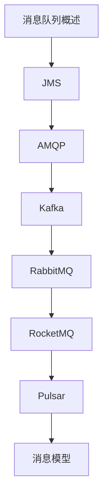

# 消息队列 学习指南

> **分类**：后端开发 ｜ **章节总数**：100 ｜ **技术栈**：消息队列

## 领域概述

消息队列是后端开发领域的重要技术方向，本系列从基础到高级逐步深入，涵盖15个核心模块：消息队列概述、JMS、AMQP、Kafka、RabbitMQ等。每个知识点作为独立章节，包含原理讲解、实现要点、常见陷阱和最佳实践，配合源码分析和架构图，帮助读者建立完整的消息队列知识体系。

本教程基于 **通用** 与 **消息队列** 生态编写，涵盖 行业标准工具链 等主流工具与框架。每章独立成篇，文字精炼、逻辑清晰，适合系统学习与按需查阅。

## 你将学到什么

完成本系列后，你将能够：

- 系统理解 **消息队列** 的核心概念与模块划分。
- 按难度递进掌握从入门到实战的完整知识路径。
- 在工程实践中做出合理的技术判断与问题排查。
- 通过章节索引快速定位所需知识点。

## 前置知识

- 编程基础
- 数据结构
- 计算机基础
- 后端开发基础概念

## 推荐学习路径

1. **消息队列概述**
2. **JMS**
3. **AMQP**
4. **Kafka**
5. **RabbitMQ**
6. **RocketMQ**
7. **Pulsar**
8. **消息模型**

## 模块体系

本领域按以下模块组织，难度由浅入深：

- **消息队列概述**
- **JMS**
- **AMQP**
- **Kafka**
- **RabbitMQ**
- **RocketMQ**
- **Pulsar**
- **消息模型**
- **消息可靠性**
- **消息顺序**
- **消息事务**
- **死信队列**
- **延迟队列**
- **性能优化**
- **最佳实践**

## 难度分布

| 难度 | 章节数 | 占比 |
|------|--------|------|
| 入门 | 21 | 21% |
| 实战 | 18 | 18% |
| 进阶 | 28 | 28% |
| 高级 | 33 | 33% |

## 章节索引

点击章节标题进入对应教程：

### 消息队列概述

- [消息队列概述核心概念与原理](chapters/001-消息队列概述核心概念与原理.md) ｜ 入门
- [消息队列概述的实现机制详解](chapters/002-消息队列概述的实现机制详解.md) ｜ 入门
- [消息队列概述的关键技术点](chapters/003-消息队列概述的关键技术点.md) ｜ 入门
- [消息队列概述的源码级分析](chapters/004-消息队列概述的源码级分析.md) ｜ 入门
- [消息队列概述的配置与使用](chapters/005-消息队列概述的配置与使用.md) ｜ 入门
- [消息队列概述的常见问题与解决方案](chapters/006-消息队列概述的常见问题与解决方案.md) ｜ 入门
- [消息队列概述的性能优化技巧](chapters/007-消息队列概述的性能优化技巧.md) ｜ 入门

### JMS

- [JMS核心概念与原理](chapters/008-JMS核心概念与原理.md) ｜ 入门
- [JMS的实现机制详解](chapters/009-JMS的实现机制详解.md) ｜ 入门
- [JMS的关键技术点](chapters/010-JMS的关键技术点.md) ｜ 入门
- [JMS的源码级分析](chapters/011-JMS的源码级分析.md) ｜ 入门
- [JMS的配置与使用](chapters/012-JMS的配置与使用.md) ｜ 入门
- [JMS的常见问题与解决方案](chapters/013-JMS的常见问题与解决方案.md) ｜ 入门
- [JMS的性能优化技巧](chapters/014-JMS的性能优化技巧.md) ｜ 入门

### AMQP

- [AMQP核心概念与原理](chapters/015-AMQP核心概念与原理.md) ｜ 入门
- [AMQP的实现机制详解](chapters/016-AMQP的实现机制详解.md) ｜ 入门
- [AMQP的关键技术点](chapters/017-AMQP的关键技术点.md) ｜ 入门
- [AMQP的源码级分析](chapters/018-AMQP的源码级分析.md) ｜ 入门
- [AMQP的配置与使用](chapters/019-AMQP的配置与使用.md) ｜ 入门
- [AMQP的常见问题与解决方案](chapters/020-AMQP的常见问题与解决方案.md) ｜ 入门
- [AMQP的性能优化技巧](chapters/021-AMQP的性能优化技巧.md) ｜ 入门

### Kafka

- [Kafka核心概念与原理](chapters/022-Kafka核心概念与原理.md) ｜ 进阶
- [Kafka的实现机制详解](chapters/023-Kafka的实现机制详解.md) ｜ 进阶
- [Kafka的关键技术点](chapters/024-Kafka的关键技术点.md) ｜ 进阶
- [Kafka的源码级分析](chapters/025-Kafka的源码级分析.md) ｜ 进阶
- [Kafka的配置与使用](chapters/026-Kafka的配置与使用.md) ｜ 进阶
- [Kafka的常见问题与解决方案](chapters/027-Kafka的常见问题与解决方案.md) ｜ 进阶
- [Kafka的性能优化技巧](chapters/028-Kafka的性能优化技巧.md) ｜ 进阶

### RabbitMQ

- [RabbitMQ核心概念与原理](chapters/029-RabbitMQ核心概念与原理.md) ｜ 进阶
- [RabbitMQ的实现机制详解](chapters/030-RabbitMQ的实现机制详解.md) ｜ 进阶
- [RabbitMQ的关键技术点](chapters/031-RabbitMQ的关键技术点.md) ｜ 进阶
- [RabbitMQ的源码级分析](chapters/032-RabbitMQ的源码级分析.md) ｜ 进阶
- [RabbitMQ的配置与使用](chapters/033-RabbitMQ的配置与使用.md) ｜ 进阶
- [RabbitMQ的常见问题与解决方案](chapters/034-RabbitMQ的常见问题与解决方案.md) ｜ 进阶
- [RabbitMQ的性能优化技巧](chapters/035-RabbitMQ的性能优化技巧.md) ｜ 进阶

### RocketMQ

- [RocketMQ核心概念与原理](chapters/036-RocketMQ核心概念与原理.md) ｜ 进阶
- [RocketMQ的实现机制详解](chapters/037-RocketMQ的实现机制详解.md) ｜ 进阶
- [RocketMQ的关键技术点](chapters/038-RocketMQ的关键技术点.md) ｜ 进阶
- [RocketMQ的源码级分析](chapters/039-RocketMQ的源码级分析.md) ｜ 进阶
- [RocketMQ的配置与使用](chapters/040-RocketMQ的配置与使用.md) ｜ 进阶
- [RocketMQ的常见问题与解决方案](chapters/041-RocketMQ的常见问题与解决方案.md) ｜ 进阶
- [RocketMQ的性能优化技巧](chapters/042-RocketMQ的性能优化技巧.md) ｜ 进阶

### Pulsar

- [Pulsar核心概念与原理](chapters/043-Pulsar核心概念与原理.md) ｜ 进阶
- [Pulsar的实现机制详解](chapters/044-Pulsar的实现机制详解.md) ｜ 进阶
- [Pulsar的关键技术点](chapters/045-Pulsar的关键技术点.md) ｜ 进阶
- [Pulsar的源码级分析](chapters/046-Pulsar的源码级分析.md) ｜ 进阶
- [Pulsar的配置与使用](chapters/047-Pulsar的配置与使用.md) ｜ 进阶
- [Pulsar的常见问题与解决方案](chapters/048-Pulsar的常见问题与解决方案.md) ｜ 进阶
- [Pulsar的性能优化技巧](chapters/049-Pulsar的性能优化技巧.md) ｜ 进阶

### 消息模型

- [消息模型核心概念与原理](chapters/050-消息模型核心概念与原理.md) ｜ 高级
- [消息模型的实现机制详解](chapters/051-消息模型的实现机制详解.md) ｜ 高级
- [消息模型的关键技术点](chapters/052-消息模型的关键技术点.md) ｜ 高级
- [消息模型的源码级分析](chapters/053-消息模型的源码级分析.md) ｜ 高级
- [消息模型的配置与使用](chapters/054-消息模型的配置与使用.md) ｜ 高级
- [消息模型的常见问题与解决方案](chapters/055-消息模型的常见问题与解决方案.md) ｜ 高级
- [消息模型的性能优化技巧](chapters/056-消息模型的性能优化技巧.md) ｜ 高级

### 消息可靠性

- [消息可靠性核心概念与原理](chapters/057-消息可靠性核心概念与原理.md) ｜ 高级
- [消息可靠性的实现机制详解](chapters/058-消息可靠性的实现机制详解.md) ｜ 高级
- [消息可靠性的关键技术点](chapters/059-消息可靠性的关键技术点.md) ｜ 高级
- [消息可靠性的源码级分析](chapters/060-消息可靠性的源码级分析.md) ｜ 高级
- [消息可靠性的配置与使用](chapters/061-消息可靠性的配置与使用.md) ｜ 高级
- [消息可靠性的常见问题与解决方案](chapters/062-消息可靠性的常见问题与解决方案.md) ｜ 高级
- [消息可靠性的性能优化技巧](chapters/063-消息可靠性的性能优化技巧.md) ｜ 高级

### 消息顺序

- [消息顺序核心概念与原理](chapters/064-消息顺序核心概念与原理.md) ｜ 高级
- [消息顺序的实现机制详解](chapters/065-消息顺序的实现机制详解.md) ｜ 高级
- [消息顺序的关键技术点](chapters/066-消息顺序的关键技术点.md) ｜ 高级
- [消息顺序的源码级分析](chapters/067-消息顺序的源码级分析.md) ｜ 高级
- [消息顺序的配置与使用](chapters/068-消息顺序的配置与使用.md) ｜ 高级
- [消息顺序的常见问题与解决方案](chapters/069-消息顺序的常见问题与解决方案.md) ｜ 高级
- [消息顺序的性能优化技巧](chapters/070-消息顺序的性能优化技巧.md) ｜ 高级

### 消息事务

- [消息事务核心概念与原理](chapters/071-消息事务核心概念与原理.md) ｜ 高级
- [消息事务的实现机制详解](chapters/072-消息事务的实现机制详解.md) ｜ 高级
- [消息事务的关键技术点](chapters/073-消息事务的关键技术点.md) ｜ 高级
- [消息事务的源码级分析](chapters/074-消息事务的源码级分析.md) ｜ 高级
- [消息事务的配置与使用](chapters/075-消息事务的配置与使用.md) ｜ 高级
- [消息事务的常见问题与解决方案](chapters/076-消息事务的常见问题与解决方案.md) ｜ 高级

### 死信队列

- [死信队列核心概念与原理](chapters/077-死信队列核心概念与原理.md) ｜ 高级
- [死信队列的实现机制详解](chapters/078-死信队列的实现机制详解.md) ｜ 高级
- [死信队列的关键技术点](chapters/079-死信队列的关键技术点.md) ｜ 高级
- [死信队列的源码级分析](chapters/080-死信队列的源码级分析.md) ｜ 高级
- [死信队列的配置与使用](chapters/081-死信队列的配置与使用.md) ｜ 高级
- [死信队列的常见问题与解决方案](chapters/082-死信队列的常见问题与解决方案.md) ｜ 高级

### 延迟队列

- [延迟队列核心概念与原理](chapters/083-延迟队列核心概念与原理.md) ｜ 实战
- [延迟队列的实现机制详解](chapters/084-延迟队列的实现机制详解.md) ｜ 实战
- [延迟队列的关键技术点](chapters/085-延迟队列的关键技术点.md) ｜ 实战
- [延迟队列的源码级分析](chapters/086-延迟队列的源码级分析.md) ｜ 实战
- [延迟队列的配置与使用](chapters/087-延迟队列的配置与使用.md) ｜ 实战
- [延迟队列的常见问题与解决方案](chapters/088-延迟队列的常见问题与解决方案.md) ｜ 实战

### 性能优化

- [性能优化核心概念与原理](chapters/089-性能优化核心概念与原理.md) ｜ 实战
- [性能优化的实现机制详解](chapters/090-性能优化的实现机制详解.md) ｜ 实战
- [性能优化的关键技术点](chapters/091-性能优化的关键技术点.md) ｜ 实战
- [性能优化的源码级分析](chapters/092-性能优化的源码级分析.md) ｜ 实战
- [性能优化的配置与使用](chapters/093-性能优化的配置与使用.md) ｜ 实战
- [性能优化的常见问题与解决方案](chapters/094-性能优化的常见问题与解决方案.md) ｜ 实战

### 最佳实践

- [最佳实践核心概念与原理](chapters/095-最佳实践核心概念与原理.md) ｜ 实战
- [最佳实践的实现机制详解](chapters/096-最佳实践的实现机制详解.md) ｜ 实战
- [最佳实践的关键技术点](chapters/097-最佳实践的关键技术点.md) ｜ 实战
- [最佳实践的源码级分析](chapters/098-最佳实践的源码级分析.md) ｜ 实战
- [最佳实践的配置与使用](chapters/099-最佳实践的配置与使用.md) ｜ 实战
- [最佳实践的常见问题与解决方案](chapters/100-最佳实践的常见问题与解决方案.md) ｜ 实战

## 学习方法建议

1. **先读概述再读章节**：用本指南建立全局地图，避免迷失在细节中。
2. **按模块递进**：同一模块内章节有前后关联，顺序阅读效果更好。
3. **主动复述**：每章读完后，用三五句话概括「是什么、为什么、怎么用」。
4. **关联阅读**：利用章节底部的「延伸学习」在同模块内构建知识网络。
5. **对照官方文档**：本教程提供结构化视角，细节以官方文档为准。

---
*领域: 消息队列 ｜ 版本: 2.0 ｜ 共 100 章*