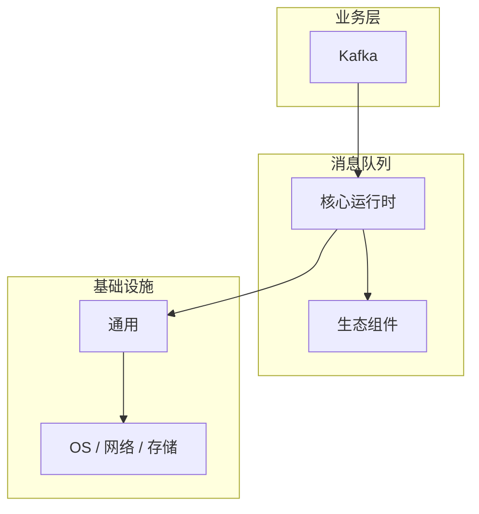

# Kafka的源码级分析

> **领域**：消息队列 ｜ **模块**：Kafka ｜ **难度**：进阶 ｜ **类型**：源码分析

## 导读

本章系统讲解 **消息队列** 中 **Kafka** 的相关知识（源码分析）。本章沿源码与调用链剖析 **Kafka** 的实现，适合需要排障或二次开发的读者。内容基于主流框架与工程实践撰写，不依赖过时概念堆砌。

## 核心知识

Apache Kafka 是分布式 commit log：Topic 分区有序 append-only，Producer 按 key hash 选分区；Consumer Group 内分区独占消费实现水平扩展。

### 核心知识

**1. 分区与副本**

Partition Leader 处理读写，Follower ISR 同步；min.insync.replicas 保障 acks=all 语义。

**2. Consumer Offset**

Offset 存 __consumer_offsets 或外部系统；rebalance 时 partition 重新分配。

**3. 零拷贝 sendfile**

Broker 向 Consumer 传输时用 sendfile 减少用户态拷贝，提升吞吐。

## 架构与流程

## 技术详解

### 源码与实现

Producer → batch 压缩 → Partition leader append log → follower 拉取 → ack 返回。

## 原理与实现

### 工作机制

Producer → batch 压缩 → Partition leader append log → follower 拉取 → ack 返回。

## 性能、安全与排查

### 性能优化

batch.size、linger.ms 权衡延迟与吞吐；分区数 ≈ 目标并行 Consumer 数。

## 本章聚焦

源码阅读 **Kafka** 宜采用「由外向内」：先跟一次主路径请求，再展开分支与错误处理，避免陷入细节迷失主线。

### 常见误区与纠正

**Consumer rebalance 风暴**

频繁 join/leave 导致 stop-the-world，应合理 session.timeout 与 cooperative sticky assignor。

### 最佳实践

1. 监控 under-replicated partitions
2. 业务 key 保证同实体进同分区

## 巩固建议

建议结合 **消息队列** 官方文档与小型实验，亲手验证 **Kafka** 的默认行为与边界条件；将本章要点整理为检查清单或 ADR，便于评审与团队 onboarding。

### 本章小结

学完本章，你应能独立说明 **Kafka** 在 消息队列 中的角色，理解其核心机制，规避常见误区，并在项目中正确运用。

## 延伸学习

- Kafka核心概念与原理
- Kafka的实现机制详解
- Kafka的关键技术点
- Kafka的配置与使用
- Kafka的常见问题与解决方案

### 延伸阅读

- Kafka 官方文档
- KIP 列表

---
*章节 ID: 025 ｜ 领域: 消息队列*