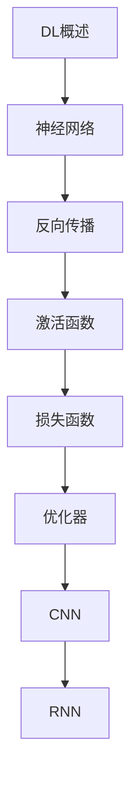

# 深度学习 学习指南

> **分类**：AI与算法 ｜ **章节总数**：120 ｜ **技术栈**：PyTorch 2

## 领域概述

深度学习是AI与算法领域的重要技术方向，本系列从基础到高级逐步深入，涵盖21个核心模块：DL概述、神经网络、反向传播、激活函数、损失函数等。每个知识点作为独立章节，包含原理讲解、实现要点、常见陷阱和最佳实践，配合源码分析和架构图，帮助读者建立完整的深度学习知识体系。

本教程基于 **Python** 与 **PyTorch 2** 生态编写，涵盖 CUDA, TensorBoard 等主流工具与框架。每章独立成篇，文字精炼、逻辑清晰，适合系统学习与按需查阅。

## 你将学到什么

完成本系列后，你将能够：

- 系统理解 **深度学习** 的核心概念与模块划分。
- 按难度递进掌握从入门到实战的完整知识路径。
- 在工程实践中做出合理的技术判断与问题排查。
- 通过章节索引快速定位所需知识点。

## 前置知识

- 编程基础
- 数据结构
- 计算机基础
- AI与算法基础概念

## 推荐学习路径

1. **DL概述**
2. **神经网络**
3. **反向传播**
4. **激活函数**
5. **损失函数**
6. **优化器**
7. **CNN**
8. **RNN**

## 模块体系

本领域按以下模块组织，难度由浅入深：

- **DL概述**
- **神经网络**
- **反向传播**
- **激活函数**
- **损失函数**
- **优化器**
- **CNN**
- **RNN**
- **LSTM**
- **GRU**
- **Attention**
- **Transformer**
- **GAN**
- **AutoEncoder**
- **迁移学习**
- **正则化**
- **批归一化**
- **深度学习框架**
- **PyTorch**
- **TensorFlow**
- **DL最佳实践**

## 难度分布

| 难度 | 章节数 | 占比 |
|------|--------|------|
| 入门 | 24 | 20% |
| 实战 | 25 | 20% |
| 进阶 | 36 | 30% |
| 高级 | 35 | 29% |

## 章节索引

点击章节标题进入对应教程：

### DL概述

- [DL概述核心概念与原理](chapters/001-DL概述核心概念与原理.md) ｜ 入门
- [DL概述的实现机制详解](chapters/002-DL概述的实现机制详解.md) ｜ 入门
- [DL概述的关键技术点](chapters/003-DL概述的关键技术点.md) ｜ 入门
- [DL概述的源码级分析](chapters/004-DL概述的源码级分析.md) ｜ 入门
- [DL概述的配置与使用](chapters/005-DL概述的配置与使用.md) ｜ 入门
- [DL概述的常见问题与解决方案](chapters/006-DL概述的常见问题与解决方案.md) ｜ 入门

### 神经网络

- [神经网络核心概念与原理](chapters/007-神经网络核心概念与原理.md) ｜ 入门
- [神经网络的实现机制详解](chapters/008-神经网络的实现机制详解.md) ｜ 入门
- [神经网络的关键技术点](chapters/009-神经网络的关键技术点.md) ｜ 入门
- [神经网络的源码级分析](chapters/010-神经网络的源码级分析.md) ｜ 入门
- [神经网络的配置与使用](chapters/011-神经网络的配置与使用.md) ｜ 入门
- [神经网络的常见问题与解决方案](chapters/012-神经网络的常见问题与解决方案.md) ｜ 入门

### 反向传播

- [反向传播核心概念与原理](chapters/013-反向传播核心概念与原理.md) ｜ 入门
- [反向传播的实现机制详解](chapters/014-反向传播的实现机制详解.md) ｜ 入门
- [反向传播的关键技术点](chapters/015-反向传播的关键技术点.md) ｜ 入门
- [反向传播的源码级分析](chapters/016-反向传播的源码级分析.md) ｜ 入门
- [反向传播的配置与使用](chapters/017-反向传播的配置与使用.md) ｜ 入门
- [反向传播的常见问题与解决方案](chapters/018-反向传播的常见问题与解决方案.md) ｜ 入门

### 激活函数

- [激活函数核心概念与原理](chapters/019-激活函数核心概念与原理.md) ｜ 入门
- [激活函数的实现机制详解](chapters/020-激活函数的实现机制详解.md) ｜ 入门
- [激活函数的关键技术点](chapters/021-激活函数的关键技术点.md) ｜ 入门
- [激活函数的源码级分析](chapters/022-激活函数的源码级分析.md) ｜ 入门
- [激活函数的配置与使用](chapters/023-激活函数的配置与使用.md) ｜ 入门
- [激活函数的常见问题与解决方案](chapters/024-激活函数的常见问题与解决方案.md) ｜ 入门

### 损失函数

- [损失函数核心概念与原理](chapters/025-损失函数核心概念与原理.md) ｜ 进阶
- [损失函数的实现机制详解](chapters/026-损失函数的实现机制详解.md) ｜ 进阶
- [损失函数的关键技术点](chapters/027-损失函数的关键技术点.md) ｜ 进阶
- [损失函数的源码级分析](chapters/028-损失函数的源码级分析.md) ｜ 进阶
- [损失函数的配置与使用](chapters/029-损失函数的配置与使用.md) ｜ 进阶
- [损失函数的常见问题与解决方案](chapters/030-损失函数的常见问题与解决方案.md) ｜ 进阶

### 优化器

- [优化器核心概念与原理](chapters/031-优化器核心概念与原理.md) ｜ 进阶
- [优化器的实现机制详解](chapters/032-优化器的实现机制详解.md) ｜ 进阶
- [优化器的关键技术点](chapters/033-优化器的关键技术点.md) ｜ 进阶
- [优化器的源码级分析](chapters/034-优化器的源码级分析.md) ｜ 进阶
- [优化器的配置与使用](chapters/035-优化器的配置与使用.md) ｜ 进阶
- [优化器的常见问题与解决方案](chapters/036-优化器的常见问题与解决方案.md) ｜ 进阶

### CNN

- [CNN核心概念与原理](chapters/037-CNN核心概念与原理.md) ｜ 进阶
- [CNN的实现机制详解](chapters/038-CNN的实现机制详解.md) ｜ 进阶
- [CNN的关键技术点](chapters/039-CNN的关键技术点.md) ｜ 进阶
- [CNN的源码级分析](chapters/040-CNN的源码级分析.md) ｜ 进阶
- [CNN的配置与使用](chapters/041-CNN的配置与使用.md) ｜ 进阶
- [CNN的常见问题与解决方案](chapters/042-CNN的常见问题与解决方案.md) ｜ 进阶

### RNN

- [RNN核心概念与原理](chapters/043-RNN核心概念与原理.md) ｜ 进阶
- [RNN的实现机制详解](chapters/044-RNN的实现机制详解.md) ｜ 进阶
- [RNN的关键技术点](chapters/045-RNN的关键技术点.md) ｜ 进阶
- [RNN的源码级分析](chapters/046-RNN的源码级分析.md) ｜ 进阶
- [RNN的配置与使用](chapters/047-RNN的配置与使用.md) ｜ 进阶
- [RNN的常见问题与解决方案](chapters/048-RNN的常见问题与解决方案.md) ｜ 进阶

### LSTM

- [LSTM核心概念与原理](chapters/049-LSTM核心概念与原理.md) ｜ 进阶
- [LSTM的实现机制详解](chapters/050-LSTM的实现机制详解.md) ｜ 进阶
- [LSTM的关键技术点](chapters/051-LSTM的关键技术点.md) ｜ 进阶
- [LSTM的源码级分析](chapters/052-LSTM的源码级分析.md) ｜ 进阶
- [LSTM的配置与使用](chapters/053-LSTM的配置与使用.md) ｜ 进阶
- [LSTM的常见问题与解决方案](chapters/054-LSTM的常见问题与解决方案.md) ｜ 进阶

### GRU

- [GRU核心概念与原理](chapters/055-GRU核心概念与原理.md) ｜ 进阶
- [GRU的实现机制详解](chapters/056-GRU的实现机制详解.md) ｜ 进阶
- [GRU的关键技术点](chapters/057-GRU的关键技术点.md) ｜ 进阶
- [GRU的源码级分析](chapters/058-GRU的源码级分析.md) ｜ 进阶
- [GRU的配置与使用](chapters/059-GRU的配置与使用.md) ｜ 进阶
- [GRU的常见问题与解决方案](chapters/060-GRU的常见问题与解决方案.md) ｜ 进阶

### Attention

- [Attention核心概念与原理](chapters/061-Attention核心概念与原理.md) ｜ 高级
- [Attention的实现机制详解](chapters/062-Attention的实现机制详解.md) ｜ 高级
- [Attention的关键技术点](chapters/063-Attention的关键技术点.md) ｜ 高级
- [Attention的源码级分析](chapters/064-Attention的源码级分析.md) ｜ 高级
- [Attention的配置与使用](chapters/065-Attention的配置与使用.md) ｜ 高级
- [Attention的常见问题与解决方案](chapters/066-Attention的常见问题与解决方案.md) ｜ 高级

### Transformer

- [Transformer核心概念与原理](chapters/067-Transformer核心概念与原理.md) ｜ 高级
- [Transformer的实现机制详解](chapters/068-Transformer的实现机制详解.md) ｜ 高级
- [Transformer的关键技术点](chapters/069-Transformer的关键技术点.md) ｜ 高级
- [Transformer的源码级分析](chapters/070-Transformer的源码级分析.md) ｜ 高级
- [Transformer的配置与使用](chapters/071-Transformer的配置与使用.md) ｜ 高级
- [Transformer的常见问题与解决方案](chapters/072-Transformer的常见问题与解决方案.md) ｜ 高级

### GAN

- [GAN核心概念与原理](chapters/073-GAN核心概念与原理.md) ｜ 高级
- [GAN的实现机制详解](chapters/074-GAN的实现机制详解.md) ｜ 高级
- [GAN的关键技术点](chapters/075-GAN的关键技术点.md) ｜ 高级
- [GAN的源码级分析](chapters/076-GAN的源码级分析.md) ｜ 高级
- [GAN的配置与使用](chapters/077-GAN的配置与使用.md) ｜ 高级
- [GAN的常见问题与解决方案](chapters/078-GAN的常见问题与解决方案.md) ｜ 高级

### AutoEncoder

- [AutoEncoder核心概念与原理](chapters/079-AutoEncoder核心概念与原理.md) ｜ 高级
- [AutoEncoder的实现机制详解](chapters/080-AutoEncoder的实现机制详解.md) ｜ 高级
- [AutoEncoder的关键技术点](chapters/081-AutoEncoder的关键技术点.md) ｜ 高级
- [AutoEncoder的源码级分析](chapters/082-AutoEncoder的源码级分析.md) ｜ 高级
- [AutoEncoder的配置与使用](chapters/083-AutoEncoder的配置与使用.md) ｜ 高级
- [AutoEncoder的常见问题与解决方案](chapters/084-AutoEncoder的常见问题与解决方案.md) ｜ 高级

### 迁移学习

- [迁移学习核心概念与原理](chapters/085-迁移学习核心概念与原理.md) ｜ 高级
- [迁移学习的实现机制详解](chapters/086-迁移学习的实现机制详解.md) ｜ 高级
- [迁移学习的关键技术点](chapters/087-迁移学习的关键技术点.md) ｜ 高级
- [迁移学习的源码级分析](chapters/088-迁移学习的源码级分析.md) ｜ 高级
- [迁移学习的配置与使用](chapters/089-迁移学习的配置与使用.md) ｜ 高级
- [迁移学习的常见问题与解决方案](chapters/090-迁移学习的常见问题与解决方案.md) ｜ 高级

### 正则化

- [正则化核心概念与原理](chapters/091-正则化核心概念与原理.md) ｜ 高级
- [正则化的实现机制详解](chapters/092-正则化的实现机制详解.md) ｜ 高级
- [正则化的关键技术点](chapters/093-正则化的关键技术点.md) ｜ 高级
- [正则化的源码级分析](chapters/094-正则化的源码级分析.md) ｜ 高级
- [正则化的配置与使用](chapters/095-正则化的配置与使用.md) ｜ 高级

### 批归一化

- [批归一化核心概念与原理](chapters/096-批归一化核心概念与原理.md) ｜ 实战
- [批归一化的实现机制详解](chapters/097-批归一化的实现机制详解.md) ｜ 实战
- [批归一化的关键技术点](chapters/098-批归一化的关键技术点.md) ｜ 实战
- [批归一化的源码级分析](chapters/099-批归一化的源码级分析.md) ｜ 实战
- [批归一化的配置与使用](chapters/100-批归一化的配置与使用.md) ｜ 实战

### 深度学习框架

- [深度学习框架核心概念与原理](chapters/101-深度学习框架核心概念与原理.md) ｜ 实战
- [深度学习框架的实现机制详解](chapters/102-深度学习框架的实现机制详解.md) ｜ 实战
- [深度学习框架的关键技术点](chapters/103-深度学习框架的关键技术点.md) ｜ 实战
- [深度学习框架的源码级分析](chapters/104-深度学习框架的源码级分析.md) ｜ 实战
- [深度学习框架的配置与使用](chapters/105-深度学习框架的配置与使用.md) ｜ 实战

### PyTorch

- [PyTorch核心概念与原理](chapters/106-PyTorch核心概念与原理.md) ｜ 实战
- [PyTorch的实现机制详解](chapters/107-PyTorch的实现机制详解.md) ｜ 实战
- [PyTorch的关键技术点](chapters/108-PyTorch的关键技术点.md) ｜ 实战
- [PyTorch的源码级分析](chapters/109-PyTorch的源码级分析.md) ｜ 实战
- [PyTorch的配置与使用](chapters/110-PyTorch的配置与使用.md) ｜ 实战

### TensorFlow

- [TensorFlow核心概念与原理](chapters/111-TensorFlow核心概念与原理.md) ｜ 实战
- [TensorFlow的实现机制详解](chapters/112-TensorFlow的实现机制详解.md) ｜ 实战
- [TensorFlow的关键技术点](chapters/113-TensorFlow的关键技术点.md) ｜ 实战
- [TensorFlow的源码级分析](chapters/114-TensorFlow的源码级分析.md) ｜ 实战
- [TensorFlow的配置与使用](chapters/115-TensorFlow的配置与使用.md) ｜ 实战

### DL最佳实践

- [DL最佳实践核心概念与原理](chapters/116-DL最佳实践核心概念与原理.md) ｜ 实战
- [DL最佳实践的实现机制详解](chapters/117-DL最佳实践的实现机制详解.md) ｜ 实战
- [DL最佳实践的关键技术点](chapters/118-DL最佳实践的关键技术点.md) ｜ 实战
- [DL最佳实践的源码级分析](chapters/119-DL最佳实践的源码级分析.md) ｜ 实战
- [DL最佳实践的配置与使用](chapters/120-DL最佳实践的配置与使用.md) ｜ 实战

## 学习方法建议

1. **先读概述再读章节**：用本指南建立全局地图，避免迷失在细节中。
2. **按模块递进**：同一模块内章节有前后关联，顺序阅读效果更好。
3. **主动复述**：每章读完后，用三五句话概括「是什么、为什么、怎么用」。
4. **关联阅读**：利用章节底部的「延伸学习」在同模块内构建知识网络。
5. **对照官方文档**：本教程提供结构化视角，细节以官方文档为准。

---
*领域: 深度学习 ｜ 版本: 2.0 ｜ 共 120 章*