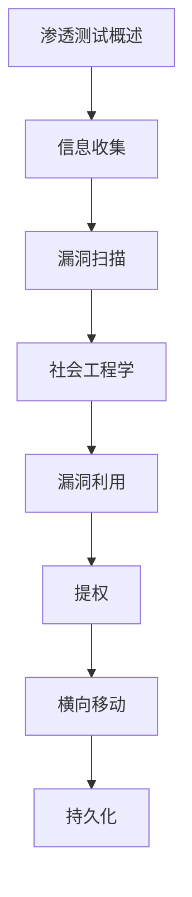

# 渗透测试 学习指南

> **分类**：安全 ｜ **章节总数**：100 ｜ **技术栈**：渗透测试

> **学习声明**：本章内容仅供合法授权环境下的安全研究与防御建设，请遵守法律法规与组织安全政策，禁止对未授权系统开展测试。

## 领域概述

授权安全评估测试是安全领域的重要技术方向，本系列从基础到高级逐步深入，涵盖15个核心模块：授权安全评估测试概述、信息收集、漏洞扫描、社会工程学、风险验证等。每个知识点作为独立章节，包含原理讲解、实现要点、常见陷阱和最佳实践，配合源码分析和架构图，帮助读者建立完整的授权安全评估测试知识体系。

本教程基于 **通用** 与 **渗透测试** 生态编写，涵盖 行业标准工具链 等主流工具与框架。每章独立成篇，文字精炼、逻辑清晰，适合系统学习与按需查阅。

## 你将学到什么

完成本系列后，你将能够：

- 系统理解 **渗透测试** 的核心概念与模块划分。
- 按难度递进掌握从入门到实战的完整知识路径。
- 在工程实践中做出合理的技术判断与问题排查。
- 通过章节索引快速定位所需知识点。

## 前置知识

- 编程基础
- 数据结构
- 计算机基础
- 安全基础概念

## 推荐学习路径

1. **渗透测试概述**
2. **信息收集**
3. **漏洞扫描**
4. **社会工程学**
5. **漏洞利用**
6. **提权**
7. **横向移动**
8. **持久化**

## 模块体系

本领域按以下模块组织，难度由浅入深：

- **渗透测试概述**
- **信息收集**
- **漏洞扫描**
- **社会工程学**
- **漏洞利用**
- **提权**
- **横向移动**
- **持久化**
- **痕迹清除**
- **报告编写**
- **Metasploit**
- **Burp Suite**
- **Nmap**
- **Kali Linux**
- **渗透测试最佳实践**

## 难度分布

| 难度 | 章节数 | 占比 |
|------|--------|------|
| 入门 | 21 | 21% |
| 实战 | 18 | 18% |
| 进阶 | 28 | 28% |
| 高级 | 33 | 33% |

## 章节索引

点击章节标题进入对应教程：

### 渗透测试概述

- [授权安全评估测试概述核心概念与原理](chapters/001-授权安全评估测试概述核心概念与原理.md) ｜ 入门
- [授权安全评估测试概述的实现机制详解](chapters/002-授权安全评估测试概述的实现机制详解.md) ｜ 入门
- [授权安全评估测试概述的关键技术点](chapters/003-授权安全评估测试概述的关键技术点.md) ｜ 入门
- [授权安全评估测试概述的源码级分析](chapters/004-授权安全评估测试概述的源码级分析.md) ｜ 入门
- [授权安全评估测试概述的配置与使用](chapters/005-授权安全评估测试概述的配置与使用.md) ｜ 入门
- [授权安全评估测试概述的常见问题与解决方案](chapters/006-授权安全评估测试概述的常见问题与解决方案.md) ｜ 入门
- [授权安全评估测试概述的性能优化技巧](chapters/007-授权安全评估测试概述的性能优化技巧.md) ｜ 入门

### 信息收集

- [信息收集核心概念与原理](chapters/008-信息收集核心概念与原理.md) ｜ 入门
- [信息收集的实现机制详解](chapters/009-信息收集的实现机制详解.md) ｜ 入门
- [信息收集的关键技术点](chapters/010-信息收集的关键技术点.md) ｜ 入门
- [信息收集的源码级分析](chapters/011-信息收集的源码级分析.md) ｜ 入门
- [信息收集的配置与使用](chapters/012-信息收集的配置与使用.md) ｜ 入门
- [信息收集的常见问题与解决方案](chapters/013-信息收集的常见问题与解决方案.md) ｜ 入门
- [信息收集的性能优化技巧](chapters/014-信息收集的性能优化技巧.md) ｜ 入门

### 漏洞扫描

- [漏洞扫描核心概念与原理](chapters/015-漏洞扫描核心概念与原理.md) ｜ 入门
- [漏洞扫描的实现机制详解](chapters/016-漏洞扫描的实现机制详解.md) ｜ 入门
- [漏洞扫描的关键技术点](chapters/017-漏洞扫描的关键技术点.md) ｜ 入门
- [漏洞扫描的源码级分析](chapters/018-漏洞扫描的源码级分析.md) ｜ 入门
- [漏洞扫描的配置与使用](chapters/019-漏洞扫描的配置与使用.md) ｜ 入门
- [漏洞扫描的常见问题与解决方案](chapters/020-漏洞扫描的常见问题与解决方案.md) ｜ 入门
- [漏洞扫描的性能优化技巧](chapters/021-漏洞扫描的性能优化技巧.md) ｜ 入门

### 社会工程学

- [社会工程学核心概念与原理](chapters/022-社会工程学核心概念与原理.md) ｜ 进阶
- [社会工程学的实现机制详解](chapters/023-社会工程学的实现机制详解.md) ｜ 进阶
- [社会工程学的关键技术点](chapters/024-社会工程学的关键技术点.md) ｜ 进阶
- [社会工程学的源码级分析](chapters/025-社会工程学的源码级分析.md) ｜ 进阶
- [社会工程学的配置与使用](chapters/026-社会工程学的配置与使用.md) ｜ 进阶
- [社会工程学的常见问题与解决方案](chapters/027-社会工程学的常见问题与解决方案.md) ｜ 进阶
- [社会工程学的性能优化技巧](chapters/028-社会工程学的性能优化技巧.md) ｜ 进阶

### 漏洞利用

- [风险验证核心概念与原理](chapters/029-风险验证核心概念与原理.md) ｜ 进阶
- [风险验证的实现机制详解](chapters/030-风险验证的实现机制详解.md) ｜ 进阶
- [风险验证的关键技术点](chapters/031-风险验证的关键技术点.md) ｜ 进阶
- [风险验证的源码级分析](chapters/032-风险验证的源码级分析.md) ｜ 进阶
- [风险验证的配置与使用](chapters/033-风险验证的配置与使用.md) ｜ 进阶
- [风险验证的常见问题与解决方案](chapters/034-风险验证的常见问题与解决方案.md) ｜ 进阶
- [风险验证的性能优化技巧](chapters/035-风险验证的性能优化技巧.md) ｜ 进阶

### 提权

- [权限提升风险核心概念与原理](chapters/036-权限提升风险核心概念与原理.md) ｜ 进阶
- [权限提升风险的实现机制详解](chapters/037-权限提升风险的实现机制详解.md) ｜ 进阶
- [权限提升风险的关键技术点](chapters/038-权限提升风险的关键技术点.md) ｜ 进阶
- [权限提升风险的源码级分析](chapters/039-权限提升风险的源码级分析.md) ｜ 进阶
- [权限提升风险的配置与使用](chapters/040-权限提升风险的配置与使用.md) ｜ 进阶
- [权限提升风险的常见问题与解决方案](chapters/041-权限提升风险的常见问题与解决方案.md) ｜ 进阶
- [权限提升风险的性能优化技巧](chapters/042-权限提升风险的性能优化技巧.md) ｜ 进阶

### 横向移动

- [横向移动核心概念与原理](chapters/043-横向移动核心概念与原理.md) ｜ 进阶
- [横向移动的实现机制详解](chapters/044-横向移动的实现机制详解.md) ｜ 进阶
- [横向移动的关键技术点](chapters/045-横向移动的关键技术点.md) ｜ 进阶
- [横向移动的源码级分析](chapters/046-横向移动的源码级分析.md) ｜ 进阶
- [横向移动的配置与使用](chapters/047-横向移动的配置与使用.md) ｜ 进阶
- [横向移动的常见问题与解决方案](chapters/048-横向移动的常见问题与解决方案.md) ｜ 进阶
- [横向移动的性能优化技巧](chapters/049-横向移动的性能优化技巧.md) ｜ 进阶

### 持久化

- [持久化核心概念与原理](chapters/050-持久化核心概念与原理.md) ｜ 高级
- [持久化的实现机制详解](chapters/051-持久化的实现机制详解.md) ｜ 高级
- [持久化的关键技术点](chapters/052-持久化的关键技术点.md) ｜ 高级
- [持久化的源码级分析](chapters/053-持久化的源码级分析.md) ｜ 高级
- [持久化的配置与使用](chapters/054-持久化的配置与使用.md) ｜ 高级
- [持久化的常见问题与解决方案](chapters/055-持久化的常见问题与解决方案.md) ｜ 高级
- [持久化的性能优化技巧](chapters/056-持久化的性能优化技巧.md) ｜ 高级

### 痕迹清除

- [痕迹清除核心概念与原理](chapters/057-痕迹清除核心概念与原理.md) ｜ 高级
- [痕迹清除的实现机制详解](chapters/058-痕迹清除的实现机制详解.md) ｜ 高级
- [痕迹清除的关键技术点](chapters/059-痕迹清除的关键技术点.md) ｜ 高级
- [痕迹清除的源码级分析](chapters/060-痕迹清除的源码级分析.md) ｜ 高级
- [痕迹清除的配置与使用](chapters/061-痕迹清除的配置与使用.md) ｜ 高级
- [痕迹清除的常见问题与解决方案](chapters/062-痕迹清除的常见问题与解决方案.md) ｜ 高级
- [痕迹清除的性能优化技巧](chapters/063-痕迹清除的性能优化技巧.md) ｜ 高级

### 报告编写

- [报告编写核心概念与原理](chapters/064-报告编写核心概念与原理.md) ｜ 高级
- [报告编写的实现机制详解](chapters/065-报告编写的实现机制详解.md) ｜ 高级
- [报告编写的关键技术点](chapters/066-报告编写的关键技术点.md) ｜ 高级
- [报告编写的源码级分析](chapters/067-报告编写的源码级分析.md) ｜ 高级
- [报告编写的配置与使用](chapters/068-报告编写的配置与使用.md) ｜ 高级
- [报告编写的常见问题与解决方案](chapters/069-报告编写的常见问题与解决方案.md) ｜ 高级
- [报告编写的性能优化技巧](chapters/070-报告编写的性能优化技巧.md) ｜ 高级

### Metasploit

- [Metasploit核心概念与原理](chapters/071-Metasploit核心概念与原理.md) ｜ 高级
- [Metasploit的实现机制详解](chapters/072-Metasploit的实现机制详解.md) ｜ 高级
- [Metasploit的关键技术点](chapters/073-Metasploit的关键技术点.md) ｜ 高级
- [Metasploit的源码级分析](chapters/074-Metasploit的源码级分析.md) ｜ 高级
- [Metasploit的配置与使用](chapters/075-Metasploit的配置与使用.md) ｜ 高级
- [Metasploit的常见问题与解决方案](chapters/076-Metasploit的常见问题与解决方案.md) ｜ 高级

### Burp Suite

- [Burp Suite核心概念与原理](chapters/077-Burp-Suite核心概念与原理.md) ｜ 高级
- [Burp Suite的实现机制详解](chapters/078-Burp-Suite的实现机制详解.md) ｜ 高级
- [Burp Suite的关键技术点](chapters/079-Burp-Suite的关键技术点.md) ｜ 高级
- [Burp Suite的源码级分析](chapters/080-Burp-Suite的源码级分析.md) ｜ 高级
- [Burp Suite的配置与使用](chapters/081-Burp-Suite的配置与使用.md) ｜ 高级
- [Burp Suite的常见问题与解决方案](chapters/082-Burp-Suite的常见问题与解决方案.md) ｜ 高级

### Nmap

- [Nmap核心概念与原理](chapters/083-Nmap核心概念与原理.md) ｜ 实战
- [Nmap的实现机制详解](chapters/084-Nmap的实现机制详解.md) ｜ 实战
- [Nmap的关键技术点](chapters/085-Nmap的关键技术点.md) ｜ 实战
- [Nmap的源码级分析](chapters/086-Nmap的源码级分析.md) ｜ 实战
- [Nmap的配置与使用](chapters/087-Nmap的配置与使用.md) ｜ 实战
- [Nmap的常见问题与解决方案](chapters/088-Nmap的常见问题与解决方案.md) ｜ 实战

### Kali Linux

- [Kali Linux核心概念与原理](chapters/089-Kali-Linux核心概念与原理.md) ｜ 实战
- [Kali Linux的实现机制详解](chapters/090-Kali-Linux的实现机制详解.md) ｜ 实战
- [Kali Linux的关键技术点](chapters/091-Kali-Linux的关键技术点.md) ｜ 实战
- [Kali Linux的源码级分析](chapters/092-Kali-Linux的源码级分析.md) ｜ 实战
- [Kali Linux的配置与使用](chapters/093-Kali-Linux的配置与使用.md) ｜ 实战
- [Kali Linux的常见问题与解决方案](chapters/094-Kali-Linux的常见问题与解决方案.md) ｜ 实战

### 渗透测试最佳实践

- [授权安全评估测试最佳实践核心概念与原理](chapters/095-授权安全评估测试最佳实践核心概念与原理.md) ｜ 实战
- [授权安全评估测试最佳实践的实现机制详解](chapters/096-授权安全评估测试最佳实践的实现机制详解.md) ｜ 实战
- [授权安全评估测试最佳实践的关键技术点](chapters/097-授权安全评估测试最佳实践的关键技术点.md) ｜ 实战
- [授权安全评估测试最佳实践的源码级分析](chapters/098-授权安全评估测试最佳实践的源码级分析.md) ｜ 实战
- [授权安全评估测试最佳实践的配置与使用](chapters/099-授权安全评估测试最佳实践的配置与使用.md) ｜ 实战
- [授权安全评估测试最佳实践的常见问题与解决方案](chapters/100-授权安全评估测试最佳实践的常见问题与解决方案.md) ｜ 实战

## 学习方法建议

1. **先读概述再读章节**：用本指南建立全局地图，避免迷失在细节中。
2. **按模块递进**：同一模块内章节有前后关联，顺序阅读效果更好。
3. **主动复述**：每章读完后，用三五句话概括「是什么、为什么、怎么用」。
4. **关联阅读**：利用章节底部的「延伸学习」在同模块内构建知识网络。
5. **对照官方文档**：本教程提供结构化视角，细节以官方文档为准。

---
*领域: 渗透测试 ｜ 版本: 2.0 ｜ 共 100 章*