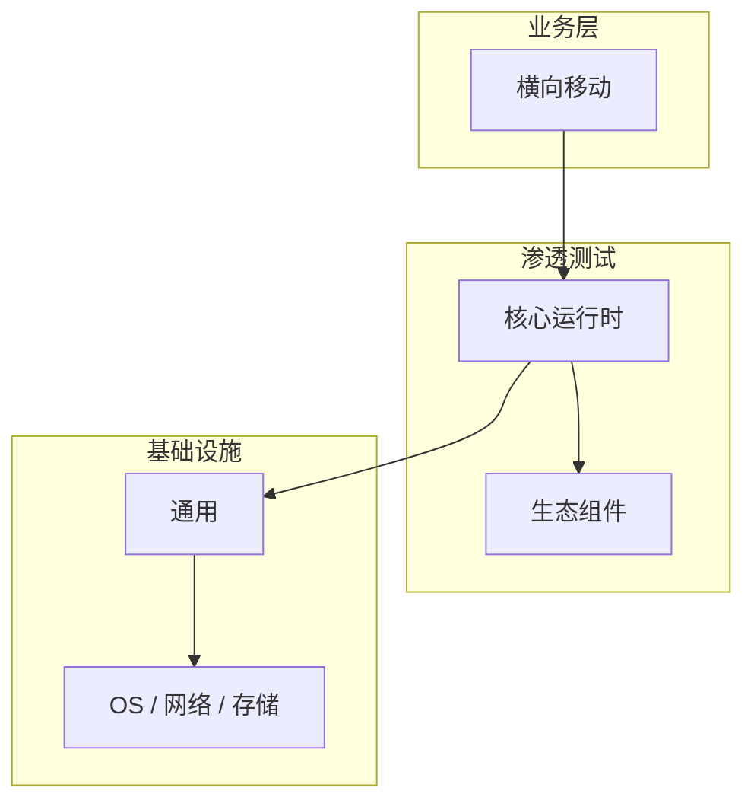

# 横向移动的实现机制详解

> **领域**：渗透测试 ｜ **模块**：横向移动 ｜ **难度**：进阶 ｜ **类型**：实现机制

> **学习声明**：本章内容仅供合法授权环境下的安全研究与防御建设，请遵守法律法规与组织安全政策，禁止对未授权系统开展测试。

## 导读

本章系统讲解 **渗透测试** 中 **横向移动** 的相关知识（实现机制）。本章聚焦 **横向移动** 的内部实现路径与关键数据结构，帮助从 API 用法深入到机制层。内容基于主流框架与工程实践撰写，不依赖过时概念堆砌。

## 核心知识

**横向移动** 是 渗透测试 领域的核心主题。内网横向移动的发现与防御建议。本模块从原理与工程实践出发，帮助读者建立系统理解。 本教程内容仅供合法授权的安全测试、防御加固与学术研究使用。未经授权对他人系统进行扫描、入侵或破坏属于违法行为。

### 核心知识

**1. 横向移动**

攻击者从已控主机扩展到内网其他系统。

**2. 检测**

异常认证（Pass-the-Hash）、内网扫描、SMB/WMI 远程执行。

**3. 防御**

网络分段、Privileged Access Management、EDR 监控。

## 架构与流程

## 技术详解

### 实现机制

测试（授权）：凭证复用 → 内网枚举 → 尝试访问其他系统 → 记录路径。

## 原理与实现

### 工作机制

测试（授权）：凭证复用 → 内网枚举 → 尝试访问其他系统 → 记录路径。

### 内部实现

横向移动 的底层实现依赖 渗透测试 生态中的标准组件与协议，建议阅读官方规范文档。

## 操作流程与实践

### 操作流程

1. 理解 横向移动 概念 → 2. 学习标准用法 → 3. 动手实验 → 4. 分析案例 → 5. 总结最佳实践。

### 配置要点

配置 横向移动 时遵循官方推荐默认值，仅在理解影响后调整参数。

## 性能、安全与排查

### 性能优化

评估 横向移动 性能时建立基准测试，关注时间/空间复杂度或系统吞吐延迟指标。

### 安全注意

横向移动测试需明确内网范围授权，避免影响生产系统。

### 调试排错

排查 横向移动 问题时，结合日志、监控与最小复现用例逐步定位根因。

## 案例与选型

### 案例复盘

在典型 渗透测试 项目中，正确应用 横向移动 可显著提升系统质量与可维护性。

### 方案对比

选择 横向移动 方案时需对比多种替代方案的适用场景、性能与生态支持。

## 本章聚焦

阅读 **横向移动** 实现时，建议对照调用栈画出数据流：入口 API → 核心数据结构 → 系统调用或 I/O 边界，标注锁与共享状态位置。

### 常见误区与纠正

**概念理解偏差**

对 横向移动 理解不全面导致误用，应回到官方文档重新梳理。

**忽视边界条件**

横向移动 在极端输入或高并发下行为可能不同，需充分测试。

**缺少监控**

未对 横向移动 关键指标监控，问题只能被动发现。

### 最佳实践

1. 遵循 渗透测试 领域 横向移动 的官方推荐实践
2. 为 横向移动 相关功能编写自动化测试
3. 关键配置纳入版本管理与变更审计
4. 生产部署前在接近真实环境验证

## 巩固建议

建议结合 **渗透测试** 官方文档与小型实验，亲手验证 **横向移动** 的默认行为与边界条件；将本章要点整理为检查清单或 ADR，便于评审与团队 onboarding。

### 本章小结

学完本章，你应能独立说明 **横向移动** 在 渗透测试 中的角色，理解其核心机制，规避常见误区，并在项目中正确运用。

## 延伸学习

- 横向移动核心概念与原理
- 横向移动的关键技术点
- 横向移动的源码级分析
- 横向移动的配置与使用
- 横向移动的常见问题与解决方案

### 延伸阅读

- 渗透测试 官方文档 - 横向移动
- OWASP / NIST 相关指南（如适用）
- 权威书籍与 RFC 标准文档

---
*章节 ID: 044 ｜ 领域: 渗透测试*