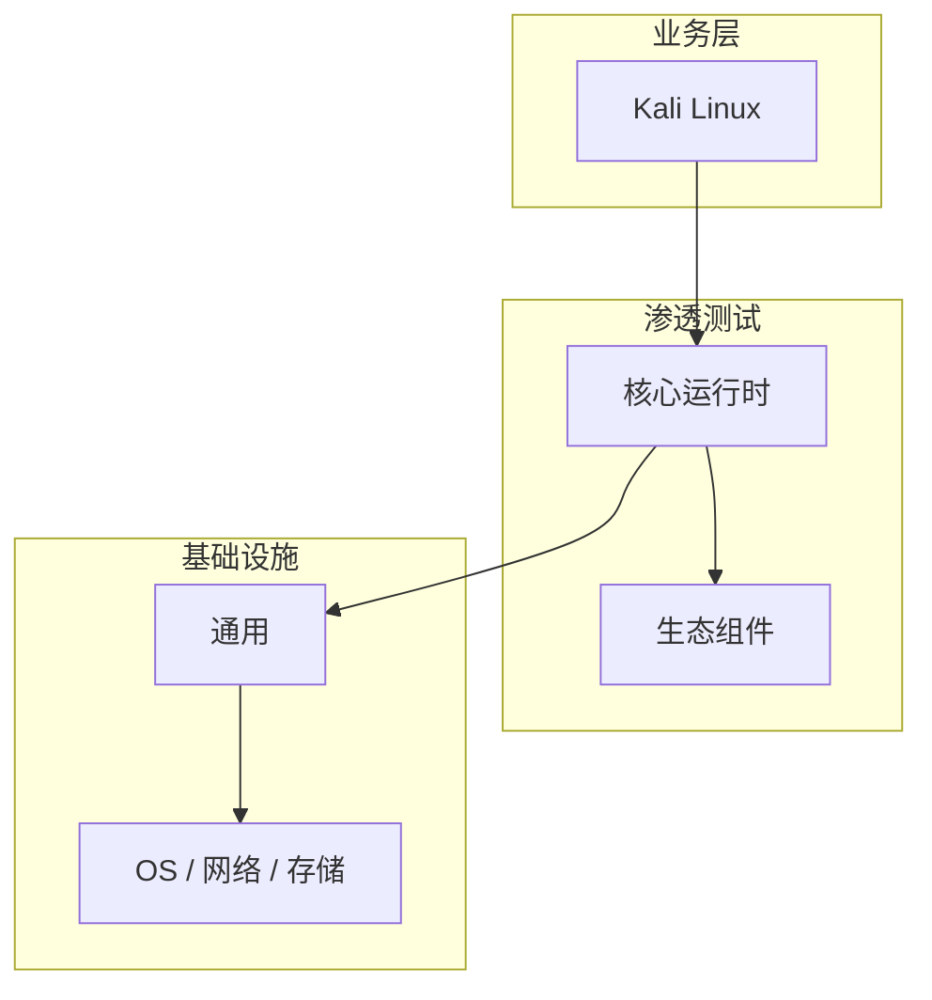

# Kali Linux的源码级分析

> **领域**：渗透测试 ｜ **模块**：Kali Linux ｜ **难度**：实战 ｜ **类型**：源码分析

> **学习声明**：本章内容仅供合法授权环境下的安全研究与防御建设，请遵守法律法规与组织安全政策，禁止对未授权系统开展测试。

## 导读

本章系统讲解 **渗透测试** 中 **Kali Linux** 的相关知识（源码分析）。本章沿源码与调用链剖析 **Kali Linux** 的实现，适合需要排障或二次开发的读者。内容基于主流框架与工程实践撰写，不依赖过时概念堆砌。

## 核心知识

**Kali Linux** 是 渗透测试 领域的核心主题。Kali Linux 安全测试工具集概览。本模块从原理与工程实践出发，帮助读者建立系统理解。 本教程内容仅供合法授权的安全测试、防御加固与学术研究使用。未经授权对他人系统进行扫描、入侵或破坏属于违法行为。

### 核心知识

**1. 工具分类**

信息收集、漏洞分析、Web 应用、密码攻击、无线、逆向。

**2. 使用规范**

Kali 仅用于授权测试，不得用于未授权活动。

**3. 隔离环境**

在虚拟机或专用测试环境中运行，与生产网络隔离。

## 架构与流程

## 技术详解

### 源码与实现

安装 Kali VM → 配置测试网络 → 选择工具 → 执行授权测试 → 记录结果。

## 原理与实现

### 工作机制

安装 Kali VM → 配置测试网络 → 选择工具 → 执行授权测试 → 记录结果。

### 内部实现

Kali Linux 的底层实现依赖 渗透测试 生态中的标准组件与协议，建议阅读官方规范文档。

## 操作流程与实践

### 操作流程

1. 理解 Kali Linux 概念 → 2. 学习标准用法 → 3. 动手实验 → 4. 分析案例 → 5. 总结最佳实践。

### 配置要点

配置 Kali Linux 时遵循官方推荐默认值，仅在理解影响后调整参数。

## 性能、安全与排查

### 性能优化

评估 Kali Linux 性能时建立基准测试，关注时间/空间复杂度或系统吞吐延迟指标。

### 安全注意

本教程内容仅供合法授权的安全测试、防御加固与学术研究使用。未经授权对他人系统进行扫描、入侵或破坏属于违法行为。

### 调试排错

排查 Kali Linux 问题时，结合日志、监控与最小复现用例逐步定位根因。

## 案例与选型

### 案例复盘

在典型 渗透测试 项目中，正确应用 Kali Linux 可显著提升系统质量与可维护性。

### 方案对比

选择 Kali Linux 方案时需对比多种替代方案的适用场景、性能与生态支持。

## 本章聚焦

源码阅读 **Kali Linux** 宜采用「由外向内」：先跟一次主路径请求，再展开分支与错误处理，避免陷入细节迷失主线。

### 常见误区与纠正

**概念理解偏差**

对 Kali Linux 理解不全面导致误用，应回到官方文档重新梳理。

**忽视边界条件**

Kali Linux 在极端输入或高并发下行为可能不同，需充分测试。

**缺少监控**

未对 Kali Linux 关键指标监控，问题只能被动发现。

### 最佳实践

1. 遵循 渗透测试 领域 Kali Linux 的官方推荐实践
2. 为 Kali Linux 相关功能编写自动化测试
3. 关键配置纳入版本管理与变更审计
4. 生产部署前在接近真实环境验证

## 巩固建议

建议结合 **渗透测试** 官方文档与小型实验，亲手验证 **Kali Linux** 的默认行为与边界条件；将本章要点整理为检查清单或 ADR，便于评审与团队 onboarding。

### 本章小结

学完本章，你应能独立说明 **Kali Linux** 在 渗透测试 中的角色，理解其核心机制，规避常见误区，并在项目中正确运用。

## 延伸学习

- Kali Linux核心概念与原理
- Kali Linux的实现机制详解
- Kali Linux的关键技术点
- Kali Linux的配置与使用
- Kali Linux的常见问题与解决方案

### 延伸阅读

- 渗透测试 官方文档 - Kali Linux
- OWASP / NIST 相关指南（如适用）
- 权威书籍与 RFC 标准文档

---
*章节 ID: 092 ｜ 领域: 渗透测试*