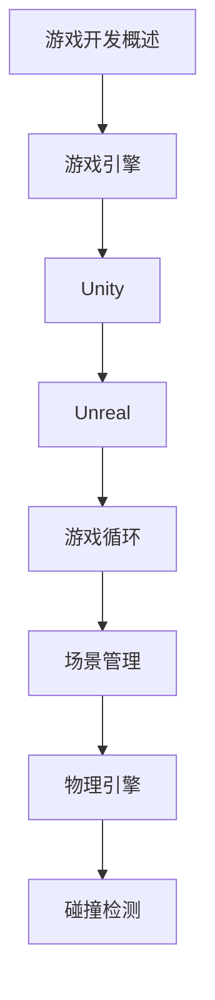

# 游戏开发 学习指南

> **分类**：其他 ｜ **章节总数**：100 ｜ **技术栈**：游戏开发

## 领域概述

游戏开发是其他领域的重要技术方向，本系列从基础到高级逐步深入，涵盖18个核心模块：游戏开发概述、游戏引擎、Unity、Unreal、游戏循环等。每个知识点作为独立章节，包含原理讲解、实现要点、常见陷阱和最佳实践，配合源码分析和架构图，帮助读者建立完整的游戏开发知识体系。

本教程基于 **通用** 与 **游戏开发** 生态编写，涵盖 行业标准工具链 等主流工具与框架。每章独立成篇，文字精炼、逻辑清晰，适合系统学习与按需查阅。

## 你将学到什么

完成本系列后，你将能够：

- 系统理解 **游戏开发** 的核心概念与模块划分。
- 按难度递进掌握从入门到实战的完整知识路径。
- 在工程实践中做出合理的技术判断与问题排查。
- 通过章节索引快速定位所需知识点。

## 前置知识

- 编程基础
- 数据结构
- 计算机基础
- 其他基础概念

## 推荐学习路径

1. **游戏开发概述**
2. **游戏引擎**
3. **Unity**
4. **Unreal**
5. **游戏循环**
6. **场景管理**
7. **物理引擎**
8. **碰撞检测**

## 模块体系

本领域按以下模块组织，难度由浅入深：

- **游戏开发概述**
- **游戏引擎**
- **Unity**
- **Unreal**
- **游戏循环**
- **场景管理**
- **物理引擎**
- **碰撞检测**
- **动画**
- **粒子系统**
- **渲染**
- **光照**
- **材质**
- **音频**
- **AI**
- **网络同步**
- **性能优化**
- **游戏最佳实践**

## 难度分布

| 难度 | 章节数 | 占比 |
|------|--------|------|
| 入门 | 24 | 24% |
| 实战 | 20 | 20% |
| 进阶 | 30 | 30% |
| 高级 | 26 | 26% |

## 章节索引

点击章节标题进入对应教程：

### 游戏开发概述

- [游戏开发概述核心概念与原理](chapters/001-游戏开发概述核心概念与原理.md) ｜ 入门
- [游戏开发概述的实现机制详解](chapters/002-游戏开发概述的实现机制详解.md) ｜ 入门
- [游戏开发概述的关键技术点](chapters/003-游戏开发概述的关键技术点.md) ｜ 入门
- [游戏开发概述的源码级分析](chapters/004-游戏开发概述的源码级分析.md) ｜ 入门
- [游戏开发概述的配置与使用](chapters/005-游戏开发概述的配置与使用.md) ｜ 入门
- [游戏开发概述的常见问题与解决方案](chapters/006-游戏开发概述的常见问题与解决方案.md) ｜ 入门

### 游戏引擎

- [游戏引擎核心概念与原理](chapters/007-游戏引擎核心概念与原理.md) ｜ 入门
- [游戏引擎的实现机制详解](chapters/008-游戏引擎的实现机制详解.md) ｜ 入门
- [游戏引擎的关键技术点](chapters/009-游戏引擎的关键技术点.md) ｜ 入门
- [游戏引擎的源码级分析](chapters/010-游戏引擎的源码级分析.md) ｜ 入门
- [游戏引擎的配置与使用](chapters/011-游戏引擎的配置与使用.md) ｜ 入门
- [游戏引擎的常见问题与解决方案](chapters/012-游戏引擎的常见问题与解决方案.md) ｜ 入门

### Unity

- [Unity核心概念与原理](chapters/013-Unity核心概念与原理.md) ｜ 入门
- [Unity的实现机制详解](chapters/014-Unity的实现机制详解.md) ｜ 入门
- [Unity的关键技术点](chapters/015-Unity的关键技术点.md) ｜ 入门
- [Unity的源码级分析](chapters/016-Unity的源码级分析.md) ｜ 入门
- [Unity的配置与使用](chapters/017-Unity的配置与使用.md) ｜ 入门
- [Unity的常见问题与解决方案](chapters/018-Unity的常见问题与解决方案.md) ｜ 入门

### Unreal

- [Unreal核心概念与原理](chapters/019-Unreal核心概念与原理.md) ｜ 入门
- [Unreal的实现机制详解](chapters/020-Unreal的实现机制详解.md) ｜ 入门
- [Unreal的关键技术点](chapters/021-Unreal的关键技术点.md) ｜ 入门
- [Unreal的源码级分析](chapters/022-Unreal的源码级分析.md) ｜ 入门
- [Unreal的配置与使用](chapters/023-Unreal的配置与使用.md) ｜ 入门
- [Unreal的常见问题与解决方案](chapters/024-Unreal的常见问题与解决方案.md) ｜ 入门

### 游戏循环

- [游戏循环核心概念与原理](chapters/025-游戏循环核心概念与原理.md) ｜ 进阶
- [游戏循环的实现机制详解](chapters/026-游戏循环的实现机制详解.md) ｜ 进阶
- [游戏循环的关键技术点](chapters/027-游戏循环的关键技术点.md) ｜ 进阶
- [游戏循环的源码级分析](chapters/028-游戏循环的源码级分析.md) ｜ 进阶
- [游戏循环的配置与使用](chapters/029-游戏循环的配置与使用.md) ｜ 进阶
- [游戏循环的常见问题与解决方案](chapters/030-游戏循环的常见问题与解决方案.md) ｜ 进阶

### 场景管理

- [场景管理核心概念与原理](chapters/031-场景管理核心概念与原理.md) ｜ 进阶
- [场景管理的实现机制详解](chapters/032-场景管理的实现机制详解.md) ｜ 进阶
- [场景管理的关键技术点](chapters/033-场景管理的关键技术点.md) ｜ 进阶
- [场景管理的源码级分析](chapters/034-场景管理的源码级分析.md) ｜ 进阶
- [场景管理的配置与使用](chapters/035-场景管理的配置与使用.md) ｜ 进阶
- [场景管理的常见问题与解决方案](chapters/036-场景管理的常见问题与解决方案.md) ｜ 进阶

### 物理引擎

- [物理引擎核心概念与原理](chapters/037-物理引擎核心概念与原理.md) ｜ 进阶
- [物理引擎的实现机制详解](chapters/038-物理引擎的实现机制详解.md) ｜ 进阶
- [物理引擎的关键技术点](chapters/039-物理引擎的关键技术点.md) ｜ 进阶
- [物理引擎的源码级分析](chapters/040-物理引擎的源码级分析.md) ｜ 进阶
- [物理引擎的配置与使用](chapters/041-物理引擎的配置与使用.md) ｜ 进阶
- [物理引擎的常见问题与解决方案](chapters/042-物理引擎的常见问题与解决方案.md) ｜ 进阶

### 碰撞检测

- [碰撞检测核心概念与原理](chapters/043-碰撞检测核心概念与原理.md) ｜ 进阶
- [碰撞检测的实现机制详解](chapters/044-碰撞检测的实现机制详解.md) ｜ 进阶
- [碰撞检测的关键技术点](chapters/045-碰撞检测的关键技术点.md) ｜ 进阶
- [碰撞检测的源码级分析](chapters/046-碰撞检测的源码级分析.md) ｜ 进阶
- [碰撞检测的配置与使用](chapters/047-碰撞检测的配置与使用.md) ｜ 进阶
- [碰撞检测的常见问题与解决方案](chapters/048-碰撞检测的常见问题与解决方案.md) ｜ 进阶

### 动画

- [动画核心概念与原理](chapters/049-动画核心概念与原理.md) ｜ 进阶
- [动画的实现机制详解](chapters/050-动画的实现机制详解.md) ｜ 进阶
- [动画的关键技术点](chapters/051-动画的关键技术点.md) ｜ 进阶
- [动画的源码级分析](chapters/052-动画的源码级分析.md) ｜ 进阶
- [动画的配置与使用](chapters/053-动画的配置与使用.md) ｜ 进阶
- [动画的常见问题与解决方案](chapters/054-动画的常见问题与解决方案.md) ｜ 进阶

### 粒子系统

- [粒子系统核心概念与原理](chapters/055-粒子系统核心概念与原理.md) ｜ 高级
- [粒子系统的实现机制详解](chapters/056-粒子系统的实现机制详解.md) ｜ 高级
- [粒子系统的关键技术点](chapters/057-粒子系统的关键技术点.md) ｜ 高级
- [粒子系统的源码级分析](chapters/058-粒子系统的源码级分析.md) ｜ 高级
- [粒子系统的配置与使用](chapters/059-粒子系统的配置与使用.md) ｜ 高级
- [粒子系统的常见问题与解决方案](chapters/060-粒子系统的常见问题与解决方案.md) ｜ 高级

### 渲染

- [渲染核心概念与原理](chapters/061-渲染核心概念与原理.md) ｜ 高级
- [渲染的实现机制详解](chapters/062-渲染的实现机制详解.md) ｜ 高级
- [渲染的关键技术点](chapters/063-渲染的关键技术点.md) ｜ 高级
- [渲染的源码级分析](chapters/064-渲染的源码级分析.md) ｜ 高级
- [渲染的配置与使用](chapters/065-渲染的配置与使用.md) ｜ 高级

### 光照

- [光照核心概念与原理](chapters/066-光照核心概念与原理.md) ｜ 高级
- [光照的实现机制详解](chapters/067-光照的实现机制详解.md) ｜ 高级
- [光照的关键技术点](chapters/068-光照的关键技术点.md) ｜ 高级
- [光照的源码级分析](chapters/069-光照的源码级分析.md) ｜ 高级
- [光照的配置与使用](chapters/070-光照的配置与使用.md) ｜ 高级

### 材质

- [材质核心概念与原理](chapters/071-材质核心概念与原理.md) ｜ 高级
- [材质的实现机制详解](chapters/072-材质的实现机制详解.md) ｜ 高级
- [材质的关键技术点](chapters/073-材质的关键技术点.md) ｜ 高级
- [材质的源码级分析](chapters/074-材质的源码级分析.md) ｜ 高级
- [材质的配置与使用](chapters/075-材质的配置与使用.md) ｜ 高级

### 音频

- [音频核心概念与原理](chapters/076-音频核心概念与原理.md) ｜ 高级
- [音频的实现机制详解](chapters/077-音频的实现机制详解.md) ｜ 高级
- [音频的关键技术点](chapters/078-音频的关键技术点.md) ｜ 高级
- [音频的源码级分析](chapters/079-音频的源码级分析.md) ｜ 高级
- [音频的配置与使用](chapters/080-音频的配置与使用.md) ｜ 高级

### AI

- [AI核心概念与原理](chapters/081-AI核心概念与原理.md) ｜ 实战
- [AI的实现机制详解](chapters/082-AI的实现机制详解.md) ｜ 实战
- [AI的关键技术点](chapters/083-AI的关键技术点.md) ｜ 实战
- [AI的源码级分析](chapters/084-AI的源码级分析.md) ｜ 实战
- [AI的配置与使用](chapters/085-AI的配置与使用.md) ｜ 实战

### 网络同步

- [网络同步核心概念与原理](chapters/086-网络同步核心概念与原理.md) ｜ 实战
- [网络同步的实现机制详解](chapters/087-网络同步的实现机制详解.md) ｜ 实战
- [网络同步的关键技术点](chapters/088-网络同步的关键技术点.md) ｜ 实战
- [网络同步的源码级分析](chapters/089-网络同步的源码级分析.md) ｜ 实战
- [网络同步的配置与使用](chapters/090-网络同步的配置与使用.md) ｜ 实战

### 性能优化

- [性能优化核心概念与原理](chapters/091-性能优化核心概念与原理.md) ｜ 实战
- [性能优化的实现机制详解](chapters/092-性能优化的实现机制详解.md) ｜ 实战
- [性能优化的关键技术点](chapters/093-性能优化的关键技术点.md) ｜ 实战
- [性能优化的源码级分析](chapters/094-性能优化的源码级分析.md) ｜ 实战
- [性能优化的配置与使用](chapters/095-性能优化的配置与使用.md) ｜ 实战

### 游戏最佳实践

- [游戏最佳实践核心概念与原理](chapters/096-游戏最佳实践核心概念与原理.md) ｜ 实战
- [游戏最佳实践的实现机制详解](chapters/097-游戏最佳实践的实现机制详解.md) ｜ 实战
- [游戏最佳实践的关键技术点](chapters/098-游戏最佳实践的关键技术点.md) ｜ 实战
- [游戏最佳实践的源码级分析](chapters/099-游戏最佳实践的源码级分析.md) ｜ 实战
- [游戏最佳实践的配置与使用](chapters/100-游戏最佳实践的配置与使用.md) ｜ 实战

## 学习方法建议

1. **先读概述再读章节**：用本指南建立全局地图，避免迷失在细节中。
2. **按模块递进**：同一模块内章节有前后关联，顺序阅读效果更好。
3. **主动复述**：每章读完后，用三五句话概括「是什么、为什么、怎么用」。
4. **关联阅读**：利用章节底部的「延伸学习」在同模块内构建知识网络。
5. **对照官方文档**：本教程提供结构化视角，细节以官方文档为准。

---
*领域: 游戏开发 ｜ 版本: 2.0 ｜ 共 100 章*