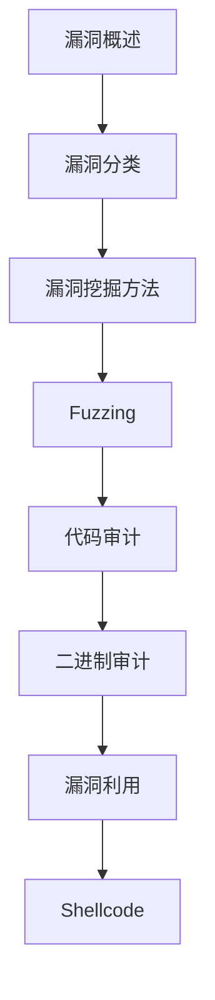

# 漏洞挖掘 学习指南

> **分类**：安全 ｜ **章节总数**：60 ｜ **技术栈**：漏洞挖掘

> **学习声明**：本章内容仅供合法授权环境下的安全研究与防御建设，请遵守法律法规与组织安全政策，禁止对未授权系统开展测试。

## 领域概述

安全缺陷分析是安全领域的重要技术方向，本系列从基础到高级逐步深入，涵盖11个核心模块：漏洞概述、漏洞分类、安全缺陷分析方法、Fuzzing、代码审计等。每个知识点作为独立章节，包含原理讲解、实现要点、常见陷阱和最佳实践，配合源码分析和架构图，帮助读者建立完整的安全缺陷分析知识体系。

本教程基于 **通用** 与 **漏洞挖掘** 生态编写，涵盖 行业标准工具链 等主流工具与框架。每章独立成篇，文字精炼、逻辑清晰，适合系统学习与按需查阅。

## 你将学到什么

完成本系列后，你将能够：

- 系统理解 **漏洞挖掘** 的核心概念与模块划分。
- 按难度递进掌握从入门到实战的完整知识路径。
- 在工程实践中做出合理的技术判断与问题排查。
- 通过章节索引快速定位所需知识点。

## 前置知识

- 编程基础
- 数据结构
- 计算机基础
- 安全基础概念

## 推荐学习路径

1. **漏洞概述**
2. **漏洞分类**
3. **漏洞挖掘方法**
4. **Fuzzing**
5. **代码审计**
6. **二进制审计**
7. **漏洞利用**
8. **Shellcode**

## 模块体系

本领域按以下模块组织，难度由浅入深：

- **漏洞概述**
- **漏洞分类**
- **漏洞挖掘方法**
- **Fuzzing**
- **代码审计**
- **二进制审计**
- **漏洞利用**
- **Shellcode**
- **ROP**
- **漏洞报告**
- **漏洞挖掘最佳实践**

## 难度分布

| 难度 | 章节数 | 占比 |
|------|--------|------|
| 入门 | 12 | 20% |
| 实战 | 15 | 25% |
| 进阶 | 18 | 30% |
| 高级 | 15 | 25% |

## 章节索引

点击章节标题进入对应教程：

### 漏洞概述

- [漏洞概述核心概念与原理](chapters/001-漏洞概述核心概念与原理.md) ｜ 入门
- [漏洞概述的实现机制详解](chapters/002-漏洞概述的实现机制详解.md) ｜ 入门
- [漏洞概述的关键技术点](chapters/003-漏洞概述的关键技术点.md) ｜ 入门
- [漏洞概述的源码级分析](chapters/004-漏洞概述的源码级分析.md) ｜ 入门
- [漏洞概述的配置与使用](chapters/005-漏洞概述的配置与使用.md) ｜ 入门
- [漏洞概述的常见问题与解决方案](chapters/006-漏洞概述的常见问题与解决方案.md) ｜ 入门

### 漏洞分类

- [漏洞分类核心概念与原理](chapters/007-漏洞分类核心概念与原理.md) ｜ 入门
- [漏洞分类的实现机制详解](chapters/008-漏洞分类的实现机制详解.md) ｜ 入门
- [漏洞分类的关键技术点](chapters/009-漏洞分类的关键技术点.md) ｜ 入门
- [漏洞分类的源码级分析](chapters/010-漏洞分类的源码级分析.md) ｜ 入门
- [漏洞分类的配置与使用](chapters/011-漏洞分类的配置与使用.md) ｜ 入门
- [漏洞分类的常见问题与解决方案](chapters/012-漏洞分类的常见问题与解决方案.md) ｜ 入门

### 漏洞挖掘方法

- [安全缺陷分析方法核心概念与原理](chapters/013-安全缺陷分析方法核心概念与原理.md) ｜ 进阶
- [安全缺陷分析方法的实现机制详解](chapters/014-安全缺陷分析方法的实现机制详解.md) ｜ 进阶
- [安全缺陷分析方法的关键技术点](chapters/015-安全缺陷分析方法的关键技术点.md) ｜ 进阶
- [安全缺陷分析方法的源码级分析](chapters/016-安全缺陷分析方法的源码级分析.md) ｜ 进阶
- [安全缺陷分析方法的配置与使用](chapters/017-安全缺陷分析方法的配置与使用.md) ｜ 进阶
- [安全缺陷分析方法的常见问题与解决方案](chapters/018-安全缺陷分析方法的常见问题与解决方案.md) ｜ 进阶

### Fuzzing

- [Fuzzing核心概念与原理](chapters/019-Fuzzing核心概念与原理.md) ｜ 进阶
- [Fuzzing的实现机制详解](chapters/020-Fuzzing的实现机制详解.md) ｜ 进阶
- [Fuzzing的关键技术点](chapters/021-Fuzzing的关键技术点.md) ｜ 进阶
- [Fuzzing的源码级分析](chapters/022-Fuzzing的源码级分析.md) ｜ 进阶
- [Fuzzing的配置与使用](chapters/023-Fuzzing的配置与使用.md) ｜ 进阶
- [Fuzzing的常见问题与解决方案](chapters/024-Fuzzing的常见问题与解决方案.md) ｜ 进阶

### 代码审计

- [代码审计核心概念与原理](chapters/025-代码审计核心概念与原理.md) ｜ 进阶
- [代码审计的实现机制详解](chapters/026-代码审计的实现机制详解.md) ｜ 进阶
- [代码审计的关键技术点](chapters/027-代码审计的关键技术点.md) ｜ 进阶
- [代码审计的源码级分析](chapters/028-代码审计的源码级分析.md) ｜ 进阶
- [代码审计的配置与使用](chapters/029-代码审计的配置与使用.md) ｜ 进阶
- [代码审计的常见问题与解决方案](chapters/030-代码审计的常见问题与解决方案.md) ｜ 进阶

### 二进制审计

- [二进制审计核心概念与原理](chapters/031-二进制审计核心概念与原理.md) ｜ 高级
- [二进制审计的实现机制详解](chapters/032-二进制审计的实现机制详解.md) ｜ 高级
- [二进制审计的关键技术点](chapters/033-二进制审计的关键技术点.md) ｜ 高级
- [二进制审计的源码级分析](chapters/034-二进制审计的源码级分析.md) ｜ 高级
- [二进制审计的配置与使用](chapters/035-二进制审计的配置与使用.md) ｜ 高级

### 漏洞利用

- [风险验证核心概念与原理](chapters/036-风险验证核心概念与原理.md) ｜ 高级
- [风险验证的实现机制详解](chapters/037-风险验证的实现机制详解.md) ｜ 高级
- [风险验证的关键技术点](chapters/038-风险验证的关键技术点.md) ｜ 高级
- [风险验证的源码级分析](chapters/039-风险验证的源码级分析.md) ｜ 高级
- [风险验证的配置与使用](chapters/040-风险验证的配置与使用.md) ｜ 高级

### Shellcode

- [Shellcode核心概念与原理](chapters/041-Shellcode核心概念与原理.md) ｜ 高级
- [Shellcode的实现机制详解](chapters/042-Shellcode的实现机制详解.md) ｜ 高级
- [Shellcode的关键技术点](chapters/043-Shellcode的关键技术点.md) ｜ 高级
- [Shellcode的源码级分析](chapters/044-Shellcode的源码级分析.md) ｜ 高级
- [Shellcode的配置与使用](chapters/045-Shellcode的配置与使用.md) ｜ 高级

### ROP

- [ROP核心概念与原理](chapters/046-ROP核心概念与原理.md) ｜ 实战
- [ROP的实现机制详解](chapters/047-ROP的实现机制详解.md) ｜ 实战
- [ROP的关键技术点](chapters/048-ROP的关键技术点.md) ｜ 实战
- [ROP的源码级分析](chapters/049-ROP的源码级分析.md) ｜ 实战
- [ROP的配置与使用](chapters/050-ROP的配置与使用.md) ｜ 实战

### 漏洞报告

- [漏洞报告核心概念与原理](chapters/051-漏洞报告核心概念与原理.md) ｜ 实战
- [漏洞报告的实现机制详解](chapters/052-漏洞报告的实现机制详解.md) ｜ 实战
- [漏洞报告的关键技术点](chapters/053-漏洞报告的关键技术点.md) ｜ 实战
- [漏洞报告的源码级分析](chapters/054-漏洞报告的源码级分析.md) ｜ 实战
- [漏洞报告的配置与使用](chapters/055-漏洞报告的配置与使用.md) ｜ 实战

### 漏洞挖掘最佳实践

- [安全缺陷分析最佳实践核心概念与原理](chapters/056-安全缺陷分析最佳实践核心概念与原理.md) ｜ 实战
- [安全缺陷分析最佳实践的实现机制详解](chapters/057-安全缺陷分析最佳实践的实现机制详解.md) ｜ 实战
- [安全缺陷分析最佳实践的关键技术点](chapters/058-安全缺陷分析最佳实践的关键技术点.md) ｜ 实战
- [安全缺陷分析最佳实践的源码级分析](chapters/059-安全缺陷分析最佳实践的源码级分析.md) ｜ 实战
- [安全缺陷分析最佳实践的配置与使用](chapters/060-安全缺陷分析最佳实践的配置与使用.md) ｜ 实战

## 学习方法建议

1. **先读概述再读章节**：用本指南建立全局地图，避免迷失在细节中。
2. **按模块递进**：同一模块内章节有前后关联，顺序阅读效果更好。
3. **主动复述**：每章读完后，用三五句话概括「是什么、为什么、怎么用」。
4. **关联阅读**：利用章节底部的「延伸学习」在同模块内构建知识网络。
5. **对照官方文档**：本教程提供结构化视角，细节以官方文档为准。

---
*领域: 漏洞挖掘 ｜ 版本: 2.0 ｜ 共 60 章*