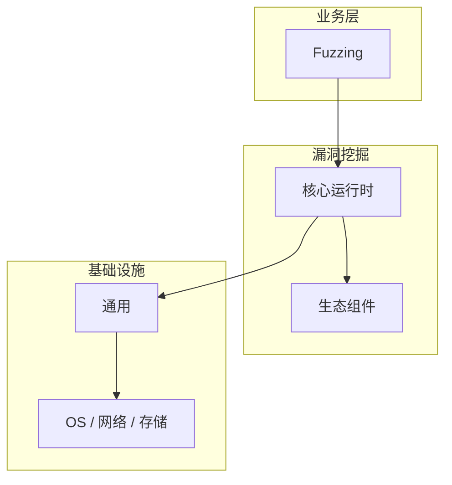

# Fuzzing的实现机制详解

> **领域**：漏洞挖掘 ｜ **模块**：Fuzzing ｜ **难度**：进阶 ｜ **类型**：实现机制

> **学习声明**：本章内容仅供合法授权环境下的安全研究与防御建设，请遵守法律法规与组织安全政策，禁止对未授权系统开展测试。

## 导读

本章系统讲解 **漏洞挖掘** 中 **Fuzzing** 的相关知识（实现机制）。本章聚焦 **Fuzzing** 的内部实现路径与关键数据结构，帮助从 API 用法深入到机制层。内容基于主流框架与工程实践撰写，不依赖过时概念堆砌。

## 核心知识

**Fuzzing** 是 漏洞挖掘 领域的核心主题。模糊测试原理与工具。本模块从原理与工程实践出发，帮助读者建立系统理解。 本教程内容仅供合法授权的安全测试、防御加固与学术研究使用。未经授权对他人系统进行扫描、入侵或破坏属于违法行为。

### 核心知识

**1. Fuzzer 类型**

变异型（AFL++）、生成型（libFuzzer）、协议 Fuzz。

**2. 覆盖率**

AFL 通过插桩监控代码覆盖率引导变异。

**3. 工作流**

准备语料 → 启动 Fuzzer → 监控 Crash → 分析 Triage。

## 架构与流程

## 技术详解

### 实现机制

输入变异 → 执行目标 → 监控异常 → 最小化 Crash 用例 → 根因分析。

## 原理与实现

### 工作机制

输入变异 → 执行目标 → 监控异常 → 最小化 Crash 用例 → 根因分析。

### 内部实现

Fuzzing 的底层实现依赖 漏洞挖掘 生态中的标准组件与协议，建议阅读官方规范文档。

## 操作流程与实践

### 操作流程

1. 理解 Fuzzing 概念 → 2. 学习标准用法 → 3. 动手实验 → 4. 分析案例 → 5. 总结最佳实践。

### 配置要点

配置 Fuzzing 时遵循官方推荐默认值，仅在理解影响后调整参数。

## 性能、安全与排查

### 性能优化

评估 Fuzzing 性能时建立基准测试，关注时间/空间复杂度或系统吞吐延迟指标。

### 安全注意

本教程内容仅供合法授权的安全测试、防御加固与学术研究使用。未经授权对他人系统进行扫描、入侵或破坏属于违法行为。

### 调试排错

排查 Fuzzing 问题时，结合日志、监控与最小复现用例逐步定位根因。

## 案例与选型

### 案例复盘

在典型 漏洞挖掘 项目中，正确应用 Fuzzing 可显著提升系统质量与可维护性。

### 方案对比

选择 Fuzzing 方案时需对比多种替代方案的适用场景、性能与生态支持。

## 本章聚焦

阅读 **Fuzzing** 实现时，建议对照调用栈画出数据流：入口 API → 核心数据结构 → 系统调用或 I/O 边界，标注锁与共享状态位置。

### 常见误区与纠正

**概念理解偏差**

对 Fuzzing 理解不全面导致误用，应回到官方文档重新梳理。

**忽视边界条件**

Fuzzing 在极端输入或高并发下行为可能不同，需充分测试。

**缺少监控**

未对 Fuzzing 关键指标监控，问题只能被动发现。

### 最佳实践

1. 遵循 漏洞挖掘 领域 Fuzzing 的官方推荐实践
2. 为 Fuzzing 相关功能编写自动化测试
3. 关键配置纳入版本管理与变更审计
4. 生产部署前在接近真实环境验证

## 巩固建议

建议结合 **漏洞挖掘** 官方文档与小型实验，亲手验证 **Fuzzing** 的默认行为与边界条件；将本章要点整理为检查清单或 ADR，便于评审与团队 onboarding。

### 本章小结

学完本章，你应能独立说明 **Fuzzing** 在 漏洞挖掘 中的角色，理解其核心机制，规避常见误区，并在项目中正确运用。

## 延伸学习

- Fuzzing核心概念与原理
- Fuzzing的关键技术点
- Fuzzing的源码级分析
- Fuzzing的配置与使用
- Fuzzing的常见问题与解决方案

### 延伸阅读

- 漏洞挖掘 官方文档 - Fuzzing
- OWASP / NIST 相关指南（如适用）
- 权威书籍与 RFC 标准文档

---
*章节 ID: 020 ｜ 领域: 漏洞挖掘*