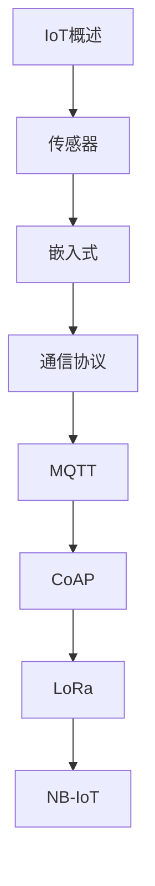

# 物联网 学习指南

> **分类**：其他 ｜ **章节总数**：60 ｜ **技术栈**：物联网

## 领域概述

物联网是其他领域的重要技术方向，本系列从基础到高级逐步深入，涵盖12个核心模块：IoT概述、传感器、嵌入式、通信协议、MQTT等。每个知识点作为独立章节，包含原理讲解、实现要点、常见陷阱和最佳实践，配合源码分析和架构图，帮助读者建立完整的物联网知识体系。

本教程基于 **通用** 与 **物联网** 生态编写，涵盖 行业标准工具链 等主流工具与框架。每章独立成篇，文字精炼、逻辑清晰，适合系统学习与按需查阅。

## 你将学到什么

完成本系列后，你将能够：

- 系统理解 **物联网** 的核心概念与模块划分。
- 按难度递进掌握从入门到实战的完整知识路径。
- 在工程实践中做出合理的技术判断与问题排查。
- 通过章节索引快速定位所需知识点。

## 前置知识

- 编程基础
- 数据结构
- 计算机基础
- 其他基础概念

## 推荐学习路径

1. **IoT概述**
2. **传感器**
3. **嵌入式**
4. **通信协议**
5. **MQTT**
6. **CoAP**
7. **LoRa**
8. **NB-IoT**

## 模块体系

本领域按以下模块组织，难度由浅入深：

- **IoT概述**
- **传感器**
- **嵌入式**
- **通信协议**
- **MQTT**
- **CoAP**
- **LoRa**
- **NB-IoT**
- **边缘计算**
- **物联网平台**
- **物联网安全**
- **物联网最佳实践**

## 难度分布

| 难度 | 章节数 | 占比 |
|------|--------|------|
| 入门 | 15 | 25% |
| 实战 | 15 | 25% |
| 进阶 | 15 | 25% |
| 高级 | 15 | 25% |

## 章节索引

点击章节标题进入对应教程：

### IoT概述

- [IoT概述核心概念与原理](chapters/001-IoT概述核心概念与原理.md) ｜ 入门
- [IoT概述的实现机制详解](chapters/002-IoT概述的实现机制详解.md) ｜ 入门
- [IoT概述的关键技术点](chapters/003-IoT概述的关键技术点.md) ｜ 入门
- [IoT概述的源码级分析](chapters/004-IoT概述的源码级分析.md) ｜ 入门
- [IoT概述的配置与使用](chapters/005-IoT概述的配置与使用.md) ｜ 入门

### 传感器

- [传感器核心概念与原理](chapters/006-传感器核心概念与原理.md) ｜ 入门
- [传感器的实现机制详解](chapters/007-传感器的实现机制详解.md) ｜ 入门
- [传感器的关键技术点](chapters/008-传感器的关键技术点.md) ｜ 入门
- [传感器的源码级分析](chapters/009-传感器的源码级分析.md) ｜ 入门
- [传感器的配置与使用](chapters/010-传感器的配置与使用.md) ｜ 入门

### 嵌入式

- [嵌入式核心概念与原理](chapters/011-嵌入式核心概念与原理.md) ｜ 入门
- [嵌入式的实现机制详解](chapters/012-嵌入式的实现机制详解.md) ｜ 入门
- [嵌入式的关键技术点](chapters/013-嵌入式的关键技术点.md) ｜ 入门
- [嵌入式的源码级分析](chapters/014-嵌入式的源码级分析.md) ｜ 入门
- [嵌入式的配置与使用](chapters/015-嵌入式的配置与使用.md) ｜ 入门

### 通信协议

- [通信协议核心概念与原理](chapters/016-通信协议核心概念与原理.md) ｜ 进阶
- [通信协议的实现机制详解](chapters/017-通信协议的实现机制详解.md) ｜ 进阶
- [通信协议的关键技术点](chapters/018-通信协议的关键技术点.md) ｜ 进阶
- [通信协议的源码级分析](chapters/019-通信协议的源码级分析.md) ｜ 进阶
- [通信协议的配置与使用](chapters/020-通信协议的配置与使用.md) ｜ 进阶

### MQTT

- [MQTT核心概念与原理](chapters/021-MQTT核心概念与原理.md) ｜ 进阶
- [MQTT的实现机制详解](chapters/022-MQTT的实现机制详解.md) ｜ 进阶
- [MQTT的关键技术点](chapters/023-MQTT的关键技术点.md) ｜ 进阶
- [MQTT的源码级分析](chapters/024-MQTT的源码级分析.md) ｜ 进阶
- [MQTT的配置与使用](chapters/025-MQTT的配置与使用.md) ｜ 进阶

### CoAP

- [CoAP核心概念与原理](chapters/026-CoAP核心概念与原理.md) ｜ 进阶
- [CoAP的实现机制详解](chapters/027-CoAP的实现机制详解.md) ｜ 进阶
- [CoAP的关键技术点](chapters/028-CoAP的关键技术点.md) ｜ 进阶
- [CoAP的源码级分析](chapters/029-CoAP的源码级分析.md) ｜ 进阶
- [CoAP的配置与使用](chapters/030-CoAP的配置与使用.md) ｜ 进阶

### LoRa

- [LoRa核心概念与原理](chapters/031-LoRa核心概念与原理.md) ｜ 高级
- [LoRa的实现机制详解](chapters/032-LoRa的实现机制详解.md) ｜ 高级
- [LoRa的关键技术点](chapters/033-LoRa的关键技术点.md) ｜ 高级
- [LoRa的源码级分析](chapters/034-LoRa的源码级分析.md) ｜ 高级
- [LoRa的配置与使用](chapters/035-LoRa的配置与使用.md) ｜ 高级

### NB-IoT

- [NB-IoT核心概念与原理](chapters/036-NB-IoT核心概念与原理.md) ｜ 高级
- [NB-IoT的实现机制详解](chapters/037-NB-IoT的实现机制详解.md) ｜ 高级
- [NB-IoT的关键技术点](chapters/038-NB-IoT的关键技术点.md) ｜ 高级
- [NB-IoT的源码级分析](chapters/039-NB-IoT的源码级分析.md) ｜ 高级
- [NB-IoT的配置与使用](chapters/040-NB-IoT的配置与使用.md) ｜ 高级

### 边缘计算

- [边缘计算核心概念与原理](chapters/041-边缘计算核心概念与原理.md) ｜ 高级
- [边缘计算的实现机制详解](chapters/042-边缘计算的实现机制详解.md) ｜ 高级
- [边缘计算的关键技术点](chapters/043-边缘计算的关键技术点.md) ｜ 高级
- [边缘计算的源码级分析](chapters/044-边缘计算的源码级分析.md) ｜ 高级
- [边缘计算的配置与使用](chapters/045-边缘计算的配置与使用.md) ｜ 高级

### 物联网平台

- [物联网平台核心概念与原理](chapters/046-物联网平台核心概念与原理.md) ｜ 实战
- [物联网平台的实现机制详解](chapters/047-物联网平台的实现机制详解.md) ｜ 实战
- [物联网平台的关键技术点](chapters/048-物联网平台的关键技术点.md) ｜ 实战
- [物联网平台的源码级分析](chapters/049-物联网平台的源码级分析.md) ｜ 实战
- [物联网平台的配置与使用](chapters/050-物联网平台的配置与使用.md) ｜ 实战

### 物联网安全

- [物联网安全核心概念与原理](chapters/051-物联网安全核心概念与原理.md) ｜ 实战
- [物联网安全的实现机制详解](chapters/052-物联网安全的实现机制详解.md) ｜ 实战
- [物联网安全的关键技术点](chapters/053-物联网安全的关键技术点.md) ｜ 实战
- [物联网安全的源码级分析](chapters/054-物联网安全的源码级分析.md) ｜ 实战
- [物联网安全的配置与使用](chapters/055-物联网安全的配置与使用.md) ｜ 实战

### 物联网最佳实践

- [物联网最佳实践核心概念与原理](chapters/056-物联网最佳实践核心概念与原理.md) ｜ 实战
- [物联网最佳实践的实现机制详解](chapters/057-物联网最佳实践的实现机制详解.md) ｜ 实战
- [物联网最佳实践的关键技术点](chapters/058-物联网最佳实践的关键技术点.md) ｜ 实战
- [物联网最佳实践的源码级分析](chapters/059-物联网最佳实践的源码级分析.md) ｜ 实战
- [物联网最佳实践的配置与使用](chapters/060-物联网最佳实践的配置与使用.md) ｜ 实战

## 学习方法建议

1. **先读概述再读章节**：用本指南建立全局地图，避免迷失在细节中。
2. **按模块递进**：同一模块内章节有前后关联，顺序阅读效果更好。
3. **主动复述**：每章读完后，用三五句话概括「是什么、为什么、怎么用」。
4. **关联阅读**：利用章节底部的「延伸学习」在同模块内构建知识网络。
5. **对照官方文档**：本教程提供结构化视角，细节以官方文档为准。

---
*领域: 物联网 ｜ 版本: 2.0 ｜ 共 60 章*