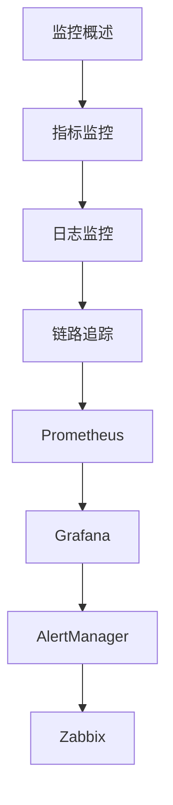

# 监控告警 学习指南

> **分类**：DevOps ｜ **技术生态**：Prometheus、Grafana、Alertmanager、Jaeger、Datadog

## 领域定位

可观测性由指标（Metrics）、日志（Logs）、链路（Traces）组成。Prometheus 拉取指标，Grafana 可视化，Alertmanager 路由告警。

覆盖 RED/USE 方法、SLO/SLI、告警降噪与 On-call 实践。

本领域常用技术栈与工具包括：Prometheus、Grafana、Alertmanager、Jaeger、Datadog。

## 学习目标

- 能定义 SLI/SLO 与 error budget
- 能编写 PromQL 与告警规则
- 能设计告警分级与 runbook
- 能集成 APM 追踪

## 前置知识

- HTTP 服务
- Linux 基础
- 时间序列概念

## 学习路径

1. **监控概述**
2. **指标监控**
3. **日志监控**
4. **链路追踪**
5. **Prometheus**
6. **Grafana**
7. **AlertManager**
8. **Zabbix**

## 模块体系

- **监控概述**
- **指标监控**
- **日志监控**
- **链路追踪**
- **Prometheus**
- **Grafana**
- **AlertManager**
- **Zabbix**
- **APM**
- **告警设计**
- **SLA/SLO**
- **容量规划**
- **性能分析**
- **监控最佳实践**

## 难度分布

| 入门 | 18 | 22% |
| 实战 | 15 | 18% |
| 进阶 | 24 | 30% |
| 高级 | 23 | 28% |

## 章节索引

### 监控概述

- [监控概述核心概念与原理](chapters/001-监控概述核心概念与原理.md) ｜ 入门
- [监控概述的实现机制详解](chapters/002-监控概述的实现机制详解.md) ｜ 入门
- [监控概述的关键技术点](chapters/003-监控概述的关键技术点.md) ｜ 入门
- [监控概述的源码级分析](chapters/004-监控概述的源码级分析.md) ｜ 入门
- [监控概述的配置与使用](chapters/005-监控概述的配置与使用.md) ｜ 入门
- [监控概述的常见问题与解决方案](chapters/006-监控概述的常见问题与解决方案.md) ｜ 入门

### 指标监控

- [指标监控核心概念与原理](chapters/007-指标监控核心概念与原理.md) ｜ 入门
- [指标监控的实现机制详解](chapters/008-指标监控的实现机制详解.md) ｜ 入门
- [指标监控的关键技术点](chapters/009-指标监控的关键技术点.md) ｜ 入门
- [指标监控的源码级分析](chapters/010-指标监控的源码级分析.md) ｜ 入门
- [指标监控的配置与使用](chapters/011-指标监控的配置与使用.md) ｜ 入门
- [指标监控的常见问题与解决方案](chapters/012-指标监控的常见问题与解决方案.md) ｜ 入门

### 日志监控

- [日志监控核心概念与原理](chapters/013-日志监控核心概念与原理.md) ｜ 入门
- [日志监控的实现机制详解](chapters/014-日志监控的实现机制详解.md) ｜ 入门
- [日志监控的关键技术点](chapters/015-日志监控的关键技术点.md) ｜ 入门
- [日志监控的源码级分析](chapters/016-日志监控的源码级分析.md) ｜ 入门
- [日志监控的配置与使用](chapters/017-日志监控的配置与使用.md) ｜ 入门
- [日志监控的常见问题与解决方案](chapters/018-日志监控的常见问题与解决方案.md) ｜ 入门

### 链路追踪

- [链路追踪核心概念与原理](chapters/019-链路追踪核心概念与原理.md) ｜ 进阶
- [链路追踪的实现机制详解](chapters/020-链路追踪的实现机制详解.md) ｜ 进阶
- [链路追踪的关键技术点](chapters/021-链路追踪的关键技术点.md) ｜ 进阶
- [链路追踪的源码级分析](chapters/022-链路追踪的源码级分析.md) ｜ 进阶
- [链路追踪的配置与使用](chapters/023-链路追踪的配置与使用.md) ｜ 进阶
- [链路追踪的常见问题与解决方案](chapters/024-链路追踪的常见问题与解决方案.md) ｜ 进阶

### Prometheus

- [Prometheus核心概念与原理](chapters/025-Prometheus核心概念与原理.md) ｜ 进阶
- [Prometheus的实现机制详解](chapters/026-Prometheus的实现机制详解.md) ｜ 进阶
- [Prometheus的关键技术点](chapters/027-Prometheus的关键技术点.md) ｜ 进阶
- [Prometheus的源码级分析](chapters/028-Prometheus的源码级分析.md) ｜ 进阶
- [Prometheus的配置与使用](chapters/029-Prometheus的配置与使用.md) ｜ 进阶
- [Prometheus的常见问题与解决方案](chapters/030-Prometheus的常见问题与解决方案.md) ｜ 进阶

### Grafana

- [Grafana核心概念与原理](chapters/031-Grafana核心概念与原理.md) ｜ 进阶
- [Grafana的实现机制详解](chapters/032-Grafana的实现机制详解.md) ｜ 进阶
- [Grafana的关键技术点](chapters/033-Grafana的关键技术点.md) ｜ 进阶
- [Grafana的源码级分析](chapters/034-Grafana的源码级分析.md) ｜ 进阶
- [Grafana的配置与使用](chapters/035-Grafana的配置与使用.md) ｜ 进阶
- [Grafana的常见问题与解决方案](chapters/036-Grafana的常见问题与解决方案.md) ｜ 进阶

### AlertManager

- [AlertManager核心概念与原理](chapters/037-AlertManager核心概念与原理.md) ｜ 进阶
- [AlertManager的实现机制详解](chapters/038-AlertManager的实现机制详解.md) ｜ 进阶
- [AlertManager的关键技术点](chapters/039-AlertManager的关键技术点.md) ｜ 进阶
- [AlertManager的源码级分析](chapters/040-AlertManager的源码级分析.md) ｜ 进阶
- [AlertManager的配置与使用](chapters/041-AlertManager的配置与使用.md) ｜ 进阶
- [AlertManager的常见问题与解决方案](chapters/042-AlertManager的常见问题与解决方案.md) ｜ 进阶

### Zabbix

- [Zabbix核心概念与原理](chapters/043-Zabbix核心概念与原理.md) ｜ 高级
- [Zabbix的实现机制详解](chapters/044-Zabbix的实现机制详解.md) ｜ 高级
- [Zabbix的关键技术点](chapters/045-Zabbix的关键技术点.md) ｜ 高级
- [Zabbix的源码级分析](chapters/046-Zabbix的源码级分析.md) ｜ 高级
- [Zabbix的配置与使用](chapters/047-Zabbix的配置与使用.md) ｜ 高级
- [Zabbix的常见问题与解决方案](chapters/048-Zabbix的常见问题与解决方案.md) ｜ 高级

### APM

- [APM核心概念与原理](chapters/049-APM核心概念与原理.md) ｜ 高级
- [APM的实现机制详解](chapters/050-APM的实现机制详解.md) ｜ 高级
- [APM的关键技术点](chapters/051-APM的关键技术点.md) ｜ 高级
- [APM的源码级分析](chapters/052-APM的源码级分析.md) ｜ 高级
- [APM的配置与使用](chapters/053-APM的配置与使用.md) ｜ 高级
- [APM的常见问题与解决方案](chapters/054-APM的常见问题与解决方案.md) ｜ 高级

### 告警设计

- [告警设计核心概念与原理](chapters/055-告警设计核心概念与原理.md) ｜ 高级
- [告警设计的实现机制详解](chapters/056-告警设计的实现机制详解.md) ｜ 高级
- [告警设计的关键技术点](chapters/057-告警设计的关键技术点.md) ｜ 高级
- [告警设计的源码级分析](chapters/058-告警设计的源码级分析.md) ｜ 高级
- [告警设计的配置与使用](chapters/059-告警设计的配置与使用.md) ｜ 高级
- [告警设计的常见问题与解决方案](chapters/060-告警设计的常见问题与解决方案.md) ｜ 高级

### SLA/SLO

- [SLA/SLO核心概念与原理](chapters/061-SLASLO核心概念与原理.md) ｜ 高级
- [SLA/SLO的实现机制详解](chapters/062-SLASLO的实现机制详解.md) ｜ 高级
- [SLA/SLO的关键技术点](chapters/063-SLASLO的关键技术点.md) ｜ 高级
- [SLA/SLO的源码级分析](chapters/064-SLASLO的源码级分析.md) ｜ 高级
- [SLA/SLO的配置与使用](chapters/065-SLASLO的配置与使用.md) ｜ 高级

### 容量规划

- [容量规划核心概念与原理](chapters/066-容量规划核心概念与原理.md) ｜ 实战
- [容量规划的实现机制详解](chapters/067-容量规划的实现机制详解.md) ｜ 实战
- [容量规划的关键技术点](chapters/068-容量规划的关键技术点.md) ｜ 实战
- [容量规划的源码级分析](chapters/069-容量规划的源码级分析.md) ｜ 实战
- [容量规划的配置与使用](chapters/070-容量规划的配置与使用.md) ｜ 实战

### 性能分析

- [性能分析核心概念与原理](chapters/071-性能分析核心概念与原理.md) ｜ 实战
- [性能分析的实现机制详解](chapters/072-性能分析的实现机制详解.md) ｜ 实战
- [性能分析的关键技术点](chapters/073-性能分析的关键技术点.md) ｜ 实战
- [性能分析的源码级分析](chapters/074-性能分析的源码级分析.md) ｜ 实战
- [性能分析的配置与使用](chapters/075-性能分析的配置与使用.md) ｜ 实战

### 监控最佳实践

- [监控最佳实践核心概念与原理](chapters/076-监控最佳实践核心概念与原理.md) ｜ 实战
- [监控最佳实践的实现机制详解](chapters/077-监控最佳实践的实现机制详解.md) ｜ 实战
- [监控最佳实践的关键技术点](chapters/078-监控最佳实践的关键技术点.md) ｜ 实战
- [监控最佳实践的源码级分析](chapters/079-监控最佳实践的源码级分析.md) ｜ 实战
- [监控最佳实践的配置与使用](chapters/080-监控最佳实践的配置与使用.md) ｜ 实战

---
*领域: 监控告警*