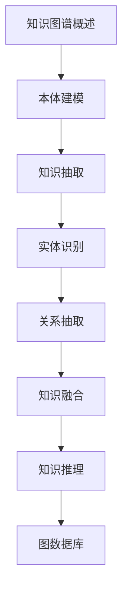

# 知识图谱 学习指南

> **分类**：AI与算法 ｜ **章节总数**：60 ｜ **技术栈**：知识图谱

## 领域概述

知识图谱是AI与算法领域的重要技术方向，本系列从基础到高级逐步深入，涵盖11个核心模块：知识图谱概述、本体建模、知识抽取、实体识别、关系抽取等。每个知识点作为独立章节，包含原理讲解、实现要点、常见陷阱和最佳实践，配合源码分析和架构图，帮助读者建立完整的知识图谱知识体系。

本教程基于 **通用** 与 **知识图谱** 生态编写，涵盖 行业标准工具链 等主流工具与框架。每章独立成篇，文字精炼、逻辑清晰，适合系统学习与按需查阅。

## 你将学到什么

完成本系列后，你将能够：

- 系统理解 **知识图谱** 的核心概念与模块划分。
- 按难度递进掌握从入门到实战的完整知识路径。
- 在工程实践中做出合理的技术判断与问题排查。
- 通过章节索引快速定位所需知识点。

## 前置知识

- 编程基础
- 数据结构
- 计算机基础
- AI与算法基础概念

## 推荐学习路径

1. **知识图谱概述**
2. **本体建模**
3. **知识抽取**
4. **实体识别**
5. **关系抽取**
6. **知识融合**
7. **知识推理**
8. **图数据库**

## 模块体系

本领域按以下模块组织，难度由浅入深：

- **知识图谱概述**
- **本体建模**
- **知识抽取**
- **实体识别**
- **关系抽取**
- **知识融合**
- **知识推理**
- **图数据库**
- **Neo4j**
- **知识图谱应用**
- **知识图谱最佳实践**

## 难度分布

| 难度 | 章节数 | 占比 |
|------|--------|------|
| 入门 | 12 | 20% |
| 实战 | 15 | 25% |
| 进阶 | 18 | 30% |
| 高级 | 15 | 25% |

## 章节索引

点击章节标题进入对应教程：

### 知识图谱概述

- [知识图谱概述核心概念与原理](chapters/001-知识图谱概述核心概念与原理.md) ｜ 入门
- [知识图谱概述的实现机制详解](chapters/002-知识图谱概述的实现机制详解.md) ｜ 入门
- [知识图谱概述的关键技术点](chapters/003-知识图谱概述的关键技术点.md) ｜ 入门
- [知识图谱概述的源码级分析](chapters/004-知识图谱概述的源码级分析.md) ｜ 入门
- [知识图谱概述的配置与使用](chapters/005-知识图谱概述的配置与使用.md) ｜ 入门
- [知识图谱概述的常见问题与解决方案](chapters/006-知识图谱概述的常见问题与解决方案.md) ｜ 入门

### 本体建模

- [本体建模核心概念与原理](chapters/007-本体建模核心概念与原理.md) ｜ 入门
- [本体建模的实现机制详解](chapters/008-本体建模的实现机制详解.md) ｜ 入门
- [本体建模的关键技术点](chapters/009-本体建模的关键技术点.md) ｜ 入门
- [本体建模的源码级分析](chapters/010-本体建模的源码级分析.md) ｜ 入门
- [本体建模的配置与使用](chapters/011-本体建模的配置与使用.md) ｜ 入门
- [本体建模的常见问题与解决方案](chapters/012-本体建模的常见问题与解决方案.md) ｜ 入门

### 知识抽取

- [知识抽取核心概念与原理](chapters/013-知识抽取核心概念与原理.md) ｜ 进阶
- [知识抽取的实现机制详解](chapters/014-知识抽取的实现机制详解.md) ｜ 进阶
- [知识抽取的关键技术点](chapters/015-知识抽取的关键技术点.md) ｜ 进阶
- [知识抽取的源码级分析](chapters/016-知识抽取的源码级分析.md) ｜ 进阶
- [知识抽取的配置与使用](chapters/017-知识抽取的配置与使用.md) ｜ 进阶
- [知识抽取的常见问题与解决方案](chapters/018-知识抽取的常见问题与解决方案.md) ｜ 进阶

### 实体识别

- [实体识别核心概念与原理](chapters/019-实体识别核心概念与原理.md) ｜ 进阶
- [实体识别的实现机制详解](chapters/020-实体识别的实现机制详解.md) ｜ 进阶
- [实体识别的关键技术点](chapters/021-实体识别的关键技术点.md) ｜ 进阶
- [实体识别的源码级分析](chapters/022-实体识别的源码级分析.md) ｜ 进阶
- [实体识别的配置与使用](chapters/023-实体识别的配置与使用.md) ｜ 进阶
- [实体识别的常见问题与解决方案](chapters/024-实体识别的常见问题与解决方案.md) ｜ 进阶

### 关系抽取

- [关系抽取核心概念与原理](chapters/025-关系抽取核心概念与原理.md) ｜ 进阶
- [关系抽取的实现机制详解](chapters/026-关系抽取的实现机制详解.md) ｜ 进阶
- [关系抽取的关键技术点](chapters/027-关系抽取的关键技术点.md) ｜ 进阶
- [关系抽取的源码级分析](chapters/028-关系抽取的源码级分析.md) ｜ 进阶
- [关系抽取的配置与使用](chapters/029-关系抽取的配置与使用.md) ｜ 进阶
- [关系抽取的常见问题与解决方案](chapters/030-关系抽取的常见问题与解决方案.md) ｜ 进阶

### 知识融合

- [知识融合核心概念与原理](chapters/031-知识融合核心概念与原理.md) ｜ 高级
- [知识融合的实现机制详解](chapters/032-知识融合的实现机制详解.md) ｜ 高级
- [知识融合的关键技术点](chapters/033-知识融合的关键技术点.md) ｜ 高级
- [知识融合的源码级分析](chapters/034-知识融合的源码级分析.md) ｜ 高级
- [知识融合的配置与使用](chapters/035-知识融合的配置与使用.md) ｜ 高级

### 知识推理

- [知识推理核心概念与原理](chapters/036-知识推理核心概念与原理.md) ｜ 高级
- [知识推理的实现机制详解](chapters/037-知识推理的实现机制详解.md) ｜ 高级
- [知识推理的关键技术点](chapters/038-知识推理的关键技术点.md) ｜ 高级
- [知识推理的源码级分析](chapters/039-知识推理的源码级分析.md) ｜ 高级
- [知识推理的配置与使用](chapters/040-知识推理的配置与使用.md) ｜ 高级

### 图数据库

- [图数据库核心概念与原理](chapters/041-图数据库核心概念与原理.md) ｜ 高级
- [图数据库的实现机制详解](chapters/042-图数据库的实现机制详解.md) ｜ 高级
- [图数据库的关键技术点](chapters/043-图数据库的关键技术点.md) ｜ 高级
- [图数据库的源码级分析](chapters/044-图数据库的源码级分析.md) ｜ 高级
- [图数据库的配置与使用](chapters/045-图数据库的配置与使用.md) ｜ 高级

### Neo4j

- [Neo4j核心概念与原理](chapters/046-Neo4j核心概念与原理.md) ｜ 实战
- [Neo4j的实现机制详解](chapters/047-Neo4j的实现机制详解.md) ｜ 实战
- [Neo4j的关键技术点](chapters/048-Neo4j的关键技术点.md) ｜ 实战
- [Neo4j的源码级分析](chapters/049-Neo4j的源码级分析.md) ｜ 实战
- [Neo4j的配置与使用](chapters/050-Neo4j的配置与使用.md) ｜ 实战

### 知识图谱应用

- [知识图谱应用核心概念与原理](chapters/051-知识图谱应用核心概念与原理.md) ｜ 实战
- [知识图谱应用的实现机制详解](chapters/052-知识图谱应用的实现机制详解.md) ｜ 实战
- [知识图谱应用的关键技术点](chapters/053-知识图谱应用的关键技术点.md) ｜ 实战
- [知识图谱应用的源码级分析](chapters/054-知识图谱应用的源码级分析.md) ｜ 实战
- [知识图谱应用的配置与使用](chapters/055-知识图谱应用的配置与使用.md) ｜ 实战

### 知识图谱最佳实践

- [知识图谱最佳实践核心概念与原理](chapters/056-知识图谱最佳实践核心概念与原理.md) ｜ 实战
- [知识图谱最佳实践的实现机制详解](chapters/057-知识图谱最佳实践的实现机制详解.md) ｜ 实战
- [知识图谱最佳实践的关键技术点](chapters/058-知识图谱最佳实践的关键技术点.md) ｜ 实战
- [知识图谱最佳实践的源码级分析](chapters/059-知识图谱最佳实践的源码级分析.md) ｜ 实战
- [知识图谱最佳实践的配置与使用](chapters/060-知识图谱最佳实践的配置与使用.md) ｜ 实战

## 学习方法建议

1. **先读概述再读章节**：用本指南建立全局地图，避免迷失在细节中。
2. **按模块递进**：同一模块内章节有前后关联，顺序阅读效果更好。
3. **主动复述**：每章读完后，用三五句话概括「是什么、为什么、怎么用」。
4. **关联阅读**：利用章节底部的「延伸学习」在同模块内构建知识网络。
5. **对照官方文档**：本教程提供结构化视角，细节以官方文档为准。

---
*领域: 知识图谱 ｜ 版本: 2.0 ｜ 共 60 章*