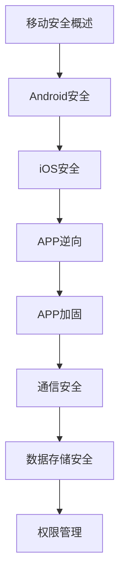

# 移动安全 学习指南

> **分类**：安全 ｜ **技术生态**：Android Studio, Xcode, MobSF, Frida(授权分析), OWASP MASVS

> **学习声明**：本章内容仅供合法授权环境下的安全研究与防御建设，请遵守法律法规与组织安全政策，禁止对未授权系统开展测试。

## 领域定位

移动安全涵盖 Android 与 iOS 平台的应用安全、数据保护与通信安全。Android 基于 Linux 与 ART 虚拟机，iOS 基于沙箱与代码签名。防御重点包括权限最小化、安全存储、证书锁定与代码混淆。

面向移动开发者与安全工程师，侧重平台安全机制与防御加固。

本领域常用技术栈与工具包括：Android Studio, Xcode, MobSF, Frida(授权分析), OWASP MASVS。

## 学习目标

- 理解 Android/iOS 沙箱与权限模型
- 实施安全数据存储与通信加密
- 配置应用加固与完整性校验
- 在授权范围内分析应用安全风险

## 前置知识

- Java/Kotlin 或 Swift
- 移动开发基础
- HTTP/TLS
- 密码学基础

## 学习路径

1. **移动安全概述**
2. **Android安全**
3. **iOS安全**
4. **APP逆向**
5. **APP加固**
6. **通信安全**
7. **数据存储安全**
8. **权限管理**

## 模块体系

- **移动安全概述**
- **Android安全**
- **iOS安全**
- **APP逆向**
- **APP加固**
- **通信安全**
- **数据存储安全**
- **权限管理**
- **恶意软件分析**
- **移动安全最佳实践**

## 难度分布

| 入门 | 12 | 20% |
| 实战 | 12 | 20% |
| 进阶 | 18 | 30% |
| 高级 | 18 | 30% |

## 章节索引

### 移动安全概述

- [移动安全概述核心概念与原理](chapters/001-移动安全概述核心概念与原理.md) ｜ 入门
- [移动安全概述的实现机制详解](chapters/002-移动安全概述的实现机制详解.md) ｜ 入门
- [移动安全概述的关键技术点](chapters/003-移动安全概述的关键技术点.md) ｜ 入门
- [移动安全概述的源码级分析](chapters/004-移动安全概述的源码级分析.md) ｜ 入门
- [移动安全概述的配置与使用](chapters/005-移动安全概述的配置与使用.md) ｜ 入门
- [移动安全概述的常见问题与解决方案](chapters/006-移动安全概述的常见问题与解决方案.md) ｜ 入门

### Android安全

- [Android安全核心概念与原理](chapters/007-Android安全核心概念与原理.md) ｜ 入门
- [Android安全的实现机制详解](chapters/008-Android安全的实现机制详解.md) ｜ 入门
- [Android安全的关键技术点](chapters/009-Android安全的关键技术点.md) ｜ 入门
- [Android安全的源码级分析](chapters/010-Android安全的源码级分析.md) ｜ 入门
- [Android安全的配置与使用](chapters/011-Android安全的配置与使用.md) ｜ 入门
- [Android安全的常见问题与解决方案](chapters/012-Android安全的常见问题与解决方案.md) ｜ 入门

### iOS安全

- [iOS安全核心概念与原理](chapters/013-iOS安全核心概念与原理.md) ｜ 进阶
- [iOS安全的实现机制详解](chapters/014-iOS安全的实现机制详解.md) ｜ 进阶
- [iOS安全的关键技术点](chapters/015-iOS安全的关键技术点.md) ｜ 进阶
- [iOS安全的源码级分析](chapters/016-iOS安全的源码级分析.md) ｜ 进阶
- [iOS安全的配置与使用](chapters/017-iOS安全的配置与使用.md) ｜ 进阶
- [iOS安全的常见问题与解决方案](chapters/018-iOS安全的常见问题与解决方案.md) ｜ 进阶

### APP逆向

- [APP逆向核心概念与原理](chapters/019-APP逆向核心概念与原理.md) ｜ 进阶
- [APP逆向的实现机制详解](chapters/020-APP逆向的实现机制详解.md) ｜ 进阶
- [APP逆向的关键技术点](chapters/021-APP逆向的关键技术点.md) ｜ 进阶
- [APP逆向的源码级分析](chapters/022-APP逆向的源码级分析.md) ｜ 进阶
- [APP逆向的配置与使用](chapters/023-APP逆向的配置与使用.md) ｜ 进阶
- [APP逆向的常见问题与解决方案](chapters/024-APP逆向的常见问题与解决方案.md) ｜ 进阶

### APP加固

- [APP加固核心概念与原理](chapters/025-APP加固核心概念与原理.md) ｜ 进阶
- [APP加固的实现机制详解](chapters/026-APP加固的实现机制详解.md) ｜ 进阶
- [APP加固的关键技术点](chapters/027-APP加固的关键技术点.md) ｜ 进阶
- [APP加固的源码级分析](chapters/028-APP加固的源码级分析.md) ｜ 进阶
- [APP加固的配置与使用](chapters/029-APP加固的配置与使用.md) ｜ 进阶
- [APP加固的常见问题与解决方案](chapters/030-APP加固的常见问题与解决方案.md) ｜ 进阶

### 通信安全

- [通信安全核心概念与原理](chapters/031-通信安全核心概念与原理.md) ｜ 高级
- [通信安全的实现机制详解](chapters/032-通信安全的实现机制详解.md) ｜ 高级
- [通信安全的关键技术点](chapters/033-通信安全的关键技术点.md) ｜ 高级
- [通信安全的源码级分析](chapters/034-通信安全的源码级分析.md) ｜ 高级
- [通信安全的配置与使用](chapters/035-通信安全的配置与使用.md) ｜ 高级
- [通信安全的常见问题与解决方案](chapters/036-通信安全的常见问题与解决方案.md) ｜ 高级

### 数据存储安全

- [数据存储安全核心概念与原理](chapters/037-数据存储安全核心概念与原理.md) ｜ 高级
- [数据存储安全的实现机制详解](chapters/038-数据存储安全的实现机制详解.md) ｜ 高级
- [数据存储安全的关键技术点](chapters/039-数据存储安全的关键技术点.md) ｜ 高级
- [数据存储安全的源码级分析](chapters/040-数据存储安全的源码级分析.md) ｜ 高级
- [数据存储安全的配置与使用](chapters/041-数据存储安全的配置与使用.md) ｜ 高级
- [数据存储安全的常见问题与解决方案](chapters/042-数据存储安全的常见问题与解决方案.md) ｜ 高级

### 权限管理

- [权限管理核心概念与原理](chapters/043-权限管理核心概念与原理.md) ｜ 高级
- [权限管理的实现机制详解](chapters/044-权限管理的实现机制详解.md) ｜ 高级
- [权限管理的关键技术点](chapters/045-权限管理的关键技术点.md) ｜ 高级
- [权限管理的源码级分析](chapters/046-权限管理的源码级分析.md) ｜ 高级
- [权限管理的配置与使用](chapters/047-权限管理的配置与使用.md) ｜ 高级
- [权限管理的常见问题与解决方案](chapters/048-权限管理的常见问题与解决方案.md) ｜ 高级

### 恶意软件分析

- [恶意软件分析核心概念与原理](chapters/049-恶意软件分析核心概念与原理.md) ｜ 实战
- [恶意软件分析的实现机制详解](chapters/050-恶意软件分析的实现机制详解.md) ｜ 实战
- [恶意软件分析的关键技术点](chapters/051-恶意软件分析的关键技术点.md) ｜ 实战
- [恶意软件分析的源码级分析](chapters/052-恶意软件分析的源码级分析.md) ｜ 实战
- [恶意软件分析的配置与使用](chapters/053-恶意软件分析的配置与使用.md) ｜ 实战
- [恶意软件分析的常见问题与解决方案](chapters/054-恶意软件分析的常见问题与解决方案.md) ｜ 实战

### 移动安全最佳实践

- [移动安全最佳实践核心概念与原理](chapters/055-移动安全最佳实践核心概念与原理.md) ｜ 实战
- [移动安全最佳实践的实现机制详解](chapters/056-移动安全最佳实践的实现机制详解.md) ｜ 实战
- [移动安全最佳实践的关键技术点](chapters/057-移动安全最佳实践的关键技术点.md) ｜ 实战
- [移动安全最佳实践的源码级分析](chapters/058-移动安全最佳实践的源码级分析.md) ｜ 实战
- [移动安全最佳实践的配置与使用](chapters/059-移动安全最佳实践的配置与使用.md) ｜ 实战
- [移动安全最佳实践的常见问题与解决方案](chapters/060-移动安全最佳实践的常见问题与解决方案.md) ｜ 实战

---
*领域: 移动安全*