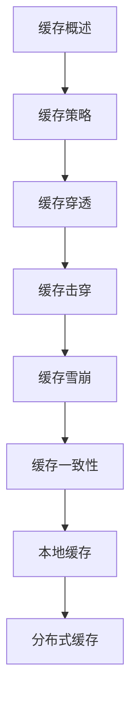

# 缓存技术 学习指南

> **分类**：数据存储 ｜ **技术生态**：Redis、Caffeine、Guava Cache、Memcached

## 领域定位

缓存通过空间换时间降低延迟与 DB 压力。本地缓存（Caffeine）与分布式缓存（Redis）组合为多级缓存；需处理一致性与三大经典问题。

覆盖 Cache-Aside、Read/Write Through、穿透击穿雪崩与热点 key。

本领域常用技术栈与工具包括：Redis、Caffeine、Guava Cache、Memcached。

## 学习目标

- 能选择缓存更新策略
- 能实现互斥锁与逻辑过期防击穿
- 能设计多级缓存
- 能监控命中率与 evicted keys

## 前置知识

- Redis 或 Memcached 其一
- 并发基础

## 学习路径

1. **缓存概述**
2. **缓存策略**
3. **缓存穿透**
4. **缓存击穿**
5. **缓存雪崩**
6. **缓存一致性**
7. **本地缓存**
8. **分布式缓存**

## 模块体系

- **缓存概述**
- **缓存策略**
- **缓存穿透**
- **缓存击穿**
- **缓存雪崩**
- **缓存一致性**
- **本地缓存**
- **分布式缓存**
- **多级缓存**
- **缓存预热**
- **缓存降级**
- **热点key**
- **大key**
- **性能优化**
- **缓存最佳实践**

## 难度分布

| 入门 | 18 | 22% |
| 实战 | 15 | 18% |
| 进阶 | 22 | 27% |
| 高级 | 25 | 31% |

## 章节索引

### 缓存概述

- [缓存概述核心概念与原理](chapters/001-缓存概述核心概念与原理.md) ｜ 入门
- [缓存概述的实现机制详解](chapters/002-缓存概述的实现机制详解.md) ｜ 入门
- [缓存概述的关键技术点](chapters/003-缓存概述的关键技术点.md) ｜ 入门
- [缓存概述的源码级分析](chapters/004-缓存概述的源码级分析.md) ｜ 入门
- [缓存概述的配置与使用](chapters/005-缓存概述的配置与使用.md) ｜ 入门
- [缓存概述的常见问题与解决方案](chapters/006-缓存概述的常见问题与解决方案.md) ｜ 入门

### 缓存策略

- [缓存策略核心概念与原理](chapters/007-缓存策略核心概念与原理.md) ｜ 入门
- [缓存策略的实现机制详解](chapters/008-缓存策略的实现机制详解.md) ｜ 入门
- [缓存策略的关键技术点](chapters/009-缓存策略的关键技术点.md) ｜ 入门
- [缓存策略的源码级分析](chapters/010-缓存策略的源码级分析.md) ｜ 入门
- [缓存策略的配置与使用](chapters/011-缓存策略的配置与使用.md) ｜ 入门
- [缓存策略的常见问题与解决方案](chapters/012-缓存策略的常见问题与解决方案.md) ｜ 入门

### 缓存穿透

- [缓存穿透核心概念与原理](chapters/013-缓存穿透核心概念与原理.md) ｜ 入门
- [缓存穿透的实现机制详解](chapters/014-缓存穿透的实现机制详解.md) ｜ 入门
- [缓存穿透的关键技术点](chapters/015-缓存穿透的关键技术点.md) ｜ 入门
- [缓存穿透的源码级分析](chapters/016-缓存穿透的源码级分析.md) ｜ 入门
- [缓存穿透的配置与使用](chapters/017-缓存穿透的配置与使用.md) ｜ 入门
- [缓存穿透的常见问题与解决方案](chapters/018-缓存穿透的常见问题与解决方案.md) ｜ 入门

### 缓存击穿

- [缓存击穿核心概念与原理](chapters/019-缓存击穿核心概念与原理.md) ｜ 进阶
- [缓存击穿的实现机制详解](chapters/020-缓存击穿的实现机制详解.md) ｜ 进阶
- [缓存击穿的关键技术点](chapters/021-缓存击穿的关键技术点.md) ｜ 进阶
- [缓存击穿的源码级分析](chapters/022-缓存击穿的源码级分析.md) ｜ 进阶
- [缓存击穿的配置与使用](chapters/023-缓存击穿的配置与使用.md) ｜ 进阶
- [缓存击穿的常见问题与解决方案](chapters/024-缓存击穿的常见问题与解决方案.md) ｜ 进阶

### 缓存雪崩

- [缓存雪崩核心概念与原理](chapters/025-缓存雪崩核心概念与原理.md) ｜ 进阶
- [缓存雪崩的实现机制详解](chapters/026-缓存雪崩的实现机制详解.md) ｜ 进阶
- [缓存雪崩的关键技术点](chapters/027-缓存雪崩的关键技术点.md) ｜ 进阶
- [缓存雪崩的源码级分析](chapters/028-缓存雪崩的源码级分析.md) ｜ 进阶
- [缓存雪崩的配置与使用](chapters/029-缓存雪崩的配置与使用.md) ｜ 进阶
- [缓存雪崩的常见问题与解决方案](chapters/030-缓存雪崩的常见问题与解决方案.md) ｜ 进阶

### 缓存一致性

- [缓存一致性核心概念与原理](chapters/031-缓存一致性核心概念与原理.md) ｜ 进阶
- [缓存一致性的实现机制详解](chapters/032-缓存一致性的实现机制详解.md) ｜ 进阶
- [缓存一致性的关键技术点](chapters/033-缓存一致性的关键技术点.md) ｜ 进阶
- [缓存一致性的源码级分析](chapters/034-缓存一致性的源码级分析.md) ｜ 进阶
- [缓存一致性的配置与使用](chapters/035-缓存一致性的配置与使用.md) ｜ 进阶

### 本地缓存

- [本地缓存核心概念与原理](chapters/036-本地缓存核心概念与原理.md) ｜ 进阶
- [本地缓存的实现机制详解](chapters/037-本地缓存的实现机制详解.md) ｜ 进阶
- [本地缓存的关键技术点](chapters/038-本地缓存的关键技术点.md) ｜ 进阶
- [本地缓存的源码级分析](chapters/039-本地缓存的源码级分析.md) ｜ 进阶
- [本地缓存的配置与使用](chapters/040-本地缓存的配置与使用.md) ｜ 进阶

### 分布式缓存

- [分布式缓存核心概念与原理](chapters/041-分布式缓存核心概念与原理.md) ｜ 高级
- [分布式缓存的实现机制详解](chapters/042-分布式缓存的实现机制详解.md) ｜ 高级
- [分布式缓存的关键技术点](chapters/043-分布式缓存的关键技术点.md) ｜ 高级
- [分布式缓存的源码级分析](chapters/044-分布式缓存的源码级分析.md) ｜ 高级
- [分布式缓存的配置与使用](chapters/045-分布式缓存的配置与使用.md) ｜ 高级

### 多级缓存

- [多级缓存核心概念与原理](chapters/046-多级缓存核心概念与原理.md) ｜ 高级
- [多级缓存的实现机制详解](chapters/047-多级缓存的实现机制详解.md) ｜ 高级
- [多级缓存的关键技术点](chapters/048-多级缓存的关键技术点.md) ｜ 高级
- [多级缓存的源码级分析](chapters/049-多级缓存的源码级分析.md) ｜ 高级
- [多级缓存的配置与使用](chapters/050-多级缓存的配置与使用.md) ｜ 高级

### 缓存预热

- [缓存预热核心概念与原理](chapters/051-缓存预热核心概念与原理.md) ｜ 高级
- [缓存预热的实现机制详解](chapters/052-缓存预热的实现机制详解.md) ｜ 高级
- [缓存预热的关键技术点](chapters/053-缓存预热的关键技术点.md) ｜ 高级
- [缓存预热的源码级分析](chapters/054-缓存预热的源码级分析.md) ｜ 高级
- [缓存预热的配置与使用](chapters/055-缓存预热的配置与使用.md) ｜ 高级

### 缓存降级

- [缓存降级核心概念与原理](chapters/056-缓存降级核心概念与原理.md) ｜ 高级
- [缓存降级的实现机制详解](chapters/057-缓存降级的实现机制详解.md) ｜ 高级
- [缓存降级的关键技术点](chapters/058-缓存降级的关键技术点.md) ｜ 高级
- [缓存降级的源码级分析](chapters/059-缓存降级的源码级分析.md) ｜ 高级
- [缓存降级的配置与使用](chapters/060-缓存降级的配置与使用.md) ｜ 高级

### 热点key

- [热点key核心概念与原理](chapters/061-热点key核心概念与原理.md) ｜ 高级
- [热点key的实现机制详解](chapters/062-热点key的实现机制详解.md) ｜ 高级
- [热点key的关键技术点](chapters/063-热点key的关键技术点.md) ｜ 高级
- [热点key的源码级分析](chapters/064-热点key的源码级分析.md) ｜ 高级
- [热点key的配置与使用](chapters/065-热点key的配置与使用.md) ｜ 高级

### 大key

- [大key核心概念与原理](chapters/066-大key核心概念与原理.md) ｜ 实战
- [大key的实现机制详解](chapters/067-大key的实现机制详解.md) ｜ 实战
- [大key的关键技术点](chapters/068-大key的关键技术点.md) ｜ 实战
- [大key的源码级分析](chapters/069-大key的源码级分析.md) ｜ 实战
- [大key的配置与使用](chapters/070-大key的配置与使用.md) ｜ 实战

### 性能优化

- [性能优化核心概念与原理](chapters/071-性能优化核心概念与原理.md) ｜ 实战
- [性能优化的实现机制详解](chapters/072-性能优化的实现机制详解.md) ｜ 实战
- [性能优化的关键技术点](chapters/073-性能优化的关键技术点.md) ｜ 实战
- [性能优化的源码级分析](chapters/074-性能优化的源码级分析.md) ｜ 实战
- [性能优化的配置与使用](chapters/075-性能优化的配置与使用.md) ｜ 实战

### 缓存最佳实践

- [缓存最佳实践核心概念与原理](chapters/076-缓存最佳实践核心概念与原理.md) ｜ 实战
- [缓存最佳实践的实现机制详解](chapters/077-缓存最佳实践的实现机制详解.md) ｜ 实战
- [缓存最佳实践的关键技术点](chapters/078-缓存最佳实践的关键技术点.md) ｜ 实战
- [缓存最佳实践的源码级分析](chapters/079-缓存最佳实践的源码级分析.md) ｜ 实战
- [缓存最佳实践的配置与使用](chapters/080-缓存最佳实践的配置与使用.md) ｜ 实战

---
*领域: 缓存技术*