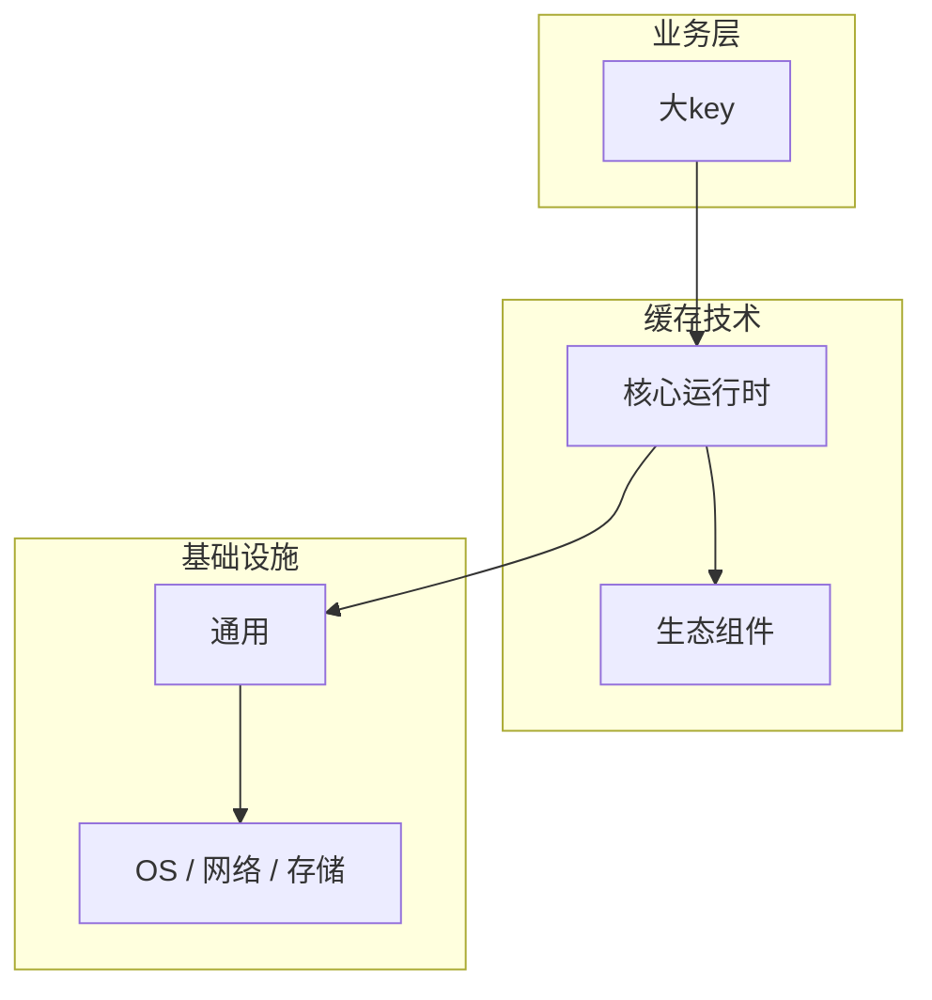

# 大key的实现机制详解

> **领域**：缓存技术 ｜ **模块**：大key ｜ **难度**：实战 ｜ **类型**：实现机制

## 导读

本章系统讲解 **缓存技术** 中 **大key** 的相关知识（实现机制）。本章聚焦 **大key** 的内部实现路径与关键数据结构，帮助从 API 用法深入到机制层。内容基于主流框架与工程实践撰写，不依赖过时概念堆砌。

## 核心知识

**大key** 在 **缓存技术** 中承担关键职责。拆分 hash；压缩；unlink 异步删。

### 核心知识

**1. 底层实现与架构**

避免 HGETALL 大 hash。

**2. 大key核心概念**

拆分 hash；压缩；unlink 异步删。

**3. 大key在缓存技术中的协作**

大key 与 缓存技术 其他模块通过明确接口协作：定义输入输出契约、失败模式（超时、重试、降级）及观测点。生产排障时应结合日志、指标与链路追踪定位 大key 路径上的瓶颈。

**4. 典型应用场景**

在 缓存技术 工程实践中，大key 常见于核心链路设计与性能调优场景。选型时需评估团队熟悉度、生态成熟度及与现有栈的集成成本。

## 架构与流程

## 技术详解

### 实现机制

大key 工作原理：接收请求或事件 → 路由到处理逻辑 → 访问依赖服务（DB/缓存/队列）→ 聚合结果返回。错误应分类为可重试与不可重试，并映射为统一错误码。避免 HGETALL 大 hash。

## 原理与实现

### 工作机制

大key 工作原理：接收请求或事件 → 路由到处理逻辑 → 访问依赖服务（DB/缓存/队列）→ 聚合结果返回。错误应分类为可重试与不可重试，并映射为统一错误码。避免 HGETALL 大 hash。

## 操作流程与实践

### 操作流程

1. 阅读 缓存技术 官方 大key 文档与权威示例，列出与本项目相关的 API/配置项
2. 在本地或开发环境搭建最小可运行样例，验证输入输出与边界条件
3. 将 大key 集成到主流程，补充单元测试与必要的集成测试
4. 在预发环境做容量与回归验证，记录性能与错误率基线
5. 编写变更说明与回滚步骤，灰度上线并持续观察核心指标

### 配置要点

大key 配置项应外部化（环境变量/配置中心），区分 dev/staging/prod；敏感项用密钥管理服务。

## 性能、安全与排查

### 性能优化

大key 性能优化：Profiling 定位热点；优先优化 I/O 与算法复杂度；避免过早微优化。缓存技术 社区通常提供 大key 相关的 benchmark 与 tuning 指南。

### 安全注意

使用 大key 时遵循最小权限：输入校验、敏感数据脱敏、审计日志。缓存技术 安全公告与 CVE 应订阅并及时打补丁。

### 调试排错

排查 大key 问题：复现用例 → 查日志/trace → 对照配置 diff → 最小化隔离实验。缓存技术 通常提供 debug 模式或 diagnostic 命令。

## 案例与选型

### 案例复盘

某团队在 缓存技术 项目中重构 大key 模块：拆分职责、引入缓存/队列削峰、补充契约测试，P95 延迟下降且故障恢复时间缩短。

### 方案对比

选型 大key 方案时，对比官方推荐实现与第三方扩展的成熟度、社区活跃度、运维成本及与现有 缓存技术 栈的集成难度。

## 本章聚焦

阅读 **大key** 实现时，建议对照调用栈画出数据流：入口 API → 核心数据结构 → 系统调用或 I/O 边界，标注锁与共享状态位置。

### 常见误区与纠正

**配置与环境不一致**

开发环境可用的 大key 配置在生产因网络/权限/资源限制失败，应使用 IaC 保持一致。

**忽视版本兼容性**

缓存技术 大版本升级可能变更 大key API，缺少回归测试易引发隐性故障。

**缺少可观测性**

未对 大key 埋点，故障只能被动发现，排错依赖猜测。

### 最佳实践

1. 遵循 缓存技术 官方 大key 最佳实践文档
2. 为 大key 编写自动化测试与契约测试
3. 关键配置纳入 Code Review 与变更审计
4. 生产变更前在预发压测验证容量
5. 文档化架构决策（ADR）

## 巩固建议

建议结合 **缓存技术** 官方文档与小型实验，亲手验证 **大key** 的默认行为与边界条件；将本章要点整理为检查清单或 ADR，便于评审与团队 onboarding。

### 本章小结

学完本章，你应能独立说明 **大key** 在 缓存技术 中的角色，理解其核心机制，规避常见误区，并在项目中正确运用。

## 延伸学习

- 大key核心概念与原理
- 大key的关键技术点
- 大key的源码级分析
- 大key的配置与使用

### 延伸阅读

- 缓存技术 官方文档 - 大key
- 缓存技术 源码或设计文档
- 相关 RFC / KIP / PEP（如适用）

---
*章节 ID: 067 ｜ 领域: 缓存技术*