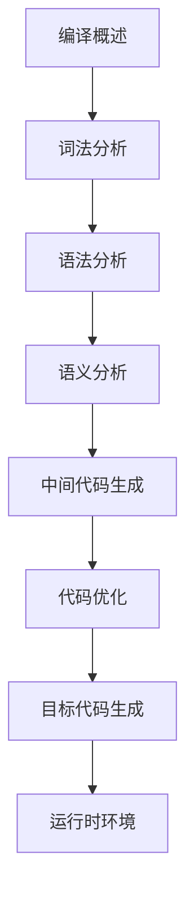

# 编译原理 学习指南

> **分类**：系统底层 ｜ **技术生态**：Flex/Bison, LLVM, GCC, ANTLR, Compiler Explorer (godbolt.org)

## 领域定位

编译原理讲解将高级语言翻译为机器码的全过程：词法分析、语法分析、语义分析、中间表示、优化与代码生成。LLVM/GCC 是现代工具链的理论基础。

面向编译器开发者、DSL 设计者及希望深入理解语言实现的工程师。

本领域常用技术栈与工具包括：Flex/Bison, LLVM, GCC, ANTLR, Compiler Explorer (godbolt.org)。

## 学习目标

- 手写递归下降或 LR 分析器解析表达式与语句
- 理解符号表、类型检查、三地址码与 SSA 形式
- 掌握常见优化：常量折叠、DCE、循环不变量外提
- 了解链接、加载、PLT/GOT 与 JIT 基本原理

## 前置知识

- C 语言
- 数据结构与算法
- 自动机理论
- 汇编语言基础

## 学习路径

1. **编译概述**
2. **词法分析**
3. **语法分析**
4. **语义分析**
5. **中间代码生成**
6. **代码优化**
7. **目标代码生成**
8. **运行时环境**

## 模块体系

- **编译概述**
- **词法分析**
- **语法分析**
- **语义分析**
- **中间代码生成**
- **代码优化**
- **目标代码生成**
- **运行时环境**
- **链接与加载**
- **JIT与解释器**

## 难度分布

| 入门 | 20 | 20% |
| 实战 | 20 | 20% |
| 进阶 | 30 | 30% |
| 高级 | 30 | 30% |

## 章节索引

### 编译概述

- [编译概述核心概念与原理](chapters/001-编译概述核心概念与原理.md) ｜ 入门
- [编译概述的实现机制详解](chapters/002-编译概述的实现机制详解.md) ｜ 入门
- [编译概述的关键技术点](chapters/003-编译概述的关键技术点.md) ｜ 入门
- [编译概述的源码级分析](chapters/004-编译概述的源码级分析.md) ｜ 入门
- [编译概述的配置与使用](chapters/005-编译概述的配置与使用.md) ｜ 入门
- [编译概述的常见问题与解决方案](chapters/006-编译概述的常见问题与解决方案.md) ｜ 入门
- [编译概述的性能优化技巧](chapters/007-编译概述的性能优化技巧.md) ｜ 入门
- [编译概述的最佳实践指南](chapters/008-编译概述的最佳实践指南.md) ｜ 入门
- [编译概述的高级应用场景](chapters/009-编译概述的高级应用场景.md) ｜ 入门
- [编译概述的实战案例分析](chapters/010-编译概述的实战案例分析.md) ｜ 入门

### 词法分析

- [词法分析核心概念与原理](chapters/011-词法分析核心概念与原理.md) ｜ 入门
- [词法分析的实现机制详解](chapters/012-词法分析的实现机制详解.md) ｜ 入门
- [词法分析的关键技术点](chapters/013-词法分析的关键技术点.md) ｜ 入门
- [词法分析的源码级分析](chapters/014-词法分析的源码级分析.md) ｜ 入门
- [词法分析的配置与使用](chapters/015-词法分析的配置与使用.md) ｜ 入门
- [词法分析的常见问题与解决方案](chapters/016-词法分析的常见问题与解决方案.md) ｜ 入门
- [词法分析的性能优化技巧](chapters/017-词法分析的性能优化技巧.md) ｜ 入门
- [词法分析的最佳实践指南](chapters/018-词法分析的最佳实践指南.md) ｜ 入门
- [词法分析的高级应用场景](chapters/019-词法分析的高级应用场景.md) ｜ 入门
- [词法分析的实战案例分析](chapters/020-词法分析的实战案例分析.md) ｜ 入门

### 语法分析

- [语法分析核心概念与原理](chapters/021-语法分析核心概念与原理.md) ｜ 进阶
- [语法分析的实现机制详解](chapters/022-语法分析的实现机制详解.md) ｜ 进阶
- [语法分析的关键技术点](chapters/023-语法分析的关键技术点.md) ｜ 进阶
- [语法分析的源码级分析](chapters/024-语法分析的源码级分析.md) ｜ 进阶
- [语法分析的配置与使用](chapters/025-语法分析的配置与使用.md) ｜ 进阶
- [语法分析的常见问题与解决方案](chapters/026-语法分析的常见问题与解决方案.md) ｜ 进阶
- [语法分析的性能优化技巧](chapters/027-语法分析的性能优化技巧.md) ｜ 进阶
- [语法分析的最佳实践指南](chapters/028-语法分析的最佳实践指南.md) ｜ 进阶
- [语法分析的高级应用场景](chapters/029-语法分析的高级应用场景.md) ｜ 进阶
- [语法分析的实战案例分析](chapters/030-语法分析的实战案例分析.md) ｜ 进阶

### 语义分析

- [语义分析核心概念与原理](chapters/031-语义分析核心概念与原理.md) ｜ 进阶
- [语义分析的实现机制详解](chapters/032-语义分析的实现机制详解.md) ｜ 进阶
- [语义分析的关键技术点](chapters/033-语义分析的关键技术点.md) ｜ 进阶
- [语义分析的源码级分析](chapters/034-语义分析的源码级分析.md) ｜ 进阶
- [语义分析的配置与使用](chapters/035-语义分析的配置与使用.md) ｜ 进阶
- [语义分析的常见问题与解决方案](chapters/036-语义分析的常见问题与解决方案.md) ｜ 进阶
- [语义分析的性能优化技巧](chapters/037-语义分析的性能优化技巧.md) ｜ 进阶
- [语义分析的最佳实践指南](chapters/038-语义分析的最佳实践指南.md) ｜ 进阶
- [语义分析的高级应用场景](chapters/039-语义分析的高级应用场景.md) ｜ 进阶
- [语义分析的实战案例分析](chapters/040-语义分析的实战案例分析.md) ｜ 进阶

### 中间代码生成

- [中间代码生成核心概念与原理](chapters/041-中间代码生成核心概念与原理.md) ｜ 进阶
- [中间代码生成的实现机制详解](chapters/042-中间代码生成的实现机制详解.md) ｜ 进阶
- [中间代码生成的关键技术点](chapters/043-中间代码生成的关键技术点.md) ｜ 进阶
- [中间代码生成的源码级分析](chapters/044-中间代码生成的源码级分析.md) ｜ 进阶
- [中间代码生成的配置与使用](chapters/045-中间代码生成的配置与使用.md) ｜ 进阶
- [中间代码生成的常见问题与解决方案](chapters/046-中间代码生成的常见问题与解决方案.md) ｜ 进阶
- [中间代码生成的性能优化技巧](chapters/047-中间代码生成的性能优化技巧.md) ｜ 进阶
- [中间代码生成的最佳实践指南](chapters/048-中间代码生成的最佳实践指南.md) ｜ 进阶
- [中间代码生成的高级应用场景](chapters/049-中间代码生成的高级应用场景.md) ｜ 进阶
- [中间代码生成的实战案例分析](chapters/050-中间代码生成的实战案例分析.md) ｜ 进阶

### 代码优化

- [代码优化核心概念与原理](chapters/051-代码优化核心概念与原理.md) ｜ 高级
- [代码优化的实现机制详解](chapters/052-代码优化的实现机制详解.md) ｜ 高级
- [代码优化的关键技术点](chapters/053-代码优化的关键技术点.md) ｜ 高级
- [代码优化的源码级分析](chapters/054-代码优化的源码级分析.md) ｜ 高级
- [代码优化的配置与使用](chapters/055-代码优化的配置与使用.md) ｜ 高级
- [代码优化的常见问题与解决方案](chapters/056-代码优化的常见问题与解决方案.md) ｜ 高级
- [代码优化的性能优化技巧](chapters/057-代码优化的性能优化技巧.md) ｜ 高级
- [代码优化的最佳实践指南](chapters/058-代码优化的最佳实践指南.md) ｜ 高级
- [代码优化的高级应用场景](chapters/059-代码优化的高级应用场景.md) ｜ 高级
- [代码优化的实战案例分析](chapters/060-代码优化的实战案例分析.md) ｜ 高级

### 目标代码生成

- [目标代码生成核心概念与原理](chapters/061-目标代码生成核心概念与原理.md) ｜ 高级
- [目标代码生成的实现机制详解](chapters/062-目标代码生成的实现机制详解.md) ｜ 高级
- [目标代码生成的关键技术点](chapters/063-目标代码生成的关键技术点.md) ｜ 高级
- [目标代码生成的源码级分析](chapters/064-目标代码生成的源码级分析.md) ｜ 高级
- [目标代码生成的配置与使用](chapters/065-目标代码生成的配置与使用.md) ｜ 高级
- [目标代码生成的常见问题与解决方案](chapters/066-目标代码生成的常见问题与解决方案.md) ｜ 高级
- [目标代码生成的性能优化技巧](chapters/067-目标代码生成的性能优化技巧.md) ｜ 高级
- [目标代码生成的最佳实践指南](chapters/068-目标代码生成的最佳实践指南.md) ｜ 高级
- [目标代码生成的高级应用场景](chapters/069-目标代码生成的高级应用场景.md) ｜ 高级
- [目标代码生成的实战案例分析](chapters/070-目标代码生成的实战案例分析.md) ｜ 高级

### 运行时环境

- [运行时环境核心概念与原理](chapters/071-运行时环境核心概念与原理.md) ｜ 高级
- [运行时环境的实现机制详解](chapters/072-运行时环境的实现机制详解.md) ｜ 高级
- [运行时环境的关键技术点](chapters/073-运行时环境的关键技术点.md) ｜ 高级
- [运行时环境的源码级分析](chapters/074-运行时环境的源码级分析.md) ｜ 高级
- [运行时环境的配置与使用](chapters/075-运行时环境的配置与使用.md) ｜ 高级
- [运行时环境的常见问题与解决方案](chapters/076-运行时环境的常见问题与解决方案.md) ｜ 高级
- [运行时环境的性能优化技巧](chapters/077-运行时环境的性能优化技巧.md) ｜ 高级
- [运行时环境的最佳实践指南](chapters/078-运行时环境的最佳实践指南.md) ｜ 高级
- [运行时环境的高级应用场景](chapters/079-运行时环境的高级应用场景.md) ｜ 高级
- [运行时环境的实战案例分析](chapters/080-运行时环境的实战案例分析.md) ｜ 高级

### 链接与加载

- [链接与加载核心概念与原理](chapters/081-链接与加载核心概念与原理.md) ｜ 实战
- [链接与加载的实现机制详解](chapters/082-链接与加载的实现机制详解.md) ｜ 实战
- [链接与加载的关键技术点](chapters/083-链接与加载的关键技术点.md) ｜ 实战
- [链接与加载的源码级分析](chapters/084-链接与加载的源码级分析.md) ｜ 实战
- [链接与加载的配置与使用](chapters/085-链接与加载的配置与使用.md) ｜ 实战
- [链接与加载的常见问题与解决方案](chapters/086-链接与加载的常见问题与解决方案.md) ｜ 实战
- [链接与加载的性能优化技巧](chapters/087-链接与加载的性能优化技巧.md) ｜ 实战
- [链接与加载的最佳实践指南](chapters/088-链接与加载的最佳实践指南.md) ｜ 实战
- [链接与加载的高级应用场景](chapters/089-链接与加载的高级应用场景.md) ｜ 实战
- [链接与加载的实战案例分析](chapters/090-链接与加载的实战案例分析.md) ｜ 实战

### JIT与解释器

- [JIT与解释器核心概念与原理](chapters/091-JIT与解释器核心概念与原理.md) ｜ 实战
- [JIT与解释器的实现机制详解](chapters/092-JIT与解释器的实现机制详解.md) ｜ 实战
- [JIT与解释器的关键技术点](chapters/093-JIT与解释器的关键技术点.md) ｜ 实战
- [JIT与解释器的源码级分析](chapters/094-JIT与解释器的源码级分析.md) ｜ 实战
- [JIT与解释器的配置与使用](chapters/095-JIT与解释器的配置与使用.md) ｜ 实战
- [JIT与解释器的常见问题与解决方案](chapters/096-JIT与解释器的常见问题与解决方案.md) ｜ 实战
- [JIT与解释器的性能优化技巧](chapters/097-JIT与解释器的性能优化技巧.md) ｜ 实战
- [JIT与解释器的最佳实践指南](chapters/098-JIT与解释器的最佳实践指南.md) ｜ 实战
- [JIT与解释器的高级应用场景](chapters/099-JIT与解释器的高级应用场景.md) ｜ 实战
- [JIT与解释器的实战案例分析](chapters/100-JIT与解释器的实战案例分析.md) ｜ 实战

---
*领域: 编译原理*