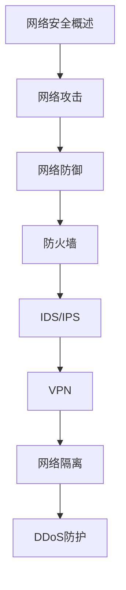

# 网络安全 学习指南

> **分类**：安全 ｜ **技术生态**：iptables/nftables, Snort/Suricata, Wireshark, Zeek, pfSense, Cisco ASA

> **学习声明**：本章内容仅供合法授权环境下的安全研究与防御建设，请遵守法律法规与组织安全政策，禁止对未授权系统开展测试。

## 领域定位

网络安全是保障信息系统在存储、传输与处理过程中机密性、完整性与可用性的综合学科。它横跨网络协议、边界防护、入侵检测、安全审计与应急响应，是 DevSecOps 与零信任架构的理论与实践基础。

面向安全工程师与网络运维人员，侧重防御体系设计与合规落地，而非攻击技巧。

本领域常用技术栈与工具包括：iptables/nftables, Snort/Suricata, Wireshark, Zeek, pfSense, Cisco ASA。

## 学习目标

- 理解 OSI/TCP-IP 各层常见威胁与对应防御手段
- 能设计分层网络防御架构并配置防火墙与 IDS/IPS
- 掌握 VPN、网络隔离与 DDoS 缓解的基本策略
- 能在授权范围内开展安全审计与应急响应

## 前置知识

- 计算机网络
- TCP/IP 协议
- Linux 基础
- 防火墙基本概念

## 学习路径

1. **网络安全概述**
2. **网络攻击**
3. **网络防御**
4. **防火墙**
5. **IDS/IPS**
6. **VPN**
7. **网络隔离**
8. **DDoS防护**

## 模块体系

- **网络安全概述**
- **网络攻击**
- **网络防御**
- **防火墙**
- **IDS/IPS**
- **VPN**
- **网络隔离**
- **DDoS防护**
- **端口扫描**
- **嗅探**
- **协议安全**
- **无线安全**
- **安全审计**
- **应急响应**
- **网络安全最佳实践**

## 难度分布

| 入门 | 21 | 21% |
| 实战 | 18 | 18% |
| 进阶 | 28 | 28% |
| 高级 | 33 | 33% |

## 章节索引

### 网络安全概述

- [网络安全概述核心概念与原理](chapters/001-网络安全概述核心概念与原理.md) ｜ 入门
- [网络安全概述的实现机制详解](chapters/002-网络安全概述的实现机制详解.md) ｜ 入门
- [网络安全概述的关键技术点](chapters/003-网络安全概述的关键技术点.md) ｜ 入门
- [网络安全概述的源码级分析](chapters/004-网络安全概述的源码级分析.md) ｜ 入门
- [网络安全概述的配置与使用](chapters/005-网络安全概述的配置与使用.md) ｜ 入门
- [网络安全概述的常见问题与解决方案](chapters/006-网络安全概述的常见问题与解决方案.md) ｜ 入门
- [网络安全概述的性能优化技巧](chapters/007-网络安全概述的性能优化技巧.md) ｜ 入门

### 网络攻击

- [网络威胁核心概念与原理](chapters/008-网络威胁核心概念与原理.md) ｜ 入门
- [网络威胁的实现机制详解](chapters/009-网络威胁的实现机制详解.md) ｜ 入门
- [网络威胁的关键技术点](chapters/010-网络威胁的关键技术点.md) ｜ 入门
- [网络威胁的源码级分析](chapters/011-网络威胁的源码级分析.md) ｜ 入门
- [网络威胁的配置与使用](chapters/012-网络威胁的配置与使用.md) ｜ 入门
- [网络威胁的常见问题与解决方案](chapters/013-网络威胁的常见问题与解决方案.md) ｜ 入门
- [网络威胁的性能优化技巧](chapters/014-网络威胁的性能优化技巧.md) ｜ 入门

### 网络防御

- [网络防御核心概念与原理](chapters/015-网络防御核心概念与原理.md) ｜ 入门
- [网络防御的实现机制详解](chapters/016-网络防御的实现机制详解.md) ｜ 入门
- [网络防御的关键技术点](chapters/017-网络防御的关键技术点.md) ｜ 入门
- [网络防御的源码级分析](chapters/018-网络防御的源码级分析.md) ｜ 入门
- [网络防御的配置与使用](chapters/019-网络防御的配置与使用.md) ｜ 入门
- [网络防御的常见问题与解决方案](chapters/020-网络防御的常见问题与解决方案.md) ｜ 入门
- [网络防御的性能优化技巧](chapters/021-网络防御的性能优化技巧.md) ｜ 入门

### 防火墙

- [防火墙核心概念与原理](chapters/022-防火墙核心概念与原理.md) ｜ 进阶
- [防火墙的实现机制详解](chapters/023-防火墙的实现机制详解.md) ｜ 进阶
- [防火墙的关键技术点](chapters/024-防火墙的关键技术点.md) ｜ 进阶
- [防火墙的源码级分析](chapters/025-防火墙的源码级分析.md) ｜ 进阶
- [防火墙的配置与使用](chapters/026-防火墙的配置与使用.md) ｜ 进阶
- [防火墙的常见问题与解决方案](chapters/027-防火墙的常见问题与解决方案.md) ｜ 进阶
- [防火墙的性能优化技巧](chapters/028-防火墙的性能优化技巧.md) ｜ 进阶

### IDS/IPS

- [IDS/IPS核心概念与原理](chapters/029-IDSIPS核心概念与原理.md) ｜ 进阶
- [IDS/IPS的实现机制详解](chapters/030-IDSIPS的实现机制详解.md) ｜ 进阶
- [IDS/IPS的关键技术点](chapters/031-IDSIPS的关键技术点.md) ｜ 进阶
- [IDS/IPS的源码级分析](chapters/032-IDSIPS的源码级分析.md) ｜ 进阶
- [IDS/IPS的配置与使用](chapters/033-IDSIPS的配置与使用.md) ｜ 进阶
- [IDS/IPS的常见问题与解决方案](chapters/034-IDSIPS的常见问题与解决方案.md) ｜ 进阶
- [IDS/IPS的性能优化技巧](chapters/035-IDSIPS的性能优化技巧.md) ｜ 进阶

### VPN

- [VPN核心概念与原理](chapters/036-VPN核心概念与原理.md) ｜ 进阶
- [VPN的实现机制详解](chapters/037-VPN的实现机制详解.md) ｜ 进阶
- [VPN的关键技术点](chapters/038-VPN的关键技术点.md) ｜ 进阶
- [VPN的源码级分析](chapters/039-VPN的源码级分析.md) ｜ 进阶
- [VPN的配置与使用](chapters/040-VPN的配置与使用.md) ｜ 进阶
- [VPN的常见问题与解决方案](chapters/041-VPN的常见问题与解决方案.md) ｜ 进阶
- [VPN的性能优化技巧](chapters/042-VPN的性能优化技巧.md) ｜ 进阶

### 网络隔离

- [网络隔离核心概念与原理](chapters/043-网络隔离核心概念与原理.md) ｜ 进阶
- [网络隔离的实现机制详解](chapters/044-网络隔离的实现机制详解.md) ｜ 进阶
- [网络隔离的关键技术点](chapters/045-网络隔离的关键技术点.md) ｜ 进阶
- [网络隔离的源码级分析](chapters/046-网络隔离的源码级分析.md) ｜ 进阶
- [网络隔离的配置与使用](chapters/047-网络隔离的配置与使用.md) ｜ 进阶
- [网络隔离的常见问题与解决方案](chapters/048-网络隔离的常见问题与解决方案.md) ｜ 进阶
- [网络隔离的性能优化技巧](chapters/049-网络隔离的性能优化技巧.md) ｜ 进阶

### DDoS防护

- [DDoS防护核心概念与原理](chapters/050-DDoS防护核心概念与原理.md) ｜ 高级
- [DDoS防护的实现机制详解](chapters/051-DDoS防护的实现机制详解.md) ｜ 高级
- [DDoS防护的关键技术点](chapters/052-DDoS防护的关键技术点.md) ｜ 高级
- [DDoS防护的源码级分析](chapters/053-DDoS防护的源码级分析.md) ｜ 高级
- [DDoS防护的配置与使用](chapters/054-DDoS防护的配置与使用.md) ｜ 高级
- [DDoS防护的常见问题与解决方案](chapters/055-DDoS防护的常见问题与解决方案.md) ｜ 高级
- [DDoS防护的性能优化技巧](chapters/056-DDoS防护的性能优化技巧.md) ｜ 高级

### 端口扫描

- [端口扫描核心概念与原理](chapters/057-端口扫描核心概念与原理.md) ｜ 高级
- [端口扫描的实现机制详解](chapters/058-端口扫描的实现机制详解.md) ｜ 高级
- [端口扫描的关键技术点](chapters/059-端口扫描的关键技术点.md) ｜ 高级
- [端口扫描的源码级分析](chapters/060-端口扫描的源码级分析.md) ｜ 高级
- [端口扫描的配置与使用](chapters/061-端口扫描的配置与使用.md) ｜ 高级
- [端口扫描的常见问题与解决方案](chapters/062-端口扫描的常见问题与解决方案.md) ｜ 高级
- [端口扫描的性能优化技巧](chapters/063-端口扫描的性能优化技巧.md) ｜ 高级

### 嗅探

- [嗅探核心概念与原理](chapters/064-嗅探核心概念与原理.md) ｜ 高级
- [嗅探的实现机制详解](chapters/065-嗅探的实现机制详解.md) ｜ 高级
- [嗅探的关键技术点](chapters/066-嗅探的关键技术点.md) ｜ 高级
- [嗅探的源码级分析](chapters/067-嗅探的源码级分析.md) ｜ 高级
- [嗅探的配置与使用](chapters/068-嗅探的配置与使用.md) ｜ 高级
- [嗅探的常见问题与解决方案](chapters/069-嗅探的常见问题与解决方案.md) ｜ 高级
- [嗅探的性能优化技巧](chapters/070-嗅探的性能优化技巧.md) ｜ 高级

### 协议安全

- [协议安全核心概念与原理](chapters/071-协议安全核心概念与原理.md) ｜ 高级
- [协议安全的实现机制详解](chapters/072-协议安全的实现机制详解.md) ｜ 高级
- [协议安全的关键技术点](chapters/073-协议安全的关键技术点.md) ｜ 高级
- [协议安全的源码级分析](chapters/074-协议安全的源码级分析.md) ｜ 高级
- [协议安全的配置与使用](chapters/075-协议安全的配置与使用.md) ｜ 高级
- [协议安全的常见问题与解决方案](chapters/076-协议安全的常见问题与解决方案.md) ｜ 高级

### 无线安全

- [无线安全核心概念与原理](chapters/077-无线安全核心概念与原理.md) ｜ 高级
- [无线安全的实现机制详解](chapters/078-无线安全的实现机制详解.md) ｜ 高级
- [无线安全的关键技术点](chapters/079-无线安全的关键技术点.md) ｜ 高级
- [无线安全的源码级分析](chapters/080-无线安全的源码级分析.md) ｜ 高级
- [无线安全的配置与使用](chapters/081-无线安全的配置与使用.md) ｜ 高级
- [无线安全的常见问题与解决方案](chapters/082-无线安全的常见问题与解决方案.md) ｜ 高级

### 安全审计

- [安全审计核心概念与原理](chapters/083-安全审计核心概念与原理.md) ｜ 实战
- [安全审计的实现机制详解](chapters/084-安全审计的实现机制详解.md) ｜ 实战
- [安全审计的关键技术点](chapters/085-安全审计的关键技术点.md) ｜ 实战
- [安全审计的源码级分析](chapters/086-安全审计的源码级分析.md) ｜ 实战
- [安全审计的配置与使用](chapters/087-安全审计的配置与使用.md) ｜ 实战
- [安全审计的常见问题与解决方案](chapters/088-安全审计的常见问题与解决方案.md) ｜ 实战

### 应急响应

- [应急响应核心概念与原理](chapters/089-应急响应核心概念与原理.md) ｜ 实战
- [应急响应的实现机制详解](chapters/090-应急响应的实现机制详解.md) ｜ 实战
- [应急响应的关键技术点](chapters/091-应急响应的关键技术点.md) ｜ 实战
- [应急响应的源码级分析](chapters/092-应急响应的源码级分析.md) ｜ 实战
- [应急响应的配置与使用](chapters/093-应急响应的配置与使用.md) ｜ 实战
- [应急响应的常见问题与解决方案](chapters/094-应急响应的常见问题与解决方案.md) ｜ 实战

### 网络安全最佳实践

- [网络安全最佳实践核心概念与原理](chapters/095-网络安全最佳实践核心概念与原理.md) ｜ 实战
- [网络安全最佳实践的实现机制详解](chapters/096-网络安全最佳实践的实现机制详解.md) ｜ 实战
- [网络安全最佳实践的关键技术点](chapters/097-网络安全最佳实践的关键技术点.md) ｜ 实战
- [网络安全最佳实践的源码级分析](chapters/098-网络安全最佳实践的源码级分析.md) ｜ 实战
- [网络安全最佳实践的配置与使用](chapters/099-网络安全最佳实践的配置与使用.md) ｜ 实战
- [网络安全最佳实践的常见问题与解决方案](chapters/100-网络安全最佳实践的常见问题与解决方案.md) ｜ 实战

---
*领域: 网络安全*