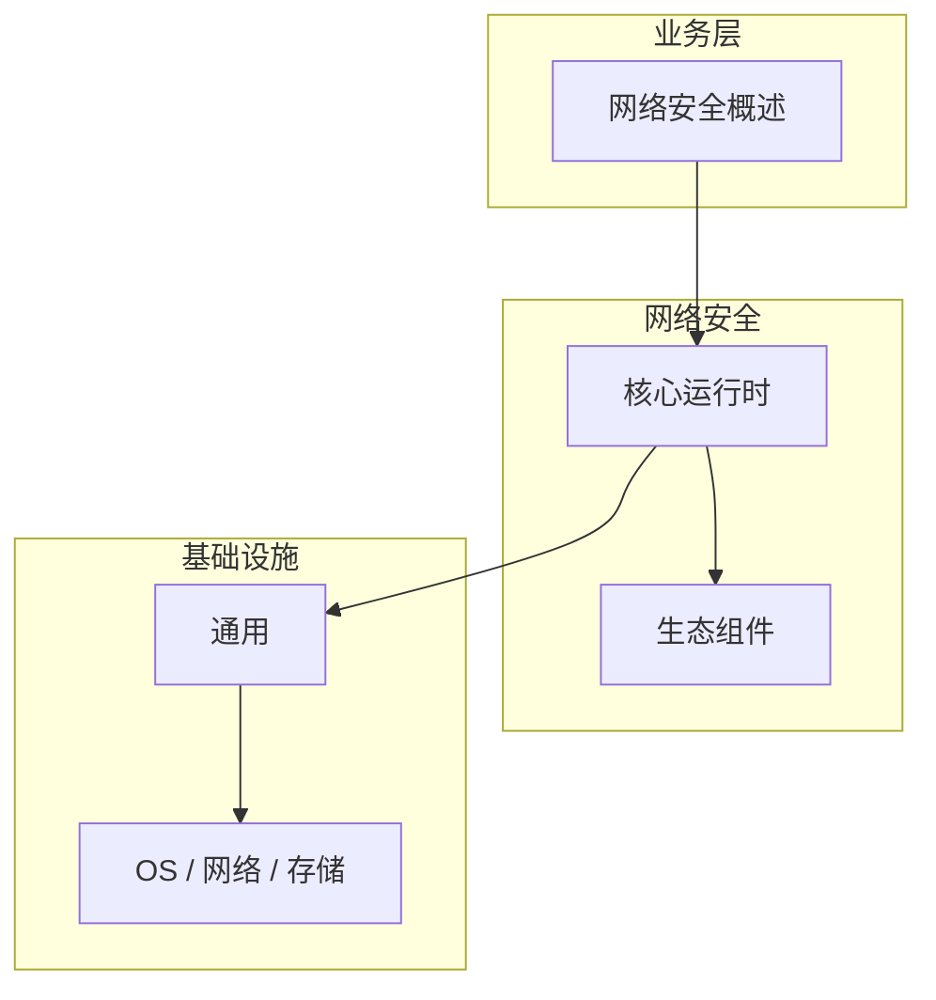

# 网络安全概述的关键技术点

> **领域**：网络安全 ｜ **模块**：网络安全概述 ｜ **难度**：入门 ｜ **类型**：关键技术

> **学习声明**：本章内容仅供合法授权环境下的安全研究与防御建设，请遵守法律法规与组织安全政策，禁止对未授权系统开展测试。

## 导读

本章系统讲解 **网络安全** 中 **网络安全概述** 的相关知识（关键技术）。本章归纳 **网络安全概述** 在生产环境中最常用、最易出错的关键技术点。内容基于主流框架与工程实践撰写，不依赖过时概念堆砌。

## 核心知识

网络安全（Network Security）保护数据在网络上传输与交换时的机密性、完整性与可用性。CIA 三要素是评估安全方案的基本框架：机密性防止未授权读取，完整性防止篡改，可用性保障服务持续运行。现代网络面临 APT、勒索软件与供应链攻击等复杂威胁，需要纵深防御（Defense in Depth）策略。

### 核心知识

**1. 威胁建模**

识别资产、攻击面与潜在攻击者，按 STRIDE 模型分类威胁（欺骗、篡改、否认、信息泄露、拒绝服务、权限提升），优先处理高风险项。

**2. CIA 三要素**

机密性（Confidentiality）通过加密与访问控制实现；完整性（Integrity）通过哈希、MAC 与数字签名保障；可用性（Availability）通过冗余、负载均衡与 DDoS 防护维持。三者缺一不可。

**3. 纵深防御**

不依赖单一防护点，在网络边界、内部隔离、主机加固、应用安全各层叠加控制。任一层被突破时，后续层仍能提供保护。

**4. 合规框架**

等保 2.0、ISO 27001、NIST CSF 等框架提供安全控制基线，企业应结合自身业务选择适用标准。

## 架构与流程

## 技术详解

### 关键技术

1. 资产盘点与网络拓扑梳理 → 2. 威胁建模与风险评估 → 3. 制定安全策略与基线 → 4. 部署边界防护与监控 → 5. 定期审计与演练 → 6. 持续改进。

## 原理与实现

### 工作机制

网络安全的实现依赖分层控制：物理层防窃听与设备安全，链路层 MAC 过滤与 VLAN 隔离，网络层 ACL 与 IPSec，传输层 TLS，应用层 WAF 与 API 网关。各层协同形成完整防护链。

### 内部实现

深入 网络安全概述 需阅读 网络安全 官方文档与源码/规范。关注默认行为、扩展点与性能特征。对比不同版本/API 的变更以避免兼容问题。

## 操作流程与实践

### 操作流程

1. 资产盘点与网络拓扑梳理 → 2. 威胁建模与风险评估 → 3. 制定安全策略与基线 → 4. 部署边界防护与监控 → 5. 定期审计与演练 → 6. 持续改进。

### 配置要点

参考 网络安全 官方文档配置 网络安全概述，关键参数变更需经过测试验证。

## 性能、安全与排查

### 性能优化

对 网络安全概述 热点路径做 profiling，优先优化算法复杂度与 I/O 瓶颈。

### 安全注意

本教程内容仅供合法授权的安全测试、防御加固与学术研究使用。未经授权对他人系统进行扫描、入侵或破坏属于违法行为。 所有测试活动必须在书面授权范围内进行。

### 调试排错

排查 网络安全概述 问题：复现 → 日志分析 → 最小化测试 → 定位根因 → 修复验证。

## 案例与选型

### 案例复盘

某 网络安全 项目通过正确应用 网络安全概述，解决了生产环境中的关键问题，显著提升了系统质量。

### 方案对比

对比 网络安全概述 的不同实现/方案，从性能、易用性、生态支持角度选型。

## 本章聚焦

**网络安全概述** 的关键技术往往集中在默认配置与边界行为；生产问题多源于「以为懂了」的细节，应用 checklist 逐项验证。

### 常见误区与纠正

**理解不深入**

对 网络安全概述 一知半解导致误用，应系统学习后再应用于生产。

**忽视版本差异**

网络安全 生态版本更新可能变更 网络安全概述 API，升级前查阅变更日志。

**缺少测试**

未对 网络安全概述 编写测试，变更后无法快速发现回归。

### 最佳实践

1. 遵循 网络安全 官方 网络安全概述 推荐用法
2. 为 网络安全概述 关键路径编写单元/集成测试
3. 文档化配置与架构决策
4. 持续跟进社区最佳实践

## 巩固建议

建议结合 **网络安全** 官方文档与小型实验，亲手验证 **网络安全概述** 的默认行为与边界条件；将本章要点整理为检查清单或 ADR，便于评审与团队 onboarding。

### 本章小结

学完本章，你应能独立说明 **网络安全概述** 在 网络安全 中的角色，理解其核心机制，规避常见误区，并在项目中正确运用。

## 延伸学习

- 网络安全概述核心概念与原理
- 网络安全概述的实现机制详解
- 网络安全概述的源码级分析
- 网络安全概述的配置与使用
- 网络安全概述的常见问题与解决方案

### 延伸阅读

- 网络安全 官方文档 - 网络安全概述
- 《网络安全权威指南》
- 相关开源项目与 RFC/论文

---
*章节 ID: 003 ｜ 领域: 网络安全*