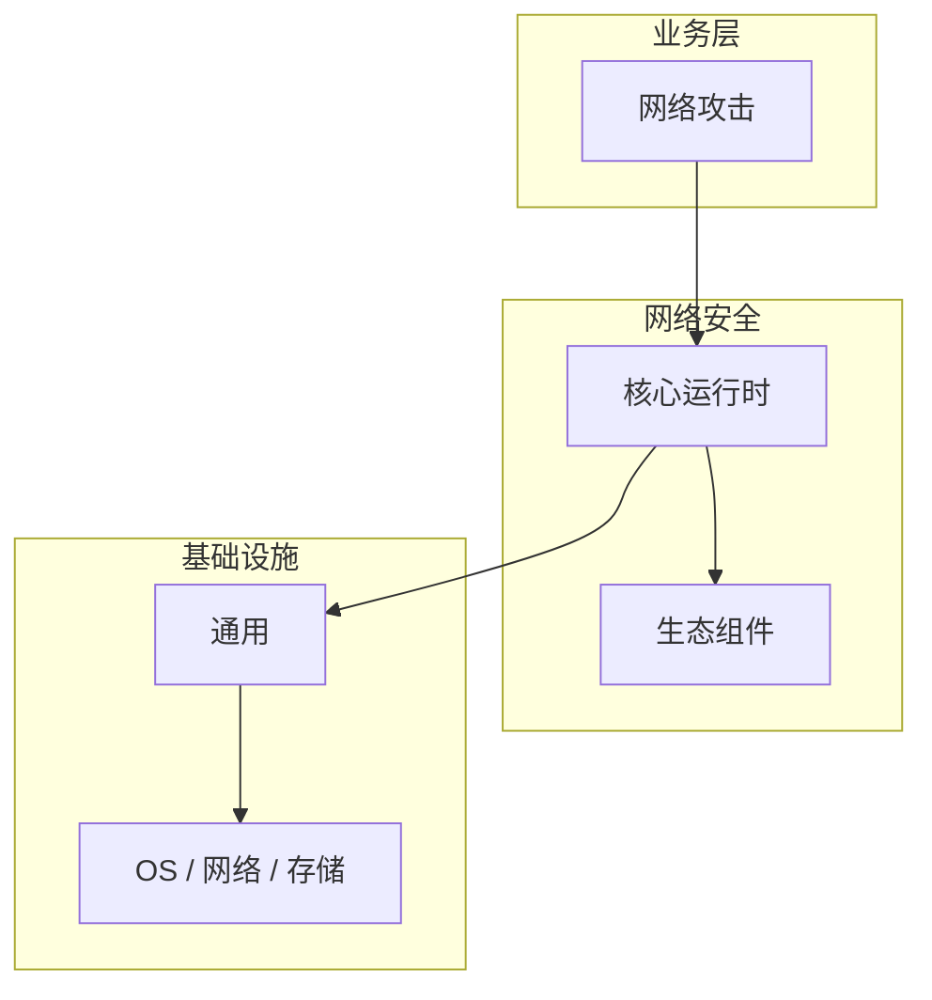

# 网络威胁的性能优化技巧

> **领域**：网络安全 ｜ **模块**：网络攻击 ｜ **难度**：入门 ｜ **类型**：性能优化

> **学习声明**：本章内容仅供合法授权环境下的安全研究与防御建设，请遵守法律法规与组织安全政策，禁止对未授权系统开展测试。

## 导读

本章系统讲解 **网络安全** 中 **网络攻击** 的相关知识（性能优化）。本章从度量指标、瓶颈定位与优化手段三方面讲解 **网络攻击** 的性能议题。内容基于主流框架与工程实践撰写，不依赖过时概念堆砌。

## 核心知识

理解网络攻击类型是设计有效防御的前提。本模块从防御视角分类讲解常见攻击手法及其检测与缓解措施，不提供攻击实施指导。

### 核心知识

**1. 被动攻击**

嗅探、流量分析等不修改数据的攻击，通过加密通信（TLS）与网络分段降低风险。

**2. 主动攻击**

篡改、重放、中间人攻击等修改或注入数据的攻击，需结合认证、完整性校验与 IDS 检测。

**3. DoS/DDoS**

通过耗尽带宽或连接资源使服务不可用。缓解手段包括流量清洗、限速、Anycast 与 CDN 分散。

**4. 中间人攻击**

攻击者插入通信路径窃听或篡改。防御依赖证书验证、HSTS 与证书锁定（Certificate Pinning）。

## 架构与流程

## 技术详解

### 性能优化

攻击通常遵循侦察→武器化→投递→利用→安装→命令控制→行动（Cyber Kill Chain）模型。防御方应在各阶段部署检测点：流量异常、IOC 匹配、行为分析。

## 原理与实现

### 工作机制

攻击通常遵循侦察→武器化→投递→利用→安装→命令控制→行动（Cyber Kill Chain）模型。防御方应在各阶段部署检测点：流量异常、IOC 匹配、行为分析。

### 内部实现

深入 网络攻击 需阅读 网络安全 官方文档与源码/规范。关注默认行为、扩展点与性能特征。对比不同版本/API 的变更以避免兼容问题。

## 操作流程与实践

### 操作流程

1. 学习 网络攻击 概念与 API → 2. 跟随官方教程动手实践 → 3. 在 网络安全 示例项目中应用 → 4. 分析常见问题 → 5. 总结最佳实践

### 配置要点

参考 网络安全 官方文档配置 网络攻击，关键参数变更需经过测试验证。

## 性能、安全与排查

### 性能优化

对 网络攻击 热点路径做 profiling，优先优化算法复杂度与 I/O 瓶颈。

### 安全注意

仅分析已公开的攻击案例与威胁情报，在隔离实验环境复现以验证防御规则有效性。

### 调试排错

排查 网络攻击 问题：复现 → 日志分析 → 最小化测试 → 定位根因 → 修复验证。

## 案例与选型

### 案例复盘

某 网络安全 项目通过正确应用 网络攻击，解决了生产环境中的关键问题，显著提升了系统质量。

### 方案对比

对比 网络攻击 的不同实现/方案，从性能、易用性、生态支持角度选型。

## 本章聚焦

针对 **网络攻击**，性能工作应「先度量后优化」：明确 P50/P95/P99 与资源占用基线，用 profiler/trace 定位热点，优先处理 I/O、锁竞争与算法复杂度问题，避免无数据支撑的微调。

### 常见误区与纠正

**理解不深入**

对 网络攻击 一知半解导致误用，应系统学习后再应用于生产。

**忽视版本差异**

网络安全 生态版本更新可能变更 网络攻击 API，升级前查阅变更日志。

**缺少测试**

未对 网络攻击 编写测试，变更后无法快速发现回归。

### 最佳实践

1. 遵循 网络安全 官方 网络攻击 推荐用法
2. 为 网络攻击 关键路径编写单元/集成测试
3. 文档化配置与架构决策
4. 持续跟进社区最佳实践

## 巩固建议

建议结合 **网络安全** 官方文档与小型实验，亲手验证 **网络攻击** 的默认行为与边界条件；将本章要点整理为检查清单或 ADR，便于评审与团队 onboarding。

### 本章小结

学完本章，你应能独立说明 **网络攻击** 在 网络安全 中的角色，理解其核心机制，规避常见误区，并在项目中正确运用。

## 延伸学习

- 网络威胁核心概念与原理
- 网络威胁的实现机制详解
- 网络威胁的关键技术点
- 网络威胁的源码级分析
- 网络威胁的配置与使用

### 延伸阅读

- 网络安全 官方文档 - 网络攻击
- 《网络安全权威指南》
- 相关开源项目与 RFC/论文

---
*章节 ID: 014 ｜ 领域: 网络安全*