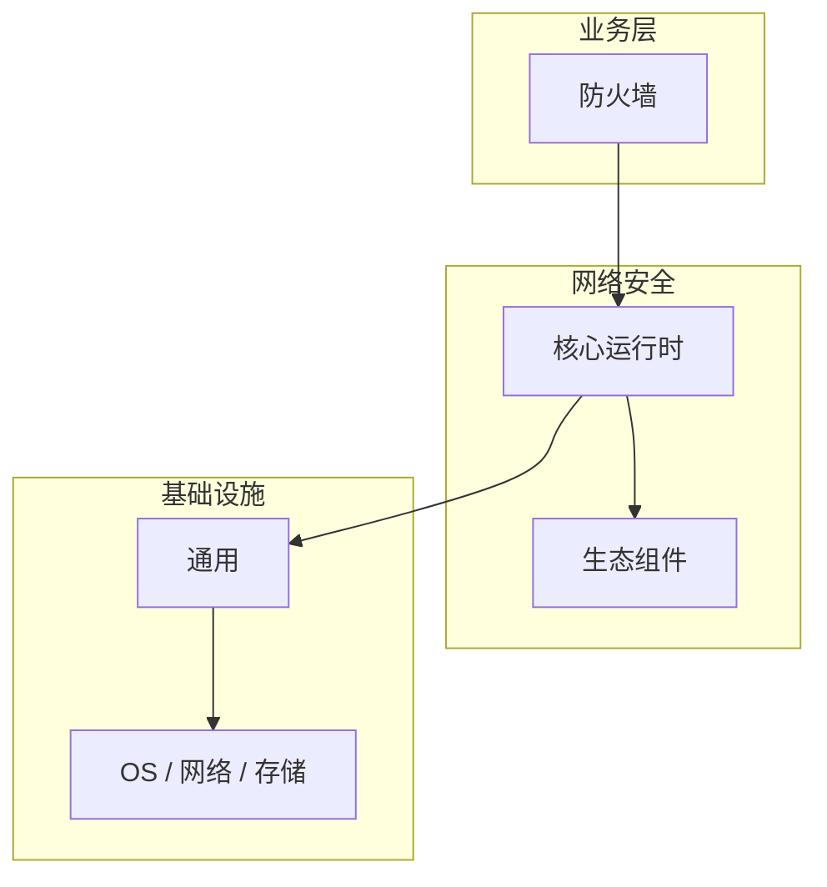

# 防火墙的配置与使用

> **领域**：网络安全 ｜ **模块**：防火墙 ｜ **难度**：进阶 ｜ **类型**：配置实践

> **学习声明**：本章内容仅供合法授权环境下的安全研究与防御建设，请遵守法律法规与组织安全政策，禁止对未授权系统开展测试。

## 导读

本章系统讲解 **网络安全** 中 **防火墙** 的相关知识（配置实践）。本章讲解 **防火墙** 的配置项含义、环境差异与验证方法，强调可重复部署。内容基于主流框架与工程实践撰写，不依赖过时概念堆砌。

## 核心知识

防火墙是网络边界的第一道防线，通过规则集过滤进出流量。状态防火墙跟踪连接状态，下一代防火墙（NGFW）还集成应用识别与 IPS。

### 核心知识

**1. 包过滤防火墙**

基于 IP、端口、协议的五元组规则过滤，无状态，速度快但无法识别应用层。

**2. 状态防火墙**

维护连接状态表，只允许属于已建立连接的返回流量，安全性更高。

**3. NGFW**

集成 DPI、应用识别、URL 过滤、IPS 与 VPN，可基于用户/应用而非仅 IP 制定策略。

**4. 规则设计原则**

默认拒绝（Default Deny），白名单放行；规则从具体到通用排序；定期审计冗余规则。

## 架构与流程

## 技术详解

### 配置实践

数据包到达 → 匹配 ACL 规则（自上而下）→ 状态检查 → 应用层检测（NGFW）→ 允许/拒绝/记录。

## 原理与实现

### 工作机制

数据包到达 → 匹配 ACL 规则（自上而下）→ 状态检查 → 应用层检测（NGFW）→ 允许/拒绝/记录。

### 内部实现

深入 防火墙 需阅读 网络安全 官方文档与源码/规范。关注默认行为、扩展点与性能特征。对比不同版本/API 的变更以避免兼容问题。

## 操作流程与实践

### 操作流程

1. 学习 防火墙 概念与 API → 2. 跟随官方教程动手实践 → 3. 在 网络安全 示例项目中应用 → 4. 分析常见问题 → 5. 总结最佳实践

### 配置要点

iptables/nftables（Linux）、pfSense、Cisco ASA 配置示例：先定义对象组，再编写 ACL，最后启用日志与告警。

## 性能、安全与排查

### 性能优化

对 防火墙 热点路径做 profiling，优先优化算法复杂度与 I/O 瓶颈。

### 安全注意

本教程内容仅供合法授权的安全测试、防御加固与学术研究使用。未经授权对他人系统进行扫描、入侵或破坏属于违法行为。

### 调试排错

使用 tcpdump/Wireshark 在防火墙两侧抓包对比，确认规则是否按预期过滤；检查连接跟踪表（conntrack）。

## 案例与选型

### 案例复盘

某 网络安全 项目通过正确应用 防火墙，解决了生产环境中的关键问题，显著提升了系统质量。

### 方案对比

对比 防火墙 的不同实现/方案，从性能、易用性、生态支持角度选型。

## 本章聚焦

**防火墙** 配置应外部化并分环境管理；关键项在文档中注明默认值、取值范围与生产推荐值，纳入 Code Review。

### 常见误区与纠正

**理解不深入**

对 防火墙 一知半解导致误用，应系统学习后再应用于生产。

**忽视版本差异**

网络安全 生态版本更新可能变更 防火墙 API，升级前查阅变更日志。

**缺少测试**

未对 防火墙 编写测试，变更后无法快速发现回归。

### 最佳实践

1. 遵循 网络安全 官方 防火墙 推荐用法
2. 为 防火墙 关键路径编写单元/集成测试
3. 文档化配置与架构决策
4. 持续跟进社区最佳实践

## 巩固建议

建议结合 **网络安全** 官方文档与小型实验，亲手验证 **防火墙** 的默认行为与边界条件；将本章要点整理为检查清单或 ADR，便于评审与团队 onboarding。

### 本章小结

学完本章，你应能独立说明 **防火墙** 在 网络安全 中的角色，理解其核心机制，规避常见误区，并在项目中正确运用。

## 延伸学习

- 防火墙核心概念与原理
- 防火墙的实现机制详解
- 防火墙的关键技术点
- 防火墙的源码级分析
- 防火墙的常见问题与解决方案

### 延伸阅读

- 网络安全 官方文档 - 防火墙
- 《网络安全权威指南》
- 相关开源项目与 RFC/论文

---
*章节 ID: 026 ｜ 领域: 网络安全*