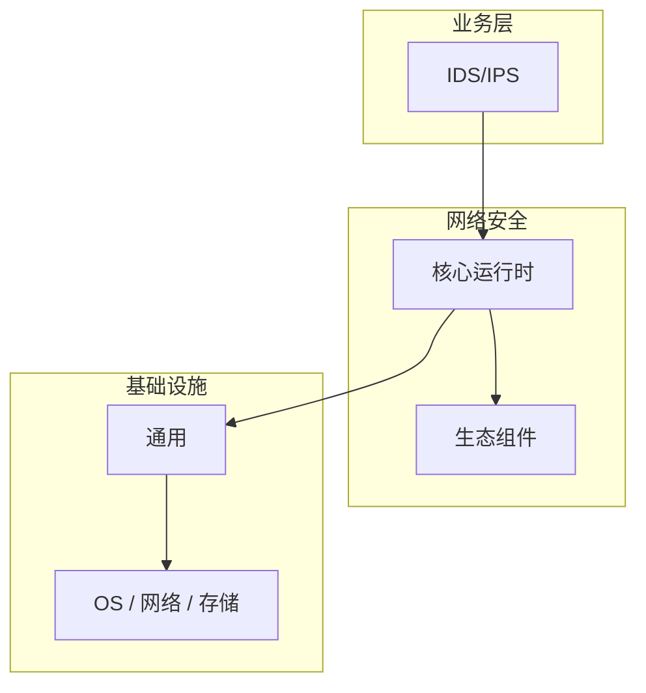

# IDS/IPS的配置与使用

> **领域**：网络安全 ｜ **模块**：IDS/IPS ｜ **难度**：进阶 ｜ **类型**：配置实践

> **学习声明**：本章内容仅供合法授权环境下的安全研究与防御建设，请遵守法律法规与组织安全政策，禁止对未授权系统开展测试。

## 导读

本章系统讲解 **网络安全** 中 **IDS/IPS** 的相关知识（配置实践）。本章讲解 **IDS/IPS** 的配置项含义、环境差异与验证方法，强调可重复部署。内容基于主流框架与工程实践撰写，不依赖过时概念堆砌。

## 核心知识

入侵检测系统（IDS）监控网络或主机流量发现可疑活动；入侵防御系统（IPS）可主动阻断攻击。Snort 与 Suricata 是开源主流方案。

### 核心知识

**1. 检测方法**

签名检测匹配已知攻击特征；异常检测建立基线识别偏离；启发式检测识别攻击行为模式。

**2. IDS vs IPS**

IDS 旁路部署仅告警；IPS 串联部署可阻断，但存在误报导致业务中断的风险。

**3. 规则管理**

Snort/Suricata 规则需定期更新（Emerging Threats 等），自定义规则应对内部威胁。

**4. 告警疲劳**

过多误报导致告警被忽略，需调优阈值、关联分析与优先级分级。

## 架构与流程

## 技术详解

### 配置实践

流量镜像/串联 → 协议解析 → 规则/ML 匹配 → 生成告警 → SIEM 关联 → 响应（IPS 阻断）。

## 原理与实现

### 工作机制

流量镜像/串联 → 协议解析 → 规则/ML 匹配 → 生成告警 → SIEM 关联 → 响应（IPS 阻断）。

### 内部实现

深入 IDS/IPS 需阅读 网络安全 官方文档与源码/规范。关注默认行为、扩展点与性能特征。对比不同版本/API 的变更以避免兼容问题。

## 操作流程与实践

### 操作流程

1. 学习 IDS/IPS 概念与 API → 2. 跟随官方教程动手实践 → 3. 在 网络安全 示例项目中应用 → 4. 分析常见问题 → 5. 总结最佳实践

### 配置要点

Suricata 配置：HOME_NET/EXTERNAL_NET 定义、规则文件路径、输出到 EVE JSON 供 ELK 分析。

## 性能、安全与排查

### 性能优化

对 IDS/IPS 热点路径做 profiling，优先优化算法复杂度与 I/O 瓶颈。

### 安全注意

本教程内容仅供合法授权的安全测试、防御加固与学术研究使用。未经授权对他人系统进行扫描、入侵或破坏属于违法行为。

### 调试排错

排查 IDS/IPS 问题：复现 → 日志分析 → 最小化测试 → 定位根因 → 修复验证。

## 案例与选型

### 案例复盘

某 网络安全 项目通过正确应用 IDS/IPS，解决了生产环境中的关键问题，显著提升了系统质量。

### 方案对比

对比 IDS/IPS 的不同实现/方案，从性能、易用性、生态支持角度选型。

## 本章聚焦

**IDS/IPS** 配置应外部化并分环境管理；关键项在文档中注明默认值、取值范围与生产推荐值，纳入 Code Review。

### 常见误区与纠正

**理解不深入**

对 IDS/IPS 一知半解导致误用，应系统学习后再应用于生产。

**忽视版本差异**

网络安全 生态版本更新可能变更 IDS/IPS API，升级前查阅变更日志。

**缺少测试**

未对 IDS/IPS 编写测试，变更后无法快速发现回归。

### 最佳实践

1. 遵循 网络安全 官方 IDS/IPS 推荐用法
2. 为 IDS/IPS 关键路径编写单元/集成测试
3. 文档化配置与架构决策
4. 持续跟进社区最佳实践

## 巩固建议

建议结合 **网络安全** 官方文档与小型实验，亲手验证 **IDS/IPS** 的默认行为与边界条件；将本章要点整理为检查清单或 ADR，便于评审与团队 onboarding。

### 本章小结

学完本章，你应能独立说明 **IDS/IPS** 在 网络安全 中的角色，理解其核心机制，规避常见误区，并在项目中正确运用。

## 延伸学习

- IDS/IPS核心概念与原理
- IDS/IPS的实现机制详解
- IDS/IPS的关键技术点
- IDS/IPS的源码级分析
- IDS/IPS的常见问题与解决方案

### 延伸阅读

- 网络安全 官方文档 - IDS/IPS
- 《网络安全权威指南》
- 相关开源项目与 RFC/论文

---
*章节 ID: 033 ｜ 领域: 网络安全*