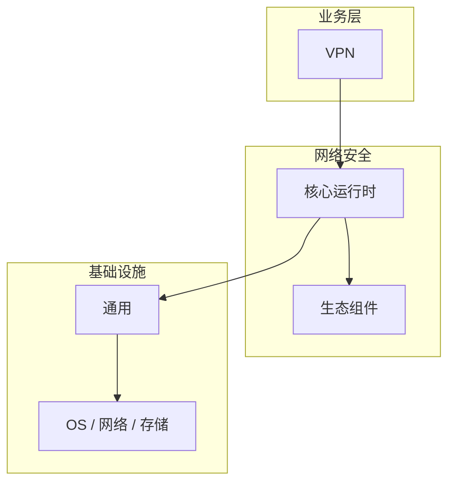

# VPN的常见问题与解决方案

> **领域**：网络安全 ｜ **模块**：VPN ｜ **难度**：进阶 ｜ **类型**：问题排查

> **学习声明**：本章内容仅供合法授权环境下的安全研究与防御建设，请遵守法律法规与组织安全政策，禁止对未授权系统开展测试。

## 导读

本章系统讲解 **网络安全** 中 **VPN** 的相关知识（问题排查）。本章围绕 **VPN** 的典型故障现象、根因定位与修复步骤组织内容。内容基于主流框架与工程实践撰写，不依赖过时概念堆砌。

## 核心知识

虚拟专用网（VPN）在公共网络上建立加密隧道，实现远程安全接入。IPSec 与 SSL/TLS VPN 是两种主流技术。

### 核心知识

**1. IPSec VPN**

网络层加密，支持站点到站点与远程接入，IKE 协商 SA，ESP 封装加密数据。

**2. SSL VPN**

基于 TLS 的应用层 VPN，浏览器即可接入，适合移动办公。

**3. WireGuard**

现代轻量 VPN 协议，代码简洁、性能高，内核级实现。

**4. Split Tunnel**

仅企业流量走 VPN，互联网直连。全隧道更安全但增加带宽压力。

## 架构与流程

## 技术详解

### 问题排查

IKE 阶段一协商加密算法与认证 → 阶段二建立 IPSec SA → 数据经 ESP/AH 封装传输 → 对端解密验证。

## 原理与实现

### 工作机制

IKE 阶段一协商加密算法与认证 → 阶段二建立 IPSec SA → 数据经 ESP/AH 封装传输 → 对端解密验证。

### 内部实现

深入 VPN 需阅读 网络安全 官方文档与源码/规范。关注默认行为、扩展点与性能特征。对比不同版本/API 的变更以避免兼容问题。

## 操作流程与实践

### 操作流程

1. 学习 VPN 概念与 API → 2. 跟随官方教程动手实践 → 3. 在 网络安全 示例项目中应用 → 4. 分析常见问题 → 5. 总结最佳实践

### 配置要点

参考 网络安全 官方文档配置 VPN，关键参数变更需经过测试验证。

## 性能、安全与排查

### 性能优化

对 VPN 热点路径做 profiling，优先优化算法复杂度与 I/O 瓶颈。

### 安全注意

使用 AES-256-GCM 与 ECDH 密钥交换；禁用 PPTP/L2TP 等弱协议；启用 MFA 认证。

### 调试排错

排查 VPN 问题：复现 → 日志分析 → 最小化测试 → 定位根因 → 修复验证。

## 案例与选型

### 案例复盘

某 网络安全 项目通过正确应用 VPN，解决了生产环境中的关键问题，显著提升了系统质量。

### 方案对比

对比 VPN 的不同实现/方案，从性能、易用性、生态支持角度选型。

## 本章聚焦

排障 **VPN** 时建议固定顺序：复现 → 收集日志/metrics/trace → 对比最近变更与配置 diff → 最小化隔离实验 → 记录根因与回归用例。

### 常见误区与纠正

**理解不深入**

对 VPN 一知半解导致误用，应系统学习后再应用于生产。

**忽视版本差异**

网络安全 生态版本更新可能变更 VPN API，升级前查阅变更日志。

**缺少测试**

未对 VPN 编写测试，变更后无法快速发现回归。

### 最佳实践

1. 遵循 网络安全 官方 VPN 推荐用法
2. 为 VPN 关键路径编写单元/集成测试
3. 文档化配置与架构决策
4. 持续跟进社区最佳实践

## 巩固建议

建议结合 **网络安全** 官方文档与小型实验，亲手验证 **VPN** 的默认行为与边界条件；将本章要点整理为检查清单或 ADR，便于评审与团队 onboarding。

### 本章小结

学完本章，你应能独立说明 **VPN** 在 网络安全 中的角色，理解其核心机制，规避常见误区，并在项目中正确运用。

## 延伸学习

- VPN核心概念与原理
- VPN的实现机制详解
- VPN的关键技术点
- VPN的源码级分析
- VPN的配置与使用

### 延伸阅读

- 网络安全 官方文档 - VPN
- 《网络安全权威指南》
- 相关开源项目与 RFC/论文

---
*章节 ID: 041 ｜ 领域: 网络安全*