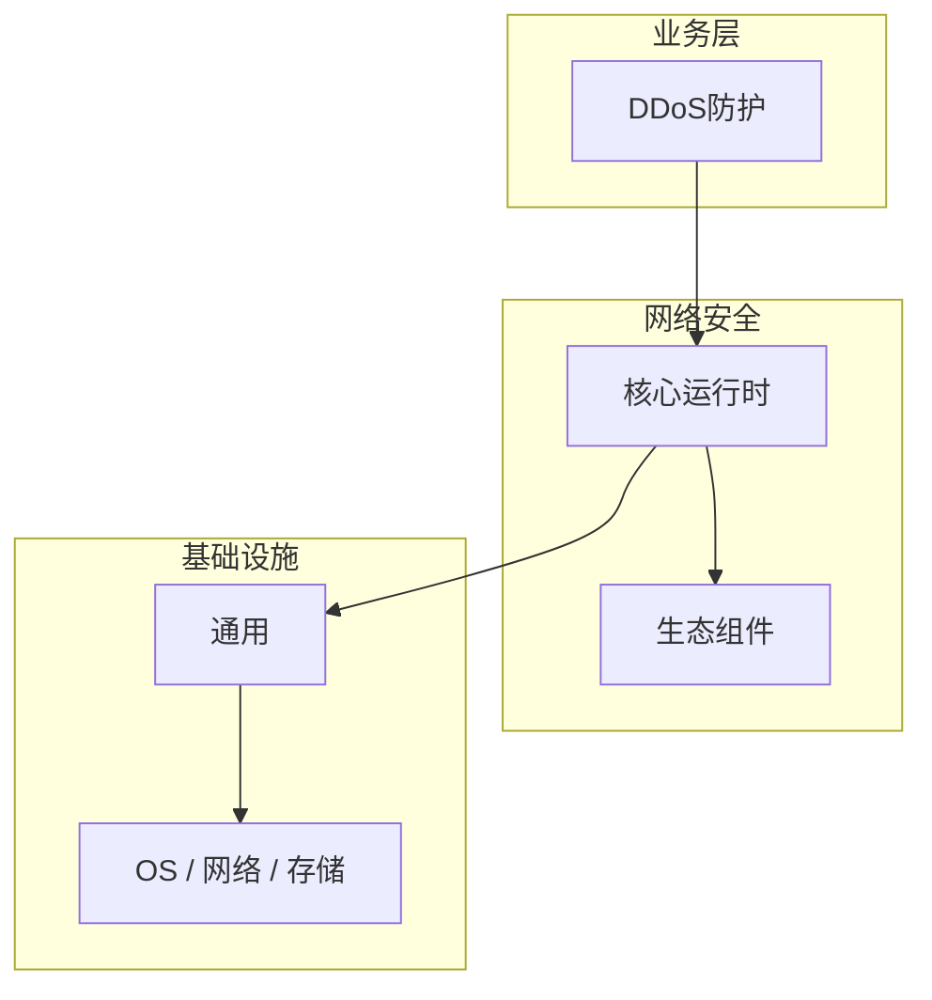

# DDoS防护的源码级分析

> **领域**：网络安全 ｜ **模块**：DDoS防护 ｜ **难度**：高级 ｜ **类型**：源码分析

> **学习声明**：本章内容仅供合法授权环境下的安全研究与防御建设，请遵守法律法规与组织安全政策，禁止对未授权系统开展测试。

## 导读

本章系统讲解 **网络安全** 中 **DDoS防护** 的相关知识（源码分析）。本章沿源码与调用链剖析 **DDoS防护** 的实现，适合需要排障或二次开发的读者。内容基于主流框架与工程实践撰写，不依赖过时概念堆砌。

## 核心知识

分布式拒绝服务（DDoS）攻击通过大量僵尸主机耗尽目标带宽或连接资源。防护需多层：本地限速、ISP 清洗、CDN 分散。

### 核心知识

**1. SYN Cookie**

不分配连接资源，用密码学 cookie 验证 SYN，抵御 SYN 洪水。

**2. 攻击类型**

 volumetric（UDP/ICMP 洪水）、protocol（SYN 洪水）、application（HTTP 慢速攻击）。

**3. 流量清洗**

云清洗中心识别并过滤恶意流量，仅转发合法流量到源站。

**4. Anycast**

将流量分散到全球多个节点，单点攻击被稀释。

## 架构与流程

## 技术详解

### 源码与实现

检测异常流量模式 → 触发 BGP 引流至清洗中心 → 多层过滤（黑名单、速率限制、挑战验证）→ 回注干净流量。

## 原理与实现

### 工作机制

检测异常流量模式 → 触发 BGP 引流至清洗中心 → 多层过滤（黑名单、速率限制、挑战验证）→ 回注干净流量。

### 内部实现

深入 DDoS防护 需阅读 网络安全 官方文档与源码/规范。关注默认行为、扩展点与性能特征。对比不同版本/API 的变更以避免兼容问题。

## 操作流程与实践

### 操作流程

1. 学习 DDoS防护 概念与 API → 2. 跟随官方教程动手实践 → 3. 在 网络安全 示例项目中应用 → 4. 分析常见问题 → 5. 总结最佳实践

### 配置要点

参考 网络安全 官方文档配置 DDoS防护，关键参数变更需经过测试验证。

## 性能、安全与排查

### 性能优化

对 DDoS防护 热点路径做 profiling，优先优化算法复杂度与 I/O 瓶颈。

### 安全注意

本教程内容仅供合法授权的安全测试、防御加固与学术研究使用。未经授权对他人系统进行扫描、入侵或破坏属于违法行为。

### 调试排错

排查 DDoS防护 问题：复现 → 日志分析 → 最小化测试 → 定位根因 → 修复验证。

## 案例与选型

### 案例复盘

某电商平台在促销期间遭遇 500Gbps UDP 洪水，通过 CDN Anycast + 云清洗在 3 分钟内恢复服务。

### 方案对比

对比 DDoS防护 的不同实现/方案，从性能、易用性、生态支持角度选型。

## 本章聚焦

源码阅读 **DDoS防护** 宜采用「由外向内」：先跟一次主路径请求，再展开分支与错误处理，避免陷入细节迷失主线。

### 常见误区与纠正

**理解不深入**

对 DDoS防护 一知半解导致误用，应系统学习后再应用于生产。

**忽视版本差异**

网络安全 生态版本更新可能变更 DDoS防护 API，升级前查阅变更日志。

**缺少测试**

未对 DDoS防护 编写测试，变更后无法快速发现回归。

### 最佳实践

1. 遵循 网络安全 官方 DDoS防护 推荐用法
2. 为 DDoS防护 关键路径编写单元/集成测试
3. 文档化配置与架构决策
4. 持续跟进社区最佳实践

## 巩固建议

建议结合 **网络安全** 官方文档与小型实验，亲手验证 **DDoS防护** 的默认行为与边界条件；将本章要点整理为检查清单或 ADR，便于评审与团队 onboarding。

### 本章小结

学完本章，你应能独立说明 **DDoS防护** 在 网络安全 中的角色，理解其核心机制，规避常见误区，并在项目中正确运用。

## 延伸学习

- DDoS防护核心概念与原理
- DDoS防护的实现机制详解
- DDoS防护的关键技术点
- DDoS防护的配置与使用
- DDoS防护的常见问题与解决方案

### 延伸阅读

- 网络安全 官方文档 - DDoS防护
- 《网络安全权威指南》
- 相关开源项目与 RFC/论文

---
*章节 ID: 053 ｜ 领域: 网络安全*