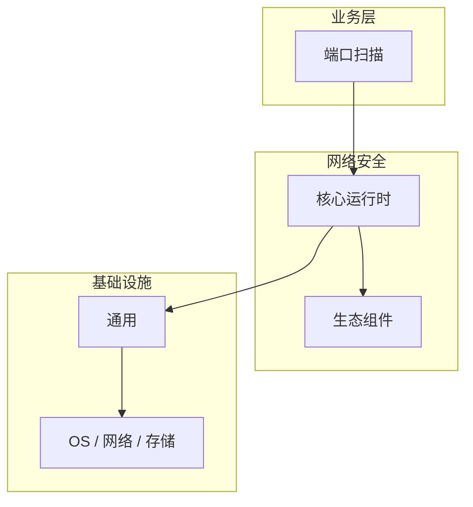

# 端口扫描的实现机制详解

> **领域**：网络安全 ｜ **模块**：端口扫描 ｜ **难度**：高级 ｜ **类型**：实现机制

> **学习声明**：本章内容仅供合法授权环境下的安全研究与防御建设，请遵守法律法规与组织安全政策，禁止对未授权系统开展测试。

## 导读

本章系统讲解 **网络安全** 中 **端口扫描** 的相关知识（实现机制）。本章聚焦 **端口扫描** 的内部实现路径与关键数据结构，帮助从 API 用法深入到机制层。内容基于主流框架与工程实践撰写，不依赖过时概念堆砌。

## 核心知识

端口扫描是授权安全评估中识别开放服务的基础手段。本模块讲解扫描原理与防御检测，强调仅在授权范围内使用。

### 核心知识

**1. Nmap 基础**

Nmap 是标准扫描工具，-sS SYN 扫描、-sV 版本探测、-O 操作系统识别（仅限授权目标）。

**2. 扫描类型**

TCP SYN 扫描（半开）、全连接扫描、UDP 扫描、ACK 扫描等，各有适用场景。

**3. 防御检测**

IDS 识别扫描特征（短时间内大量 SYN、端口顺序探测），触发告警或自动封禁。

**4. 端口最小化**

仅开放业务必需端口，关闭不必要服务，定期审计开放端口清单。

## 架构与流程

## 技术详解

### 实现机制

端口扫描 的执行流程：接收输入并完成校验 → 核心处理逻辑（端口扫描 在 网络安全 工程实践中的应用）→ 输出结果并处理异常 → 记录日志与指标。理解各阶段的数据流转是排查问题的基础。

## 原理与实现

### 工作机制

端口扫描 的执行流程：接收输入并完成校验 → 核心处理逻辑（端口扫描 在 网络安全 工程实践中的应用）→ 输出结果并处理异常 → 记录日志与指标。理解各阶段的数据流转是排查问题的基础。

### 内部实现

深入 端口扫描 需阅读 网络安全 官方文档与源码/规范。关注默认行为、扩展点与性能特征。对比不同版本/API 的变更以避免兼容问题。

## 操作流程与实践

### 操作流程

1. 确认授权范围 → 2. 选择扫描策略 → 3. 执行扫描并记录 → 4. 分析开放服务 → 5. 纳入风险评估报告。

### 配置要点

参考 网络安全 官方文档配置 端口扫描，关键参数变更需经过测试验证。

## 性能、安全与排查

### 性能优化

对 端口扫描 热点路径做 profiling，优先优化算法复杂度与 I/O 瓶颈。

### 安全注意

端口扫描仅可在获得书面授权的目标上进行。未授权扫描可能违反《网络安全法》等法规。

### 调试排错

排查 端口扫描 问题：复现 → 日志分析 → 最小化测试 → 定位根因 → 修复验证。

## 案例与选型

### 案例复盘

某 网络安全 项目通过正确应用 端口扫描，解决了生产环境中的关键问题，显著提升了系统质量。

### 方案对比

对比 端口扫描 的不同实现/方案，从性能、易用性、生态支持角度选型。

## 本章聚焦

阅读 **端口扫描** 实现时，建议对照调用栈画出数据流：入口 API → 核心数据结构 → 系统调用或 I/O 边界，标注锁与共享状态位置。

### 常见误区与纠正

**理解不深入**

对 端口扫描 一知半解导致误用，应系统学习后再应用于生产。

**忽视版本差异**

网络安全 生态版本更新可能变更 端口扫描 API，升级前查阅变更日志。

**缺少测试**

未对 端口扫描 编写测试，变更后无法快速发现回归。

### 最佳实践

1. 遵循 网络安全 官方 端口扫描 推荐用法
2. 为 端口扫描 关键路径编写单元/集成测试
3. 文档化配置与架构决策
4. 持续跟进社区最佳实践

## 巩固建议

建议结合 **网络安全** 官方文档与小型实验，亲手验证 **端口扫描** 的默认行为与边界条件；将本章要点整理为检查清单或 ADR，便于评审与团队 onboarding。

### 本章小结

学完本章，你应能独立说明 **端口扫描** 在 网络安全 中的角色，理解其核心机制，规避常见误区，并在项目中正确运用。

## 延伸学习

- 端口扫描核心概念与原理
- 端口扫描的关键技术点
- 端口扫描的源码级分析
- 端口扫描的配置与使用
- 端口扫描的常见问题与解决方案

### 延伸阅读

- 网络安全 官方文档 - 端口扫描
- 《网络安全权威指南》
- 相关开源项目与 RFC/论文

---
*章节 ID: 058 ｜ 领域: 网络安全*