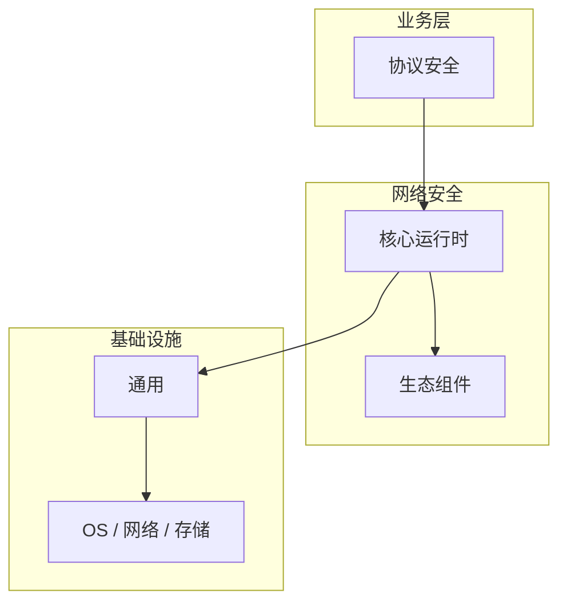

# 协议安全的实现机制详解

> **领域**：网络安全 ｜ **模块**：协议安全 ｜ **难度**：高级 ｜ **类型**：实现机制

> **学习声明**：本章内容仅供合法授权环境下的安全研究与防御建设，请遵守法律法规与组织安全政策，禁止对未授权系统开展测试。

## 导读

本章系统讲解 **网络安全** 中 **协议安全** 的相关知识（实现机制）。本章聚焦 **协议安全** 的内部实现路径与关键数据结构，帮助从 API 用法深入到机制层。内容基于主流框架与工程实践撰写，不依赖过时概念堆砌。

## 核心知识

网络协议设计时的安全假设在现代环境中常不成立。DNS、BGP、SNMP 等协议需额外加固或使用安全替代方案。

### 核心知识

**1. BGP 安全**

RPKI 验证路由起源，防止路由劫持。

**2. DNS 安全**

DNSSEC 防止 DNS 欺骗；DoH/DoT 加密 DNS 查询；限制区域传送。

**3. SNMP 安全**

使用 SNMPv3 认证加密，禁用默认 community string。

**4. 禁用弱协议**

Telnet、FTP、HTTP 应替换为 SSH、SFTP、HTTPS。

## 架构与流程

## 技术详解

### 实现机制

协议审计 → 识别明文/弱认证协议 → 制定迁移计划 → 部署安全替代 → 监控残留使用。

## 原理与实现

### 工作机制

协议审计 → 识别明文/弱认证协议 → 制定迁移计划 → 部署安全替代 → 监控残留使用。

### 内部实现

深入 协议安全 需阅读 网络安全 官方文档与源码/规范。关注默认行为、扩展点与性能特征。对比不同版本/API 的变更以避免兼容问题。

## 操作流程与实践

### 操作流程

1. 学习 协议安全 概念与 API → 2. 跟随官方教程动手实践 → 3. 在 网络安全 示例项目中应用 → 4. 分析常见问题 → 5. 总结最佳实践

### 配置要点

参考 网络安全 官方文档配置 协议安全，关键参数变更需经过测试验证。

## 性能、安全与排查

### 性能优化

对 协议安全 热点路径做 profiling，优先优化算法复杂度与 I/O 瓶颈。

### 安全注意

本教程内容仅供合法授权的安全测试、防御加固与学术研究使用。未经授权对他人系统进行扫描、入侵或破坏属于违法行为。

### 调试排错

排查 协议安全 问题：复现 → 日志分析 → 最小化测试 → 定位根因 → 修复验证。

## 案例与选型

### 案例复盘

某 网络安全 项目通过正确应用 协议安全，解决了生产环境中的关键问题，显著提升了系统质量。

### 方案对比

对比 协议安全 的不同实现/方案，从性能、易用性、生态支持角度选型。

## 本章聚焦

阅读 **协议安全** 实现时，建议对照调用栈画出数据流：入口 API → 核心数据结构 → 系统调用或 I/O 边界，标注锁与共享状态位置。

### 常见误区与纠正

**理解不深入**

对 协议安全 一知半解导致误用，应系统学习后再应用于生产。

**忽视版本差异**

网络安全 生态版本更新可能变更 协议安全 API，升级前查阅变更日志。

**缺少测试**

未对 协议安全 编写测试，变更后无法快速发现回归。

### 最佳实践

1. 遵循 网络安全 官方 协议安全 推荐用法
2. 为 协议安全 关键路径编写单元/集成测试
3. 文档化配置与架构决策
4. 持续跟进社区最佳实践

## 巩固建议

建议结合 **网络安全** 官方文档与小型实验，亲手验证 **协议安全** 的默认行为与边界条件；将本章要点整理为检查清单或 ADR，便于评审与团队 onboarding。

### 本章小结

学完本章，你应能独立说明 **协议安全** 在 网络安全 中的角色，理解其核心机制，规避常见误区，并在项目中正确运用。

## 延伸学习

- 协议安全核心概念与原理
- 协议安全的关键技术点
- 协议安全的源码级分析
- 协议安全的配置与使用
- 协议安全的常见问题与解决方案

### 延伸阅读

- 网络安全 官方文档 - 协议安全
- 《网络安全权威指南》
- 相关开源项目与 RFC/论文

---
*章节 ID: 072 ｜ 领域: 网络安全*