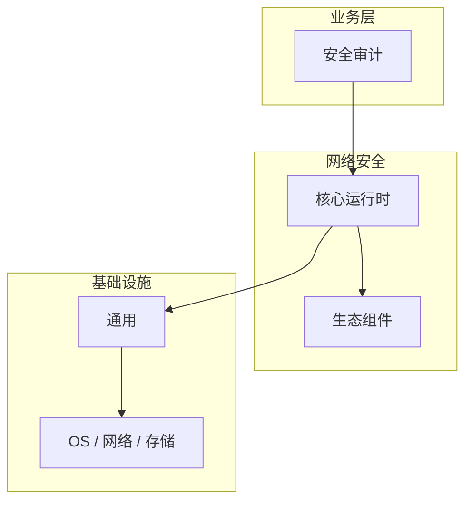

# 安全审计的常见问题与解决方案

> **领域**：网络安全 ｜ **模块**：安全审计 ｜ **难度**：实战 ｜ **类型**：问题排查

> **学习声明**：本章内容仅供合法授权环境下的安全研究与防御建设，请遵守法律法规与组织安全政策，禁止对未授权系统开展测试。

## 导读

本章系统讲解 **网络安全** 中 **安全审计** 的相关知识（问题排查）。本章围绕 **安全审计** 的典型故障现象、根因定位与修复步骤组织内容。内容基于主流框架与工程实践撰写，不依赖过时概念堆砌。

## 核心知识

安全审计系统性地检查网络配置、日志与合规状态，发现偏离基线的风险。

### 核心知识

**1. 审计范围**

网络设备配置、ACL 规则、用户权限、日志完整性、补丁状态。

**2. 自动化审计**

Nessus/OpenSCAP 等工具自动扫描配置合规性，生成差距报告。

**3. 日志审计**

检查防火墙/IDS 日志是否完整、时间同步、保留策略符合合规要求。

**4. 审计频率**

关键系统每季度审计，变更后立即审计，年度全面审计。

## 架构与流程

## 技术详解

### 问题排查

安全审计 的执行流程：接收输入并完成校验 → 核心处理逻辑（安全审计 在 网络安全 工程实践中的应用）→ 输出结果并处理异常 → 记录日志与指标。理解各阶段的数据流转是排查问题的基础。

## 原理与实现

### 工作机制

安全审计 的执行流程：接收输入并完成校验 → 核心处理逻辑（安全审计 在 网络安全 工程实践中的应用）→ 输出结果并处理异常 → 记录日志与指标。理解各阶段的数据流转是排查问题的基础。

### 内部实现

深入 安全审计 需阅读 网络安全 官方文档与源码/规范。关注默认行为、扩展点与性能特征。对比不同版本/API 的变更以避免兼容问题。

## 操作流程与实践

### 操作流程

制定审计计划 → 收集配置与日志 → 对照基线检查 → 编写发现项 → 跟踪整改 → 验证关闭。

### 配置要点

参考 网络安全 官方文档配置 安全审计，关键参数变更需经过测试验证。

## 性能、安全与排查

### 性能优化

对 安全审计 热点路径做 profiling，优先优化算法复杂度与 I/O 瓶颈。

### 安全注意

本教程内容仅供合法授权的安全测试、防御加固与学术研究使用。未经授权对他人系统进行扫描、入侵或破坏属于违法行为。

### 调试排错

排查 安全审计 问题：复现 → 日志分析 → 最小化测试 → 定位根因 → 修复验证。

## 案例与选型

### 案例复盘

某 网络安全 项目通过正确应用 安全审计，解决了生产环境中的关键问题，显著提升了系统质量。

### 方案对比

对比 安全审计 的不同实现/方案，从性能、易用性、生态支持角度选型。

## 本章聚焦

排障 **安全审计** 时建议固定顺序：复现 → 收集日志/metrics/trace → 对比最近变更与配置 diff → 最小化隔离实验 → 记录根因与回归用例。

### 常见误区与纠正

**理解不深入**

对 安全审计 一知半解导致误用，应系统学习后再应用于生产。

**忽视版本差异**

网络安全 生态版本更新可能变更 安全审计 API，升级前查阅变更日志。

**缺少测试**

未对 安全审计 编写测试，变更后无法快速发现回归。

### 最佳实践

1. 遵循 网络安全 官方 安全审计 推荐用法
2. 为 安全审计 关键路径编写单元/集成测试
3. 文档化配置与架构决策
4. 持续跟进社区最佳实践

## 巩固建议

建议结合 **网络安全** 官方文档与小型实验，亲手验证 **安全审计** 的默认行为与边界条件；将本章要点整理为检查清单或 ADR，便于评审与团队 onboarding。

### 本章小结

学完本章，你应能独立说明 **安全审计** 在 网络安全 中的角色，理解其核心机制，规避常见误区，并在项目中正确运用。

## 延伸学习

- 安全审计核心概念与原理
- 安全审计的实现机制详解
- 安全审计的关键技术点
- 安全审计的源码级分析
- 安全审计的配置与使用

### 延伸阅读

- 网络安全 官方文档 - 安全审计
- 《网络安全权威指南》
- 相关开源项目与 RFC/论文

---
*章节 ID: 088 ｜ 领域: 网络安全*