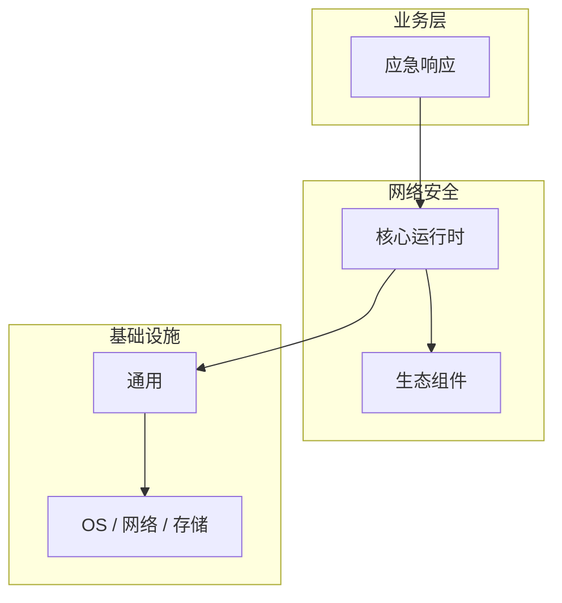

# 应急响应的源码级分析

> **领域**：网络安全 ｜ **模块**：应急响应 ｜ **难度**：实战 ｜ **类型**：源码分析

> **学习声明**：本章内容仅供合法授权环境下的安全研究与防御建设，请遵守法律法规与组织安全政策，禁止对未授权系统开展测试。

## 导读

本章系统讲解 **网络安全** 中 **应急响应** 的相关知识（源码分析）。本章沿源码与调用链剖析 **应急响应** 的实现，适合需要排障或二次开发的读者。内容基于主流框架与工程实践撰写，不依赖过时概念堆砌。

## 核心知识

网络安全应急响应在事件发生时快速遏制、根除威胁并恢复业务。NIST 框架定义准备、检测分析、遏制、根除恢复、事后总结五阶段。

### 核心知识

**1. 遏制策略**

短期：隔离受影响主机；长期：封堵攻击入口、修改凭证。

**2. 事件分类**

按严重级别（P1-P4）分类，P1 为核心业务中断需立即响应。

**3. 证据保全**

镜像磁盘、导出日志、记录时间线，满足取证与合规要求。

**4. 沟通机制**

明确事件指挥官、技术团队、法务、公关的职责与升级路径。

## 架构与流程

## 技术详解

### 源码与实现

应急响应 的执行流程：接收输入并完成校验 → 核心处理逻辑（应急响应 在 网络安全 工程实践中的应用）→ 输出结果并处理异常 → 记录日志与指标。理解各阶段的数据流转是排查问题的基础。

## 原理与实现

### 工作机制

应急响应 的执行流程：接收输入并完成校验 → 核心处理逻辑（应急响应 在 网络安全 工程实践中的应用）→ 输出结果并处理异常 → 记录日志与指标。理解各阶段的数据流转是排查问题的基础。

### 内部实现

深入 应急响应 需阅读 网络安全 官方文档与源码/规范。关注默认行为、扩展点与性能特征。对比不同版本/API 的变更以避免兼容问题。

## 操作流程与实践

### 操作流程

检测告警 → 初步分析确认事件 → 启动应急预案 → 遏制与根除 → 恢复服务 → 事后复盘（Lessons Learned）。

### 配置要点

参考 网络安全 官方文档配置 应急响应，关键参数变更需经过测试验证。

## 性能、安全与排查

### 性能优化

对 应急响应 热点路径做 profiling，优先优化算法复杂度与 I/O 瓶颈。

### 安全注意

本教程内容仅供合法授权的安全测试、防御加固与学术研究使用。未经授权对他人系统进行扫描、入侵或破坏属于违法行为。

### 调试排错

排查 应急响应 问题：复现 → 日志分析 → 最小化测试 → 定位根因 → 修复验证。

## 案例与选型

### 案例复盘

勒索软件事件：立即断网隔离 → 确认备份完整性 → 从干净备份恢复 → 修补入口漏洞 → 提交 IOC 至威胁情报平台。

### 方案对比

对比 应急响应 的不同实现/方案，从性能、易用性、生态支持角度选型。

## 本章聚焦

源码阅读 **应急响应** 宜采用「由外向内」：先跟一次主路径请求，再展开分支与错误处理，避免陷入细节迷失主线。

### 常见误区与纠正

**理解不深入**

对 应急响应 一知半解导致误用，应系统学习后再应用于生产。

**忽视版本差异**

网络安全 生态版本更新可能变更 应急响应 API，升级前查阅变更日志。

**缺少测试**

未对 应急响应 编写测试，变更后无法快速发现回归。

### 最佳实践

1. 遵循 网络安全 官方 应急响应 推荐用法
2. 为 应急响应 关键路径编写单元/集成测试
3. 文档化配置与架构决策
4. 持续跟进社区最佳实践

## 巩固建议

建议结合 **网络安全** 官方文档与小型实验，亲手验证 **应急响应** 的默认行为与边界条件；将本章要点整理为检查清单或 ADR，便于评审与团队 onboarding。

### 本章小结

学完本章，你应能独立说明 **应急响应** 在 网络安全 中的角色，理解其核心机制，规避常见误区，并在项目中正确运用。

## 延伸学习

- 应急响应核心概念与原理
- 应急响应的实现机制详解
- 应急响应的关键技术点
- 应急响应的配置与使用
- 应急响应的常见问题与解决方案

### 延伸阅读

- 网络安全 官方文档 - 应急响应
- 《网络安全权威指南》
- 相关开源项目与 RFC/论文

---
*章节 ID: 092 ｜ 领域: 网络安全*