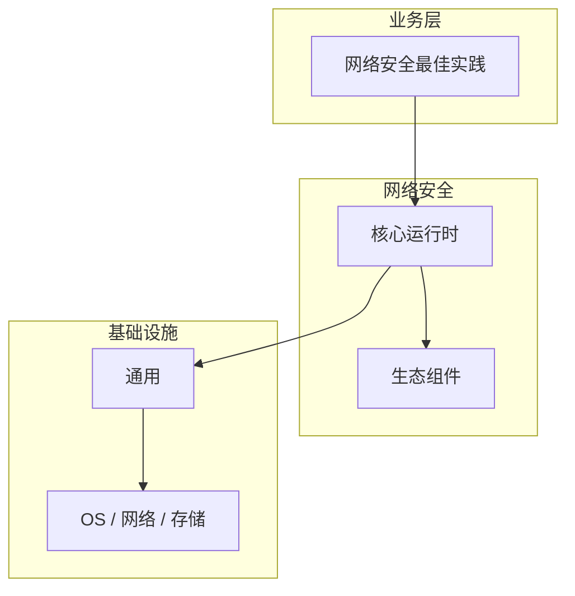

# 网络安全最佳实践核心概念与原理

> **领域**：网络安全 ｜ **模块**：网络安全最佳实践 ｜ **难度**：实战 ｜ **类型**：基础概念

> **学习声明**：本章内容仅供合法授权环境下的安全研究与防御建设，请遵守法律法规与组织安全政策，禁止对未授权系统开展测试。

## 导读

本章系统讲解 **网络安全** 中 **网络安全最佳实践** 的相关知识（基础概念）。本章建立 **网络安全最佳实践** 的概念模型与工作原理，是后续专题章节的基础。内容基于主流框架与工程实践撰写，不依赖过时概念堆砌。

## 核心知识

汇总网络安全领域的工程最佳实践，帮助建立可持续的安全运营体系。

### 核心知识

**1. 网络安全最佳实践的定义**

网络安全最佳实践 解决 网络安全 中特定场景的核心问题。网络安全最佳实践 在 网络安全 工程实践中的应用。

**2. 网络安全最佳实践的核心原理**

理解 网络安全最佳实践 的底层机制是正确应用的前提，需结合 网络安全 典型架构学习。

**3. 在网络安全中的位置**

网络安全最佳实践 与 网络安全 其他模块协作，形成完整的技术链路。

**4. 典型应用场景**

在 网络安全 实际项目中，网络安全最佳实践 常用于解决性能、可靠性或功能扩展问题。

## 架构与流程

## 技术详解

### 基础理解

汇总网络安全领域的工程最佳实践，帮助建立可持续的安全运营体系。

1. 学习 网络安全最佳实践 概念与 API → 2. 跟随官方教程动手实践 → 3. 在 网络安全 示例项目中应用 → 4. 分析常见问题 → 5. 总结最佳实践

## 原理与实现

### 工作机制

网络安全最佳实践 的执行流程：接收输入并完成校验 → 核心处理逻辑（网络安全最佳实践 在 网络安全 工程实践中的应用）→ 输出结果并处理异常 → 记录日志与指标。理解各阶段的数据流转是排查问题的基础。

### 内部实现

深入 网络安全最佳实践 需阅读 网络安全 官方文档与源码/规范。关注默认行为、扩展点与性能特征。对比不同版本/API 的变更以避免兼容问题。

## 操作流程与实践

### 操作流程

1. 学习 网络安全最佳实践 概念与 API → 2. 跟随官方教程动手实践 → 3. 在 网络安全 示例项目中应用 → 4. 分析常见问题 → 5. 总结最佳实践

### 配置要点

参考 网络安全 官方文档配置 网络安全最佳实践，关键参数变更需经过测试验证。

## 性能、安全与排查

### 性能优化

对 网络安全最佳实践 热点路径做 profiling，优先优化算法复杂度与 I/O 瓶颈。

### 安全注意

本教程内容仅供合法授权的安全测试、防御加固与学术研究使用。未经授权对他人系统进行扫描、入侵或破坏属于违法行为。

### 调试排错

排查 网络安全最佳实践 问题：复现 → 日志分析 → 最小化测试 → 定位根因 → 修复验证。

## 案例与选型

### 案例复盘

某 网络安全 项目通过正确应用 网络安全最佳实践，解决了生产环境中的关键问题，显著提升了系统质量。

### 方案对比

对比 网络安全最佳实践 的不同实现/方案，从性能、易用性、生态支持角度选型。

### 常见误区与纠正

**理解不深入**

对 网络安全最佳实践 一知半解导致误用，应系统学习后再应用于生产。

**忽视版本差异**

网络安全 生态版本更新可能变更 网络安全最佳实践 API，升级前查阅变更日志。

**缺少测试**

未对 网络安全最佳实践 编写测试，变更后无法快速发现回归。

### 最佳实践

1. 默认拒绝策略，最小权限开放端口与服务
2. 全流量加密（TLS 1.3），禁用弱密码套件
3. 网络分段 + 微隔离，限制横向移动
4. 集中日志（SIEM）+ 7×24 监控告警
5. 定期漏洞扫描（授权）与渗透测试
6. 制定并演练应急响应预案
7. 持续威胁情报订阅与 IOC 更新

## 巩固建议

建议结合 **网络安全** 官方文档与小型实验，亲手验证 **网络安全最佳实践** 的默认行为与边界条件；将本章要点整理为检查清单或 ADR，便于评审与团队 onboarding。

### 本章小结

学完本章，你应能独立说明 **网络安全最佳实践** 在 网络安全 中的角色，理解其核心机制，规避常见误区，并在项目中正确运用。

## 延伸学习

- 网络安全最佳实践的实现机制详解
- 网络安全最佳实践的关键技术点
- 网络安全最佳实践的源码级分析
- 网络安全最佳实践的配置与使用
- 网络安全最佳实践的常见问题与解决方案

### 延伸阅读

- NIST SP 800-53
- CIS Controls v8
- 等保 2.0 网络安全要求
- OWASP ASVS

---
*章节 ID: 095 ｜ 领域: 网络安全*