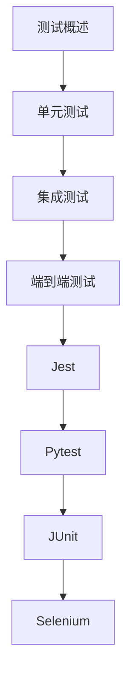

# 自动化测试 学习指南

> **分类**：后端开发 ｜ **章节总数**：100 ｜ **技术栈**：自动化测试

## 领域概述

自动化测试是后端开发领域的重要技术方向，本系列从基础到高级逐步深入，涵盖15个核心模块：测试概述、单元测试、集成测试、端到端测试、Jest等。每个知识点作为独立章节，包含原理讲解、实现要点、常见陷阱和最佳实践，配合源码分析和架构图，帮助读者建立完整的自动化测试知识体系。

本教程基于 **通用** 与 **自动化测试** 生态编写，涵盖 行业标准工具链 等主流工具与框架。每章独立成篇，文字精炼、逻辑清晰，适合系统学习与按需查阅。

## 你将学到什么

完成本系列后，你将能够：

- 系统理解 **自动化测试** 的核心概念与模块划分。
- 按难度递进掌握从入门到实战的完整知识路径。
- 在工程实践中做出合理的技术判断与问题排查。
- 通过章节索引快速定位所需知识点。

## 前置知识

- 编程基础
- 数据结构
- 计算机基础
- 后端开发基础概念

## 推荐学习路径

1. **测试概述**
2. **单元测试**
3. **集成测试**
4. **端到端测试**
5. **Jest**
6. **Pytest**
7. **JUnit**
8. **Selenium**

## 模块体系

本领域按以下模块组织，难度由浅入深：

- **测试概述**
- **单元测试**
- **集成测试**
- **端到端测试**
- **Jest**
- **Pytest**
- **JUnit**
- **Selenium**
- **Cypress**
- **Playwright**
- **Mock**
- **测试覆盖率**
- **CI测试**
- **测试策略**
- **自动化测试最佳实践**

## 难度分布

| 难度 | 章节数 | 占比 |
|------|--------|------|
| 入门 | 21 | 21% |
| 实战 | 18 | 18% |
| 进阶 | 28 | 28% |
| 高级 | 33 | 33% |

## 章节索引

点击章节标题进入对应教程：

### 测试概述

- [测试概述核心概念与原理](chapters/001-测试概述核心概念与原理.md) ｜ 入门
- [测试概述的实现机制详解](chapters/002-测试概述的实现机制详解.md) ｜ 入门
- [测试概述的关键技术点](chapters/003-测试概述的关键技术点.md) ｜ 入门
- [测试概述的源码级分析](chapters/004-测试概述的源码级分析.md) ｜ 入门
- [测试概述的配置与使用](chapters/005-测试概述的配置与使用.md) ｜ 入门
- [测试概述的常见问题与解决方案](chapters/006-测试概述的常见问题与解决方案.md) ｜ 入门
- [测试概述的性能优化技巧](chapters/007-测试概述的性能优化技巧.md) ｜ 入门

### 单元测试

- [单元测试核心概念与原理](chapters/008-单元测试核心概念与原理.md) ｜ 入门
- [单元测试的实现机制详解](chapters/009-单元测试的实现机制详解.md) ｜ 入门
- [单元测试的关键技术点](chapters/010-单元测试的关键技术点.md) ｜ 入门
- [单元测试的源码级分析](chapters/011-单元测试的源码级分析.md) ｜ 入门
- [单元测试的配置与使用](chapters/012-单元测试的配置与使用.md) ｜ 入门
- [单元测试的常见问题与解决方案](chapters/013-单元测试的常见问题与解决方案.md) ｜ 入门
- [单元测试的性能优化技巧](chapters/014-单元测试的性能优化技巧.md) ｜ 入门

### 集成测试

- [集成测试核心概念与原理](chapters/015-集成测试核心概念与原理.md) ｜ 入门
- [集成测试的实现机制详解](chapters/016-集成测试的实现机制详解.md) ｜ 入门
- [集成测试的关键技术点](chapters/017-集成测试的关键技术点.md) ｜ 入门
- [集成测试的源码级分析](chapters/018-集成测试的源码级分析.md) ｜ 入门
- [集成测试的配置与使用](chapters/019-集成测试的配置与使用.md) ｜ 入门
- [集成测试的常见问题与解决方案](chapters/020-集成测试的常见问题与解决方案.md) ｜ 入门
- [集成测试的性能优化技巧](chapters/021-集成测试的性能优化技巧.md) ｜ 入门

### 端到端测试

- [端到端测试核心概念与原理](chapters/022-端到端测试核心概念与原理.md) ｜ 进阶
- [端到端测试的实现机制详解](chapters/023-端到端测试的实现机制详解.md) ｜ 进阶
- [端到端测试的关键技术点](chapters/024-端到端测试的关键技术点.md) ｜ 进阶
- [端到端测试的源码级分析](chapters/025-端到端测试的源码级分析.md) ｜ 进阶
- [端到端测试的配置与使用](chapters/026-端到端测试的配置与使用.md) ｜ 进阶
- [端到端测试的常见问题与解决方案](chapters/027-端到端测试的常见问题与解决方案.md) ｜ 进阶
- [端到端测试的性能优化技巧](chapters/028-端到端测试的性能优化技巧.md) ｜ 进阶

### Jest

- [Jest核心概念与原理](chapters/029-Jest核心概念与原理.md) ｜ 进阶
- [Jest的实现机制详解](chapters/030-Jest的实现机制详解.md) ｜ 进阶
- [Jest的关键技术点](chapters/031-Jest的关键技术点.md) ｜ 进阶
- [Jest的源码级分析](chapters/032-Jest的源码级分析.md) ｜ 进阶
- [Jest的配置与使用](chapters/033-Jest的配置与使用.md) ｜ 进阶
- [Jest的常见问题与解决方案](chapters/034-Jest的常见问题与解决方案.md) ｜ 进阶
- [Jest的性能优化技巧](chapters/035-Jest的性能优化技巧.md) ｜ 进阶

### Pytest

- [Pytest核心概念与原理](chapters/036-Pytest核心概念与原理.md) ｜ 进阶
- [Pytest的实现机制详解](chapters/037-Pytest的实现机制详解.md) ｜ 进阶
- [Pytest的关键技术点](chapters/038-Pytest的关键技术点.md) ｜ 进阶
- [Pytest的源码级分析](chapters/039-Pytest的源码级分析.md) ｜ 进阶
- [Pytest的配置与使用](chapters/040-Pytest的配置与使用.md) ｜ 进阶
- [Pytest的常见问题与解决方案](chapters/041-Pytest的常见问题与解决方案.md) ｜ 进阶
- [Pytest的性能优化技巧](chapters/042-Pytest的性能优化技巧.md) ｜ 进阶

### JUnit

- [JUnit核心概念与原理](chapters/043-JUnit核心概念与原理.md) ｜ 进阶
- [JUnit的实现机制详解](chapters/044-JUnit的实现机制详解.md) ｜ 进阶
- [JUnit的关键技术点](chapters/045-JUnit的关键技术点.md) ｜ 进阶
- [JUnit的源码级分析](chapters/046-JUnit的源码级分析.md) ｜ 进阶
- [JUnit的配置与使用](chapters/047-JUnit的配置与使用.md) ｜ 进阶
- [JUnit的常见问题与解决方案](chapters/048-JUnit的常见问题与解决方案.md) ｜ 进阶
- [JUnit的性能优化技巧](chapters/049-JUnit的性能优化技巧.md) ｜ 进阶

### Selenium

- [Selenium核心概念与原理](chapters/050-Selenium核心概念与原理.md) ｜ 高级
- [Selenium的实现机制详解](chapters/051-Selenium的实现机制详解.md) ｜ 高级
- [Selenium的关键技术点](chapters/052-Selenium的关键技术点.md) ｜ 高级
- [Selenium的源码级分析](chapters/053-Selenium的源码级分析.md) ｜ 高级
- [Selenium的配置与使用](chapters/054-Selenium的配置与使用.md) ｜ 高级
- [Selenium的常见问题与解决方案](chapters/055-Selenium的常见问题与解决方案.md) ｜ 高级
- [Selenium的性能优化技巧](chapters/056-Selenium的性能优化技巧.md) ｜ 高级

### Cypress

- [Cypress核心概念与原理](chapters/057-Cypress核心概念与原理.md) ｜ 高级
- [Cypress的实现机制详解](chapters/058-Cypress的实现机制详解.md) ｜ 高级
- [Cypress的关键技术点](chapters/059-Cypress的关键技术点.md) ｜ 高级
- [Cypress的源码级分析](chapters/060-Cypress的源码级分析.md) ｜ 高级
- [Cypress的配置与使用](chapters/061-Cypress的配置与使用.md) ｜ 高级
- [Cypress的常见问题与解决方案](chapters/062-Cypress的常见问题与解决方案.md) ｜ 高级
- [Cypress的性能优化技巧](chapters/063-Cypress的性能优化技巧.md) ｜ 高级

### Playwright

- [Playwright核心概念与原理](chapters/064-Playwright核心概念与原理.md) ｜ 高级
- [Playwright的实现机制详解](chapters/065-Playwright的实现机制详解.md) ｜ 高级
- [Playwright的关键技术点](chapters/066-Playwright的关键技术点.md) ｜ 高级
- [Playwright的源码级分析](chapters/067-Playwright的源码级分析.md) ｜ 高级
- [Playwright的配置与使用](chapters/068-Playwright的配置与使用.md) ｜ 高级
- [Playwright的常见问题与解决方案](chapters/069-Playwright的常见问题与解决方案.md) ｜ 高级
- [Playwright的性能优化技巧](chapters/070-Playwright的性能优化技巧.md) ｜ 高级

### Mock

- [Mock核心概念与原理](chapters/071-Mock核心概念与原理.md) ｜ 高级
- [Mock的实现机制详解](chapters/072-Mock的实现机制详解.md) ｜ 高级
- [Mock的关键技术点](chapters/073-Mock的关键技术点.md) ｜ 高级
- [Mock的源码级分析](chapters/074-Mock的源码级分析.md) ｜ 高级
- [Mock的配置与使用](chapters/075-Mock的配置与使用.md) ｜ 高级
- [Mock的常见问题与解决方案](chapters/076-Mock的常见问题与解决方案.md) ｜ 高级

### 测试覆盖率

- [测试覆盖率核心概念与原理](chapters/077-测试覆盖率核心概念与原理.md) ｜ 高级
- [测试覆盖率的实现机制详解](chapters/078-测试覆盖率的实现机制详解.md) ｜ 高级
- [测试覆盖率的关键技术点](chapters/079-测试覆盖率的关键技术点.md) ｜ 高级
- [测试覆盖率的源码级分析](chapters/080-测试覆盖率的源码级分析.md) ｜ 高级
- [测试覆盖率的配置与使用](chapters/081-测试覆盖率的配置与使用.md) ｜ 高级
- [测试覆盖率的常见问题与解决方案](chapters/082-测试覆盖率的常见问题与解决方案.md) ｜ 高级

### CI测试

- [CI测试核心概念与原理](chapters/083-CI测试核心概念与原理.md) ｜ 实战
- [CI测试的实现机制详解](chapters/084-CI测试的实现机制详解.md) ｜ 实战
- [CI测试的关键技术点](chapters/085-CI测试的关键技术点.md) ｜ 实战
- [CI测试的源码级分析](chapters/086-CI测试的源码级分析.md) ｜ 实战
- [CI测试的配置与使用](chapters/087-CI测试的配置与使用.md) ｜ 实战
- [CI测试的常见问题与解决方案](chapters/088-CI测试的常见问题与解决方案.md) ｜ 实战

### 测试策略

- [测试策略核心概念与原理](chapters/089-测试策略核心概念与原理.md) ｜ 实战
- [测试策略的实现机制详解](chapters/090-测试策略的实现机制详解.md) ｜ 实战
- [测试策略的关键技术点](chapters/091-测试策略的关键技术点.md) ｜ 实战
- [测试策略的源码级分析](chapters/092-测试策略的源码级分析.md) ｜ 实战
- [测试策略的配置与使用](chapters/093-测试策略的配置与使用.md) ｜ 实战
- [测试策略的常见问题与解决方案](chapters/094-测试策略的常见问题与解决方案.md) ｜ 实战

### 自动化测试最佳实践

- [自动化测试最佳实践核心概念与原理](chapters/095-自动化测试最佳实践核心概念与原理.md) ｜ 实战
- [自动化测试最佳实践的实现机制详解](chapters/096-自动化测试最佳实践的实现机制详解.md) ｜ 实战
- [自动化测试最佳实践的关键技术点](chapters/097-自动化测试最佳实践的关键技术点.md) ｜ 实战
- [自动化测试最佳实践的源码级分析](chapters/098-自动化测试最佳实践的源码级分析.md) ｜ 实战
- [自动化测试最佳实践的配置与使用](chapters/099-自动化测试最佳实践的配置与使用.md) ｜ 实战
- [自动化测试最佳实践的常见问题与解决方案](chapters/100-自动化测试最佳实践的常见问题与解决方案.md) ｜ 实战

## 学习方法建议

1. **先读概述再读章节**：用本指南建立全局地图，避免迷失在细节中。
2. **按模块递进**：同一模块内章节有前后关联，顺序阅读效果更好。
3. **主动复述**：每章读完后，用三五句话概括「是什么、为什么、怎么用」。
4. **关联阅读**：利用章节底部的「延伸学习」在同模块内构建知识网络。
5. **对照官方文档**：本教程提供结构化视角，细节以官方文档为准。

---
*领域: 自动化测试 ｜ 版本: 2.0 ｜ 共 100 章*