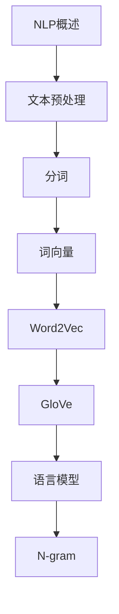

# 自然语言处理 学习指南

> **分类**：AI与算法 ｜ **章节总数**：100 ｜ **技术栈**：自然语言处理

## 领域概述

自然语言处理是AI与算法领域的重要技术方向，本系列从基础到高级逐步深入，涵盖19个核心模块：NLP概述、文本预处理、分词、词向量、Word2Vec等。每个知识点作为独立章节，包含原理讲解、实现要点、常见陷阱和最佳实践，配合源码分析和架构图，帮助读者建立完整的自然语言处理知识体系。

本教程基于 **通用** 与 **自然语言处理** 生态编写，涵盖 行业标准工具链 等主流工具与框架。每章独立成篇，文字精炼、逻辑清晰，适合系统学习与按需查阅。

## 你将学到什么

完成本系列后，你将能够：

- 系统理解 **自然语言处理** 的核心概念与模块划分。
- 按难度递进掌握从入门到实战的完整知识路径。
- 在工程实践中做出合理的技术判断与问题排查。
- 通过章节索引快速定位所需知识点。

## 前置知识

- 编程基础
- 数据结构
- 计算机基础
- AI与算法基础概念

## 推荐学习路径

1. **NLP概述**
2. **文本预处理**
3. **分词**
4. **词向量**
5. **Word2Vec**
6. **GloVe**
7. **语言模型**
8. **N-gram**

## 模块体系

本领域按以下模块组织，难度由浅入深：

- **NLP概述**
- **文本预处理**
- **分词**
- **词向量**
- **Word2Vec**
- **GloVe**
- **语言模型**
- **N-gram**
- **文本分类**
- **情感分析**
- **命名实体识别**
- **关系抽取**
- **机器翻译**
- **文本生成**
- **问答系统**
- **BERT**
- **GPT**
- **大语言模型**
- **NLP最佳实践**

## 难度分布

| 难度 | 章节数 | 占比 |
|------|--------|------|
| 入门 | 24 | 24% |
| 实战 | 20 | 20% |
| 进阶 | 26 | 26% |
| 高级 | 30 | 30% |

## 章节索引

点击章节标题进入对应教程：

### NLP概述

- [NLP概述核心概念与原理](chapters/001-NLP概述核心概念与原理.md) ｜ 入门
- [NLP概述的实现机制详解](chapters/002-NLP概述的实现机制详解.md) ｜ 入门
- [NLP概述的关键技术点](chapters/003-NLP概述的关键技术点.md) ｜ 入门
- [NLP概述的源码级分析](chapters/004-NLP概述的源码级分析.md) ｜ 入门
- [NLP概述的配置与使用](chapters/005-NLP概述的配置与使用.md) ｜ 入门
- [NLP概述的常见问题与解决方案](chapters/006-NLP概述的常见问题与解决方案.md) ｜ 入门

### 文本预处理

- [文本预处理核心概念与原理](chapters/007-文本预处理核心概念与原理.md) ｜ 入门
- [文本预处理的实现机制详解](chapters/008-文本预处理的实现机制详解.md) ｜ 入门
- [文本预处理的关键技术点](chapters/009-文本预处理的关键技术点.md) ｜ 入门
- [文本预处理的源码级分析](chapters/010-文本预处理的源码级分析.md) ｜ 入门
- [文本预处理的配置与使用](chapters/011-文本预处理的配置与使用.md) ｜ 入门
- [文本预处理的常见问题与解决方案](chapters/012-文本预处理的常见问题与解决方案.md) ｜ 入门

### 分词

- [分词核心概念与原理](chapters/013-分词核心概念与原理.md) ｜ 入门
- [分词的实现机制详解](chapters/014-分词的实现机制详解.md) ｜ 入门
- [分词的关键技术点](chapters/015-分词的关键技术点.md) ｜ 入门
- [分词的源码级分析](chapters/016-分词的源码级分析.md) ｜ 入门
- [分词的配置与使用](chapters/017-分词的配置与使用.md) ｜ 入门
- [分词的常见问题与解决方案](chapters/018-分词的常见问题与解决方案.md) ｜ 入门

### 词向量

- [词向量核心概念与原理](chapters/019-词向量核心概念与原理.md) ｜ 入门
- [词向量的实现机制详解](chapters/020-词向量的实现机制详解.md) ｜ 入门
- [词向量的关键技术点](chapters/021-词向量的关键技术点.md) ｜ 入门
- [词向量的源码级分析](chapters/022-词向量的源码级分析.md) ｜ 入门
- [词向量的配置与使用](chapters/023-词向量的配置与使用.md) ｜ 入门
- [词向量的常见问题与解决方案](chapters/024-词向量的常见问题与解决方案.md) ｜ 入门

### Word2Vec

- [Word2Vec核心概念与原理](chapters/025-Word2Vec核心概念与原理.md) ｜ 进阶
- [Word2Vec的实现机制详解](chapters/026-Word2Vec的实现机制详解.md) ｜ 进阶
- [Word2Vec的关键技术点](chapters/027-Word2Vec的关键技术点.md) ｜ 进阶
- [Word2Vec的源码级分析](chapters/028-Word2Vec的源码级分析.md) ｜ 进阶
- [Word2Vec的配置与使用](chapters/029-Word2Vec的配置与使用.md) ｜ 进阶
- [Word2Vec的常见问题与解决方案](chapters/030-Word2Vec的常见问题与解决方案.md) ｜ 进阶

### GloVe

- [GloVe核心概念与原理](chapters/031-GloVe核心概念与原理.md) ｜ 进阶
- [GloVe的实现机制详解](chapters/032-GloVe的实现机制详解.md) ｜ 进阶
- [GloVe的关键技术点](chapters/033-GloVe的关键技术点.md) ｜ 进阶
- [GloVe的源码级分析](chapters/034-GloVe的源码级分析.md) ｜ 进阶
- [GloVe的配置与使用](chapters/035-GloVe的配置与使用.md) ｜ 进阶

### 语言模型

- [语言模型核心概念与原理](chapters/036-语言模型核心概念与原理.md) ｜ 进阶
- [语言模型的实现机制详解](chapters/037-语言模型的实现机制详解.md) ｜ 进阶
- [语言模型的关键技术点](chapters/038-语言模型的关键技术点.md) ｜ 进阶
- [语言模型的源码级分析](chapters/039-语言模型的源码级分析.md) ｜ 进阶
- [语言模型的配置与使用](chapters/040-语言模型的配置与使用.md) ｜ 进阶

### N-gram

- [N-gram核心概念与原理](chapters/041-N-gram核心概念与原理.md) ｜ 进阶
- [N-gram的实现机制详解](chapters/042-N-gram的实现机制详解.md) ｜ 进阶
- [N-gram的关键技术点](chapters/043-N-gram的关键技术点.md) ｜ 进阶
- [N-gram的源码级分析](chapters/044-N-gram的源码级分析.md) ｜ 进阶
- [N-gram的配置与使用](chapters/045-N-gram的配置与使用.md) ｜ 进阶

### 文本分类

- [文本分类核心概念与原理](chapters/046-文本分类核心概念与原理.md) ｜ 进阶
- [文本分类的实现机制详解](chapters/047-文本分类的实现机制详解.md) ｜ 进阶
- [文本分类的关键技术点](chapters/048-文本分类的关键技术点.md) ｜ 进阶
- [文本分类的源码级分析](chapters/049-文本分类的源码级分析.md) ｜ 进阶
- [文本分类的配置与使用](chapters/050-文本分类的配置与使用.md) ｜ 进阶

### 情感分析

- [情感分析核心概念与原理](chapters/051-情感分析核心概念与原理.md) ｜ 高级
- [情感分析的实现机制详解](chapters/052-情感分析的实现机制详解.md) ｜ 高级
- [情感分析的关键技术点](chapters/053-情感分析的关键技术点.md) ｜ 高级
- [情感分析的源码级分析](chapters/054-情感分析的源码级分析.md) ｜ 高级
- [情感分析的配置与使用](chapters/055-情感分析的配置与使用.md) ｜ 高级

### 命名实体识别

- [命名实体识别核心概念与原理](chapters/056-命名实体识别核心概念与原理.md) ｜ 高级
- [命名实体识别的实现机制详解](chapters/057-命名实体识别的实现机制详解.md) ｜ 高级
- [命名实体识别的关键技术点](chapters/058-命名实体识别的关键技术点.md) ｜ 高级
- [命名实体识别的源码级分析](chapters/059-命名实体识别的源码级分析.md) ｜ 高级
- [命名实体识别的配置与使用](chapters/060-命名实体识别的配置与使用.md) ｜ 高级

### 关系抽取

- [关系抽取核心概念与原理](chapters/061-关系抽取核心概念与原理.md) ｜ 高级
- [关系抽取的实现机制详解](chapters/062-关系抽取的实现机制详解.md) ｜ 高级
- [关系抽取的关键技术点](chapters/063-关系抽取的关键技术点.md) ｜ 高级
- [关系抽取的源码级分析](chapters/064-关系抽取的源码级分析.md) ｜ 高级
- [关系抽取的配置与使用](chapters/065-关系抽取的配置与使用.md) ｜ 高级

### 机器翻译

- [机器翻译核心概念与原理](chapters/066-机器翻译核心概念与原理.md) ｜ 高级
- [机器翻译的实现机制详解](chapters/067-机器翻译的实现机制详解.md) ｜ 高级
- [机器翻译的关键技术点](chapters/068-机器翻译的关键技术点.md) ｜ 高级
- [机器翻译的源码级分析](chapters/069-机器翻译的源码级分析.md) ｜ 高级
- [机器翻译的配置与使用](chapters/070-机器翻译的配置与使用.md) ｜ 高级

### 文本生成

- [文本生成核心概念与原理](chapters/071-文本生成核心概念与原理.md) ｜ 高级
- [文本生成的实现机制详解](chapters/072-文本生成的实现机制详解.md) ｜ 高级
- [文本生成的关键技术点](chapters/073-文本生成的关键技术点.md) ｜ 高级
- [文本生成的源码级分析](chapters/074-文本生成的源码级分析.md) ｜ 高级
- [文本生成的配置与使用](chapters/075-文本生成的配置与使用.md) ｜ 高级

### 问答系统

- [问答系统核心概念与原理](chapters/076-问答系统核心概念与原理.md) ｜ 高级
- [问答系统的实现机制详解](chapters/077-问答系统的实现机制详解.md) ｜ 高级
- [问答系统的关键技术点](chapters/078-问答系统的关键技术点.md) ｜ 高级
- [问答系统的源码级分析](chapters/079-问答系统的源码级分析.md) ｜ 高级
- [问答系统的配置与使用](chapters/080-问答系统的配置与使用.md) ｜ 高级

### BERT

- [BERT核心概念与原理](chapters/081-BERT核心概念与原理.md) ｜ 实战
- [BERT的实现机制详解](chapters/082-BERT的实现机制详解.md) ｜ 实战
- [BERT的关键技术点](chapters/083-BERT的关键技术点.md) ｜ 实战
- [BERT的源码级分析](chapters/084-BERT的源码级分析.md) ｜ 实战
- [BERT的配置与使用](chapters/085-BERT的配置与使用.md) ｜ 实战

### GPT

- [GPT核心概念与原理](chapters/086-GPT核心概念与原理.md) ｜ 实战
- [GPT的实现机制详解](chapters/087-GPT的实现机制详解.md) ｜ 实战
- [GPT的关键技术点](chapters/088-GPT的关键技术点.md) ｜ 实战
- [GPT的源码级分析](chapters/089-GPT的源码级分析.md) ｜ 实战
- [GPT的配置与使用](chapters/090-GPT的配置与使用.md) ｜ 实战

### 大语言模型

- [大语言模型核心概念与原理](chapters/091-大语言模型核心概念与原理.md) ｜ 实战
- [大语言模型的实现机制详解](chapters/092-大语言模型的实现机制详解.md) ｜ 实战
- [大语言模型的关键技术点](chapters/093-大语言模型的关键技术点.md) ｜ 实战
- [大语言模型的源码级分析](chapters/094-大语言模型的源码级分析.md) ｜ 实战
- [大语言模型的配置与使用](chapters/095-大语言模型的配置与使用.md) ｜ 实战

### NLP最佳实践

- [NLP最佳实践核心概念与原理](chapters/096-NLP最佳实践核心概念与原理.md) ｜ 实战
- [NLP最佳实践的实现机制详解](chapters/097-NLP最佳实践的实现机制详解.md) ｜ 实战
- [NLP最佳实践的关键技术点](chapters/098-NLP最佳实践的关键技术点.md) ｜ 实战
- [NLP最佳实践的源码级分析](chapters/099-NLP最佳实践的源码级分析.md) ｜ 实战
- [NLP最佳实践的配置与使用](chapters/100-NLP最佳实践的配置与使用.md) ｜ 实战

## 学习方法建议

1. **先读概述再读章节**：用本指南建立全局地图，避免迷失在细节中。
2. **按模块递进**：同一模块内章节有前后关联，顺序阅读效果更好。
3. **主动复述**：每章读完后，用三五句话概括「是什么、为什么、怎么用」。
4. **关联阅读**：利用章节底部的「延伸学习」在同模块内构建知识网络。
5. **对照官方文档**：本教程提供结构化视角，细节以官方文档为准。

---
*领域: 自然语言处理 ｜ 版本: 2.0 ｜ 共 100 章*