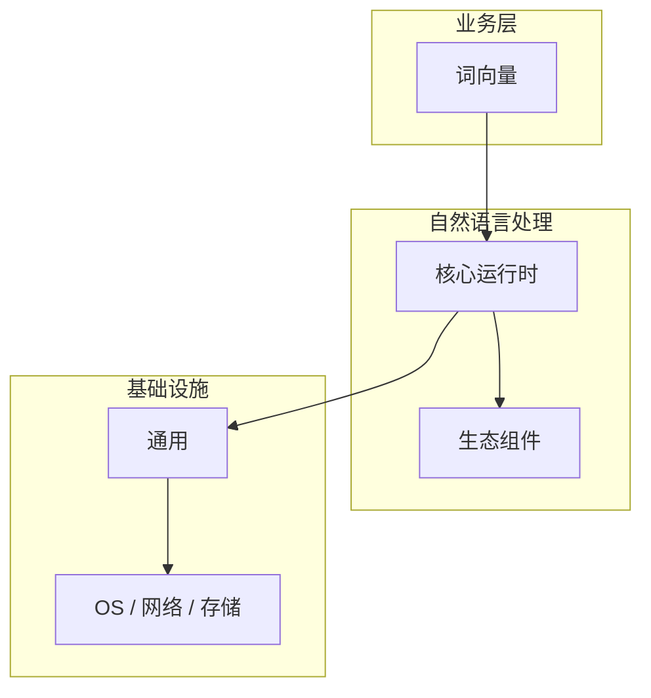

# 词向量的关键技术点

> **领域**：自然语言处理 ｜ **模块**：词向量 ｜ **难度**：入门 ｜ **类型**：关键技术

## 导读

本章系统讲解 **自然语言处理** 中 **词向量** 的相关知识（关键技术）。本章归纳 **词向量** 在生产环境中最常用、最易出错的关键技术点。内容基于主流框架与工程实践撰写，不依赖过时概念堆砌。

## 核心知识

**词向量** 是 自然语言处理 领域的核心主题。词嵌入表示。本模块从原理与工程实践出发，帮助读者建立系统理解。

### 核心知识

**1. One-Hot**

高维稀疏，无法表达语义相似。

**2. Dense**

低维稠密向量，语义相近词向量接近。

**3. 上下文**

ELMo 上下文相关词向量。

## 架构与流程

## 技术详解

### 关键技术

词 → 查表/编码 → 稠密向量 → 下游使用。

## 原理与实现

### 工作机制

词 → 查表/编码 → 稠密向量 → 下游使用。

### 内部实现

词向量 的底层实现依赖 自然语言处理 生态中的标准组件与协议，建议阅读官方规范文档。

## 操作流程与实践

### 操作流程

1. 理解 词向量 概念 → 2. 学习标准用法 → 3. 动手实验 → 4. 分析案例 → 5. 总结最佳实践。

### 配置要点

配置 词向量 时遵循官方推荐默认值，仅在理解影响后调整参数。

## 性能、安全与排查

### 性能优化

评估 词向量 性能时建立基准测试，关注时间/空间复杂度或系统吞吐延迟指标。

### 安全注意

在 自然语言处理 场景下注意输入校验、权限控制与敏感数据保护。

### 调试排错

排查 词向量 问题时，结合日志、监控与最小复现用例逐步定位根因。

## 案例与选型

### 案例复盘

在典型 自然语言处理 项目中，正确应用 词向量 可显著提升系统质量与可维护性。

### 方案对比

选择 词向量 方案时需对比多种替代方案的适用场景、性能与生态支持。

## 本章聚焦

**词向量** 的关键技术往往集中在默认配置与边界行为；生产问题多源于「以为懂了」的细节，应用 checklist 逐项验证。

### 常见误区与纠正

**概念理解偏差**

对 词向量 理解不全面导致误用，应回到官方文档重新梳理。

**忽视边界条件**

词向量 在极端输入或高并发下行为可能不同，需充分测试。

**缺少监控**

未对 词向量 关键指标监控，问题只能被动发现。

### 最佳实践

1. 遵循 自然语言处理 领域 词向量 的官方推荐实践
2. 为 词向量 相关功能编写自动化测试
3. 关键配置纳入版本管理与变更审计
4. 生产部署前在接近真实环境验证

## 巩固建议

建议结合 **自然语言处理** 官方文档与小型实验，亲手验证 **词向量** 的默认行为与边界条件；将本章要点整理为检查清单或 ADR，便于评审与团队 onboarding。

### 本章小结

学完本章，你应能独立说明 **词向量** 在 自然语言处理 中的角色，理解其核心机制，规避常见误区，并在项目中正确运用。

## 延伸学习

- 词向量核心概念与原理
- 词向量的实现机制详解
- 词向量的源码级分析
- 词向量的配置与使用
- 词向量的常见问题与解决方案

### 延伸阅读

- 自然语言处理 官方文档 - 词向量
- OWASP / NIST 相关指南（如适用）
- 权威书籍与 RFC 标准文档

---
*章节 ID: 021 ｜ 领域: 自然语言处理*