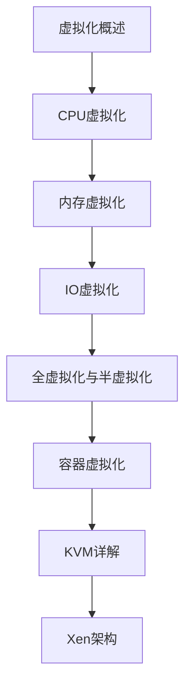

# 虚拟化技术 学习指南

> **分类**：系统底层 ｜ **技术生态**：KVM/QEMU, libvirt, Xen, VMware ESXi, virtio, VFIO

## 领域定位

虚拟化在物理硬件上运行多个隔离的操作系统实例，通过 Hypervisor 虚拟化 CPU、内存与 I/O。KVM、Xen 与硬件辅助虚拟化（Intel VT-x/AMD-V）是现代数据中心的基础。

面向云平台与基础设施工程师，讲解 Type-1/2 Hypervisor 原理与性能调优。

本领域常用技术栈与工具包括：KVM/QEMU, libvirt, Xen, VMware ESXi, virtio, VFIO。

## 学习目标

- 解释 VM Entry/Exit、EPT/NPT 二级地址翻译
- 区分全虚拟化、半虚拟化与硬件辅助路径
- 配置 KVM 虚拟机 CPU/内存/virtio 设备
- 分析虚拟化开销来源并应用 pinning、大页等优化

## 前置知识

- 操作系统原理
- Linux 内核基础
- x86 体系结构
- 计算机网络

## 学习路径

1. **虚拟化概述**
2. **CPU虚拟化**
3. **内存虚拟化**
4. **IO虚拟化**
5. **全虚拟化与半虚拟化**
6. **容器虚拟化**
7. **KVM详解**
8. **Xen架构**

## 模块体系

- **虚拟化概述**
- **CPU虚拟化**
- **内存虚拟化**
- **IO虚拟化**
- **全虚拟化与半虚拟化**
- **容器虚拟化**
- **KVM详解**
- **Xen架构**
- **性能优化**
- **虚拟化安全**

## 难度分布

| 入门 | 16 | 20% |
| 实战 | 16 | 20% |
| 进阶 | 24 | 30% |
| 高级 | 24 | 30% |

## 章节索引

### 虚拟化概述

- [虚拟化概述核心概念与原理](chapters/001-虚拟化概述核心概念与原理.md) ｜ 入门
- [虚拟化概述的实现机制详解](chapters/002-虚拟化概述的实现机制详解.md) ｜ 入门
- [虚拟化概述的关键技术点](chapters/003-虚拟化概述的关键技术点.md) ｜ 入门
- [虚拟化概述的源码级分析](chapters/004-虚拟化概述的源码级分析.md) ｜ 入门
- [虚拟化概述的配置与使用](chapters/005-虚拟化概述的配置与使用.md) ｜ 入门
- [虚拟化概述的常见问题与解决方案](chapters/006-虚拟化概述的常见问题与解决方案.md) ｜ 入门
- [虚拟化概述的性能优化技巧](chapters/007-虚拟化概述的性能优化技巧.md) ｜ 入门
- [虚拟化概述的最佳实践指南](chapters/008-虚拟化概述的最佳实践指南.md) ｜ 入门

### CPU虚拟化

- [CPU虚拟化核心概念与原理](chapters/009-CPU虚拟化核心概念与原理.md) ｜ 入门
- [CPU虚拟化的实现机制详解](chapters/010-CPU虚拟化的实现机制详解.md) ｜ 入门
- [CPU虚拟化的关键技术点](chapters/011-CPU虚拟化的关键技术点.md) ｜ 入门
- [CPU虚拟化的源码级分析](chapters/012-CPU虚拟化的源码级分析.md) ｜ 入门
- [CPU虚拟化的配置与使用](chapters/013-CPU虚拟化的配置与使用.md) ｜ 入门
- [CPU虚拟化的常见问题与解决方案](chapters/014-CPU虚拟化的常见问题与解决方案.md) ｜ 入门
- [CPU虚拟化的性能优化技巧](chapters/015-CPU虚拟化的性能优化技巧.md) ｜ 入门
- [CPU虚拟化的最佳实践指南](chapters/016-CPU虚拟化的最佳实践指南.md) ｜ 入门

### 内存虚拟化

- [内存虚拟化核心概念与原理](chapters/017-内存虚拟化核心概念与原理.md) ｜ 进阶
- [内存虚拟化的实现机制详解](chapters/018-内存虚拟化的实现机制详解.md) ｜ 进阶
- [内存虚拟化的关键技术点](chapters/019-内存虚拟化的关键技术点.md) ｜ 进阶
- [内存虚拟化的源码级分析](chapters/020-内存虚拟化的源码级分析.md) ｜ 进阶
- [内存虚拟化的配置与使用](chapters/021-内存虚拟化的配置与使用.md) ｜ 进阶
- [内存虚拟化的常见问题与解决方案](chapters/022-内存虚拟化的常见问题与解决方案.md) ｜ 进阶
- [内存虚拟化的性能优化技巧](chapters/023-内存虚拟化的性能优化技巧.md) ｜ 进阶
- [内存虚拟化的最佳实践指南](chapters/024-内存虚拟化的最佳实践指南.md) ｜ 进阶

### IO虚拟化

- [IO虚拟化核心概念与原理](chapters/025-IO虚拟化核心概念与原理.md) ｜ 进阶
- [IO虚拟化的实现机制详解](chapters/026-IO虚拟化的实现机制详解.md) ｜ 进阶
- [IO虚拟化的关键技术点](chapters/027-IO虚拟化的关键技术点.md) ｜ 进阶
- [IO虚拟化的源码级分析](chapters/028-IO虚拟化的源码级分析.md) ｜ 进阶
- [IO虚拟化的配置与使用](chapters/029-IO虚拟化的配置与使用.md) ｜ 进阶
- [IO虚拟化的常见问题与解决方案](chapters/030-IO虚拟化的常见问题与解决方案.md) ｜ 进阶
- [IO虚拟化的性能优化技巧](chapters/031-IO虚拟化的性能优化技巧.md) ｜ 进阶
- [IO虚拟化的最佳实践指南](chapters/032-IO虚拟化的最佳实践指南.md) ｜ 进阶

### 全虚拟化与半虚拟化

- [全虚拟化与半虚拟化核心概念与原理](chapters/033-全虚拟化与半虚拟化核心概念与原理.md) ｜ 进阶
- [全虚拟化与半虚拟化的实现机制详解](chapters/034-全虚拟化与半虚拟化的实现机制详解.md) ｜ 进阶
- [全虚拟化与半虚拟化的关键技术点](chapters/035-全虚拟化与半虚拟化的关键技术点.md) ｜ 进阶
- [全虚拟化与半虚拟化的源码级分析](chapters/036-全虚拟化与半虚拟化的源码级分析.md) ｜ 进阶
- [全虚拟化与半虚拟化的配置与使用](chapters/037-全虚拟化与半虚拟化的配置与使用.md) ｜ 进阶
- [全虚拟化与半虚拟化的常见问题与解决方案](chapters/038-全虚拟化与半虚拟化的常见问题与解决方案.md) ｜ 进阶
- [全虚拟化与半虚拟化的性能优化技巧](chapters/039-全虚拟化与半虚拟化的性能优化技巧.md) ｜ 进阶
- [全虚拟化与半虚拟化的最佳实践指南](chapters/040-全虚拟化与半虚拟化的最佳实践指南.md) ｜ 进阶

### 容器虚拟化

- [容器虚拟化核心概念与原理](chapters/041-容器虚拟化核心概念与原理.md) ｜ 高级
- [容器虚拟化的实现机制详解](chapters/042-容器虚拟化的实现机制详解.md) ｜ 高级
- [容器虚拟化的关键技术点](chapters/043-容器虚拟化的关键技术点.md) ｜ 高级
- [容器虚拟化的源码级分析](chapters/044-容器虚拟化的源码级分析.md) ｜ 高级
- [容器虚拟化的配置与使用](chapters/045-容器虚拟化的配置与使用.md) ｜ 高级
- [容器虚拟化的常见问题与解决方案](chapters/046-容器虚拟化的常见问题与解决方案.md) ｜ 高级
- [容器虚拟化的性能优化技巧](chapters/047-容器虚拟化的性能优化技巧.md) ｜ 高级
- [容器虚拟化的最佳实践指南](chapters/048-容器虚拟化的最佳实践指南.md) ｜ 高级

### KVM详解

- [KVM详解核心概念与原理](chapters/049-KVM详解核心概念与原理.md) ｜ 高级
- [KVM详解的实现机制详解](chapters/050-KVM详解的实现机制详解.md) ｜ 高级
- [KVM详解的关键技术点](chapters/051-KVM详解的关键技术点.md) ｜ 高级
- [KVM详解的源码级分析](chapters/052-KVM详解的源码级分析.md) ｜ 高级
- [KVM详解的配置与使用](chapters/053-KVM详解的配置与使用.md) ｜ 高级
- [KVM详解的常见问题与解决方案](chapters/054-KVM详解的常见问题与解决方案.md) ｜ 高级
- [KVM详解的性能优化技巧](chapters/055-KVM详解的性能优化技巧.md) ｜ 高级
- [KVM详解的最佳实践指南](chapters/056-KVM详解的最佳实践指南.md) ｜ 高级

### Xen架构

- [Xen架构核心概念与原理](chapters/057-Xen架构核心概念与原理.md) ｜ 高级
- [Xen架构的实现机制详解](chapters/058-Xen架构的实现机制详解.md) ｜ 高级
- [Xen架构的关键技术点](chapters/059-Xen架构的关键技术点.md) ｜ 高级
- [Xen架构的源码级分析](chapters/060-Xen架构的源码级分析.md) ｜ 高级
- [Xen架构的配置与使用](chapters/061-Xen架构的配置与使用.md) ｜ 高级
- [Xen架构的常见问题与解决方案](chapters/062-Xen架构的常见问题与解决方案.md) ｜ 高级
- [Xen架构的性能优化技巧](chapters/063-Xen架构的性能优化技巧.md) ｜ 高级
- [Xen架构的最佳实践指南](chapters/064-Xen架构的最佳实践指南.md) ｜ 高级

### 性能优化

- [性能优化核心概念与原理](chapters/065-性能优化核心概念与原理.md) ｜ 实战
- [性能优化的实现机制详解](chapters/066-性能优化的实现机制详解.md) ｜ 实战
- [性能优化的关键技术点](chapters/067-性能优化的关键技术点.md) ｜ 实战
- [性能优化的源码级分析](chapters/068-性能优化的源码级分析.md) ｜ 实战
- [性能优化的配置与使用](chapters/069-性能优化的配置与使用.md) ｜ 实战
- [性能优化的常见问题与解决方案](chapters/070-性能优化的常见问题与解决方案.md) ｜ 实战
- [性能优化的性能优化技巧](chapters/071-性能优化的性能优化技巧.md) ｜ 实战
- [性能优化的最佳实践指南](chapters/072-性能优化的最佳实践指南.md) ｜ 实战

### 虚拟化安全

- [虚拟化安全核心概念与原理](chapters/073-虚拟化安全核心概念与原理.md) ｜ 实战
- [虚拟化安全的实现机制详解](chapters/074-虚拟化安全的实现机制详解.md) ｜ 实战
- [虚拟化安全的关键技术点](chapters/075-虚拟化安全的关键技术点.md) ｜ 实战
- [虚拟化安全的源码级分析](chapters/076-虚拟化安全的源码级分析.md) ｜ 实战
- [虚拟化安全的配置与使用](chapters/077-虚拟化安全的配置与使用.md) ｜ 实战
- [虚拟化安全的常见问题与解决方案](chapters/078-虚拟化安全的常见问题与解决方案.md) ｜ 实战
- [虚拟化安全的性能优化技巧](chapters/079-虚拟化安全的性能优化技巧.md) ｜ 实战
- [虚拟化安全的最佳实践指南](chapters/080-虚拟化安全的最佳实践指南.md) ｜ 实战

---
*领域: 虚拟化技术*