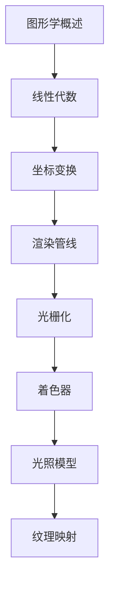

# 计算机图形学 学习指南

> **分类**：其他 ｜ **章节总数**：80 ｜ **技术栈**：计算机图形学

## 领域概述

计算机图形学是其他领域的重要技术方向，本系列从基础到高级逐步深入，涵盖16个核心模块：图形学概述、线性代数、坐标变换、渲染管线、光栅化等。每个知识点作为独立章节，包含原理讲解、实现要点、常见陷阱和最佳实践，配合源码分析和架构图，帮助读者建立完整的计算机图形学知识体系。

本教程基于 **通用** 与 **计算机图形学** 生态编写，涵盖 行业标准工具链 等主流工具与框架。每章独立成篇，文字精炼、逻辑清晰，适合系统学习与按需查阅。

## 你将学到什么

完成本系列后，你将能够：

- 系统理解 **计算机图形学** 的核心概念与模块划分。
- 按难度递进掌握从入门到实战的完整知识路径。
- 在工程实践中做出合理的技术判断与问题排查。
- 通过章节索引快速定位所需知识点。

## 前置知识

- 编程基础
- 数据结构
- 计算机基础
- 其他基础概念

## 推荐学习路径

1. **图形学概述**
2. **线性代数**
3. **坐标变换**
4. **渲染管线**
5. **光栅化**
6. **着色器**
7. **光照模型**
8. **纹理映射**

## 模块体系

本领域按以下模块组织，难度由浅入深：

- **图形学概述**
- **线性代数**
- **坐标变换**
- **渲染管线**
- **光栅化**
- **着色器**
- **光照模型**
- **纹理映射**
- **深度测试**
- **抗锯齿**
- **阴影**
- **全局光照**
- **光线追踪**
- **OpenGL**
- **Vulkan**
- **图形学最佳实践**

## 难度分布

| 难度 | 章节数 | 占比 |
|------|--------|------|
| 入门 | 15 | 18% |
| 实战 | 20 | 25% |
| 进阶 | 25 | 31% |
| 高级 | 20 | 25% |

## 章节索引

点击章节标题进入对应教程：

### 图形学概述

- [图形学概述核心概念与原理](chapters/001-图形学概述核心概念与原理.md) ｜ 入门
- [图形学概述的实现机制详解](chapters/002-图形学概述的实现机制详解.md) ｜ 入门
- [图形学概述的关键技术点](chapters/003-图形学概述的关键技术点.md) ｜ 入门
- [图形学概述的源码级分析](chapters/004-图形学概述的源码级分析.md) ｜ 入门
- [图形学概述的配置与使用](chapters/005-图形学概述的配置与使用.md) ｜ 入门

### 线性代数

- [线性代数核心概念与原理](chapters/006-线性代数核心概念与原理.md) ｜ 入门
- [线性代数的实现机制详解](chapters/007-线性代数的实现机制详解.md) ｜ 入门
- [线性代数的关键技术点](chapters/008-线性代数的关键技术点.md) ｜ 入门
- [线性代数的源码级分析](chapters/009-线性代数的源码级分析.md) ｜ 入门
- [线性代数的配置与使用](chapters/010-线性代数的配置与使用.md) ｜ 入门

### 坐标变换

- [坐标变换核心概念与原理](chapters/011-坐标变换核心概念与原理.md) ｜ 入门
- [坐标变换的实现机制详解](chapters/012-坐标变换的实现机制详解.md) ｜ 入门
- [坐标变换的关键技术点](chapters/013-坐标变换的关键技术点.md) ｜ 入门
- [坐标变换的源码级分析](chapters/014-坐标变换的源码级分析.md) ｜ 入门
- [坐标变换的配置与使用](chapters/015-坐标变换的配置与使用.md) ｜ 入门

### 渲染管线

- [渲染管线核心概念与原理](chapters/016-渲染管线核心概念与原理.md) ｜ 进阶
- [渲染管线的实现机制详解](chapters/017-渲染管线的实现机制详解.md) ｜ 进阶
- [渲染管线的关键技术点](chapters/018-渲染管线的关键技术点.md) ｜ 进阶
- [渲染管线的源码级分析](chapters/019-渲染管线的源码级分析.md) ｜ 进阶
- [渲染管线的配置与使用](chapters/020-渲染管线的配置与使用.md) ｜ 进阶

### 光栅化

- [光栅化核心概念与原理](chapters/021-光栅化核心概念与原理.md) ｜ 进阶
- [光栅化的实现机制详解](chapters/022-光栅化的实现机制详解.md) ｜ 进阶
- [光栅化的关键技术点](chapters/023-光栅化的关键技术点.md) ｜ 进阶
- [光栅化的源码级分析](chapters/024-光栅化的源码级分析.md) ｜ 进阶
- [光栅化的配置与使用](chapters/025-光栅化的配置与使用.md) ｜ 进阶

### 着色器

- [着色器核心概念与原理](chapters/026-着色器核心概念与原理.md) ｜ 进阶
- [着色器的实现机制详解](chapters/027-着色器的实现机制详解.md) ｜ 进阶
- [着色器的关键技术点](chapters/028-着色器的关键技术点.md) ｜ 进阶
- [着色器的源码级分析](chapters/029-着色器的源码级分析.md) ｜ 进阶
- [着色器的配置与使用](chapters/030-着色器的配置与使用.md) ｜ 进阶

### 光照模型

- [光照模型核心概念与原理](chapters/031-光照模型核心概念与原理.md) ｜ 进阶
- [光照模型的实现机制详解](chapters/032-光照模型的实现机制详解.md) ｜ 进阶
- [光照模型的关键技术点](chapters/033-光照模型的关键技术点.md) ｜ 进阶
- [光照模型的源码级分析](chapters/034-光照模型的源码级分析.md) ｜ 进阶
- [光照模型的配置与使用](chapters/035-光照模型的配置与使用.md) ｜ 进阶

### 纹理映射

- [纹理映射核心概念与原理](chapters/036-纹理映射核心概念与原理.md) ｜ 进阶
- [纹理映射的实现机制详解](chapters/037-纹理映射的实现机制详解.md) ｜ 进阶
- [纹理映射的关键技术点](chapters/038-纹理映射的关键技术点.md) ｜ 进阶
- [纹理映射的源码级分析](chapters/039-纹理映射的源码级分析.md) ｜ 进阶
- [纹理映射的配置与使用](chapters/040-纹理映射的配置与使用.md) ｜ 进阶

### 深度测试

- [深度测试核心概念与原理](chapters/041-深度测试核心概念与原理.md) ｜ 高级
- [深度测试的实现机制详解](chapters/042-深度测试的实现机制详解.md) ｜ 高级
- [深度测试的关键技术点](chapters/043-深度测试的关键技术点.md) ｜ 高级
- [深度测试的源码级分析](chapters/044-深度测试的源码级分析.md) ｜ 高级
- [深度测试的配置与使用](chapters/045-深度测试的配置与使用.md) ｜ 高级

### 抗锯齿

- [抗锯齿核心概念与原理](chapters/046-抗锯齿核心概念与原理.md) ｜ 高级
- [抗锯齿的实现机制详解](chapters/047-抗锯齿的实现机制详解.md) ｜ 高级
- [抗锯齿的关键技术点](chapters/048-抗锯齿的关键技术点.md) ｜ 高级
- [抗锯齿的源码级分析](chapters/049-抗锯齿的源码级分析.md) ｜ 高级
- [抗锯齿的配置与使用](chapters/050-抗锯齿的配置与使用.md) ｜ 高级

### 阴影

- [阴影核心概念与原理](chapters/051-阴影核心概念与原理.md) ｜ 高级
- [阴影的实现机制详解](chapters/052-阴影的实现机制详解.md) ｜ 高级
- [阴影的关键技术点](chapters/053-阴影的关键技术点.md) ｜ 高级
- [阴影的源码级分析](chapters/054-阴影的源码级分析.md) ｜ 高级
- [阴影的配置与使用](chapters/055-阴影的配置与使用.md) ｜ 高级

### 全局光照

- [全局光照核心概念与原理](chapters/056-全局光照核心概念与原理.md) ｜ 高级
- [全局光照的实现机制详解](chapters/057-全局光照的实现机制详解.md) ｜ 高级
- [全局光照的关键技术点](chapters/058-全局光照的关键技术点.md) ｜ 高级
- [全局光照的源码级分析](chapters/059-全局光照的源码级分析.md) ｜ 高级
- [全局光照的配置与使用](chapters/060-全局光照的配置与使用.md) ｜ 高级

### 光线追踪

- [光线追踪核心概念与原理](chapters/061-光线追踪核心概念与原理.md) ｜ 实战
- [光线追踪的实现机制详解](chapters/062-光线追踪的实现机制详解.md) ｜ 实战
- [光线追踪的关键技术点](chapters/063-光线追踪的关键技术点.md) ｜ 实战
- [光线追踪的源码级分析](chapters/064-光线追踪的源码级分析.md) ｜ 实战
- [光线追踪的配置与使用](chapters/065-光线追踪的配置与使用.md) ｜ 实战

### OpenGL

- [OpenGL核心概念与原理](chapters/066-OpenGL核心概念与原理.md) ｜ 实战
- [OpenGL的实现机制详解](chapters/067-OpenGL的实现机制详解.md) ｜ 实战
- [OpenGL的关键技术点](chapters/068-OpenGL的关键技术点.md) ｜ 实战
- [OpenGL的源码级分析](chapters/069-OpenGL的源码级分析.md) ｜ 实战
- [OpenGL的配置与使用](chapters/070-OpenGL的配置与使用.md) ｜ 实战

### Vulkan

- [Vulkan核心概念与原理](chapters/071-Vulkan核心概念与原理.md) ｜ 实战
- [Vulkan的实现机制详解](chapters/072-Vulkan的实现机制详解.md) ｜ 实战
- [Vulkan的关键技术点](chapters/073-Vulkan的关键技术点.md) ｜ 实战
- [Vulkan的源码级分析](chapters/074-Vulkan的源码级分析.md) ｜ 实战
- [Vulkan的配置与使用](chapters/075-Vulkan的配置与使用.md) ｜ 实战

### 图形学最佳实践

- [图形学最佳实践核心概念与原理](chapters/076-图形学最佳实践核心概念与原理.md) ｜ 实战
- [图形学最佳实践的实现机制详解](chapters/077-图形学最佳实践的实现机制详解.md) ｜ 实战
- [图形学最佳实践的关键技术点](chapters/078-图形学最佳实践的关键技术点.md) ｜ 实战
- [图形学最佳实践的源码级分析](chapters/079-图形学最佳实践的源码级分析.md) ｜ 实战
- [图形学最佳实践的配置与使用](chapters/080-图形学最佳实践的配置与使用.md) ｜ 实战

## 学习方法建议

1. **先读概述再读章节**：用本指南建立全局地图，避免迷失在细节中。
2. **按模块递进**：同一模块内章节有前后关联，顺序阅读效果更好。
3. **主动复述**：每章读完后，用三五句话概括「是什么、为什么、怎么用」。
4. **关联阅读**：利用章节底部的「延伸学习」在同模块内构建知识网络。
5. **对照官方文档**：本教程提供结构化视角，细节以官方文档为准。

---
*领域: 计算机图形学 ｜ 版本: 2.0 ｜ 共 80 章*