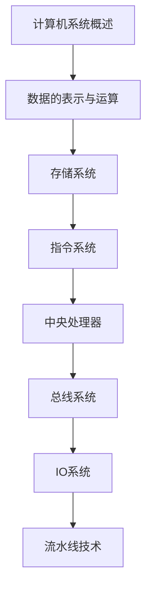

# 计算机组成原理 学习指南

> **分类**：系统底层 ｜ **技术生态**：RISC-V/MIPS 模拟器, Intel SDM, ARM Architecture Reference Manual

## 领域定位

计算机组成原理从硬件视角讲解数据表示、存储层次、指令集、CPU 微架构、总线与 I/O。理解取指-译码-执行周期与 Cache 局部性是性能优化与底层编程的基石。

面向所有需要理解「程序如何在硅片上运行」的开发者，衔接汇编、OS 与体系结构。

本领域常用技术栈与工具包括：RISC-V/MIPS 模拟器, Intel SDM, ARM Architecture Reference Manual。

## 学习目标

- 完成定点/浮点运算与补码溢出分析
- 解释 Cache 命中、替换策略与写回/写穿差异
- 阅读 MIPS/ARM 汇编并跟踪流水线冒险
- 分析总线带宽、DMA 与多核一致性协议基础

## 前置知识

- 数字逻辑基础
- C 语言
- 二进制运算
- 基本电路概念

## 学习路径

1. **计算机系统概述**
2. **数据的表示与运算**
3. **存储系统**
4. **指令系统**
5. **中央处理器**
6. **总线系统**
7. **IO系统**
8. **流水线技术**

## 模块体系

- **计算机系统概述**
- **数据的表示与运算**
- **存储系统**
- **指令系统**
- **中央处理器**
- **总线系统**
- **IO系统**
- **流水线技术**
- **多处理器**
- **性能评估**

## 难度分布

| 入门 | 20 | 20% |
| 实战 | 20 | 20% |
| 进阶 | 30 | 30% |
| 高级 | 30 | 30% |

## 章节索引

### 计算机系统概述

- [计算机系统概述核心概念与原理](chapters/001-计算机系统概述核心概念与原理.md) ｜ 入门
- [计算机系统概述的实现机制详解](chapters/002-计算机系统概述的实现机制详解.md) ｜ 入门
- [计算机系统概述的关键技术点](chapters/003-计算机系统概述的关键技术点.md) ｜ 入门
- [计算机系统概述的源码级分析](chapters/004-计算机系统概述的源码级分析.md) ｜ 入门
- [计算机系统概述的配置与使用](chapters/005-计算机系统概述的配置与使用.md) ｜ 入门
- [计算机系统概述的常见问题与解决方案](chapters/006-计算机系统概述的常见问题与解决方案.md) ｜ 入门
- [计算机系统概述的性能优化技巧](chapters/007-计算机系统概述的性能优化技巧.md) ｜ 入门
- [计算机系统概述的最佳实践指南](chapters/008-计算机系统概述的最佳实践指南.md) ｜ 入门
- [计算机系统概述的高级应用场景](chapters/009-计算机系统概述的高级应用场景.md) ｜ 入门
- [计算机系统概述的实战案例分析](chapters/010-计算机系统概述的实战案例分析.md) ｜ 入门

### 数据的表示与运算

- [数据的表示与运算核心概念与原理](chapters/011-数据的表示与运算核心概念与原理.md) ｜ 入门
- [数据的表示与运算的实现机制详解](chapters/012-数据的表示与运算的实现机制详解.md) ｜ 入门
- [数据的表示与运算的关键技术点](chapters/013-数据的表示与运算的关键技术点.md) ｜ 入门
- [数据的表示与运算的源码级分析](chapters/014-数据的表示与运算的源码级分析.md) ｜ 入门
- [数据的表示与运算的配置与使用](chapters/015-数据的表示与运算的配置与使用.md) ｜ 入门
- [数据的表示与运算的常见问题与解决方案](chapters/016-数据的表示与运算的常见问题与解决方案.md) ｜ 入门
- [数据的表示与运算的性能优化技巧](chapters/017-数据的表示与运算的性能优化技巧.md) ｜ 入门
- [数据的表示与运算的最佳实践指南](chapters/018-数据的表示与运算的最佳实践指南.md) ｜ 入门
- [数据的表示与运算的高级应用场景](chapters/019-数据的表示与运算的高级应用场景.md) ｜ 入门
- [数据的表示与运算的实战案例分析](chapters/020-数据的表示与运算的实战案例分析.md) ｜ 入门

### 存储系统

- [存储系统核心概念与原理](chapters/021-存储系统核心概念与原理.md) ｜ 进阶
- [存储系统的实现机制详解](chapters/022-存储系统的实现机制详解.md) ｜ 进阶
- [存储系统的关键技术点](chapters/023-存储系统的关键技术点.md) ｜ 进阶
- [存储系统的源码级分析](chapters/024-存储系统的源码级分析.md) ｜ 进阶
- [存储系统的配置与使用](chapters/025-存储系统的配置与使用.md) ｜ 进阶
- [存储系统的常见问题与解决方案](chapters/026-存储系统的常见问题与解决方案.md) ｜ 进阶
- [存储系统的性能优化技巧](chapters/027-存储系统的性能优化技巧.md) ｜ 进阶
- [存储系统的最佳实践指南](chapters/028-存储系统的最佳实践指南.md) ｜ 进阶
- [存储系统的高级应用场景](chapters/029-存储系统的高级应用场景.md) ｜ 进阶
- [存储系统的实战案例分析](chapters/030-存储系统的实战案例分析.md) ｜ 进阶

### 指令系统

- [指令系统核心概念与原理](chapters/031-指令系统核心概念与原理.md) ｜ 进阶
- [指令系统的实现机制详解](chapters/032-指令系统的实现机制详解.md) ｜ 进阶
- [指令系统的关键技术点](chapters/033-指令系统的关键技术点.md) ｜ 进阶
- [指令系统的源码级分析](chapters/034-指令系统的源码级分析.md) ｜ 进阶
- [指令系统的配置与使用](chapters/035-指令系统的配置与使用.md) ｜ 进阶
- [指令系统的常见问题与解决方案](chapters/036-指令系统的常见问题与解决方案.md) ｜ 进阶
- [指令系统的性能优化技巧](chapters/037-指令系统的性能优化技巧.md) ｜ 进阶
- [指令系统的最佳实践指南](chapters/038-指令系统的最佳实践指南.md) ｜ 进阶
- [指令系统的高级应用场景](chapters/039-指令系统的高级应用场景.md) ｜ 进阶
- [指令系统的实战案例分析](chapters/040-指令系统的实战案例分析.md) ｜ 进阶

### 中央处理器

- [中央处理器核心概念与原理](chapters/041-中央处理器核心概念与原理.md) ｜ 进阶
- [中央处理器的实现机制详解](chapters/042-中央处理器的实现机制详解.md) ｜ 进阶
- [中央处理器的关键技术点](chapters/043-中央处理器的关键技术点.md) ｜ 进阶
- [中央处理器的源码级分析](chapters/044-中央处理器的源码级分析.md) ｜ 进阶
- [中央处理器的配置与使用](chapters/045-中央处理器的配置与使用.md) ｜ 进阶
- [中央处理器的常见问题与解决方案](chapters/046-中央处理器的常见问题与解决方案.md) ｜ 进阶
- [中央处理器的性能优化技巧](chapters/047-中央处理器的性能优化技巧.md) ｜ 进阶
- [中央处理器的最佳实践指南](chapters/048-中央处理器的最佳实践指南.md) ｜ 进阶
- [中央处理器的高级应用场景](chapters/049-中央处理器的高级应用场景.md) ｜ 进阶
- [中央处理器的实战案例分析](chapters/050-中央处理器的实战案例分析.md) ｜ 进阶

### 总线系统

- [总线系统核心概念与原理](chapters/051-总线系统核心概念与原理.md) ｜ 高级
- [总线系统的实现机制详解](chapters/052-总线系统的实现机制详解.md) ｜ 高级
- [总线系统的关键技术点](chapters/053-总线系统的关键技术点.md) ｜ 高级
- [总线系统的源码级分析](chapters/054-总线系统的源码级分析.md) ｜ 高级
- [总线系统的配置与使用](chapters/055-总线系统的配置与使用.md) ｜ 高级
- [总线系统的常见问题与解决方案](chapters/056-总线系统的常见问题与解决方案.md) ｜ 高级
- [总线系统的性能优化技巧](chapters/057-总线系统的性能优化技巧.md) ｜ 高级
- [总线系统的最佳实践指南](chapters/058-总线系统的最佳实践指南.md) ｜ 高级
- [总线系统的高级应用场景](chapters/059-总线系统的高级应用场景.md) ｜ 高级
- [总线系统的实战案例分析](chapters/060-总线系统的实战案例分析.md) ｜ 高级

### IO系统

- [IO系统核心概念与原理](chapters/061-IO系统核心概念与原理.md) ｜ 高级
- [IO系统的实现机制详解](chapters/062-IO系统的实现机制详解.md) ｜ 高级
- [IO系统的关键技术点](chapters/063-IO系统的关键技术点.md) ｜ 高级
- [IO系统的源码级分析](chapters/064-IO系统的源码级分析.md) ｜ 高级
- [IO系统的配置与使用](chapters/065-IO系统的配置与使用.md) ｜ 高级
- [IO系统的常见问题与解决方案](chapters/066-IO系统的常见问题与解决方案.md) ｜ 高级
- [IO系统的性能优化技巧](chapters/067-IO系统的性能优化技巧.md) ｜ 高级
- [IO系统的最佳实践指南](chapters/068-IO系统的最佳实践指南.md) ｜ 高级
- [IO系统的高级应用场景](chapters/069-IO系统的高级应用场景.md) ｜ 高级
- [IO系统的实战案例分析](chapters/070-IO系统的实战案例分析.md) ｜ 高级

### 流水线技术

- [流水线技术核心概念与原理](chapters/071-流水线技术核心概念与原理.md) ｜ 高级
- [流水线技术的实现机制详解](chapters/072-流水线技术的实现机制详解.md) ｜ 高级
- [流水线技术的关键技术点](chapters/073-流水线技术的关键技术点.md) ｜ 高级
- [流水线技术的源码级分析](chapters/074-流水线技术的源码级分析.md) ｜ 高级
- [流水线技术的配置与使用](chapters/075-流水线技术的配置与使用.md) ｜ 高级
- [流水线技术的常见问题与解决方案](chapters/076-流水线技术的常见问题与解决方案.md) ｜ 高级
- [流水线技术的性能优化技巧](chapters/077-流水线技术的性能优化技巧.md) ｜ 高级
- [流水线技术的最佳实践指南](chapters/078-流水线技术的最佳实践指南.md) ｜ 高级
- [流水线技术的高级应用场景](chapters/079-流水线技术的高级应用场景.md) ｜ 高级
- [流水线技术的实战案例分析](chapters/080-流水线技术的实战案例分析.md) ｜ 高级

### 多处理器

- [多处理器核心概念与原理](chapters/081-多处理器核心概念与原理.md) ｜ 实战
- [多处理器的实现机制详解](chapters/082-多处理器的实现机制详解.md) ｜ 实战
- [多处理器的关键技术点](chapters/083-多处理器的关键技术点.md) ｜ 实战
- [多处理器的源码级分析](chapters/084-多处理器的源码级分析.md) ｜ 实战
- [多处理器的配置与使用](chapters/085-多处理器的配置与使用.md) ｜ 实战
- [多处理器的常见问题与解决方案](chapters/086-多处理器的常见问题与解决方案.md) ｜ 实战
- [多处理器的性能优化技巧](chapters/087-多处理器的性能优化技巧.md) ｜ 实战
- [多处理器的最佳实践指南](chapters/088-多处理器的最佳实践指南.md) ｜ 实战
- [多处理器的高级应用场景](chapters/089-多处理器的高级应用场景.md) ｜ 实战
- [多处理器的实战案例分析](chapters/090-多处理器的实战案例分析.md) ｜ 实战

### 性能评估

- [性能评估核心概念与原理](chapters/091-性能评估核心概念与原理.md) ｜ 实战
- [性能评估的实现机制详解](chapters/092-性能评估的实现机制详解.md) ｜ 实战
- [性能评估的关键技术点](chapters/093-性能评估的关键技术点.md) ｜ 实战
- [性能评估的源码级分析](chapters/094-性能评估的源码级分析.md) ｜ 实战
- [性能评估的配置与使用](chapters/095-性能评估的配置与使用.md) ｜ 实战
- [性能评估的常见问题与解决方案](chapters/096-性能评估的常见问题与解决方案.md) ｜ 实战
- [性能评估的性能优化技巧](chapters/097-性能评估的性能优化技巧.md) ｜ 实战
- [性能评估的最佳实践指南](chapters/098-性能评估的最佳实践指南.md) ｜ 实战
- [性能评估的高级应用场景](chapters/099-性能评估的高级应用场景.md) ｜ 实战
- [性能评估的实战案例分析](chapters/100-性能评估的实战案例分析.md) ｜ 实战

---
*领域: 计算机组成原理*