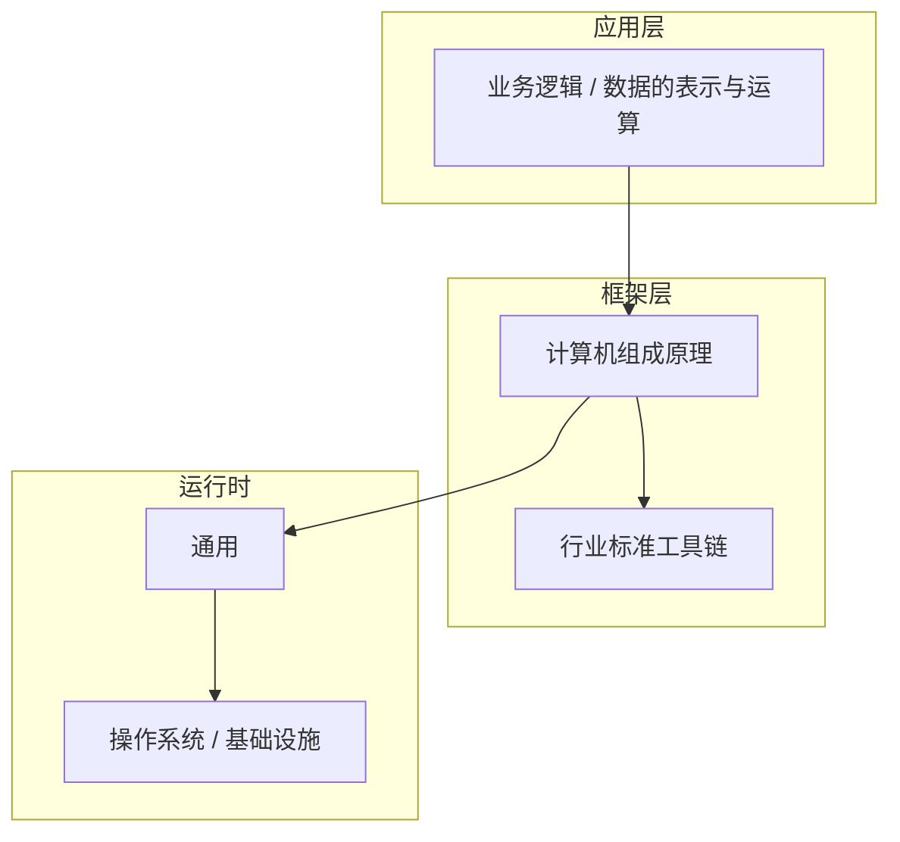

# 数据的表示与运算的最佳实践指南

> **领域**：计算机组成原理 ｜ **模块**：数据的表示与运算 ｜ **难度**：入门 ｜ **类型**：最佳实践

## 导读

本章属于 **计算机组成原理** 教程的 **数据的表示与运算** 模块，难度为 **入门**。阅读重点在于建立清晰的概念模型与工程判断能力，而非死记细节。

## 核心概念

计算机组成原理 是当前技术生态中的重要方向，系统学习需兼顾概念、原理与工程实践。

在 **计算机组成原理** 体系中，**数据的表示与运算** 与上下游模块形成协作。技术栈以 **计算机组成原理** 为核心（通用），生态包括 行业标准工具链。

「数据的表示与运算」是该领域的核心知识模块，理解其原理与边界是工程实践的基础。

### 概念精讲

**数据的表示与运算的基本概念与定义**

从流程出发：一次完整调用或生命周期经历哪些阶段。 在 数据的表示与运算 语境下，这一点直接影响设计决策与故障排查思路。

**数据的表示与运算在计算机组成原理中的作用与地位**

从数据出发：输入输出是什么格式，状态如何变迁。 在 数据的表示与运算 语境下，这一点直接影响设计决策与故障排查思路。

**数据的表示与运算的核心数据结构**

从关系出发：它与上下游模块的依赖与接口契约。 在 数据的表示与运算 语境下，这一点直接影响设计决策与故障排查思路。

**数据的表示与运算的关键算法与流程**

从实践出发：典型应用场景与反模式（不该用的场景）。 在 数据的表示与运算 语境下，这一点直接影响设计决策与故障排查思路。

**数据的表示与运算与其他模块的关系**

从演进出发：历史上为何出现、未来可能如何变化。 在 数据的表示与运算 语境下，这一点直接影响设计决策与故障排查思路。

## 架构与流程

以下框图帮助你在宏观层面把握模块协作关系与处理流向：

## 深度讲解

### 编码规范

遵循 计算机组成原理 风格指南；数据的表示与运算 逻辑集中存放；公开接口文档化，契约变更版本化。

### 测试策略

- 单元测试：核心逻辑与边界（空值、超限、并发）。
- 集成测试：数据的表示与运算 与依赖的真实协作。
- 回归测试：每次发布前自动运行。

### 可观测性

结构化日志、关键指标、告警阈值与 Runbook。日志带追踪 ID，便于跨服务串联。

### 团队协作

复杂模块设 Owner；重大变更经设计评审；小步迭代。

### 落地检查清单

- **掌握数据的表示与运算的调优技巧与最佳实践**：落地时需明确验收标准与回滚方案。
- **了解数据的表示与运算在实际项目中的应用案例**：落地时需明确验收标准与回滚方案。
- **理解数据的表示与运算的设计思想与适用场景**：落地时需明确验收标准与回滚方案。
- **掌握数据的表示与运算的核心API与配置项**：落地时需明确验收标准与回滚方案。

### 常见误区与应对

**误区：对数据的表示与运算的概念理解不深入导致误用**

**应对**：回到官方定义画一张概念图，与同事讲解一遍，确保能用自己的话复述。

**误区：忽略数据的表示与运算的性能边界与限制条件**

**应对**：用 Profiler 或压测建立基线，对比优化前后数据，避免凭感觉优化。

**误区：数据的表示与运算配置不当引发的问题**

**应对**：核对环境变量、配置文件与部署清单是否一致，使用配置 diff 工具排查。

**误区：缺乏对数据的表示与运算底层原理的理解**

**应对**：阅读官方文档与一篇深度文章，结合小实验验证理解。

**误区：数据的表示与运算与其他模块集成时的兼容性问题**

**应对**：列出依赖版本矩阵，在 CI 中跑集成测试覆盖主要组合。

### 最佳实践

1. **遵循数据的表示与运算的官方推荐用法与规范** — 落地方式：写入团队 Wiki 并纳入 Code Review 检查项。

2. **在理解原理的基础上合理使用数据的表示与运算** — 落地方式：配置静态检查或 CI 规则自动拦截违规写法。

3. **建立完善的数据的表示与运算监控与告警机制** — 落地方式：在新人 onboarding 中作为必修内容讲解。

4. **编写充分的测试用例覆盖数据的表示与运算的各种场景** — 落地方式：每季度回顾一次，对照社区最佳实践更新。

5. **持续关注数据的表示与运算的版本更新与最佳实践演进** — 落地方式：用真实项目案例演示正确与错误对比。

### 本章小结

学完本章，你应能：

- 说清 **数据的表示与运算的最佳实践指南** 在 计算机组成原理/数据的表示与运算 中的定位。
- 描述核心流程与关键概念，能用自己的话复述。
- 识别常见误区并采取预防与排查手段。
- 在项目中做出与场景匹配的工程决策。

类型：**最佳实践**。建议完成小练习或复盘笔记，将阅读转化为能力。

## 延伸学习

建议结合以下同模块章节继续阅读，构建完整知识链：

- 数据的表示与运算的常见问题与解决方案
- 数据的表示与运算的性能优化技巧
- 数据的表示与运算的高级应用场景
- 数据的表示与运算的实战案例分析

### 参考资料

- 计算机组成原理官方文档 - 数据的表示与运算章节
- 《计算机组成原理权威指南》相关章节
- 数据的表示与运算源码实现与注释
- 计算机组成原理社区最佳实践文章
- 数据的表示与运算相关技术博客与教程

---
*章节 ID: 018 ｜ 领域: 计算机组成原理 ｜ 版本: 2.0*