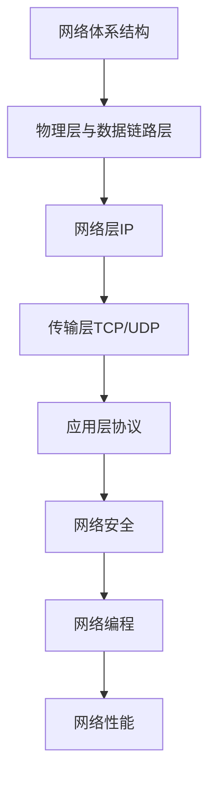

# 计算机网络 学习指南

> **分类**：系统底层 ｜ **章节总数**：120 ｜ **技术栈**：计算机网络

## 领域概述

计算机网络是系统底层领域的重要技术方向，本系列从基础到高级逐步深入，涵盖10个核心模块：网络体系结构、物理层与数据链路层、网络层IP、传输层TCP/UDP、应用层协议等。每个知识点作为独立章节，包含原理讲解、实现要点、常见陷阱和最佳实践，配合源码分析和架构图，帮助读者建立完整的计算机网络知识体系。

本教程基于 **通用** 与 **计算机网络** 生态编写，涵盖 行业标准工具链 等主流工具与框架。每章独立成篇，文字精炼、逻辑清晰，适合系统学习与按需查阅。

## 你将学到什么

完成本系列后，你将能够：

- 系统理解 **计算机网络** 的核心概念与模块划分。
- 按难度递进掌握从入门到实战的完整知识路径。
- 在工程实践中做出合理的技术判断与问题排查。
- 通过章节索引快速定位所需知识点。

## 前置知识

- 编程基础
- 数据结构
- 计算机基础
- 系统底层基础概念

## 推荐学习路径

1. **网络体系结构**
2. **物理层与数据链路层**
3. **网络层IP**
4. **传输层TCP/UDP**
5. **应用层协议**
6. **网络安全**
7. **网络编程**
8. **网络性能**

## 模块体系

本领域按以下模块组织，难度由浅入深：

- **网络体系结构**
- **物理层与数据链路层**
- **网络层IP**
- **传输层TCP/UDP**
- **应用层协议**
- **网络安全**
- **网络编程**
- **网络性能**
- **无线网络**
- **网络管理**

## 难度分布

| 难度 | 章节数 | 占比 |
|------|--------|------|
| 入门 | 24 | 20% |
| 实战 | 24 | 20% |
| 进阶 | 36 | 30% |
| 高级 | 36 | 30% |

## 章节索引

点击章节标题进入对应教程：

### 网络体系结构

- [网络体系结构核心概念与原理](chapters/001-网络体系结构核心概念与原理.md) ｜ 入门
- [网络体系结构的实现机制详解](chapters/002-网络体系结构的实现机制详解.md) ｜ 入门
- [网络体系结构的关键技术点](chapters/003-网络体系结构的关键技术点.md) ｜ 入门
- [网络体系结构的源码级分析](chapters/004-网络体系结构的源码级分析.md) ｜ 入门
- [网络体系结构的配置与使用](chapters/005-网络体系结构的配置与使用.md) ｜ 入门
- [网络体系结构的常见问题与解决方案](chapters/006-网络体系结构的常见问题与解决方案.md) ｜ 入门
- [网络体系结构的性能优化技巧](chapters/007-网络体系结构的性能优化技巧.md) ｜ 入门
- [网络体系结构的最佳实践指南](chapters/008-网络体系结构的最佳实践指南.md) ｜ 入门
- [网络体系结构的高级应用场景](chapters/009-网络体系结构的高级应用场景.md) ｜ 入门
- [网络体系结构的实战案例分析](chapters/010-网络体系结构的实战案例分析.md) ｜ 入门
- [网络体系结构的设计思想与演进](chapters/011-网络体系结构的设计思想与演进.md) ｜ 入门
- [网络体系结构的底层原理剖析](chapters/012-网络体系结构的底层原理剖析.md) ｜ 入门

### 物理层与数据链路层

- [物理层与数据链路层核心概念与原理](chapters/013-物理层与数据链路层核心概念与原理.md) ｜ 入门
- [物理层与数据链路层的实现机制详解](chapters/014-物理层与数据链路层的实现机制详解.md) ｜ 入门
- [物理层与数据链路层的关键技术点](chapters/015-物理层与数据链路层的关键技术点.md) ｜ 入门
- [物理层与数据链路层的源码级分析](chapters/016-物理层与数据链路层的源码级分析.md) ｜ 入门
- [物理层与数据链路层的配置与使用](chapters/017-物理层与数据链路层的配置与使用.md) ｜ 入门
- [物理层与数据链路层的常见问题与解决方案](chapters/018-物理层与数据链路层的常见问题与解决方案.md) ｜ 入门
- [物理层与数据链路层的性能优化技巧](chapters/019-物理层与数据链路层的性能优化技巧.md) ｜ 入门
- [物理层与数据链路层的最佳实践指南](chapters/020-物理层与数据链路层的最佳实践指南.md) ｜ 入门
- [物理层与数据链路层的高级应用场景](chapters/021-物理层与数据链路层的高级应用场景.md) ｜ 入门
- [物理层与数据链路层的实战案例分析](chapters/022-物理层与数据链路层的实战案例分析.md) ｜ 入门
- [物理层与数据链路层的设计思想与演进](chapters/023-物理层与数据链路层的设计思想与演进.md) ｜ 入门
- [物理层与数据链路层的底层原理剖析](chapters/024-物理层与数据链路层的底层原理剖析.md) ｜ 入门

### 网络层IP

- [网络层IP核心概念与原理](chapters/025-网络层IP核心概念与原理.md) ｜ 进阶
- [网络层IP的实现机制详解](chapters/026-网络层IP的实现机制详解.md) ｜ 进阶
- [网络层IP的关键技术点](chapters/027-网络层IP的关键技术点.md) ｜ 进阶
- [网络层IP的源码级分析](chapters/028-网络层IP的源码级分析.md) ｜ 进阶
- [网络层IP的配置与使用](chapters/029-网络层IP的配置与使用.md) ｜ 进阶
- [网络层IP的常见问题与解决方案](chapters/030-网络层IP的常见问题与解决方案.md) ｜ 进阶
- [网络层IP的性能优化技巧](chapters/031-网络层IP的性能优化技巧.md) ｜ 进阶
- [网络层IP的最佳实践指南](chapters/032-网络层IP的最佳实践指南.md) ｜ 进阶
- [网络层IP的高级应用场景](chapters/033-网络层IP的高级应用场景.md) ｜ 进阶
- [网络层IP的实战案例分析](chapters/034-网络层IP的实战案例分析.md) ｜ 进阶
- [网络层IP的设计思想与演进](chapters/035-网络层IP的设计思想与演进.md) ｜ 进阶
- [网络层IP的底层原理剖析](chapters/036-网络层IP的底层原理剖析.md) ｜ 进阶

### 传输层TCP/UDP

- [传输层TCP/UDP核心概念与原理](chapters/037-传输层TCPUDP核心概念与原理.md) ｜ 进阶
- [传输层TCP/UDP的实现机制详解](chapters/038-传输层TCPUDP的实现机制详解.md) ｜ 进阶
- [传输层TCP/UDP的关键技术点](chapters/039-传输层TCPUDP的关键技术点.md) ｜ 进阶
- [传输层TCP/UDP的源码级分析](chapters/040-传输层TCPUDP的源码级分析.md) ｜ 进阶
- [传输层TCP/UDP的配置与使用](chapters/041-传输层TCPUDP的配置与使用.md) ｜ 进阶
- [传输层TCP/UDP的常见问题与解决方案](chapters/042-传输层TCPUDP的常见问题与解决方案.md) ｜ 进阶
- [传输层TCP/UDP的性能优化技巧](chapters/043-传输层TCPUDP的性能优化技巧.md) ｜ 进阶
- [传输层TCP/UDP的最佳实践指南](chapters/044-传输层TCPUDP的最佳实践指南.md) ｜ 进阶
- [传输层TCP/UDP的高级应用场景](chapters/045-传输层TCPUDP的高级应用场景.md) ｜ 进阶
- [传输层TCP/UDP的实战案例分析](chapters/046-传输层TCPUDP的实战案例分析.md) ｜ 进阶
- [传输层TCP/UDP的设计思想与演进](chapters/047-传输层TCPUDP的设计思想与演进.md) ｜ 进阶
- [传输层TCP/UDP的底层原理剖析](chapters/048-传输层TCPUDP的底层原理剖析.md) ｜ 进阶

### 应用层协议

- [应用层协议核心概念与原理](chapters/049-应用层协议核心概念与原理.md) ｜ 进阶
- [应用层协议的实现机制详解](chapters/050-应用层协议的实现机制详解.md) ｜ 进阶
- [应用层协议的关键技术点](chapters/051-应用层协议的关键技术点.md) ｜ 进阶
- [应用层协议的源码级分析](chapters/052-应用层协议的源码级分析.md) ｜ 进阶
- [应用层协议的配置与使用](chapters/053-应用层协议的配置与使用.md) ｜ 进阶
- [应用层协议的常见问题与解决方案](chapters/054-应用层协议的常见问题与解决方案.md) ｜ 进阶
- [应用层协议的性能优化技巧](chapters/055-应用层协议的性能优化技巧.md) ｜ 进阶
- [应用层协议的最佳实践指南](chapters/056-应用层协议的最佳实践指南.md) ｜ 进阶
- [应用层协议的高级应用场景](chapters/057-应用层协议的高级应用场景.md) ｜ 进阶
- [应用层协议的实战案例分析](chapters/058-应用层协议的实战案例分析.md) ｜ 进阶
- [应用层协议的设计思想与演进](chapters/059-应用层协议的设计思想与演进.md) ｜ 进阶
- [应用层协议的底层原理剖析](chapters/060-应用层协议的底层原理剖析.md) ｜ 进阶

### 网络安全

- [网络安全核心概念与原理](chapters/061-网络安全核心概念与原理.md) ｜ 高级
- [网络安全的实现机制详解](chapters/062-网络安全的实现机制详解.md) ｜ 高级
- [网络安全的关键技术点](chapters/063-网络安全的关键技术点.md) ｜ 高级
- [网络安全的源码级分析](chapters/064-网络安全的源码级分析.md) ｜ 高级
- [网络安全的配置与使用](chapters/065-网络安全的配置与使用.md) ｜ 高级
- [网络安全的常见问题与解决方案](chapters/066-网络安全的常见问题与解决方案.md) ｜ 高级
- [网络安全的性能优化技巧](chapters/067-网络安全的性能优化技巧.md) ｜ 高级
- [网络安全的最佳实践指南](chapters/068-网络安全的最佳实践指南.md) ｜ 高级
- [网络安全的高级应用场景](chapters/069-网络安全的高级应用场景.md) ｜ 高级
- [网络安全的实战案例分析](chapters/070-网络安全的实战案例分析.md) ｜ 高级
- [网络安全的设计思想与演进](chapters/071-网络安全的设计思想与演进.md) ｜ 高级
- [网络安全的底层原理剖析](chapters/072-网络安全的底层原理剖析.md) ｜ 高级

### 网络编程

- [网络编程核心概念与原理](chapters/073-网络编程核心概念与原理.md) ｜ 高级
- [网络编程的实现机制详解](chapters/074-网络编程的实现机制详解.md) ｜ 高级
- [网络编程的关键技术点](chapters/075-网络编程的关键技术点.md) ｜ 高级
- [网络编程的源码级分析](chapters/076-网络编程的源码级分析.md) ｜ 高级
- [网络编程的配置与使用](chapters/077-网络编程的配置与使用.md) ｜ 高级
- [网络编程的常见问题与解决方案](chapters/078-网络编程的常见问题与解决方案.md) ｜ 高级
- [网络编程的性能优化技巧](chapters/079-网络编程的性能优化技巧.md) ｜ 高级
- [网络编程的最佳实践指南](chapters/080-网络编程的最佳实践指南.md) ｜ 高级
- [网络编程的高级应用场景](chapters/081-网络编程的高级应用场景.md) ｜ 高级
- [网络编程的实战案例分析](chapters/082-网络编程的实战案例分析.md) ｜ 高级
- [网络编程的设计思想与演进](chapters/083-网络编程的设计思想与演进.md) ｜ 高级
- [网络编程的底层原理剖析](chapters/084-网络编程的底层原理剖析.md) ｜ 高级

### 网络性能

- [网络性能核心概念与原理](chapters/085-网络性能核心概念与原理.md) ｜ 高级
- [网络性能的实现机制详解](chapters/086-网络性能的实现机制详解.md) ｜ 高级
- [网络性能的关键技术点](chapters/087-网络性能的关键技术点.md) ｜ 高级
- [网络性能的源码级分析](chapters/088-网络性能的源码级分析.md) ｜ 高级
- [网络性能的配置与使用](chapters/089-网络性能的配置与使用.md) ｜ 高级
- [网络性能的常见问题与解决方案](chapters/090-网络性能的常见问题与解决方案.md) ｜ 高级
- [网络性能的性能优化技巧](chapters/091-网络性能的性能优化技巧.md) ｜ 高级
- [网络性能的最佳实践指南](chapters/092-网络性能的最佳实践指南.md) ｜ 高级
- [网络性能的高级应用场景](chapters/093-网络性能的高级应用场景.md) ｜ 高级
- [网络性能的实战案例分析](chapters/094-网络性能的实战案例分析.md) ｜ 高级
- [网络性能的设计思想与演进](chapters/095-网络性能的设计思想与演进.md) ｜ 高级
- [网络性能的底层原理剖析](chapters/096-网络性能的底层原理剖析.md) ｜ 高级

### 无线网络

- [无线网络核心概念与原理](chapters/097-无线网络核心概念与原理.md) ｜ 实战
- [无线网络的实现机制详解](chapters/098-无线网络的实现机制详解.md) ｜ 实战
- [无线网络的关键技术点](chapters/099-无线网络的关键技术点.md) ｜ 实战
- [无线网络的源码级分析](chapters/100-无线网络的源码级分析.md) ｜ 实战
- [无线网络的配置与使用](chapters/101-无线网络的配置与使用.md) ｜ 实战
- [无线网络的常见问题与解决方案](chapters/102-无线网络的常见问题与解决方案.md) ｜ 实战
- [无线网络的性能优化技巧](chapters/103-无线网络的性能优化技巧.md) ｜ 实战
- [无线网络的最佳实践指南](chapters/104-无线网络的最佳实践指南.md) ｜ 实战
- [无线网络的高级应用场景](chapters/105-无线网络的高级应用场景.md) ｜ 实战
- [无线网络的实战案例分析](chapters/106-无线网络的实战案例分析.md) ｜ 实战
- [无线网络的设计思想与演进](chapters/107-无线网络的设计思想与演进.md) ｜ 实战
- [无线网络的底层原理剖析](chapters/108-无线网络的底层原理剖析.md) ｜ 实战

### 网络管理

- [网络管理核心概念与原理](chapters/109-网络管理核心概念与原理.md) ｜ 实战
- [网络管理的实现机制详解](chapters/110-网络管理的实现机制详解.md) ｜ 实战
- [网络管理的关键技术点](chapters/111-网络管理的关键技术点.md) ｜ 实战
- [网络管理的源码级分析](chapters/112-网络管理的源码级分析.md) ｜ 实战
- [网络管理的配置与使用](chapters/113-网络管理的配置与使用.md) ｜ 实战
- [网络管理的常见问题与解决方案](chapters/114-网络管理的常见问题与解决方案.md) ｜ 实战
- [网络管理的性能优化技巧](chapters/115-网络管理的性能优化技巧.md) ｜ 实战
- [网络管理的最佳实践指南](chapters/116-网络管理的最佳实践指南.md) ｜ 实战
- [网络管理的高级应用场景](chapters/117-网络管理的高级应用场景.md) ｜ 实战
- [网络管理的实战案例分析](chapters/118-网络管理的实战案例分析.md) ｜ 实战
- [网络管理的设计思想与演进](chapters/119-网络管理的设计思想与演进.md) ｜ 实战
- [网络管理的底层原理剖析](chapters/120-网络管理的底层原理剖析.md) ｜ 实战

## 学习方法建议

1. **先读概述再读章节**：用本指南建立全局地图，避免迷失在细节中。
2. **按模块递进**：同一模块内章节有前后关联，顺序阅读效果更好。
3. **主动复述**：每章读完后，用三五句话概括「是什么、为什么、怎么用」。
4. **关联阅读**：利用章节底部的「延伸学习」在同模块内构建知识网络。
5. **对照官方文档**：本教程提供结构化视角，细节以官方文档为准。

---
*领域: 计算机网络 ｜ 版本: 2.0 ｜ 共 120 章*