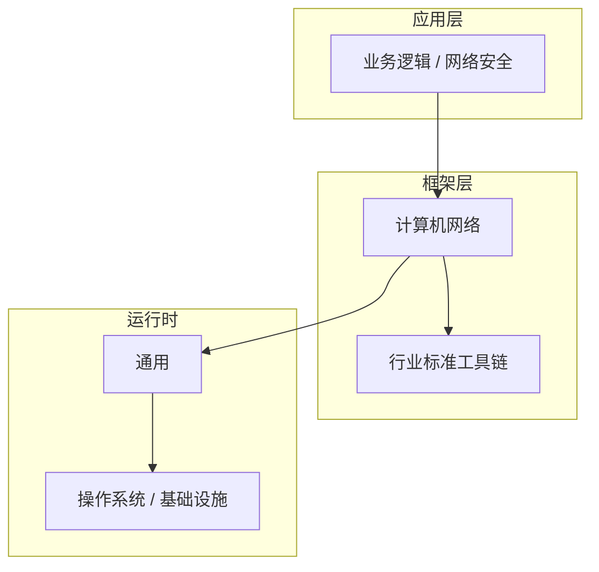

# 网络安全核心概念与原理

> **领域**：计算机网络 ｜ **模块**：网络安全 ｜ **难度**：高级 ｜ **类型**：基础概念

## 导读

本章属于 **计算机网络** 教程的 **网络安全** 模块，难度为 **高级**。阅读重点在于建立清晰的概念模型与工程判断能力，而非死记细节。

## 核心概念

计算机网络分层模型（物理、链路、网络、传输、应用）是理解 TCP/IP、HTTP、DNS 与安全协议的理论基础。

在 **计算机网络** 体系中，**网络安全** 与上下游模块形成协作。技术栈以 **计算机网络** 为核心（通用），生态包括 行业标准工具链。

「网络安全」是该领域的核心知识模块，理解其原理与边界是工程实践的基础。

### 概念精讲

**网络安全的基本概念与定义**

从实践出发：典型应用场景与反模式（不该用的场景）。 在 网络安全 语境下，这一点直接影响设计决策与故障排查思路。

**网络安全在计算机网络中的作用与地位**

从演进出发：历史上为何出现、未来可能如何变化。 在 网络安全 语境下，这一点直接影响设计决策与故障排查思路。

**网络安全的核心数据结构**

从度量出发：如何评估它是否工作正常、性能是否达标。 在 网络安全 语境下，这一点直接影响设计决策与故障排查思路。

**网络安全的关键算法与流程**

从定义出发：它解决什么问题、不解决什么问题，边界在哪里。 在 网络安全 语境下，这一点直接影响设计决策与故障排查思路。

**网络安全与其他模块的关系**

从结构出发：核心组成部分是什么，彼此如何协作。 在 网络安全 语境下，这一点直接影响设计决策与故障排查思路。

## 架构与流程

以下框图帮助你在宏观层面把握模块协作关系与处理流向：

## 深度讲解

### 为什么需要 网络安全

工程实践中，网络安全 解决的是「在 计算机网络 约束下，如何可靠、可维护地完成特定职责」的问题。初学者常只记 API 而不理解动机——场景变化时便无法判断该不该用、怎么用。

### 核心原理

网络安全 的设计遵循：**职责单一**、**接口稳定**、**可观测**。在 **高级** 阶段，重点是把这三条映射到具体概念与操作上。

### 与周边模块的关系

向上为业务层提供能力；向下依赖运行时与基础设施。横向通过清晰的数据流或事件流衔接，避免循环依赖。

### 落地检查清单

- **理解网络安全的设计思想与适用场景**：落地时需明确验收标准与回滚方案。
- **掌握网络安全的核心API与配置项**：落地时需明确验收标准与回滚方案。
- **分析网络安全的源码实现与调用流程**：落地时需明确验收标准与回滚方案。
- **了解网络安全的性能特点与瓶颈**：落地时需明确验收标准与回滚方案。

### 常见误区与应对

**误区：对网络安全的概念理解不深入导致误用**

**应对**：回到官方定义画一张概念图，与同事讲解一遍，确保能用自己的话复述。

**误区：忽略网络安全的性能边界与限制条件**

**应对**：用 Profiler 或压测建立基线，对比优化前后数据，避免凭感觉优化。

**误区：网络安全配置不当引发的问题**

**应对**：核对环境变量、配置文件与部署清单是否一致，使用配置 diff 工具排查。

**误区：缺乏对网络安全底层原理的理解**

**应对**：做威胁建模与权限审计，最小权限原则，敏感操作留审计日志。

**误区：网络安全与其他模块集成时的兼容性问题**

**应对**：列出依赖版本矩阵，在 CI 中跑集成测试覆盖主要组合。

### 最佳实践

1. **遵循网络安全的官方推荐用法与规范** — 落地方式：写入团队 Wiki 并纳入 Code Review 检查项。

2. **在理解原理的基础上合理使用网络安全** — 落地方式：配置静态检查或 CI 规则自动拦截违规写法。

3. **建立完善的网络安全监控与告警机制** — 落地方式：在新人 onboarding 中作为必修内容讲解。

4. **编写充分的测试用例覆盖网络安全的各种场景** — 落地方式：每季度回顾一次，对照社区最佳实践更新。

5. **持续关注网络安全的版本更新与最佳实践演进** — 落地方式：用真实项目案例演示正确与错误对比。

### 本章小结

学完本章，你应能：

- 说清 **网络安全核心概念与原理** 在 计算机网络/网络安全 中的定位。
- 描述核心流程与关键概念，能用自己的话复述。
- 识别常见误区并采取预防与排查手段。
- 在项目中做出与场景匹配的工程决策。

类型：**基础概念**。建议完成小练习或复盘笔记，将阅读转化为能力。

## 延伸学习

建议结合以下同模块章节继续阅读，构建完整知识链：

- 网络安全的实现机制详解
- 网络安全的关键技术点

### 参考资料

- 计算机网络官方文档 - 网络安全章节
- 《计算机网络权威指南》相关章节
- 网络安全源码实现与注释
- 计算机网络社区最佳实践文章
- 网络安全相关技术博客与教程

---
*章节 ID: 061 ｜ 领域: 计算机网络 ｜ 版本: 2.0*