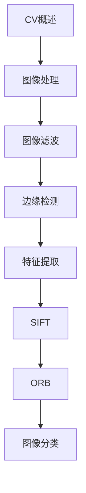

# 计算机视觉 学习指南

> **分类**：AI与算法 ｜ **技术生态**：OpenCV, PyTorch, torchvision, YOLO, MMDetection

## 领域定位

计算机视觉让机器从图像与视频中提取语义信息。从传统特征（SIFT/ORB）到深度学习（YOLO、Faster R-CNN、分割网络），CV 在安防、医疗、自动驾驶等领域广泛应用。

面向 CV 工程师，从图像处理基础到目标检测与分割实战。

本领域常用技术栈与工具包括：OpenCV, PyTorch, torchvision, YOLO, MMDetection。

## 学习目标

- 使用 OpenCV 进行图像预处理与特征提取
- 训练图像分类与目标检测模型
- 理解 YOLO、Faster R-CNN 等检测架构
- 完成 OCR、人脸识别等应用部署

## 前置知识

- Python
- 线性代数
- 深度学习基础
- NumPy/OpenCV

## 学习路径

1. **CV概述**
2. **图像处理**
3. **图像滤波**
4. **边缘检测**
5. **特征提取**
6. **SIFT**
7. **ORB**
8. **图像分类**

## 模块体系

- **CV概述**
- **图像处理**
- **图像滤波**
- **边缘检测**
- **特征提取**
- **SIFT**
- **ORB**
- **图像分类**
- **目标检测**
- **YOLO**
- **Faster R-CNN**
- **图像分割**
- **语义分割**
- **实例分割**
- **人脸识别**
- **OCR**
- **视频分析**
- **数据增强**
- **CV最佳实践**

## 难度分布

| 入门 | 24 | 24% |
| 实战 | 20 | 20% |
| 进阶 | 26 | 26% |
| 高级 | 30 | 30% |

## 章节索引

### CV概述

- [CV概述核心概念与原理](chapters/001-CV概述核心概念与原理.md) ｜ 入门
- [CV概述的实现机制详解](chapters/002-CV概述的实现机制详解.md) ｜ 入门
- [CV概述的关键技术点](chapters/003-CV概述的关键技术点.md) ｜ 入门
- [CV概述的源码级分析](chapters/004-CV概述的源码级分析.md) ｜ 入门
- [CV概述的配置与使用](chapters/005-CV概述的配置与使用.md) ｜ 入门
- [CV概述的常见问题与解决方案](chapters/006-CV概述的常见问题与解决方案.md) ｜ 入门

### 图像处理

- [图像处理核心概念与原理](chapters/007-图像处理核心概念与原理.md) ｜ 入门
- [图像处理的实现机制详解](chapters/008-图像处理的实现机制详解.md) ｜ 入门
- [图像处理的关键技术点](chapters/009-图像处理的关键技术点.md) ｜ 入门
- [图像处理的源码级分析](chapters/010-图像处理的源码级分析.md) ｜ 入门
- [图像处理的配置与使用](chapters/011-图像处理的配置与使用.md) ｜ 入门
- [图像处理的常见问题与解决方案](chapters/012-图像处理的常见问题与解决方案.md) ｜ 入门

### 图像滤波

- [图像滤波核心概念与原理](chapters/013-图像滤波核心概念与原理.md) ｜ 入门
- [图像滤波的实现机制详解](chapters/014-图像滤波的实现机制详解.md) ｜ 入门
- [图像滤波的关键技术点](chapters/015-图像滤波的关键技术点.md) ｜ 入门
- [图像滤波的源码级分析](chapters/016-图像滤波的源码级分析.md) ｜ 入门
- [图像滤波的配置与使用](chapters/017-图像滤波的配置与使用.md) ｜ 入门
- [图像滤波的常见问题与解决方案](chapters/018-图像滤波的常见问题与解决方案.md) ｜ 入门

### 边缘检测

- [边缘检测核心概念与原理](chapters/019-边缘检测核心概念与原理.md) ｜ 入门
- [边缘检测的实现机制详解](chapters/020-边缘检测的实现机制详解.md) ｜ 入门
- [边缘检测的关键技术点](chapters/021-边缘检测的关键技术点.md) ｜ 入门
- [边缘检测的源码级分析](chapters/022-边缘检测的源码级分析.md) ｜ 入门
- [边缘检测的配置与使用](chapters/023-边缘检测的配置与使用.md) ｜ 入门
- [边缘检测的常见问题与解决方案](chapters/024-边缘检测的常见问题与解决方案.md) ｜ 入门

### 特征提取

- [特征提取核心概念与原理](chapters/025-特征提取核心概念与原理.md) ｜ 进阶
- [特征提取的实现机制详解](chapters/026-特征提取的实现机制详解.md) ｜ 进阶
- [特征提取的关键技术点](chapters/027-特征提取的关键技术点.md) ｜ 进阶
- [特征提取的源码级分析](chapters/028-特征提取的源码级分析.md) ｜ 进阶
- [特征提取的配置与使用](chapters/029-特征提取的配置与使用.md) ｜ 进阶
- [特征提取的常见问题与解决方案](chapters/030-特征提取的常见问题与解决方案.md) ｜ 进阶

### SIFT

- [SIFT核心概念与原理](chapters/031-SIFT核心概念与原理.md) ｜ 进阶
- [SIFT的实现机制详解](chapters/032-SIFT的实现机制详解.md) ｜ 进阶
- [SIFT的关键技术点](chapters/033-SIFT的关键技术点.md) ｜ 进阶
- [SIFT的源码级分析](chapters/034-SIFT的源码级分析.md) ｜ 进阶
- [SIFT的配置与使用](chapters/035-SIFT的配置与使用.md) ｜ 进阶

### ORB

- [ORB核心概念与原理](chapters/036-ORB核心概念与原理.md) ｜ 进阶
- [ORB的实现机制详解](chapters/037-ORB的实现机制详解.md) ｜ 进阶
- [ORB的关键技术点](chapters/038-ORB的关键技术点.md) ｜ 进阶
- [ORB的源码级分析](chapters/039-ORB的源码级分析.md) ｜ 进阶
- [ORB的配置与使用](chapters/040-ORB的配置与使用.md) ｜ 进阶

### 图像分类

- [图像分类核心概念与原理](chapters/041-图像分类核心概念与原理.md) ｜ 进阶
- [图像分类的实现机制详解](chapters/042-图像分类的实现机制详解.md) ｜ 进阶
- [图像分类的关键技术点](chapters/043-图像分类的关键技术点.md) ｜ 进阶
- [图像分类的源码级分析](chapters/044-图像分类的源码级分析.md) ｜ 进阶
- [图像分类的配置与使用](chapters/045-图像分类的配置与使用.md) ｜ 进阶

### 目标检测

- [目标检测核心概念与原理](chapters/046-目标检测核心概念与原理.md) ｜ 进阶
- [目标检测的实现机制详解](chapters/047-目标检测的实现机制详解.md) ｜ 进阶
- [目标检测的关键技术点](chapters/048-目标检测的关键技术点.md) ｜ 进阶
- [目标检测的源码级分析](chapters/049-目标检测的源码级分析.md) ｜ 进阶
- [目标检测的配置与使用](chapters/050-目标检测的配置与使用.md) ｜ 进阶

### YOLO

- [YOLO核心概念与原理](chapters/051-YOLO核心概念与原理.md) ｜ 高级
- [YOLO的实现机制详解](chapters/052-YOLO的实现机制详解.md) ｜ 高级
- [YOLO的关键技术点](chapters/053-YOLO的关键技术点.md) ｜ 高级
- [YOLO的源码级分析](chapters/054-YOLO的源码级分析.md) ｜ 高级
- [YOLO的配置与使用](chapters/055-YOLO的配置与使用.md) ｜ 高级

### Faster R-CNN

- [Faster R-CNN核心概念与原理](chapters/056-Faster-R-CNN核心概念与原理.md) ｜ 高级
- [Faster R-CNN的实现机制详解](chapters/057-Faster-R-CNN的实现机制详解.md) ｜ 高级
- [Faster R-CNN的关键技术点](chapters/058-Faster-R-CNN的关键技术点.md) ｜ 高级
- [Faster R-CNN的源码级分析](chapters/059-Faster-R-CNN的源码级分析.md) ｜ 高级
- [Faster R-CNN的配置与使用](chapters/060-Faster-R-CNN的配置与使用.md) ｜ 高级

### 图像分割

- [图像分割核心概念与原理](chapters/061-图像分割核心概念与原理.md) ｜ 高级
- [图像分割的实现机制详解](chapters/062-图像分割的实现机制详解.md) ｜ 高级
- [图像分割的关键技术点](chapters/063-图像分割的关键技术点.md) ｜ 高级
- [图像分割的源码级分析](chapters/064-图像分割的源码级分析.md) ｜ 高级
- [图像分割的配置与使用](chapters/065-图像分割的配置与使用.md) ｜ 高级

### 语义分割

- [语义分割核心概念与原理](chapters/066-语义分割核心概念与原理.md) ｜ 高级
- [语义分割的实现机制详解](chapters/067-语义分割的实现机制详解.md) ｜ 高级
- [语义分割的关键技术点](chapters/068-语义分割的关键技术点.md) ｜ 高级
- [语义分割的源码级分析](chapters/069-语义分割的源码级分析.md) ｜ 高级
- [语义分割的配置与使用](chapters/070-语义分割的配置与使用.md) ｜ 高级

### 实例分割

- [实例分割核心概念与原理](chapters/071-实例分割核心概念与原理.md) ｜ 高级
- [实例分割的实现机制详解](chapters/072-实例分割的实现机制详解.md) ｜ 高级
- [实例分割的关键技术点](chapters/073-实例分割的关键技术点.md) ｜ 高级
- [实例分割的源码级分析](chapters/074-实例分割的源码级分析.md) ｜ 高级
- [实例分割的配置与使用](chapters/075-实例分割的配置与使用.md) ｜ 高级

### 人脸识别

- [人脸识别核心概念与原理](chapters/076-人脸识别核心概念与原理.md) ｜ 高级
- [人脸识别的实现机制详解](chapters/077-人脸识别的实现机制详解.md) ｜ 高级
- [人脸识别的关键技术点](chapters/078-人脸识别的关键技术点.md) ｜ 高级
- [人脸识别的源码级分析](chapters/079-人脸识别的源码级分析.md) ｜ 高级
- [人脸识别的配置与使用](chapters/080-人脸识别的配置与使用.md) ｜ 高级

### OCR

- [OCR核心概念与原理](chapters/081-OCR核心概念与原理.md) ｜ 实战
- [OCR的实现机制详解](chapters/082-OCR的实现机制详解.md) ｜ 实战
- [OCR的关键技术点](chapters/083-OCR的关键技术点.md) ｜ 实战
- [OCR的源码级分析](chapters/084-OCR的源码级分析.md) ｜ 实战
- [OCR的配置与使用](chapters/085-OCR的配置与使用.md) ｜ 实战

### 视频分析

- [视频分析核心概念与原理](chapters/086-视频分析核心概念与原理.md) ｜ 实战
- [视频分析的实现机制详解](chapters/087-视频分析的实现机制详解.md) ｜ 实战
- [视频分析的关键技术点](chapters/088-视频分析的关键技术点.md) ｜ 实战
- [视频分析的源码级分析](chapters/089-视频分析的源码级分析.md) ｜ 实战
- [视频分析的配置与使用](chapters/090-视频分析的配置与使用.md) ｜ 实战

### 数据增强

- [数据增强核心概念与原理](chapters/091-数据增强核心概念与原理.md) ｜ 实战
- [数据增强的实现机制详解](chapters/092-数据增强的实现机制详解.md) ｜ 实战
- [数据增强的关键技术点](chapters/093-数据增强的关键技术点.md) ｜ 实战
- [数据增强的源码级分析](chapters/094-数据增强的源码级分析.md) ｜ 实战
- [数据增强的配置与使用](chapters/095-数据增强的配置与使用.md) ｜ 实战

### CV最佳实践

- [CV最佳实践核心概念与原理](chapters/096-CV最佳实践核心概念与原理.md) ｜ 实战
- [CV最佳实践的实现机制详解](chapters/097-CV最佳实践的实现机制详解.md) ｜ 实战
- [CV最佳实践的关键技术点](chapters/098-CV最佳实践的关键技术点.md) ｜ 实战
- [CV最佳实践的源码级分析](chapters/099-CV最佳实践的源码级分析.md) ｜ 实战
- [CV最佳实践的配置与使用](chapters/100-CV最佳实践的配置与使用.md) ｜ 实战

---
*领域: 计算机视觉*