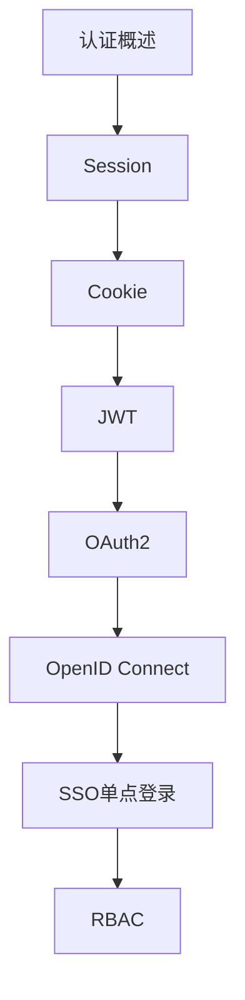

# 认证授权 学习指南

> **分类**：后端开发 ｜ **技术生态**：Spring Security、Keycloak、Auth0、OAuth2、OpenID Connect

## 领域定位

认证（Authentication）验证身份，授权（Authorization）判定权限。Web 与 API 场景下 Session、JWT、OAuth2/OIDC 与 RBAC/ABAC 构成现代安全体系。

覆盖凭证存储、Token 生命周期、SSO、MFA 与 API 权限模型，强调威胁建模与合规。

本领域常用技术栈与工具包括：Spring Security、Keycloak、Auth0、OAuth2、OpenID Connect。

## 学习目标

- 能设计 Session 与 JWT 混合方案
- 能集成 OAuth2 授权码流程
- 能建模 RBAC 与数据权限
- 能应对 OWASP 认证相关风险

## 前置知识

- HTTP Cookie/Header
- 密码学哈希基础
- HTTPS

## 学习路径

1. **认证概述**
2. **Session**
3. **Cookie**
4. **JWT**
5. **OAuth2**
6. **OpenID Connect**
7. **SSO单点登录**
8. **RBAC**

## 模块体系

- **认证概述**
- **Session**
- **Cookie**
- **JWT**
- **OAuth2**
- **OpenID Connect**
- **SSO单点登录**
- **RBAC**
- **ABAC**
- **多因素认证**
- **密码安全**
- **Token管理**
- **API安全**
- **权限设计**
- **认证授权最佳实践**

## 难度分布

| 入门 | 18 | 22% |
| 实战 | 15 | 18% |
| 进阶 | 22 | 27% |
| 高级 | 25 | 31% |

## 章节索引

### 认证概述

- [认证概述核心概念与原理](chapters/001-认证概述核心概念与原理.md) ｜ 入门
- [认证概述的实现机制详解](chapters/002-认证概述的实现机制详解.md) ｜ 入门
- [认证概述的关键技术点](chapters/003-认证概述的关键技术点.md) ｜ 入门
- [认证概述的源码级分析](chapters/004-认证概述的源码级分析.md) ｜ 入门
- [认证概述的配置与使用](chapters/005-认证概述的配置与使用.md) ｜ 入门
- [认证概述的常见问题与解决方案](chapters/006-认证概述的常见问题与解决方案.md) ｜ 入门

### Session

- [Session核心概念与原理](chapters/007-Session核心概念与原理.md) ｜ 入门
- [Session的实现机制详解](chapters/008-Session的实现机制详解.md) ｜ 入门
- [Session的关键技术点](chapters/009-Session的关键技术点.md) ｜ 入门
- [Session的源码级分析](chapters/010-Session的源码级分析.md) ｜ 入门
- [Session的配置与使用](chapters/011-Session的配置与使用.md) ｜ 入门
- [Session的常见问题与解决方案](chapters/012-Session的常见问题与解决方案.md) ｜ 入门

### Cookie

- [Cookie核心概念与原理](chapters/013-Cookie核心概念与原理.md) ｜ 入门
- [Cookie的实现机制详解](chapters/014-Cookie的实现机制详解.md) ｜ 入门
- [Cookie的关键技术点](chapters/015-Cookie的关键技术点.md) ｜ 入门
- [Cookie的源码级分析](chapters/016-Cookie的源码级分析.md) ｜ 入门
- [Cookie的配置与使用](chapters/017-Cookie的配置与使用.md) ｜ 入门
- [Cookie的常见问题与解决方案](chapters/018-Cookie的常见问题与解决方案.md) ｜ 入门

### JWT

- [JWT核心概念与原理](chapters/019-JWT核心概念与原理.md) ｜ 进阶
- [JWT的实现机制详解](chapters/020-JWT的实现机制详解.md) ｜ 进阶
- [JWT的关键技术点](chapters/021-JWT的关键技术点.md) ｜ 进阶
- [JWT的源码级分析](chapters/022-JWT的源码级分析.md) ｜ 进阶
- [JWT的配置与使用](chapters/023-JWT的配置与使用.md) ｜ 进阶
- [JWT的常见问题与解决方案](chapters/024-JWT的常见问题与解决方案.md) ｜ 进阶

### OAuth2

- [OAuth2核心概念与原理](chapters/025-OAuth2核心概念与原理.md) ｜ 进阶
- [OAuth2的实现机制详解](chapters/026-OAuth2的实现机制详解.md) ｜ 进阶
- [OAuth2的关键技术点](chapters/027-OAuth2的关键技术点.md) ｜ 进阶
- [OAuth2的源码级分析](chapters/028-OAuth2的源码级分析.md) ｜ 进阶
- [OAuth2的配置与使用](chapters/029-OAuth2的配置与使用.md) ｜ 进阶
- [OAuth2的常见问题与解决方案](chapters/030-OAuth2的常见问题与解决方案.md) ｜ 进阶

### OpenID Connect

- [OpenID Connect核心概念与原理](chapters/031-OpenID-Connect核心概念与原理.md) ｜ 进阶
- [OpenID Connect的实现机制详解](chapters/032-OpenID-Connect的实现机制详解.md) ｜ 进阶
- [OpenID Connect的关键技术点](chapters/033-OpenID-Connect的关键技术点.md) ｜ 进阶
- [OpenID Connect的源码级分析](chapters/034-OpenID-Connect的源码级分析.md) ｜ 进阶
- [OpenID Connect的配置与使用](chapters/035-OpenID-Connect的配置与使用.md) ｜ 进阶

### SSO单点登录

- [SSO单点登录核心概念与原理](chapters/036-SSO单点登录核心概念与原理.md) ｜ 进阶
- [SSO单点登录的实现机制详解](chapters/037-SSO单点登录的实现机制详解.md) ｜ 进阶
- [SSO单点登录的关键技术点](chapters/038-SSO单点登录的关键技术点.md) ｜ 进阶
- [SSO单点登录的源码级分析](chapters/039-SSO单点登录的源码级分析.md) ｜ 进阶
- [SSO单点登录的配置与使用](chapters/040-SSO单点登录的配置与使用.md) ｜ 进阶

### RBAC

- [RBAC核心概念与原理](chapters/041-RBAC核心概念与原理.md) ｜ 高级
- [RBAC的实现机制详解](chapters/042-RBAC的实现机制详解.md) ｜ 高级
- [RBAC的关键技术点](chapters/043-RBAC的关键技术点.md) ｜ 高级
- [RBAC的源码级分析](chapters/044-RBAC的源码级分析.md) ｜ 高级
- [RBAC的配置与使用](chapters/045-RBAC的配置与使用.md) ｜ 高级

### ABAC

- [ABAC核心概念与原理](chapters/046-ABAC核心概念与原理.md) ｜ 高级
- [ABAC的实现机制详解](chapters/047-ABAC的实现机制详解.md) ｜ 高级
- [ABAC的关键技术点](chapters/048-ABAC的关键技术点.md) ｜ 高级
- [ABAC的源码级分析](chapters/049-ABAC的源码级分析.md) ｜ 高级
- [ABAC的配置与使用](chapters/050-ABAC的配置与使用.md) ｜ 高级

### 多因素认证

- [多因素认证核心概念与原理](chapters/051-多因素认证核心概念与原理.md) ｜ 高级
- [多因素认证的实现机制详解](chapters/052-多因素认证的实现机制详解.md) ｜ 高级
- [多因素认证的关键技术点](chapters/053-多因素认证的关键技术点.md) ｜ 高级
- [多因素认证的源码级分析](chapters/054-多因素认证的源码级分析.md) ｜ 高级
- [多因素认证的配置与使用](chapters/055-多因素认证的配置与使用.md) ｜ 高级

### 密码安全

- [密码安全核心概念与原理](chapters/056-密码安全核心概念与原理.md) ｜ 高级
- [密码安全的实现机制详解](chapters/057-密码安全的实现机制详解.md) ｜ 高级
- [密码安全的关键技术点](chapters/058-密码安全的关键技术点.md) ｜ 高级
- [密码安全的源码级分析](chapters/059-密码安全的源码级分析.md) ｜ 高级
- [密码安全的配置与使用](chapters/060-密码安全的配置与使用.md) ｜ 高级

### Token管理

- [Token管理核心概念与原理](chapters/061-Token管理核心概念与原理.md) ｜ 高级
- [Token管理的实现机制详解](chapters/062-Token管理的实现机制详解.md) ｜ 高级
- [Token管理的关键技术点](chapters/063-Token管理的关键技术点.md) ｜ 高级
- [Token管理的源码级分析](chapters/064-Token管理的源码级分析.md) ｜ 高级
- [Token管理的配置与使用](chapters/065-Token管理的配置与使用.md) ｜ 高级

### API安全

- [API安全核心概念与原理](chapters/066-API安全核心概念与原理.md) ｜ 实战
- [API安全的实现机制详解](chapters/067-API安全的实现机制详解.md) ｜ 实战
- [API安全的关键技术点](chapters/068-API安全的关键技术点.md) ｜ 实战
- [API安全的源码级分析](chapters/069-API安全的源码级分析.md) ｜ 实战
- [API安全的配置与使用](chapters/070-API安全的配置与使用.md) ｜ 实战

### 权限设计

- [权限设计核心概念与原理](chapters/071-权限设计核心概念与原理.md) ｜ 实战
- [权限设计的实现机制详解](chapters/072-权限设计的实现机制详解.md) ｜ 实战
- [权限设计的关键技术点](chapters/073-权限设计的关键技术点.md) ｜ 实战
- [权限设计的源码级分析](chapters/074-权限设计的源码级分析.md) ｜ 实战
- [权限设计的配置与使用](chapters/075-权限设计的配置与使用.md) ｜ 实战

### 认证授权最佳实践

- [认证授权最佳实践核心概念与原理](chapters/076-认证授权最佳实践核心概念与原理.md) ｜ 实战
- [认证授权最佳实践的实现机制详解](chapters/077-认证授权最佳实践的实现机制详解.md) ｜ 实战
- [认证授权最佳实践的关键技术点](chapters/078-认证授权最佳实践的关键技术点.md) ｜ 实战
- [认证授权最佳实践的源码级分析](chapters/079-认证授权最佳实践的源码级分析.md) ｜ 实战
- [认证授权最佳实践的配置与使用](chapters/080-认证授权最佳实践的配置与使用.md) ｜ 实战

---
*领域: 认证授权*