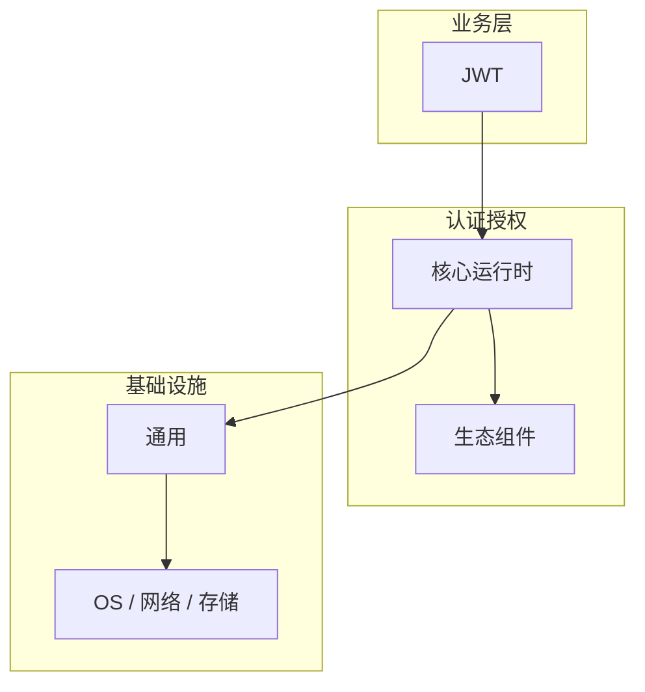

# JWT的关键技术点

> **领域**：认证授权 ｜ **模块**：JWT ｜ **难度**：进阶 ｜ **类型**：关键技术

## 导读

本章系统讲解 **认证授权** 中 **JWT** 的相关知识（关键技术）。本章归纳 **JWT** 在生产环境中最常用、最易出错的关键技术点。内容基于主流框架与工程实践撰写，不依赖过时概念堆砌。

## 核心知识

JWT（RFC 7519）由 Header.Payload.Signature 组成，Base64URL 编码。Signature = HMAC-SHA256(Header.Payload, secret) 或 RSA/ECDSA 私钥签名；服务端用密钥验签，无需服务端会话存储即可无状态认证。

### 核心知识

**1. 声明 Claims**

registered claims：iss、sub、exp、iat；自定义 claim 放 role、tenant 等，避免放敏感 PII。

**2. Access 与 Refresh Token**

Access 短过期（15min），Refresh 长过期存 HttpOnly Cookie 或安全存储，轮换防重放。

**3. 算法选择**

HS256 对称密钥需所有服务共享；RS256 公钥验签适合微服务；禁用 none 算法。

## 架构与流程

## 技术详解

### 关键技术

登录成功签发 JWT → 客户端 Authorization: Bearer → 网关/服务验签 exp 与 scope → 授权。

## 原理与实现

### 工作机制

登录成功签发 JWT → 客户端 Authorization: Bearer → 网关/服务验签 exp 与 scope → 授权。

## 性能、安全与排查

### 安全注意

密钥轮换；短 exp；HTTPS 传输；logout 需 token 黑名单或 session 版本号。

## 本章聚焦

**JWT** 的关键技术往往集中在默认配置与边界行为；生产问题多源于「以为懂了」的细节，应用 checklist 逐项验证。

### 常见误区与纠正

**Payload 不可信**

JWT 仅 Base64 非加密，敏感数据勿明文放入 Payload。

### 最佳实践

1. 使用成熟库（jjwt、PyJWT）
2. 校验 aud/iss
3. Refresh Token 单次使用

## 巩固建议

建议结合 **认证授权** 官方文档与小型实验，亲手验证 **JWT** 的默认行为与边界条件；将本章要点整理为检查清单或 ADR，便于评审与团队 onboarding。

### 本章小结

学完本章，你应能独立说明 **JWT** 在 认证授权 中的角色，理解其核心机制，规避常见误区，并在项目中正确运用。

## 延伸学习

- JWT核心概念与原理
- JWT的实现机制详解
- JWT的源码级分析
- JWT的配置与使用
- JWT的常见问题与解决方案

### 延伸阅读

- RFC 7519
- OWASP JWT Cheat Sheet

---
*章节 ID: 021 ｜ 领域: 认证授权*