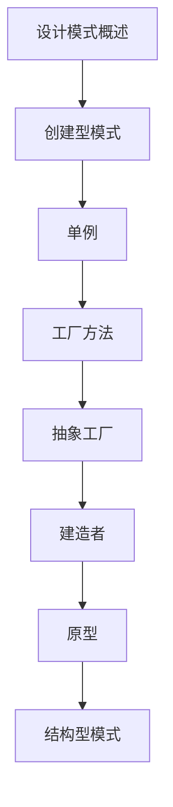

# 设计模式 学习指南

> **分类**：后端开发 ｜ **技术生态**：Spring Bean、Java Stream、Guava、Head First Design Patterns

## 领域定位

GoF 23 种设计模式分为创建型、结构型、行为型，解决特定上下文下的复用与扩展问题。现代语言特性（函数式、依赖注入）改变部分模式实现方式。

理解模式意图而非死记硬背，避免过度设计；结合 Spring、Guava 等库中的模式应用。

本领域常用技术栈与工具包括：Spring Bean、Java Stream、Guava、Head First Design Patterns。

## 学习目标

- 能说明单例、工厂、策略、观察者等意图
- 能在合适场景应用而非滥用
- 能识别框架中的模式实现
- 能评估模式与 YAGNI 的平衡

## 前置知识

- OOP
- UML 类图基础

## 学习路径

1. **设计模式概述**
2. **创建型模式**
3. **单例**
4. **工厂方法**
5. **抽象工厂**
6. **建造者**
7. **原型**
8. **结构型模式**

## 模块体系

- **设计模式概述**
- **创建型模式**
- **单例**
- **工厂方法**
- **抽象工厂**
- **建造者**
- **原型**
- **结构型模式**
- **适配器**
- **装饰器**
- **代理**
- **外观**
- **桥接**
- **组合**
- **享元**
- **行为型模式**
- **策略**
- **观察者**
- **命令**
- **迭代器**
- **模板方法**
- **状态**
- **访问者**
- **中介者**
- **备忘录**
- **解释器**
- **责任链**
- **设计模式最佳实践**

## 难度分布

| 入门 | 24 | 24% |
| 实战 | 18 | 18% |
| 进阶 | 32 | 32% |
| 高级 | 26 | 26% |

## 章节索引

### 设计模式概述

- [设计模式概述核心概念与原理](chapters/001-设计模式概述核心概念与原理.md) ｜ 入门
- [设计模式概述的实现机制详解](chapters/002-设计模式概述的实现机制详解.md) ｜ 入门
- [设计模式概述的关键技术点](chapters/003-设计模式概述的关键技术点.md) ｜ 入门
- [设计模式概述的源码级分析](chapters/004-设计模式概述的源码级分析.md) ｜ 入门

### 创建型模式

- [创建型模式核心概念与原理](chapters/005-创建型模式核心概念与原理.md) ｜ 入门
- [创建型模式的实现机制详解](chapters/006-创建型模式的实现机制详解.md) ｜ 入门
- [创建型模式的关键技术点](chapters/007-创建型模式的关键技术点.md) ｜ 入门
- [创建型模式的源码级分析](chapters/008-创建型模式的源码级分析.md) ｜ 入门

### 单例

- [单例核心概念与原理](chapters/009-单例核心概念与原理.md) ｜ 入门
- [单例的实现机制详解](chapters/010-单例的实现机制详解.md) ｜ 入门
- [单例的关键技术点](chapters/011-单例的关键技术点.md) ｜ 入门
- [单例的源码级分析](chapters/012-单例的源码级分析.md) ｜ 入门

### 工厂方法

- [工厂方法核心概念与原理](chapters/013-工厂方法核心概念与原理.md) ｜ 入门
- [工厂方法的实现机制详解](chapters/014-工厂方法的实现机制详解.md) ｜ 入门
- [工厂方法的关键技术点](chapters/015-工厂方法的关键技术点.md) ｜ 入门
- [工厂方法的源码级分析](chapters/016-工厂方法的源码级分析.md) ｜ 入门

### 抽象工厂

- [抽象工厂核心概念与原理](chapters/017-抽象工厂核心概念与原理.md) ｜ 入门
- [抽象工厂的实现机制详解](chapters/018-抽象工厂的实现机制详解.md) ｜ 入门
- [抽象工厂的关键技术点](chapters/019-抽象工厂的关键技术点.md) ｜ 入门
- [抽象工厂的源码级分析](chapters/020-抽象工厂的源码级分析.md) ｜ 入门

### 建造者

- [建造者核心概念与原理](chapters/021-建造者核心概念与原理.md) ｜ 入门
- [建造者的实现机制详解](chapters/022-建造者的实现机制详解.md) ｜ 入门
- [建造者的关键技术点](chapters/023-建造者的关键技术点.md) ｜ 入门
- [建造者的源码级分析](chapters/024-建造者的源码级分析.md) ｜ 入门

### 原型

- [原型核心概念与原理](chapters/025-原型核心概念与原理.md) ｜ 进阶
- [原型的实现机制详解](chapters/026-原型的实现机制详解.md) ｜ 进阶
- [原型的关键技术点](chapters/027-原型的关键技术点.md) ｜ 进阶
- [原型的源码级分析](chapters/028-原型的源码级分析.md) ｜ 进阶

### 结构型模式

- [结构型模式核心概念与原理](chapters/029-结构型模式核心概念与原理.md) ｜ 进阶
- [结构型模式的实现机制详解](chapters/030-结构型模式的实现机制详解.md) ｜ 进阶
- [结构型模式的关键技术点](chapters/031-结构型模式的关键技术点.md) ｜ 进阶
- [结构型模式的源码级分析](chapters/032-结构型模式的源码级分析.md) ｜ 进阶

### 适配器

- [适配器核心概念与原理](chapters/033-适配器核心概念与原理.md) ｜ 进阶
- [适配器的实现机制详解](chapters/034-适配器的实现机制详解.md) ｜ 进阶
- [适配器的关键技术点](chapters/035-适配器的关键技术点.md) ｜ 进阶
- [适配器的源码级分析](chapters/036-适配器的源码级分析.md) ｜ 进阶

### 装饰器

- [装饰器核心概念与原理](chapters/037-装饰器核心概念与原理.md) ｜ 进阶
- [装饰器的实现机制详解](chapters/038-装饰器的实现机制详解.md) ｜ 进阶
- [装饰器的关键技术点](chapters/039-装饰器的关键技术点.md) ｜ 进阶
- [装饰器的源码级分析](chapters/040-装饰器的源码级分析.md) ｜ 进阶

### 代理

- [代理核心概念与原理](chapters/041-代理核心概念与原理.md) ｜ 进阶
- [代理的实现机制详解](chapters/042-代理的实现机制详解.md) ｜ 进阶
- [代理的关键技术点](chapters/043-代理的关键技术点.md) ｜ 进阶
- [代理的源码级分析](chapters/044-代理的源码级分析.md) ｜ 进阶

### 外观

- [外观核心概念与原理](chapters/045-外观核心概念与原理.md) ｜ 进阶
- [外观的实现机制详解](chapters/046-外观的实现机制详解.md) ｜ 进阶
- [外观的关键技术点](chapters/047-外观的关键技术点.md) ｜ 进阶
- [外观的源码级分析](chapters/048-外观的源码级分析.md) ｜ 进阶

### 桥接

- [桥接核心概念与原理](chapters/049-桥接核心概念与原理.md) ｜ 进阶
- [桥接的实现机制详解](chapters/050-桥接的实现机制详解.md) ｜ 进阶
- [桥接的关键技术点](chapters/051-桥接的关键技术点.md) ｜ 进阶
- [桥接的源码级分析](chapters/052-桥接的源码级分析.md) ｜ 进阶

### 组合

- [组合核心概念与原理](chapters/053-组合核心概念与原理.md) ｜ 进阶
- [组合的实现机制详解](chapters/054-组合的实现机制详解.md) ｜ 进阶
- [组合的关键技术点](chapters/055-组合的关键技术点.md) ｜ 进阶
- [组合的源码级分析](chapters/056-组合的源码级分析.md) ｜ 进阶

### 享元

- [享元核心概念与原理](chapters/057-享元核心概念与原理.md) ｜ 高级
- [享元的实现机制详解](chapters/058-享元的实现机制详解.md) ｜ 高级
- [享元的关键技术点](chapters/059-享元的关键技术点.md) ｜ 高级
- [享元的源码级分析](chapters/060-享元的源码级分析.md) ｜ 高级

### 行为型模式

- [行为型模式核心概念与原理](chapters/061-行为型模式核心概念与原理.md) ｜ 高级
- [行为型模式的实现机制详解](chapters/062-行为型模式的实现机制详解.md) ｜ 高级
- [行为型模式的关键技术点](chapters/063-行为型模式的关键技术点.md) ｜ 高级
- [行为型模式的源码级分析](chapters/064-行为型模式的源码级分析.md) ｜ 高级

### 策略

- [策略核心概念与原理](chapters/065-策略核心概念与原理.md) ｜ 高级
- [策略的实现机制详解](chapters/066-策略的实现机制详解.md) ｜ 高级
- [策略的关键技术点](chapters/067-策略的关键技术点.md) ｜ 高级

### 观察者

- [观察者核心概念与原理](chapters/068-观察者核心概念与原理.md) ｜ 高级
- [观察者的实现机制详解](chapters/069-观察者的实现机制详解.md) ｜ 高级
- [观察者的关键技术点](chapters/070-观察者的关键技术点.md) ｜ 高级

### 命令

- [命令核心概念与原理](chapters/071-命令核心概念与原理.md) ｜ 高级
- [命令的实现机制详解](chapters/072-命令的实现机制详解.md) ｜ 高级
- [命令的关键技术点](chapters/073-命令的关键技术点.md) ｜ 高级

### 迭代器

- [迭代器核心概念与原理](chapters/074-迭代器核心概念与原理.md) ｜ 高级
- [迭代器的实现机制详解](chapters/075-迭代器的实现机制详解.md) ｜ 高级
- [迭代器的关键技术点](chapters/076-迭代器的关键技术点.md) ｜ 高级

### 模板方法

- [模板方法核心概念与原理](chapters/077-模板方法核心概念与原理.md) ｜ 高级
- [模板方法的实现机制详解](chapters/078-模板方法的实现机制详解.md) ｜ 高级
- [模板方法的关键技术点](chapters/079-模板方法的关键技术点.md) ｜ 高级

### 状态

- [状态核心概念与原理](chapters/080-状态核心概念与原理.md) ｜ 高级
- [状态的实现机制详解](chapters/081-状态的实现机制详解.md) ｜ 高级
- [状态的关键技术点](chapters/082-状态的关键技术点.md) ｜ 高级

### 访问者

- [访问者核心概念与原理](chapters/083-访问者核心概念与原理.md) ｜ 实战
- [访问者的实现机制详解](chapters/084-访问者的实现机制详解.md) ｜ 实战
- [访问者的关键技术点](chapters/085-访问者的关键技术点.md) ｜ 实战

### 中介者

- [中介者核心概念与原理](chapters/086-中介者核心概念与原理.md) ｜ 实战
- [中介者的实现机制详解](chapters/087-中介者的实现机制详解.md) ｜ 实战
- [中介者的关键技术点](chapters/088-中介者的关键技术点.md) ｜ 实战

### 备忘录

- [备忘录核心概念与原理](chapters/089-备忘录核心概念与原理.md) ｜ 实战
- [备忘录的实现机制详解](chapters/090-备忘录的实现机制详解.md) ｜ 实战
- [备忘录的关键技术点](chapters/091-备忘录的关键技术点.md) ｜ 实战

### 解释器

- [解释器核心概念与原理](chapters/092-解释器核心概念与原理.md) ｜ 实战
- [解释器的实现机制详解](chapters/093-解释器的实现机制详解.md) ｜ 实战
- [解释器的关键技术点](chapters/094-解释器的关键技术点.md) ｜ 实战

### 责任链

- [责任链核心概念与原理](chapters/095-责任链核心概念与原理.md) ｜ 实战
- [责任链的实现机制详解](chapters/096-责任链的实现机制详解.md) ｜ 实战
- [责任链的关键技术点](chapters/097-责任链的关键技术点.md) ｜ 实战

### 设计模式最佳实践

- [设计模式最佳实践核心概念与原理](chapters/098-设计模式最佳实践核心概念与原理.md) ｜ 实战
- [设计模式最佳实践的实现机制详解](chapters/099-设计模式最佳实践的实现机制详解.md) ｜ 实战
- [设计模式最佳实践的关键技术点](chapters/100-设计模式最佳实践的关键技术点.md) ｜ 实战

---
*领域: 设计模式*