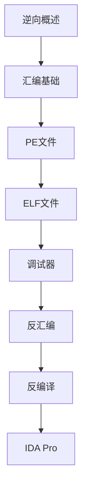

# 逆向工程 学习指南

> **分类**：安全 ｜ **技术生态**：Ghidra, IDA Pro, x64dbg, radare2, Binary Ninja, PE-bear

> **学习声明**：本章内容仅供合法授权环境下的安全研究与防御建设，请遵守法律法规与组织安全政策，禁止对未授权系统开展测试。

## 领域定位

逆向工程是通过分析二进制或固件理解程序行为的技术，合法用途包括恶意软件分析、漏洞研究与兼容性开发。本教程侧重 PE/ELF 结构、静态/动态分析与调试器使用，强调在授权样本与自有软件范围内开展研究。

面向安全研究员与恶意软件分析师，侧重分析方法论与防御洞察。

本领域常用技术栈与工具包括：Ghidra, IDA Pro, x64dbg, radare2, Binary Ninja, PE-bear。

## 学习目标

- 阅读 x86/x64 与 ARM 汇编理解控制流
- 使用 IDA Pro/Ghidra 进行静态分析
- 配置调试器进行动态行为观察
- 识别常见混淆与加壳并制定分析策略

## 前置知识

- 汇编语言
- C/C++ 基础
- 操作系统原理
- 调试基础

## 学习路径

1. **逆向概述**
2. **汇编基础**
3. **PE文件**
4. **ELF文件**
5. **调试器**
6. **反汇编**
7. **反编译**
8. **IDA Pro**

## 模块体系

- **逆向概述**
- **汇编基础**
- **PE文件**
- **ELF文件**
- **调试器**
- **反汇编**
- **反编译**
- **IDA Pro**
- **Ghidra**
- **OllyDbg**
- **脱壳**
- **加密算法识别**
- **补丁**
- **逆向分析**
- **逆向最佳实践**

## 难度分布

| 入门 | 18 | 22% |
| 实战 | 15 | 18% |
| 进阶 | 22 | 27% |
| 高级 | 25 | 31% |

## 章节索引

### 逆向概述

- [逆向概述核心概念与原理](chapters/001-逆向概述核心概念与原理.md) ｜ 入门
- [逆向概述的实现机制详解](chapters/002-逆向概述的实现机制详解.md) ｜ 入门
- [逆向概述的关键技术点](chapters/003-逆向概述的关键技术点.md) ｜ 入门
- [逆向概述的源码级分析](chapters/004-逆向概述的源码级分析.md) ｜ 入门
- [逆向概述的配置与使用](chapters/005-逆向概述的配置与使用.md) ｜ 入门
- [逆向概述的常见问题与解决方案](chapters/006-逆向概述的常见问题与解决方案.md) ｜ 入门

### 汇编基础

- [汇编基础核心概念与原理](chapters/007-汇编基础核心概念与原理.md) ｜ 入门
- [汇编基础的实现机制详解](chapters/008-汇编基础的实现机制详解.md) ｜ 入门
- [汇编基础的关键技术点](chapters/009-汇编基础的关键技术点.md) ｜ 入门
- [汇编基础的源码级分析](chapters/010-汇编基础的源码级分析.md) ｜ 入门
- [汇编基础的配置与使用](chapters/011-汇编基础的配置与使用.md) ｜ 入门
- [汇编基础的常见问题与解决方案](chapters/012-汇编基础的常见问题与解决方案.md) ｜ 入门

### PE文件

- [PE文件核心概念与原理](chapters/013-PE文件核心概念与原理.md) ｜ 入门
- [PE文件的实现机制详解](chapters/014-PE文件的实现机制详解.md) ｜ 入门
- [PE文件的关键技术点](chapters/015-PE文件的关键技术点.md) ｜ 入门
- [PE文件的源码级分析](chapters/016-PE文件的源码级分析.md) ｜ 入门
- [PE文件的配置与使用](chapters/017-PE文件的配置与使用.md) ｜ 入门
- [PE文件的常见问题与解决方案](chapters/018-PE文件的常见问题与解决方案.md) ｜ 入门

### ELF文件

- [ELF文件核心概念与原理](chapters/019-ELF文件核心概念与原理.md) ｜ 进阶
- [ELF文件的实现机制详解](chapters/020-ELF文件的实现机制详解.md) ｜ 进阶
- [ELF文件的关键技术点](chapters/021-ELF文件的关键技术点.md) ｜ 进阶
- [ELF文件的源码级分析](chapters/022-ELF文件的源码级分析.md) ｜ 进阶
- [ELF文件的配置与使用](chapters/023-ELF文件的配置与使用.md) ｜ 进阶
- [ELF文件的常见问题与解决方案](chapters/024-ELF文件的常见问题与解决方案.md) ｜ 进阶

### 调试器

- [调试器核心概念与原理](chapters/025-调试器核心概念与原理.md) ｜ 进阶
- [调试器的实现机制详解](chapters/026-调试器的实现机制详解.md) ｜ 进阶
- [调试器的关键技术点](chapters/027-调试器的关键技术点.md) ｜ 进阶
- [调试器的源码级分析](chapters/028-调试器的源码级分析.md) ｜ 进阶
- [调试器的配置与使用](chapters/029-调试器的配置与使用.md) ｜ 进阶
- [调试器的常见问题与解决方案](chapters/030-调试器的常见问题与解决方案.md) ｜ 进阶

### 反汇编

- [反汇编核心概念与原理](chapters/031-反汇编核心概念与原理.md) ｜ 进阶
- [反汇编的实现机制详解](chapters/032-反汇编的实现机制详解.md) ｜ 进阶
- [反汇编的关键技术点](chapters/033-反汇编的关键技术点.md) ｜ 进阶
- [反汇编的源码级分析](chapters/034-反汇编的源码级分析.md) ｜ 进阶
- [反汇编的配置与使用](chapters/035-反汇编的配置与使用.md) ｜ 进阶

### 反编译

- [反编译核心概念与原理](chapters/036-反编译核心概念与原理.md) ｜ 进阶
- [反编译的实现机制详解](chapters/037-反编译的实现机制详解.md) ｜ 进阶
- [反编译的关键技术点](chapters/038-反编译的关键技术点.md) ｜ 进阶
- [反编译的源码级分析](chapters/039-反编译的源码级分析.md) ｜ 进阶
- [反编译的配置与使用](chapters/040-反编译的配置与使用.md) ｜ 进阶

### IDA Pro

- [IDA Pro核心概念与原理](chapters/041-IDA-Pro核心概念与原理.md) ｜ 高级
- [IDA Pro的实现机制详解](chapters/042-IDA-Pro的实现机制详解.md) ｜ 高级
- [IDA Pro的关键技术点](chapters/043-IDA-Pro的关键技术点.md) ｜ 高级
- [IDA Pro的源码级分析](chapters/044-IDA-Pro的源码级分析.md) ｜ 高级
- [IDA Pro的配置与使用](chapters/045-IDA-Pro的配置与使用.md) ｜ 高级

### Ghidra

- [Ghidra核心概念与原理](chapters/046-Ghidra核心概念与原理.md) ｜ 高级
- [Ghidra的实现机制详解](chapters/047-Ghidra的实现机制详解.md) ｜ 高级
- [Ghidra的关键技术点](chapters/048-Ghidra的关键技术点.md) ｜ 高级
- [Ghidra的源码级分析](chapters/049-Ghidra的源码级分析.md) ｜ 高级
- [Ghidra的配置与使用](chapters/050-Ghidra的配置与使用.md) ｜ 高级

### OllyDbg

- [OllyDbg核心概念与原理](chapters/051-OllyDbg核心概念与原理.md) ｜ 高级
- [OllyDbg的实现机制详解](chapters/052-OllyDbg的实现机制详解.md) ｜ 高级
- [OllyDbg的关键技术点](chapters/053-OllyDbg的关键技术点.md) ｜ 高级
- [OllyDbg的源码级分析](chapters/054-OllyDbg的源码级分析.md) ｜ 高级
- [OllyDbg的配置与使用](chapters/055-OllyDbg的配置与使用.md) ｜ 高级

### 脱壳

- [保护层分析核心概念与原理](chapters/056-保护层分析核心概念与原理.md) ｜ 高级
- [保护层分析的实现机制详解](chapters/057-保护层分析的实现机制详解.md) ｜ 高级
- [保护层分析的关键技术点](chapters/058-保护层分析的关键技术点.md) ｜ 高级
- [保护层分析的源码级分析](chapters/059-保护层分析的源码级分析.md) ｜ 高级
- [保护层分析的配置与使用](chapters/060-保护层分析的配置与使用.md) ｜ 高级

### 加密算法识别

- [加密算法识别核心概念与原理](chapters/061-加密算法识别核心概念与原理.md) ｜ 高级
- [加密算法识别的实现机制详解](chapters/062-加密算法识别的实现机制详解.md) ｜ 高级
- [加密算法识别的关键技术点](chapters/063-加密算法识别的关键技术点.md) ｜ 高级
- [加密算法识别的源码级分析](chapters/064-加密算法识别的源码级分析.md) ｜ 高级
- [加密算法识别的配置与使用](chapters/065-加密算法识别的配置与使用.md) ｜ 高级

### 补丁

- [补丁核心概念与原理](chapters/066-补丁核心概念与原理.md) ｜ 实战
- [补丁的实现机制详解](chapters/067-补丁的实现机制详解.md) ｜ 实战
- [补丁的关键技术点](chapters/068-补丁的关键技术点.md) ｜ 实战
- [补丁的源码级分析](chapters/069-补丁的源码级分析.md) ｜ 实战
- [补丁的配置与使用](chapters/070-补丁的配置与使用.md) ｜ 实战

### 逆向分析

- [逆向分析核心概念与原理](chapters/071-逆向分析核心概念与原理.md) ｜ 实战
- [逆向分析的实现机制详解](chapters/072-逆向分析的实现机制详解.md) ｜ 实战
- [逆向分析的关键技术点](chapters/073-逆向分析的关键技术点.md) ｜ 实战
- [逆向分析的源码级分析](chapters/074-逆向分析的源码级分析.md) ｜ 实战
- [逆向分析的配置与使用](chapters/075-逆向分析的配置与使用.md) ｜ 实战

### 逆向最佳实践

- [逆向最佳实践核心概念与原理](chapters/076-逆向最佳实践核心概念与原理.md) ｜ 实战
- [逆向最佳实践的实现机制详解](chapters/077-逆向最佳实践的实现机制详解.md) ｜ 实战
- [逆向最佳实践的关键技术点](chapters/078-逆向最佳实践的关键技术点.md) ｜ 实战
- [逆向最佳实践的源码级分析](chapters/079-逆向最佳实践的源码级分析.md) ｜ 实战
- [逆向最佳实践的配置与使用](chapters/080-逆向最佳实践的配置与使用.md) ｜ 实战

---
*领域: 逆向工程*