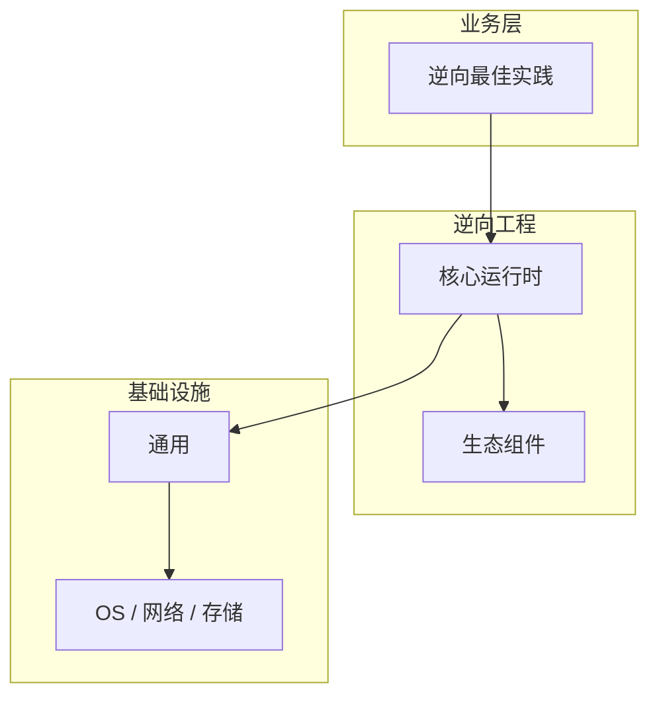

# 逆向最佳实践的实现机制详解

> **领域**：逆向工程 ｜ **模块**：逆向最佳实践 ｜ **难度**：实战 ｜ **类型**：实现机制

> **学习声明**：本章内容仅供合法授权环境下的安全研究与防御建设，请遵守法律法规与组织安全政策，禁止对未授权系统开展测试。

## 导读

本章系统讲解 **逆向工程** 中 **逆向最佳实践** 的相关知识（实现机制）。本章聚焦 **逆向最佳实践** 的内部实现路径与关键数据结构，帮助从 API 用法深入到机制层。内容基于主流框架与工程实践撰写，不依赖过时概念堆砌。

## 核心知识

**逆向最佳实践** 是 逆向工程 领域的核心主题。逆向工程最佳实践。本模块从原理与工程实践出发，帮助读者建立系统理解。 本教程内容仅供合法授权的安全测试、防御加固与学术研究使用。未经授权对他人系统进行扫描、入侵或破坏属于违法行为。

### 核心知识

**1. 逆向最佳实践的核心原理**

理解 逆向最佳实践 的底层机制是正确应用的前提，需结合 逆向工程 典型架构学习。

**2. 逆向最佳实践的定义**

逆向最佳实践 解决 逆向工程 中特定场景的核心问题。逆向最佳实践 是二进制分析与恶意软件研究的分析方法。

**3. 在逆向工程中的位置**

逆向最佳实践 与 逆向工程 其他模块协作，形成完整的技术链路。

**4. 典型应用场景**

在 逆向工程 实际项目中，逆向最佳实践 常用于解决性能、可靠性或功能扩展问题。

## 架构与流程

## 技术详解

### 实现机制

逆向最佳实践 的工作流程：输入 → 处理 → 输出，各阶段需关注正确性与安全性。

## 原理与实现

### 工作机制

逆向最佳实践 的工作流程：输入 → 处理 → 输出，各阶段需关注正确性与安全性。

### 内部实现

逆向最佳实践 的底层实现依赖 逆向工程 生态中的标准组件与协议，建议阅读官方规范文档。

## 操作流程与实践

### 操作流程

1. 理解 逆向最佳实践 概念 → 2. 学习标准用法 → 3. 动手实验 → 4. 分析案例 → 5. 总结最佳实践。

### 配置要点

配置 逆向最佳实践 时遵循官方推荐默认值，仅在理解影响后调整参数。

## 性能、安全与排查

### 性能优化

评估 逆向最佳实践 性能时建立基准测试，关注时间/空间复杂度或系统吞吐延迟指标。

### 安全注意

本教程内容仅供合法授权的安全测试、防御加固与学术研究使用。未经授权对他人系统进行扫描、入侵或破坏属于违法行为。

### 调试排错

排查 逆向最佳实践 问题时，结合日志、监控与最小复现用例逐步定位根因。

## 案例与选型

### 案例复盘

在典型 逆向工程 项目中，正确应用 逆向最佳实践 可显著提升系统质量与可维护性。

### 方案对比

选择 逆向最佳实践 方案时需对比多种替代方案的适用场景、性能与生态支持。

## 本章聚焦

阅读 **逆向最佳实践** 实现时，建议对照调用栈画出数据流：入口 API → 核心数据结构 → 系统调用或 I/O 边界，标注锁与共享状态位置。

### 常见误区与纠正

**概念理解偏差**

对 逆向最佳实践 理解不全面导致误用，应回到官方文档重新梳理。

**忽视边界条件**

逆向最佳实践 在极端输入或高并发下行为可能不同，需充分测试。

**缺少监控**

未对 逆向最佳实践 关键指标监控，问题只能被动发现。

### 最佳实践

1. 仅在授权环境分析样本
2. 使用隔离虚拟机（无网络/快照）
3. 记录分析步骤便于复现
4. 提取 IOC 贡献威胁情报
5. 遵守 responsible disclosure

## 巩固建议

建议结合 **逆向工程** 官方文档与小型实验，亲手验证 **逆向最佳实践** 的默认行为与边界条件；将本章要点整理为检查清单或 ADR，便于评审与团队 onboarding。

### 本章小结

学完本章，你应能独立说明 **逆向最佳实践** 在 逆向工程 中的角色，理解其核心机制，规避常见误区，并在项目中正确运用。

## 延伸学习

- 逆向最佳实践核心概念与原理
- 逆向最佳实践的关键技术点
- 逆向最佳实践的源码级分析
- 逆向最佳实践的配置与使用

### 延伸阅读

- 逆向工程 官方文档 - 逆向最佳实践
- OWASP / NIST 相关指南（如适用）
- 权威书籍与 RFC 标准文档

---
*章节 ID: 077 ｜ 领域: 逆向工程*