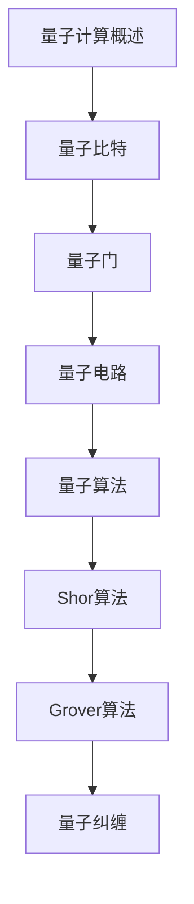

# 量子计算 学习指南

> **分类**：其他 ｜ **章节总数**：50 ｜ **技术栈**：量子计算

## 领域概述

量子计算是其他领域的重要技术方向，本系列从基础到高级逐步深入，涵盖11个核心模块：量子计算概述、量子比特、量子门、量子电路、量子算法等。每个知识点作为独立章节，包含原理讲解、实现要点、常见陷阱和最佳实践，配合源码分析和架构图，帮助读者建立完整的量子计算知识体系。

本教程基于 **通用** 与 **量子计算** 生态编写，涵盖 行业标准工具链 等主流工具与框架。每章独立成篇，文字精炼、逻辑清晰，适合系统学习与按需查阅。

## 你将学到什么

完成本系列后，你将能够：

- 系统理解 **量子计算** 的核心概念与模块划分。
- 按难度递进掌握从入门到实战的完整知识路径。
- 在工程实践中做出合理的技术判断与问题排查。
- 通过章节索引快速定位所需知识点。

## 前置知识

- 编程基础
- 数据结构
- 计算机基础
- 其他基础概念

## 推荐学习路径

1. **量子计算概述**
2. **量子比特**
3. **量子门**
4. **量子电路**
5. **量子算法**
6. **Shor算法**
7. **Grover算法**
8. **量子纠缠**

## 模块体系

本领域按以下模块组织，难度由浅入深：

- **量子计算概述**
- **量子比特**
- **量子门**
- **量子电路**
- **量子算法**
- **Shor算法**
- **Grover算法**
- **量子纠缠**
- **量子纠错**
- **量子编程**
- **量子计算最佳实践**

## 难度分布

| 难度 | 章节数 | 占比 |
|------|--------|------|
| 入门 | 10 | 20% |
| 实战 | 12 | 24% |
| 进阶 | 15 | 30% |
| 高级 | 13 | 26% |

## 章节索引

点击章节标题进入对应教程：

### 量子计算概述

- [量子计算概述核心概念与原理](chapters/001-量子计算概述核心概念与原理.md) ｜ 入门
- [量子计算概述的实现机制详解](chapters/002-量子计算概述的实现机制详解.md) ｜ 入门
- [量子计算概述的关键技术点](chapters/003-量子计算概述的关键技术点.md) ｜ 入门
- [量子计算概述的源码级分析](chapters/004-量子计算概述的源码级分析.md) ｜ 入门
- [量子计算概述的配置与使用](chapters/005-量子计算概述的配置与使用.md) ｜ 入门

### 量子比特

- [量子比特核心概念与原理](chapters/006-量子比特核心概念与原理.md) ｜ 入门
- [量子比特的实现机制详解](chapters/007-量子比特的实现机制详解.md) ｜ 入门
- [量子比特的关键技术点](chapters/008-量子比特的关键技术点.md) ｜ 入门
- [量子比特的源码级分析](chapters/009-量子比特的源码级分析.md) ｜ 入门
- [量子比特的配置与使用](chapters/010-量子比特的配置与使用.md) ｜ 入门

### 量子门

- [量子门核心概念与原理](chapters/011-量子门核心概念与原理.md) ｜ 进阶
- [量子门的实现机制详解](chapters/012-量子门的实现机制详解.md) ｜ 进阶
- [量子门的关键技术点](chapters/013-量子门的关键技术点.md) ｜ 进阶
- [量子门的源码级分析](chapters/014-量子门的源码级分析.md) ｜ 进阶
- [量子门的配置与使用](chapters/015-量子门的配置与使用.md) ｜ 进阶

### 量子电路

- [量子电路核心概念与原理](chapters/016-量子电路核心概念与原理.md) ｜ 进阶
- [量子电路的实现机制详解](chapters/017-量子电路的实现机制详解.md) ｜ 进阶
- [量子电路的关键技术点](chapters/018-量子电路的关键技术点.md) ｜ 进阶
- [量子电路的源码级分析](chapters/019-量子电路的源码级分析.md) ｜ 进阶
- [量子电路的配置与使用](chapters/020-量子电路的配置与使用.md) ｜ 进阶

### 量子算法

- [量子算法核心概念与原理](chapters/021-量子算法核心概念与原理.md) ｜ 进阶
- [量子算法的实现机制详解](chapters/022-量子算法的实现机制详解.md) ｜ 进阶
- [量子算法的关键技术点](chapters/023-量子算法的关键技术点.md) ｜ 进阶
- [量子算法的源码级分析](chapters/024-量子算法的源码级分析.md) ｜ 进阶
- [量子算法的配置与使用](chapters/025-量子算法的配置与使用.md) ｜ 进阶

### Shor算法

- [Shor算法核心概念与原理](chapters/026-Shor算法核心概念与原理.md) ｜ 高级
- [Shor算法的实现机制详解](chapters/027-Shor算法的实现机制详解.md) ｜ 高级
- [Shor算法的关键技术点](chapters/028-Shor算法的关键技术点.md) ｜ 高级
- [Shor算法的源码级分析](chapters/029-Shor算法的源码级分析.md) ｜ 高级
- [Shor算法的配置与使用](chapters/030-Shor算法的配置与使用.md) ｜ 高级

### Grover算法

- [Grover算法核心概念与原理](chapters/031-Grover算法核心概念与原理.md) ｜ 高级
- [Grover算法的实现机制详解](chapters/032-Grover算法的实现机制详解.md) ｜ 高级
- [Grover算法的关键技术点](chapters/033-Grover算法的关键技术点.md) ｜ 高级
- [Grover算法的源码级分析](chapters/034-Grover算法的源码级分析.md) ｜ 高级

### 量子纠缠

- [量子纠缠核心概念与原理](chapters/035-量子纠缠核心概念与原理.md) ｜ 高级
- [量子纠缠的实现机制详解](chapters/036-量子纠缠的实现机制详解.md) ｜ 高级
- [量子纠缠的关键技术点](chapters/037-量子纠缠的关键技术点.md) ｜ 高级
- [量子纠缠的源码级分析](chapters/038-量子纠缠的源码级分析.md) ｜ 高级

### 量子纠错

- [量子纠错核心概念与原理](chapters/039-量子纠错核心概念与原理.md) ｜ 实战
- [量子纠错的实现机制详解](chapters/040-量子纠错的实现机制详解.md) ｜ 实战
- [量子纠错的关键技术点](chapters/041-量子纠错的关键技术点.md) ｜ 实战
- [量子纠错的源码级分析](chapters/042-量子纠错的源码级分析.md) ｜ 实战

### 量子编程

- [量子编程核心概念与原理](chapters/043-量子编程核心概念与原理.md) ｜ 实战
- [量子编程的实现机制详解](chapters/044-量子编程的实现机制详解.md) ｜ 实战
- [量子编程的关键技术点](chapters/045-量子编程的关键技术点.md) ｜ 实战
- [量子编程的源码级分析](chapters/046-量子编程的源码级分析.md) ｜ 实战

### 量子计算最佳实践

- [量子计算最佳实践核心概念与原理](chapters/047-量子计算最佳实践核心概念与原理.md) ｜ 实战
- [量子计算最佳实践的实现机制详解](chapters/048-量子计算最佳实践的实现机制详解.md) ｜ 实战
- [量子计算最佳实践的关键技术点](chapters/049-量子计算最佳实践的关键技术点.md) ｜ 实战
- [量子计算最佳实践的源码级分析](chapters/050-量子计算最佳实践的源码级分析.md) ｜ 实战

## 学习方法建议

1. **先读概述再读章节**：用本指南建立全局地图，避免迷失在细节中。
2. **按模块递进**：同一模块内章节有前后关联，顺序阅读效果更好。
3. **主动复述**：每章读完后，用三五句话概括「是什么、为什么、怎么用」。
4. **关联阅读**：利用章节底部的「延伸学习」在同模块内构建知识网络。
5. **对照官方文档**：本教程提供结构化视角，细节以官方文档为准。

---
*领域: 量子计算 ｜ 版本: 2.0 ｜ 共 50 章*