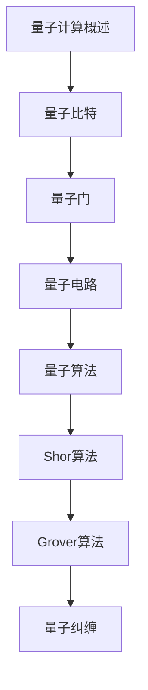

# 量子计算 学习指南

> **分类**：其他 ｜ **技术生态**：Qiskit, Cirq, IBM Quantum, Google Cirq, PennyLane

## 领域定位

量子计算利用量子比特的叠加与纠缠特性进行并行计算。Shor 与 Grover 算法展示了量子优势，IBM Q、Google Sycamore 等硬件与 Qiskit 等软件栈推动领域发展。

面向对量子计算感兴趣的开发者，从量子比特到算法与编程。

本领域常用技术栈与工具包括：Qiskit, Cirq, IBM Quantum, Google Cirq, PennyLane。

## 学习目标

- 理解量子比特、量子门与量子电路
- 使用 Qiskit 编写并模拟量子程序
- 了解 Shor/Grover 算法的原理与影响
- 认识 NISQ 时代量子计算的局限与前景

## 前置知识

- 线性代数
- 概率论
- Python
- 基本物理概念

## 学习路径

1. **量子计算概述**
2. **量子比特**
3. **量子门**
4. **量子电路**
5. **量子算法**
6. **Shor算法**
7. **Grover算法**
8. **量子纠缠**

## 模块体系

- **量子计算概述**
- **量子比特**
- **量子门**
- **量子电路**
- **量子算法**
- **Shor算法**
- **Grover算法**
- **量子纠缠**
- **量子纠错**
- **量子编程**
- **量子计算最佳实践**

## 难度分布

| 入门 | 10 | 20% |
| 实战 | 12 | 24% |
| 进阶 | 15 | 30% |
| 高级 | 13 | 26% |

## 章节索引

### 量子计算概述

- [量子计算概述核心概念与原理](chapters/001-量子计算概述核心概念与原理.md) ｜ 入门
- [量子计算概述的实现机制详解](chapters/002-量子计算概述的实现机制详解.md) ｜ 入门
- [量子计算概述的关键技术点](chapters/003-量子计算概述的关键技术点.md) ｜ 入门
- [量子计算概述的源码级分析](chapters/004-量子计算概述的源码级分析.md) ｜ 入门
- [量子计算概述的配置与使用](chapters/005-量子计算概述的配置与使用.md) ｜ 入门

### 量子比特

- [量子比特核心概念与原理](chapters/006-量子比特核心概念与原理.md) ｜ 入门
- [量子比特的实现机制详解](chapters/007-量子比特的实现机制详解.md) ｜ 入门
- [量子比特的关键技术点](chapters/008-量子比特的关键技术点.md) ｜ 入门
- [量子比特的源码级分析](chapters/009-量子比特的源码级分析.md) ｜ 入门
- [量子比特的配置与使用](chapters/010-量子比特的配置与使用.md) ｜ 入门

### 量子门

- [量子门核心概念与原理](chapters/011-量子门核心概念与原理.md) ｜ 进阶
- [量子门的实现机制详解](chapters/012-量子门的实现机制详解.md) ｜ 进阶
- [量子门的关键技术点](chapters/013-量子门的关键技术点.md) ｜ 进阶
- [量子门的源码级分析](chapters/014-量子门的源码级分析.md) ｜ 进阶
- [量子门的配置与使用](chapters/015-量子门的配置与使用.md) ｜ 进阶

### 量子电路

- [量子电路核心概念与原理](chapters/016-量子电路核心概念与原理.md) ｜ 进阶
- [量子电路的实现机制详解](chapters/017-量子电路的实现机制详解.md) ｜ 进阶
- [量子电路的关键技术点](chapters/018-量子电路的关键技术点.md) ｜ 进阶
- [量子电路的源码级分析](chapters/019-量子电路的源码级分析.md) ｜ 进阶
- [量子电路的配置与使用](chapters/020-量子电路的配置与使用.md) ｜ 进阶

### 量子算法

- [量子算法核心概念与原理](chapters/021-量子算法核心概念与原理.md) ｜ 进阶
- [量子算法的实现机制详解](chapters/022-量子算法的实现机制详解.md) ｜ 进阶
- [量子算法的关键技术点](chapters/023-量子算法的关键技术点.md) ｜ 进阶
- [量子算法的源码级分析](chapters/024-量子算法的源码级分析.md) ｜ 进阶
- [量子算法的配置与使用](chapters/025-量子算法的配置与使用.md) ｜ 进阶

### Shor算法

- [Shor算法核心概念与原理](chapters/026-Shor算法核心概念与原理.md) ｜ 高级
- [Shor算法的实现机制详解](chapters/027-Shor算法的实现机制详解.md) ｜ 高级
- [Shor算法的关键技术点](chapters/028-Shor算法的关键技术点.md) ｜ 高级
- [Shor算法的源码级分析](chapters/029-Shor算法的源码级分析.md) ｜ 高级
- [Shor算法的配置与使用](chapters/030-Shor算法的配置与使用.md) ｜ 高级

### Grover算法

- [Grover算法核心概念与原理](chapters/031-Grover算法核心概念与原理.md) ｜ 高级
- [Grover算法的实现机制详解](chapters/032-Grover算法的实现机制详解.md) ｜ 高级
- [Grover算法的关键技术点](chapters/033-Grover算法的关键技术点.md) ｜ 高级
- [Grover算法的源码级分析](chapters/034-Grover算法的源码级分析.md) ｜ 高级

### 量子纠缠

- [量子纠缠核心概念与原理](chapters/035-量子纠缠核心概念与原理.md) ｜ 高级
- [量子纠缠的实现机制详解](chapters/036-量子纠缠的实现机制详解.md) ｜ 高级
- [量子纠缠的关键技术点](chapters/037-量子纠缠的关键技术点.md) ｜ 高级
- [量子纠缠的源码级分析](chapters/038-量子纠缠的源码级分析.md) ｜ 高级

### 量子纠错

- [量子纠错核心概念与原理](chapters/039-量子纠错核心概念与原理.md) ｜ 实战
- [量子纠错的实现机制详解](chapters/040-量子纠错的实现机制详解.md) ｜ 实战
- [量子纠错的关键技术点](chapters/041-量子纠错的关键技术点.md) ｜ 实战
- [量子纠错的源码级分析](chapters/042-量子纠错的源码级分析.md) ｜ 实战

### 量子编程

- [量子编程核心概念与原理](chapters/043-量子编程核心概念与原理.md) ｜ 实战
- [量子编程的实现机制详解](chapters/044-量子编程的实现机制详解.md) ｜ 实战
- [量子编程的关键技术点](chapters/045-量子编程的关键技术点.md) ｜ 实战
- [量子编程的源码级分析](chapters/046-量子编程的源码级分析.md) ｜ 实战

### 量子计算最佳实践

- [量子计算最佳实践核心概念与原理](chapters/047-量子计算最佳实践核心概念与原理.md) ｜ 实战
- [量子计算最佳实践的实现机制详解](chapters/048-量子计算最佳实践的实现机制详解.md) ｜ 实战
- [量子计算最佳实践的关键技术点](chapters/049-量子计算最佳实践的关键技术点.md) ｜ 实战
- [量子计算最佳实践的源码级分析](chapters/050-量子计算最佳实践的源码级分析.md) ｜ 实战

---
*领域: 量子计算*