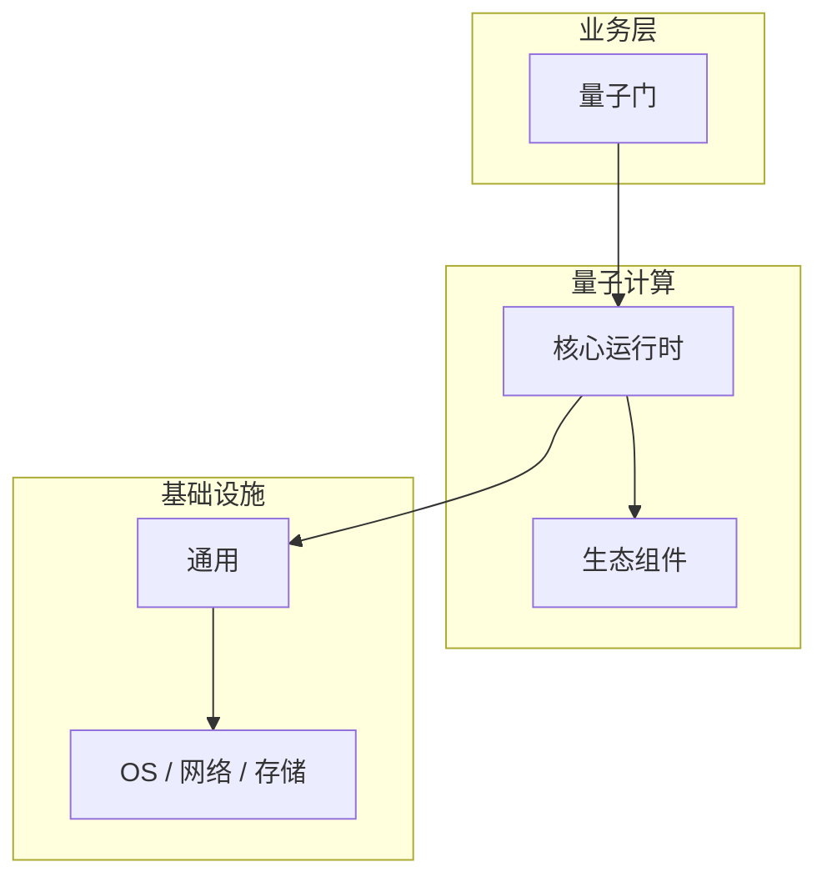

# 量子门核心概念与原理

> **领域**：量子计算 ｜ **模块**：量子门 ｜ **难度**：进阶 ｜ **类型**：基础概念

## 导读

本章系统讲解 **量子计算** 中 **量子门** 的相关知识（基础概念）。本章建立 **量子门** 的概念模型与工作原理，是后续专题章节的基础。内容基于主流框架与工程实践撰写，不依赖过时概念堆砌。

## 核心知识

**量子门** 是 量子计算 领域的核心主题。量子逻辑门。本模块从原理与工程实践出发，帮助读者建立系统理解。

### 核心知识

**1. 单比特**

X（NOT）、H（Hadamard）、RZ。

**2. 多比特**

CNOT、CZ 纠缠门。

**3. 通用**

任意量子电路可由 H+T+CNOT 组合。

## 架构与流程

## 技术详解

### 基础理解

**量子门** 是 量子计算 领域的核心主题。量子逻辑门。本模块从原理与工程实践出发，帮助读者建立系统理解。

1. 理解 量子门 概念 → 2. 学习标准用法 → 3. 动手实验 → 4. 分析案例 → 5. 总结最佳实践。

## 原理与实现

### 工作机制

量子态 → 门操作（酉变换）→ 新量子态。

### 内部实现

量子门 的底层实现依赖 量子计算 生态中的标准组件与协议，建议阅读官方规范文档。

## 操作流程与实践

### 操作流程

1. 理解 量子门 概念 → 2. 学习标准用法 → 3. 动手实验 → 4. 分析案例 → 5. 总结最佳实践。

### 配置要点

配置 量子门 时遵循官方推荐默认值，仅在理解影响后调整参数。

## 性能、安全与排查

### 性能优化

评估 量子门 性能时建立基准测试，关注时间/空间复杂度或系统吞吐延迟指标。

### 安全注意

在 量子计算 场景下注意输入校验、权限控制与敏感数据保护。

### 调试排错

排查 量子门 问题时，结合日志、监控与最小复现用例逐步定位根因。

## 案例与选型

### 案例复盘

在典型 量子计算 项目中，正确应用 量子门 可显著提升系统质量与可维护性。

### 方案对比

选择 量子门 方案时需对比多种替代方案的适用场景、性能与生态支持。

### 常见误区与纠正

**概念理解偏差**

对 量子门 理解不全面导致误用，应回到官方文档重新梳理。

**忽视边界条件**

量子门 在极端输入或高并发下行为可能不同，需充分测试。

**缺少监控**

未对 量子门 关键指标监控，问题只能被动发现。

### 最佳实践

1. 遵循 量子计算 领域 量子门 的官方推荐实践
2. 为 量子门 相关功能编写自动化测试
3. 关键配置纳入版本管理与变更审计
4. 生产部署前在接近真实环境验证

## 巩固建议

建议结合 **量子计算** 官方文档与小型实验，亲手验证 **量子门** 的默认行为与边界条件；将本章要点整理为检查清单或 ADR，便于评审与团队 onboarding。

### 本章小结

学完本章，你应能独立说明 **量子门** 在 量子计算 中的角色，理解其核心机制，规避常见误区，并在项目中正确运用。

## 延伸学习

- 量子门的实现机制详解
- 量子门的关键技术点
- 量子门的源码级分析
- 量子门的配置与使用

### 延伸阅读

- 量子计算 官方文档 - 量子门
- OWASP / NIST 相关指南（如适用）
- 权威书籍与 RFC 标准文档

---
*章节 ID: 011 ｜ 领域: 量子计算*