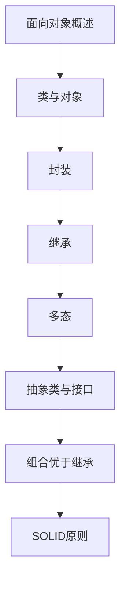

# 面向对象编程 学习指南

> **分类**：编程语言 ｜ **章节总数**：80 ｜ **技术栈**：面向对象编程

## 领域概述

面向对象编程是编程语言领域的重要技术方向，本系列从基础到高级逐步深入，涵盖15个核心模块：面向对象概述、类与对象、封装、继承、多态等。每个知识点作为独立章节，包含原理讲解、实现要点、常见陷阱和最佳实践，配合源码分析和架构图，帮助读者建立完整的面向对象编程知识体系。

本教程基于 **通用** 与 **面向对象编程** 生态编写，涵盖 行业标准工具链 等主流工具与框架。每章独立成篇，文字精炼、逻辑清晰，适合系统学习与按需查阅。

## 你将学到什么

完成本系列后，你将能够：

- 系统理解 **面向对象编程** 的核心概念与模块划分。
- 按难度递进掌握从入门到实战的完整知识路径。
- 在工程实践中做出合理的技术判断与问题排查。
- 通过章节索引快速定位所需知识点。

## 前置知识

- 编程基础
- 数据结构
- 计算机基础
- 编程语言基础概念

## 推荐学习路径

1. **面向对象概述**
2. **类与对象**
3. **封装**
4. **继承**
5. **多态**
6. **抽象类与接口**
7. **组合优于继承**
8. **SOLID原则**

## 模块体系

本领域按以下模块组织，难度由浅入深：

- **面向对象概述**
- **类与对象**
- **封装**
- **继承**
- **多态**
- **抽象类与接口**
- **组合优于继承**
- **SOLID原则**
- **设计模式**
- **UML建模**
- **面向对象分析**
- **面向对象设计**
- **重构**
- **领域建模**
- **面向对象最佳实践**

## 难度分布

| 难度 | 章节数 | 占比 |
|------|--------|------|
| 入门 | 18 | 22% |
| 实战 | 15 | 18% |
| 进阶 | 22 | 27% |
| 高级 | 25 | 31% |

## 章节索引

点击章节标题进入对应教程：

### 面向对象概述

- [面向对象概述核心概念与原理](chapters/001-面向对象概述核心概念与原理.md) ｜ 入门
- [面向对象概述的实现机制详解](chapters/002-面向对象概述的实现机制详解.md) ｜ 入门
- [面向对象概述的关键技术点](chapters/003-面向对象概述的关键技术点.md) ｜ 入门
- [面向对象概述的源码级分析](chapters/004-面向对象概述的源码级分析.md) ｜ 入门
- [面向对象概述的配置与使用](chapters/005-面向对象概述的配置与使用.md) ｜ 入门
- [面向对象概述的常见问题与解决方案](chapters/006-面向对象概述的常见问题与解决方案.md) ｜ 入门

### 类与对象

- [类与对象核心概念与原理](chapters/007-类与对象核心概念与原理.md) ｜ 入门
- [类与对象的实现机制详解](chapters/008-类与对象的实现机制详解.md) ｜ 入门
- [类与对象的关键技术点](chapters/009-类与对象的关键技术点.md) ｜ 入门
- [类与对象的源码级分析](chapters/010-类与对象的源码级分析.md) ｜ 入门
- [类与对象的配置与使用](chapters/011-类与对象的配置与使用.md) ｜ 入门
- [类与对象的常见问题与解决方案](chapters/012-类与对象的常见问题与解决方案.md) ｜ 入门

### 封装

- [封装核心概念与原理](chapters/013-封装核心概念与原理.md) ｜ 入门
- [封装的实现机制详解](chapters/014-封装的实现机制详解.md) ｜ 入门
- [封装的关键技术点](chapters/015-封装的关键技术点.md) ｜ 入门
- [封装的源码级分析](chapters/016-封装的源码级分析.md) ｜ 入门
- [封装的配置与使用](chapters/017-封装的配置与使用.md) ｜ 入门
- [封装的常见问题与解决方案](chapters/018-封装的常见问题与解决方案.md) ｜ 入门

### 继承

- [继承核心概念与原理](chapters/019-继承核心概念与原理.md) ｜ 进阶
- [继承的实现机制详解](chapters/020-继承的实现机制详解.md) ｜ 进阶
- [继承的关键技术点](chapters/021-继承的关键技术点.md) ｜ 进阶
- [继承的源码级分析](chapters/022-继承的源码级分析.md) ｜ 进阶
- [继承的配置与使用](chapters/023-继承的配置与使用.md) ｜ 进阶
- [继承的常见问题与解决方案](chapters/024-继承的常见问题与解决方案.md) ｜ 进阶

### 多态

- [多态核心概念与原理](chapters/025-多态核心概念与原理.md) ｜ 进阶
- [多态的实现机制详解](chapters/026-多态的实现机制详解.md) ｜ 进阶
- [多态的关键技术点](chapters/027-多态的关键技术点.md) ｜ 进阶
- [多态的源码级分析](chapters/028-多态的源码级分析.md) ｜ 进阶
- [多态的配置与使用](chapters/029-多态的配置与使用.md) ｜ 进阶
- [多态的常见问题与解决方案](chapters/030-多态的常见问题与解决方案.md) ｜ 进阶

### 抽象类与接口

- [抽象类与接口核心概念与原理](chapters/031-抽象类与接口核心概念与原理.md) ｜ 进阶
- [抽象类与接口的实现机制详解](chapters/032-抽象类与接口的实现机制详解.md) ｜ 进阶
- [抽象类与接口的关键技术点](chapters/033-抽象类与接口的关键技术点.md) ｜ 进阶
- [抽象类与接口的源码级分析](chapters/034-抽象类与接口的源码级分析.md) ｜ 进阶
- [抽象类与接口的配置与使用](chapters/035-抽象类与接口的配置与使用.md) ｜ 进阶

### 组合优于继承

- [组合优于继承核心概念与原理](chapters/036-组合优于继承核心概念与原理.md) ｜ 进阶
- [组合优于继承的实现机制详解](chapters/037-组合优于继承的实现机制详解.md) ｜ 进阶
- [组合优于继承的关键技术点](chapters/038-组合优于继承的关键技术点.md) ｜ 进阶
- [组合优于继承的源码级分析](chapters/039-组合优于继承的源码级分析.md) ｜ 进阶
- [组合优于继承的配置与使用](chapters/040-组合优于继承的配置与使用.md) ｜ 进阶

### SOLID原则

- [SOLID原则核心概念与原理](chapters/041-SOLID原则核心概念与原理.md) ｜ 高级
- [SOLID原则的实现机制详解](chapters/042-SOLID原则的实现机制详解.md) ｜ 高级
- [SOLID原则的关键技术点](chapters/043-SOLID原则的关键技术点.md) ｜ 高级
- [SOLID原则的源码级分析](chapters/044-SOLID原则的源码级分析.md) ｜ 高级
- [SOLID原则的配置与使用](chapters/045-SOLID原则的配置与使用.md) ｜ 高级

### 设计模式

- [设计模式核心概念与原理](chapters/046-设计模式核心概念与原理.md) ｜ 高级
- [设计模式的实现机制详解](chapters/047-设计模式的实现机制详解.md) ｜ 高级
- [设计模式的关键技术点](chapters/048-设计模式的关键技术点.md) ｜ 高级
- [设计模式的源码级分析](chapters/049-设计模式的源码级分析.md) ｜ 高级
- [设计模式的配置与使用](chapters/050-设计模式的配置与使用.md) ｜ 高级

### UML建模

- [UML建模核心概念与原理](chapters/051-UML建模核心概念与原理.md) ｜ 高级
- [UML建模的实现机制详解](chapters/052-UML建模的实现机制详解.md) ｜ 高级
- [UML建模的关键技术点](chapters/053-UML建模的关键技术点.md) ｜ 高级
- [UML建模的源码级分析](chapters/054-UML建模的源码级分析.md) ｜ 高级
- [UML建模的配置与使用](chapters/055-UML建模的配置与使用.md) ｜ 高级

### 面向对象分析

- [面向对象分析核心概念与原理](chapters/056-面向对象分析核心概念与原理.md) ｜ 高级
- [面向对象分析的实现机制详解](chapters/057-面向对象分析的实现机制详解.md) ｜ 高级
- [面向对象分析的关键技术点](chapters/058-面向对象分析的关键技术点.md) ｜ 高级
- [面向对象分析的源码级分析](chapters/059-面向对象分析的源码级分析.md) ｜ 高级
- [面向对象分析的配置与使用](chapters/060-面向对象分析的配置与使用.md) ｜ 高级

### 面向对象设计

- [面向对象设计核心概念与原理](chapters/061-面向对象设计核心概念与原理.md) ｜ 高级
- [面向对象设计的实现机制详解](chapters/062-面向对象设计的实现机制详解.md) ｜ 高级
- [面向对象设计的关键技术点](chapters/063-面向对象设计的关键技术点.md) ｜ 高级
- [面向对象设计的源码级分析](chapters/064-面向对象设计的源码级分析.md) ｜ 高级
- [面向对象设计的配置与使用](chapters/065-面向对象设计的配置与使用.md) ｜ 高级

### 重构

- [重构核心概念与原理](chapters/066-重构核心概念与原理.md) ｜ 实战
- [重构的实现机制详解](chapters/067-重构的实现机制详解.md) ｜ 实战
- [重构的关键技术点](chapters/068-重构的关键技术点.md) ｜ 实战
- [重构的源码级分析](chapters/069-重构的源码级分析.md) ｜ 实战
- [重构的配置与使用](chapters/070-重构的配置与使用.md) ｜ 实战

### 领域建模

- [领域建模核心概念与原理](chapters/071-领域建模核心概念与原理.md) ｜ 实战
- [领域建模的实现机制详解](chapters/072-领域建模的实现机制详解.md) ｜ 实战
- [领域建模的关键技术点](chapters/073-领域建模的关键技术点.md) ｜ 实战
- [领域建模的源码级分析](chapters/074-领域建模的源码级分析.md) ｜ 实战
- [领域建模的配置与使用](chapters/075-领域建模的配置与使用.md) ｜ 实战

### 面向对象最佳实践

- [面向对象最佳实践核心概念与原理](chapters/076-面向对象最佳实践核心概念与原理.md) ｜ 实战
- [面向对象最佳实践的实现机制详解](chapters/077-面向对象最佳实践的实现机制详解.md) ｜ 实战
- [面向对象最佳实践的关键技术点](chapters/078-面向对象最佳实践的关键技术点.md) ｜ 实战
- [面向对象最佳实践的源码级分析](chapters/079-面向对象最佳实践的源码级分析.md) ｜ 实战
- [面向对象最佳实践的配置与使用](chapters/080-面向对象最佳实践的配置与使用.md) ｜ 实战

## 学习方法建议

1. **先读概述再读章节**：用本指南建立全局地图，避免迷失在细节中。
2. **按模块递进**：同一模块内章节有前后关联，顺序阅读效果更好。
3. **主动复述**：每章读完后，用三五句话概括「是什么、为什么、怎么用」。
4. **关联阅读**：利用章节底部的「延伸学习」在同模块内构建知识网络。
5. **对照官方文档**：本教程提供结构化视角，细节以官方文档为准。

---
*领域: 面向对象编程 ｜ 版本: 2.0 ｜ 共 80 章*