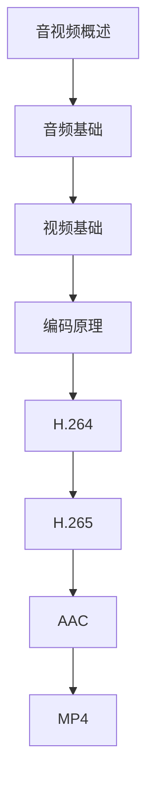

# 音视频处理 学习指南

> **分类**：其他 ｜ **技术生态**：FFmpeg, GStreamer, WebRTC, OBS, HLS, DASH

## 领域定位

音视频处理涵盖采集、编码、传输与播放全链路。H.264/H.265 视频编码、AAC 音频编码与 FFmpeg 工具链是工业标准，WebRTC 与 HLS 支撑实时与点播流媒体。

面向流媒体工程师，从编码原理到 FFmpeg 实战与 WebRTC。

本领域常用技术栈与工具包括：FFmpeg, GStreamer, WebRTC, OBS, HLS, DASH。

## 学习目标

- 理解音视频采样、编码与封装格式
- 使用 FFmpeg 进行转码、剪辑与流媒体
- 配置 HLS/RTMP 直播与 WebRTC 通话
- 解决音视频同步与延迟问题

## 前置知识

- C/Python
- 信号处理基础
- 计算机网络
- 数字媒体概念

## 学习路径

1. **音视频概述**
2. **音频基础**
3. **视频基础**
4. **编码原理**
5. **H.264**
6. **H.265**
7. **AAC**
8. **MP4**

## 模块体系

- **音视频概述**
- **音频基础**
- **视频基础**
- **编码原理**
- **H.264**
- **H.265**
- **AAC**
- **MP4**
- **FLV**
- **HLS**
- **RTMP**
- **WebRTC**
- **FFmpeg**
- **音视频同步**
- **流媒体**
- **音视频最佳实践**

## 难度分布

| 入门 | 15 | 18% |
| 实战 | 20 | 25% |
| 进阶 | 25 | 31% |
| 高级 | 20 | 25% |

## 章节索引

### 音视频概述

- [音视频概述核心概念与原理](chapters/001-音视频概述核心概念与原理.md) ｜ 入门
- [音视频概述的实现机制详解](chapters/002-音视频概述的实现机制详解.md) ｜ 入门
- [音视频概述的关键技术点](chapters/003-音视频概述的关键技术点.md) ｜ 入门
- [音视频概述的源码级分析](chapters/004-音视频概述的源码级分析.md) ｜ 入门
- [音视频概述的配置与使用](chapters/005-音视频概述的配置与使用.md) ｜ 入门

### 音频基础

- [音频基础核心概念与原理](chapters/006-音频基础核心概念与原理.md) ｜ 入门
- [音频基础的实现机制详解](chapters/007-音频基础的实现机制详解.md) ｜ 入门
- [音频基础的关键技术点](chapters/008-音频基础的关键技术点.md) ｜ 入门
- [音频基础的源码级分析](chapters/009-音频基础的源码级分析.md) ｜ 入门
- [音频基础的配置与使用](chapters/010-音频基础的配置与使用.md) ｜ 入门

### 视频基础

- [视频基础核心概念与原理](chapters/011-视频基础核心概念与原理.md) ｜ 入门
- [视频基础的实现机制详解](chapters/012-视频基础的实现机制详解.md) ｜ 入门
- [视频基础的关键技术点](chapters/013-视频基础的关键技术点.md) ｜ 入门
- [视频基础的源码级分析](chapters/014-视频基础的源码级分析.md) ｜ 入门
- [视频基础的配置与使用](chapters/015-视频基础的配置与使用.md) ｜ 入门

### 编码原理

- [编码原理核心概念与原理](chapters/016-编码原理核心概念与原理.md) ｜ 进阶
- [编码原理的实现机制详解](chapters/017-编码原理的实现机制详解.md) ｜ 进阶
- [编码原理的关键技术点](chapters/018-编码原理的关键技术点.md) ｜ 进阶
- [编码原理的源码级分析](chapters/019-编码原理的源码级分析.md) ｜ 进阶
- [编码原理的配置与使用](chapters/020-编码原理的配置与使用.md) ｜ 进阶

### H.264

- [H.264核心概念与原理](chapters/021-H.264核心概念与原理.md) ｜ 进阶
- [H.264的实现机制详解](chapters/022-H.264的实现机制详解.md) ｜ 进阶
- [H.264的关键技术点](chapters/023-H.264的关键技术点.md) ｜ 进阶
- [H.264的源码级分析](chapters/024-H.264的源码级分析.md) ｜ 进阶
- [H.264的配置与使用](chapters/025-H.264的配置与使用.md) ｜ 进阶

### H.265

- [H.265核心概念与原理](chapters/026-H.265核心概念与原理.md) ｜ 进阶
- [H.265的实现机制详解](chapters/027-H.265的实现机制详解.md) ｜ 进阶
- [H.265的关键技术点](chapters/028-H.265的关键技术点.md) ｜ 进阶
- [H.265的源码级分析](chapters/029-H.265的源码级分析.md) ｜ 进阶
- [H.265的配置与使用](chapters/030-H.265的配置与使用.md) ｜ 进阶

### AAC

- [AAC核心概念与原理](chapters/031-AAC核心概念与原理.md) ｜ 进阶
- [AAC的实现机制详解](chapters/032-AAC的实现机制详解.md) ｜ 进阶
- [AAC的关键技术点](chapters/033-AAC的关键技术点.md) ｜ 进阶
- [AAC的源码级分析](chapters/034-AAC的源码级分析.md) ｜ 进阶
- [AAC的配置与使用](chapters/035-AAC的配置与使用.md) ｜ 进阶

### MP4

- [MP4核心概念与原理](chapters/036-MP4核心概念与原理.md) ｜ 进阶
- [MP4的实现机制详解](chapters/037-MP4的实现机制详解.md) ｜ 进阶
- [MP4的关键技术点](chapters/038-MP4的关键技术点.md) ｜ 进阶
- [MP4的源码级分析](chapters/039-MP4的源码级分析.md) ｜ 进阶
- [MP4的配置与使用](chapters/040-MP4的配置与使用.md) ｜ 进阶

### FLV

- [FLV核心概念与原理](chapters/041-FLV核心概念与原理.md) ｜ 高级
- [FLV的实现机制详解](chapters/042-FLV的实现机制详解.md) ｜ 高级
- [FLV的关键技术点](chapters/043-FLV的关键技术点.md) ｜ 高级
- [FLV的源码级分析](chapters/044-FLV的源码级分析.md) ｜ 高级
- [FLV的配置与使用](chapters/045-FLV的配置与使用.md) ｜ 高级

### HLS

- [HLS核心概念与原理](chapters/046-HLS核心概念与原理.md) ｜ 高级
- [HLS的实现机制详解](chapters/047-HLS的实现机制详解.md) ｜ 高级
- [HLS的关键技术点](chapters/048-HLS的关键技术点.md) ｜ 高级
- [HLS的源码级分析](chapters/049-HLS的源码级分析.md) ｜ 高级
- [HLS的配置与使用](chapters/050-HLS的配置与使用.md) ｜ 高级

### RTMP

- [RTMP核心概念与原理](chapters/051-RTMP核心概念与原理.md) ｜ 高级
- [RTMP的实现机制详解](chapters/052-RTMP的实现机制详解.md) ｜ 高级
- [RTMP的关键技术点](chapters/053-RTMP的关键技术点.md) ｜ 高级
- [RTMP的源码级分析](chapters/054-RTMP的源码级分析.md) ｜ 高级
- [RTMP的配置与使用](chapters/055-RTMP的配置与使用.md) ｜ 高级

### WebRTC

- [WebRTC核心概念与原理](chapters/056-WebRTC核心概念与原理.md) ｜ 高级
- [WebRTC的实现机制详解](chapters/057-WebRTC的实现机制详解.md) ｜ 高级
- [WebRTC的关键技术点](chapters/058-WebRTC的关键技术点.md) ｜ 高级
- [WebRTC的源码级分析](chapters/059-WebRTC的源码级分析.md) ｜ 高级
- [WebRTC的配置与使用](chapters/060-WebRTC的配置与使用.md) ｜ 高级

### FFmpeg

- [FFmpeg核心概念与原理](chapters/061-FFmpeg核心概念与原理.md) ｜ 实战
- [FFmpeg的实现机制详解](chapters/062-FFmpeg的实现机制详解.md) ｜ 实战
- [FFmpeg的关键技术点](chapters/063-FFmpeg的关键技术点.md) ｜ 实战
- [FFmpeg的源码级分析](chapters/064-FFmpeg的源码级分析.md) ｜ 实战
- [FFmpeg的配置与使用](chapters/065-FFmpeg的配置与使用.md) ｜ 实战

### 音视频同步

- [音视频同步核心概念与原理](chapters/066-音视频同步核心概念与原理.md) ｜ 实战
- [音视频同步的实现机制详解](chapters/067-音视频同步的实现机制详解.md) ｜ 实战
- [音视频同步的关键技术点](chapters/068-音视频同步的关键技术点.md) ｜ 实战
- [音视频同步的源码级分析](chapters/069-音视频同步的源码级分析.md) ｜ 实战
- [音视频同步的配置与使用](chapters/070-音视频同步的配置与使用.md) ｜ 实战

### 流媒体

- [流媒体核心概念与原理](chapters/071-流媒体核心概念与原理.md) ｜ 实战
- [流媒体的实现机制详解](chapters/072-流媒体的实现机制详解.md) ｜ 实战
- [流媒体的关键技术点](chapters/073-流媒体的关键技术点.md) ｜ 实战
- [流媒体的源码级分析](chapters/074-流媒体的源码级分析.md) ｜ 实战
- [流媒体的配置与使用](chapters/075-流媒体的配置与使用.md) ｜ 实战

### 音视频最佳实践

- [音视频最佳实践核心概念与原理](chapters/076-音视频最佳实践核心概念与原理.md) ｜ 实战
- [音视频最佳实践的实现机制详解](chapters/077-音视频最佳实践的实现机制详解.md) ｜ 实战
- [音视频最佳实践的关键技术点](chapters/078-音视频最佳实践的关键技术点.md) ｜ 实战
- [音视频最佳实践的源码级分析](chapters/079-音视频最佳实践的源码级分析.md) ｜ 实战
- [音视频最佳实践的配置与使用](chapters/080-音视频最佳实践的配置与使用.md) ｜ 实战

---
*领域: 音视频处理*