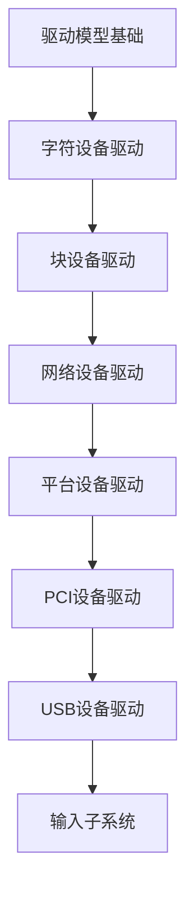

# 驱动开发 学习指南

> **分类**：系统底层 ｜ **技术生态**：Linux LDD3, Device Tree, udev, modprobe, devmem2(调试), oscilloscope

## 领域定位

Linux 设备驱动连接内核与硬件，按字符、块、网络设备分类，遵循统一设备模型。掌握 probe/remove、中断处理、DMA 与 sysfs 是驱动工程师的核心能力。

面向内核驱动开发者，以 Linux 驱动模型为主，覆盖平台/PCI/USB 等总线。

本领域常用技术栈与工具包括：Linux LDD3, Device Tree, udev, modprobe, devmem2(调试), oscilloscope。

## 学习目标

- 编写字符设备驱动并实现 file_operations
- 处理硬中断、线程化 IRQ 与 DMA 一致性映射
- 阅读设备树 binding 并完成 platform 驱动 probe
- 使用 dynamic_debug、sysfs 与逻辑分析仪排障

## 前置知识

- C 语言
- Linux 内核基础
- 计算机组成原理
- 数字电路与总线基础

## 学习路径

1. **驱动模型基础**
2. **字符设备驱动**
3. **块设备驱动**
4. **网络设备驱动**
5. **平台设备驱动**
6. **PCI设备驱动**
7. **USB设备驱动**
8. **输入子系统**

## 模块体系

- **驱动模型基础**
- **字符设备驱动**
- **块设备驱动**
- **网络设备驱动**
- **平台设备驱动**
- **PCI设备驱动**
- **USB设备驱动**
- **输入子系统**
- **中断与定时**
- **驱动调试**

## 难度分布

| 入门 | 20 | 20% |
| 实战 | 20 | 20% |
| 进阶 | 30 | 30% |
| 高级 | 30 | 30% |

## 章节索引

### 驱动模型基础

- [驱动模型基础核心概念与原理](chapters/001-驱动模型基础核心概念与原理.md) ｜ 入门
- [驱动模型基础的实现机制详解](chapters/002-驱动模型基础的实现机制详解.md) ｜ 入门
- [驱动模型基础的关键技术点](chapters/003-驱动模型基础的关键技术点.md) ｜ 入门
- [驱动模型基础的源码级分析](chapters/004-驱动模型基础的源码级分析.md) ｜ 入门
- [驱动模型基础的配置与使用](chapters/005-驱动模型基础的配置与使用.md) ｜ 入门
- [驱动模型基础的常见问题与解决方案](chapters/006-驱动模型基础的常见问题与解决方案.md) ｜ 入门
- [驱动模型基础的性能优化技巧](chapters/007-驱动模型基础的性能优化技巧.md) ｜ 入门
- [驱动模型基础的最佳实践指南](chapters/008-驱动模型基础的最佳实践指南.md) ｜ 入门
- [驱动模型基础的高级应用场景](chapters/009-驱动模型基础的高级应用场景.md) ｜ 入门
- [驱动模型基础的实战案例分析](chapters/010-驱动模型基础的实战案例分析.md) ｜ 入门

### 字符设备驱动

- [字符设备驱动核心概念与原理](chapters/011-字符设备驱动核心概念与原理.md) ｜ 入门
- [字符设备驱动的实现机制详解](chapters/012-字符设备驱动的实现机制详解.md) ｜ 入门
- [字符设备驱动的关键技术点](chapters/013-字符设备驱动的关键技术点.md) ｜ 入门
- [字符设备驱动的源码级分析](chapters/014-字符设备驱动的源码级分析.md) ｜ 入门
- [字符设备驱动的配置与使用](chapters/015-字符设备驱动的配置与使用.md) ｜ 入门
- [字符设备驱动的常见问题与解决方案](chapters/016-字符设备驱动的常见问题与解决方案.md) ｜ 入门
- [字符设备驱动的性能优化技巧](chapters/017-字符设备驱动的性能优化技巧.md) ｜ 入门
- [字符设备驱动的最佳实践指南](chapters/018-字符设备驱动的最佳实践指南.md) ｜ 入门
- [字符设备驱动的高级应用场景](chapters/019-字符设备驱动的高级应用场景.md) ｜ 入门
- [字符设备驱动的实战案例分析](chapters/020-字符设备驱动的实战案例分析.md) ｜ 入门

### 块设备驱动

- [块设备驱动核心概念与原理](chapters/021-块设备驱动核心概念与原理.md) ｜ 进阶
- [块设备驱动的实现机制详解](chapters/022-块设备驱动的实现机制详解.md) ｜ 进阶
- [块设备驱动的关键技术点](chapters/023-块设备驱动的关键技术点.md) ｜ 进阶
- [块设备驱动的源码级分析](chapters/024-块设备驱动的源码级分析.md) ｜ 进阶
- [块设备驱动的配置与使用](chapters/025-块设备驱动的配置与使用.md) ｜ 进阶
- [块设备驱动的常见问题与解决方案](chapters/026-块设备驱动的常见问题与解决方案.md) ｜ 进阶
- [块设备驱动的性能优化技巧](chapters/027-块设备驱动的性能优化技巧.md) ｜ 进阶
- [块设备驱动的最佳实践指南](chapters/028-块设备驱动的最佳实践指南.md) ｜ 进阶
- [块设备驱动的高级应用场景](chapters/029-块设备驱动的高级应用场景.md) ｜ 进阶
- [块设备驱动的实战案例分析](chapters/030-块设备驱动的实战案例分析.md) ｜ 进阶

### 网络设备驱动

- [网络设备驱动核心概念与原理](chapters/031-网络设备驱动核心概念与原理.md) ｜ 进阶
- [网络设备驱动的实现机制详解](chapters/032-网络设备驱动的实现机制详解.md) ｜ 进阶
- [网络设备驱动的关键技术点](chapters/033-网络设备驱动的关键技术点.md) ｜ 进阶
- [网络设备驱动的源码级分析](chapters/034-网络设备驱动的源码级分析.md) ｜ 进阶
- [网络设备驱动的配置与使用](chapters/035-网络设备驱动的配置与使用.md) ｜ 进阶
- [网络设备驱动的常见问题与解决方案](chapters/036-网络设备驱动的常见问题与解决方案.md) ｜ 进阶
- [网络设备驱动的性能优化技巧](chapters/037-网络设备驱动的性能优化技巧.md) ｜ 进阶
- [网络设备驱动的最佳实践指南](chapters/038-网络设备驱动的最佳实践指南.md) ｜ 进阶
- [网络设备驱动的高级应用场景](chapters/039-网络设备驱动的高级应用场景.md) ｜ 进阶
- [网络设备驱动的实战案例分析](chapters/040-网络设备驱动的实战案例分析.md) ｜ 进阶

### 平台设备驱动

- [平台设备驱动核心概念与原理](chapters/041-平台设备驱动核心概念与原理.md) ｜ 进阶
- [平台设备驱动的实现机制详解](chapters/042-平台设备驱动的实现机制详解.md) ｜ 进阶
- [平台设备驱动的关键技术点](chapters/043-平台设备驱动的关键技术点.md) ｜ 进阶
- [平台设备驱动的源码级分析](chapters/044-平台设备驱动的源码级分析.md) ｜ 进阶
- [平台设备驱动的配置与使用](chapters/045-平台设备驱动的配置与使用.md) ｜ 进阶
- [平台设备驱动的常见问题与解决方案](chapters/046-平台设备驱动的常见问题与解决方案.md) ｜ 进阶
- [平台设备驱动的性能优化技巧](chapters/047-平台设备驱动的性能优化技巧.md) ｜ 进阶
- [平台设备驱动的最佳实践指南](chapters/048-平台设备驱动的最佳实践指南.md) ｜ 进阶
- [平台设备驱动的高级应用场景](chapters/049-平台设备驱动的高级应用场景.md) ｜ 进阶
- [平台设备驱动的实战案例分析](chapters/050-平台设备驱动的实战案例分析.md) ｜ 进阶

### PCI设备驱动

- [PCI设备驱动核心概念与原理](chapters/051-PCI设备驱动核心概念与原理.md) ｜ 高级
- [PCI设备驱动的实现机制详解](chapters/052-PCI设备驱动的实现机制详解.md) ｜ 高级
- [PCI设备驱动的关键技术点](chapters/053-PCI设备驱动的关键技术点.md) ｜ 高级
- [PCI设备驱动的源码级分析](chapters/054-PCI设备驱动的源码级分析.md) ｜ 高级
- [PCI设备驱动的配置与使用](chapters/055-PCI设备驱动的配置与使用.md) ｜ 高级
- [PCI设备驱动的常见问题与解决方案](chapters/056-PCI设备驱动的常见问题与解决方案.md) ｜ 高级
- [PCI设备驱动的性能优化技巧](chapters/057-PCI设备驱动的性能优化技巧.md) ｜ 高级
- [PCI设备驱动的最佳实践指南](chapters/058-PCI设备驱动的最佳实践指南.md) ｜ 高级
- [PCI设备驱动的高级应用场景](chapters/059-PCI设备驱动的高级应用场景.md) ｜ 高级
- [PCI设备驱动的实战案例分析](chapters/060-PCI设备驱动的实战案例分析.md) ｜ 高级

### USB设备驱动

- [USB设备驱动核心概念与原理](chapters/061-USB设备驱动核心概念与原理.md) ｜ 高级
- [USB设备驱动的实现机制详解](chapters/062-USB设备驱动的实现机制详解.md) ｜ 高级
- [USB设备驱动的关键技术点](chapters/063-USB设备驱动的关键技术点.md) ｜ 高级
- [USB设备驱动的源码级分析](chapters/064-USB设备驱动的源码级分析.md) ｜ 高级
- [USB设备驱动的配置与使用](chapters/065-USB设备驱动的配置与使用.md) ｜ 高级
- [USB设备驱动的常见问题与解决方案](chapters/066-USB设备驱动的常见问题与解决方案.md) ｜ 高级
- [USB设备驱动的性能优化技巧](chapters/067-USB设备驱动的性能优化技巧.md) ｜ 高级
- [USB设备驱动的最佳实践指南](chapters/068-USB设备驱动的最佳实践指南.md) ｜ 高级
- [USB设备驱动的高级应用场景](chapters/069-USB设备驱动的高级应用场景.md) ｜ 高级
- [USB设备驱动的实战案例分析](chapters/070-USB设备驱动的实战案例分析.md) ｜ 高级

### 输入子系统

- [输入子系统核心概念与原理](chapters/071-输入子系统核心概念与原理.md) ｜ 高级
- [输入子系统的实现机制详解](chapters/072-输入子系统的实现机制详解.md) ｜ 高级
- [输入子系统的关键技术点](chapters/073-输入子系统的关键技术点.md) ｜ 高级
- [输入子系统的源码级分析](chapters/074-输入子系统的源码级分析.md) ｜ 高级
- [输入子系统的配置与使用](chapters/075-输入子系统的配置与使用.md) ｜ 高级
- [输入子系统的常见问题与解决方案](chapters/076-输入子系统的常见问题与解决方案.md) ｜ 高级
- [输入子系统的性能优化技巧](chapters/077-输入子系统的性能优化技巧.md) ｜ 高级
- [输入子系统的最佳实践指南](chapters/078-输入子系统的最佳实践指南.md) ｜ 高级
- [输入子系统的高级应用场景](chapters/079-输入子系统的高级应用场景.md) ｜ 高级
- [输入子系统的实战案例分析](chapters/080-输入子系统的实战案例分析.md) ｜ 高级

### 中断与定时

- [中断与定时核心概念与原理](chapters/081-中断与定时核心概念与原理.md) ｜ 实战
- [中断与定时的实现机制详解](chapters/082-中断与定时的实现机制详解.md) ｜ 实战
- [中断与定时的关键技术点](chapters/083-中断与定时的关键技术点.md) ｜ 实战
- [中断与定时的源码级分析](chapters/084-中断与定时的源码级分析.md) ｜ 实战
- [中断与定时的配置与使用](chapters/085-中断与定时的配置与使用.md) ｜ 实战
- [中断与定时的常见问题与解决方案](chapters/086-中断与定时的常见问题与解决方案.md) ｜ 实战
- [中断与定时的性能优化技巧](chapters/087-中断与定时的性能优化技巧.md) ｜ 实战
- [中断与定时的最佳实践指南](chapters/088-中断与定时的最佳实践指南.md) ｜ 实战
- [中断与定时的高级应用场景](chapters/089-中断与定时的高级应用场景.md) ｜ 实战
- [中断与定时的实战案例分析](chapters/090-中断与定时的实战案例分析.md) ｜ 实战

### 驱动调试

- [驱动调试核心概念与原理](chapters/091-驱动调试核心概念与原理.md) ｜ 实战
- [驱动调试的实现机制详解](chapters/092-驱动调试的实现机制详解.md) ｜ 实战
- [驱动调试的关键技术点](chapters/093-驱动调试的关键技术点.md) ｜ 实战
- [驱动调试的源码级分析](chapters/094-驱动调试的源码级分析.md) ｜ 实战
- [驱动调试的配置与使用](chapters/095-驱动调试的配置与使用.md) ｜ 实战
- [驱动调试的常见问题与解决方案](chapters/096-驱动调试的常见问题与解决方案.md) ｜ 实战
- [驱动调试的性能优化技巧](chapters/097-驱动调试的性能优化技巧.md) ｜ 实战
- [驱动调试的最佳实践指南](chapters/098-驱动调试的最佳实践指南.md) ｜ 实战
- [驱动调试的高级应用场景](chapters/099-驱动调试的高级应用场景.md) ｜ 实战
- [驱动调试的实战案例分析](chapters/100-驱动调试的实战案例分析.md) ｜ 实战

---
*领域: 驱动开发*